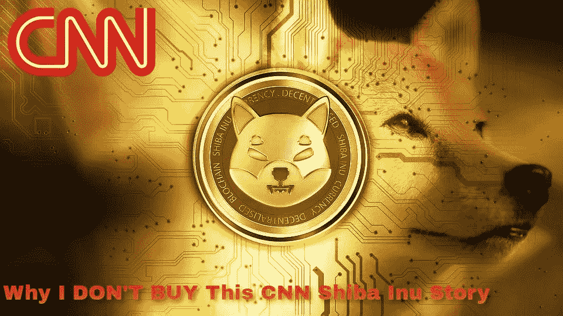
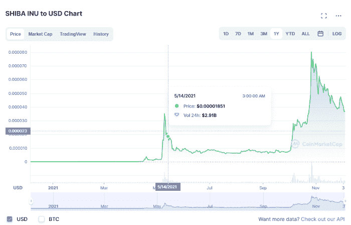
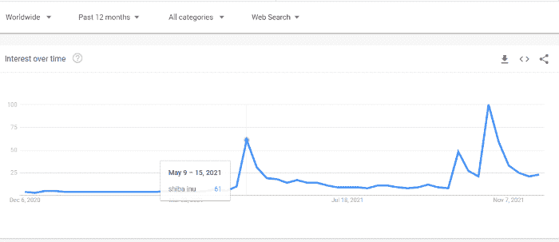

# CNN 上的柴犬？为什么我不相信这个故事！

> 原文：<https://medium.com/coinmonks/shiba-inu-on-cnn-why-i-dont-buy-this-story-ab279b6bf02d?source=collection_archive---------5----------------------->

*Source:* [*Pixabay*](https://cdn.pixabay.com/photo/2021/11/02/14/33/shiba-6763358_960_720.jpg)*, modified, (*[*wikipedia*](https://commons.wikimedia.org/wiki/File:CNN.svg)*)*

2021 年 5 月，由于马斯克宣布特斯拉对比特币采矿的环境担忧，加密货币价格最初下跌了 10%。

这是随后主要崩溃的前兆，来自中国的可怕消息禁止并取缔了加密货币采矿业。

就在特斯拉/马斯克宣布之前，加密货币市场经历了令人难以置信的增长，许多代币给投资者带来了非凡的回报。

CNN 在 2021 年 5 月 14 日发表了这个故事:

[**两兄弟如何凭借一场离奇的加密赌局从几近无业一跃成为千万富翁**](https://edition.cnn.com/2021/05/14/investing/crypto-shiba-inu-brothers-millionaires/index.html)

这是一个成功投资加密货币的励志故事。

一个关于普通人通过投资加密货币柴犬获得巨额财富的故事。

这个故事被数百个，甚至数千个网站复制，重写和重新发布。它成了病毒，至今已有数百万人阅读。

这是一个成功的故事，类似于我们过去读到的其他故事，有可能将数百万新的投机者带入 crypto。

精心专业的编写，灌输柴犬加密货币的投资成就感。

# 柴犬价格和炒作

这篇文章不仅仅是要揭穿在网上疯传的 CNN 的空洞故事。首先，我们把这个故事放在投资的范围内，作为一个投资指标(或者反指标)来考察。

Coinmarketcap: Shiba Inu

这篇文章的发表日期被标记出来，我们可以检查两个图表，这给了我们一个很好的指示**如何以投资的方式看待这条新闻**。

Shib 价格在 CNN 文章发表的同一天见顶后大幅下跌。

*Google Trends: Shiba Inu*

这个故事早在五月份就出现在 Google trends 的顶部。就在日本期货交易所大幅上涨之后。

虽然这让我们相信这是一个真实的故事，但从投资角度来说，这样的故事应该持保留态度，不要影响我们的投资策略。

这种促进暴富的故事，“蓝宝”和“月亮”总是反指标。

它在最佳时机出版，以留住柴犬的投资者，并让发生的抛售找到更好的价格。

这篇文章旨在产生更多的买家来维持价格，并帮助鲸鱼继续在交易所倾倒数万亿的柴犬代币。

自从这篇文章被无数次转载后，这些鲸鱼赚了数百万，甚至帮助柴犬恢复了牛市。

# 故事:柴犬从贫穷到富有

简而言之，两兄弟在柴犬身上下了很多赌注，总共下注 8000 美元，多次购买代币。到 4 月份，他们的总利润达到了 1000 万美元，投资回报率达到了 1000 倍！

可能是一个真实的故事，虽然，这篇文章让我觉得不是。

考虑到它发表的时间，这让我有点怀疑，(就在五月的顶部)。

这是一篇搅乱读者情感和逻辑的文章。在这一点上，我再次敦促你阅读 CNN 的故事，它只需要几分钟([链接](https://edition.cnn.com/2021/05/14/investing/crypto-shiba-inu-brothers-millionaires/index.html))，并评论你的想法。

> *一个* ***的朋友*** *，碰巧是一个密码专家，告诉他们他相信这会是一个大富翁。*
> 
> “我信任我的朋友，我想如果它变为零，那也没关系。”

我的第一个想法是:

***“我希望我有一个朋友告诉我同样的事情(无论何时发生，价格仍然很低)。”***

如果我是这个 CNN 记者，我会尽一切可能找到这个朋友的电话号码并尽快联系。

一个随机的“朋友”,当没人讨论的时候，他相信柴犬可以赚大钱。多么合适。虽然这可能是真的，但也不能否认。

我对百万美元小费的看法？

这个“朋友”(如果这个故事是真的)是一个内部人员。一位交易所内部人士，他知道发生了什么，可能与鲸鱼和交易所经营者有直接联系。

这是一个计划好的水泵，一旦鲸鱼离开，它将最终变成一个巨大的垃圾场。

柴犬的炒作仍处于不合理的水平。

价格回升，并迅速达到新的高度与承诺微不足道的财富的 Shib 军队。

很难反驳“数字上升”的论点，当有成千上万的 shills，垃圾邮件所有社交媒体关于柴犬的评论。

它能让任何新来者立即相信，柴犬是他们应该投资的最热门的货币。从我从汤米和詹姆斯(两兄弟)那里读到的来看，他们显然对任何密码一无所知。示例:

> ***“我有点想到比特币——那曾经是几分之一便士，现在是几万美元，而这发生在人们身上，这是可能的，”***
> 
> *-汤米…*

一个有缺陷的论点。对事实或技术完全无知。例如，事实上，柴犬只是另一个没有区块链、开发者或者更重要的概念的 ERC20 令牌。

比特币达到 1 万美元用了 9 年时间。我在上面读到的，意味着汤米认为加密是一个快速致富的方案。这里有一面红旗。我上面解释的原因是，我认为这样的文章是一个反指标。

> 在二月下旬首次投资后不到两个月，他们的生活发生了变化。

这篇文章充满了伪装的妙语，试图欺骗柴犬，并强调**突然获得了改变生活的财富**，失业者设法赢得一张彩票，以及**最糟糕的**:

> ***……我想如果它变为零，那也没关系。*** *(！！！)*

**柴犬队的出路。**如果降到零，就不会有人问问题，不会有人受到迫害，不会有 SEC 或联邦特工介入，不会有诉讼，也不会有法院命令。

不，那不行。但无论如何，这个故事不可能是真的。这只是一篇外科技巧文章。一个由专业操纵者完美撰写的剧本。我怀疑这是提到的记者的作品。

## “两兄弟”的匿名

这个故事的另一部分引起了我的注意，那就是两兄弟想保护他们的匿名，并要求 CNN 不要提及他们的姓氏。

我们可以承认这个决定有很多原因，因为成为“暴发户”也伴随着高度的责任感。

> *38 岁的汤米和 42 岁的詹姆斯，* ***他们要求 CNN 不要公布他们的姓氏，以保护他们的匿名……***

可能名字(汤米和詹姆斯)和年龄都是假的，只是为了表明某种身份，让这些人看起来更容易被公众理解。否则就没有真正的匿名。

如果这两兄弟说出他们的小名、年龄、地点和职业，那么如果有人开始寻找，他们很容易被找到。

当我们继续阅读时，我们发现了“汤米”的这句话:

> T21 政府的刺激支票不足以维持我们的生活。

这篇文章涵盖了心理胁迫的各个方面，以说服(尤其是)美国观众投资柴犬，就在代币鲸想卖出的最糟糕的时候。

不过，出售需要时间，而且买家并不总是准备好购买大量代币。

而 SHIB 有一千万亿代币作为总供应量。对人脑来说是一个不可思议的数字。

# 缺乏证据

这个故事不可信，我们无法证实任何真实发生的事件。相信这位记者和 CNN 这个新闻网络只是读者的选择。

我已经就这篇关于“匿名”两兄弟的文章提出了我的观点，他们有内部消息，但没有给出任何可信的证据来证明他们的财富。

柴犬加密货币的投资者出现了突然致富的案例，就像数千个案例一样。尽管如此，这本书没有证据，但讲述了两个匿名投资者的故事，以及他们如何说服家人将刺激资金(甚至不足以支付他们的支出)投资于一项风险极高的投资。

也许娱乐圈的记者经常表现得很不负责任，然而，这篇文章不是关于一个歌手或演员的。里面有**可怕的金融建议** **伪装成“加密货币”的新闻**。

如果这个故事要在新闻范围内发表，这两兄弟的真实身份应该已经公布了。

**否则就没有故事。**

我们没什么可信任的。在这个时代，我们不需要相信新闻网络，但我们可以验证这两个所谓的百万富翁的说法，如果他们只是通过在钱包上签名来证明这个 Shib 的所有权。但是在这个故事中，我们甚至没有公钥。

人们不信任区块链网络，这是这个故事的作者以及主流媒体所不理解的。

如果这个故事是真实的，那么这两个新加入 crypto 的人是从 DEX 而不是中央交易所购买 SHIB 的，因为这只是 Uniswap 交易的代币，当时价格相对较低。

只要提到以太坊的公共地址，我们就能够证实这些说法，但是文章中没有提到任何这样的细节。

它甚至不应该发表在一个主流新闻网络，希望有一个可信和可靠的新闻来源的形象。任何人都没有办法证实这些说法的真实性，然而这个故事在网上被大量转载，因为它是由 CNN 发布的。

在市值达到数十亿美元之前，柴犬可能根本没有 DeFi 或任何用例的计划。

# 最后

作为一种象征，它仍然一文不值，其价格行为一直是纯粹的炒作。每个人都在讨论柴犬，只是在大肆宣传这个标志，但根本没有关注它的特点或它到底有什么特别之处。它一直是一个迷因硬币，它的价值是从另一个迷因 Dogecoin 中提取的。

投资者疯狂购买另一个迷因的一个迷因。

基本上，没人关心柴犬做什么。每个人过去和现在都只是为了钱，这个“水泵”。对技术或发展不感兴趣。只要价格还在上涨，Shib 大军就会在社交媒体和任何可能的网络上不断增加无休止的垃圾邮件。

即使在情况下，柴犬不是一个骗局，并正在开发一个指数，因为我们后来读到，这并不意味着它目前持有一个公平的价格，并没有使它独一无二。DeFi 市场上已经有成千上万的 dex。

没有数据支持这个故事，也没有任何数据支持两兄弟的说法，他们完全是侥幸和内部人士透露的。

即使对话发生了，在这个故事中也没有任何可信的东西我们可以验证，这意味着它是无效的。

这是另一个解释主流媒体如何不负责任地处理加密货币市场的故事。一篇文章在互联网上被复制了数千次，有数百万投资者阅读了这篇文章，并可能形成了他们投资柴犬的观点。

主流媒体一点责任感都没有。柴犬的价格今天更高了，但四个月来比出版日低了 50-75%。

Writing at the following websites: ● [ReadCash](https://read.cash/@Pantera) ● [NoiseCash](https://noise.cash/u/Pantera99) ● [Medium](/@panterabch) ● [Hive](https://hive.blog/@pantera1) ● [Steemit](https://steemit.com/@pantera1) ●[Vocal](https://vocal.media/authors/pantera) ● [Minds](https://www.minds.com/pantera99/) ● [Twitter](https://twitter.com/Panterabch) ● [LinkedIn](https://www.linkedin.com/in/panterabch/) ● [email](https://read.cash/@Pantera/localcryptos-p2p-exchange-is-now-offering-bitcoin-cash-trading-06637230#bad-link)

> ***免责声明*** *:本内容发布的所有材料均用于娱乐和教育目的，并符合* ***合理使用*** *的准则。无意侵犯版权。如果您是或代表本文中使用的材料的版权所有者，并且对所述材料的使用有问题，请发送* [***电子邮件***](https://read.cash/@Pantera/cryptouknowns-battlegrounds-the-crypto-battle-royal-part-i-0ca762da#bad-link) *。*
> 
> 没有财务建议。做你的研究。

***支持内容创作者。***

如果你喜欢这个故事，就订阅吧！

*原发布于*[*https://read . cash*](https://read.cash/@Pantera/why-i-dont-buy-this-cnn-shiba-inu-story-or-anything-else-from-cnn-32b09724)*。*

> 加入 Coinmonks [电报频道](https://t.me/coincodecap)和 [Youtube 频道](https://www.youtube.com/c/coinmonks/videos)了解加密交易和投资

## 另外，阅读

*   [WazirX vs coin dcx vs bit bns](/coinmonks/wazirx-vs-coindcx-vs-bitbns-149f4f19a2f1)|[block fi vs coin loan vs Nexo](/coinmonks/blockfi-vs-coinloan-vs-nexo-cb624635230d)
*   [BlockFi 信用卡](https://blog.coincodecap.com/blockfi-credit-card) | [如何在币安购买比特币](https://blog.coincodecap.com/buy-bitcoin-binance)
*   [火币交易机器人](https://blog.coincodecap.com/huobi-trading-bot) | [如何购买 ADA](https://blog.coincodecap.com/buy-ada-cardano) | [Geco？一次回顾](https://blog.coincodecap.com/geco-one-review)
*   [加密复制交易平台](/coinmonks/top-10-crypto-copy-trading-platforms-for-beginners-d0c37c7d698c) | [五大 BlockFi 替代品](https://blog.coincodecap.com/blockfi-alternatives)
*   【Crypto.com 评论】|[|](/coinmonks/crypto-com-review-f143dca1f74c)|[信用交易](/coinmonks/huobi-margin-trading-b3b06cdc1519)
*   [Bybit vs 币安](https://blog.coincodecap.com/bybit-binance-moonxbt)|[stealth x 回顾](/coinmonks/stealthex-review-396c67309988) | [Probit 回顾](https://blog.coincodecap.com/probit-review)
*   [顶级付费加密货币和区块链课程](https://blog.coincodecap.com/blockchain-courses)
*   [在美国如何使用 BitMEX？](https://blog.coincodecap.com/use-bitmex-in-usa) | [BitMEX 评论](https://blog.coincodecap.com/bitmex-review)
*   [最佳期货交易信号](https://blog.coincodecap.com/futures-trading-signals) | [流动性交易所评论](https://blog.coincodecap.com/liquid-exchange-review)
*   [南非的加密交易所](https://blog.coincodecap.com/crypto-exchanges-in-south-africa) | [BitMEX 加密信号](https://blog.coincodecap.com/bitmex-crypto-signals)
*   [MoonXBT 副本交易](https://blog.coincodecap.com/moonxbt-copy-trading) | [阿联酋的加密钱包](https://blog.coincodecap.com/crypto-wallets-in-uae)