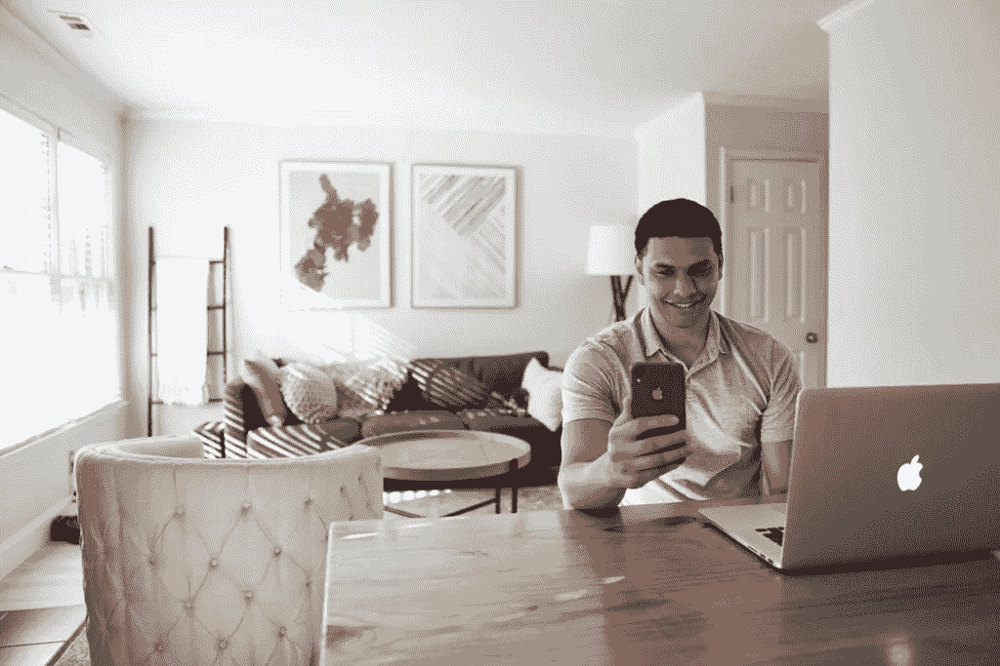
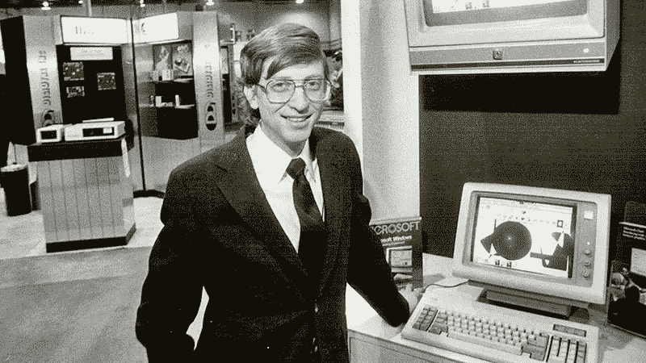

# 将你的心态转向长远

> 原文：<https://medium.com/coinmonks/shift-your-mindset-to-the-long-run-a0094a0f5c03?source=collection_archive---------5----------------------->

毫无疑问，这个市场是所有市场中最不稳定的。然而，不管你什么时候投资，只要有足够的耐心，即使是 80%的亏损投资也会变得有利可图。

Hodl 是投资和坚持投资的另一个词，无论短期波动如何。

在这个市场上，除了你自己，没有人可以信任。过了一段时间，我学到的一个教训是，我最初的策略比其他任何选择都好。

在秘密交易的世界里，日内交易者是有影响力的人，坦率地说，他们都不了解任何市场。

99%的日内交易者长期亏损。

# 我们会听这些家伙的理财建议吗？

出于对短期波动的担忧，我们必须卖出吗？为什么我们不看基本面，而是我们最初投资加密货币的原因。

虽然我们总是在这个混乱的加密市场中寻找信息，但我们经常听信所有错误的人，并允许他们影响我们的决定。

以 tradingview 为例，看看所有这些相互矛盾的分析。所有这些业余爱好者只是想让你相信他们是专业的。每个交易者都在做自己的 TA，每个人都有不同的范围和不同的预测。

这些交易者只关心讲一个好故事，增加他们的追随者。对于所有在 tradingview、YouTube 和 Twitter 上的日内交易者来说，他们的目的就是要让人相信他们的图表是有基础的，而不仅仅是晦涩难懂的。我因为太多的原因远离交易观。密码交易者从来没有以任何方式帮助过我，他们经常会说服你犯错误，放弃你的可靠策略。

他们只会让你重新考虑你的计划。

# 学习投资

我不指责交易或未来市场。我发现交易是有目的的，但我不认为日内交易者了解很多。我认为，目前的制度并没有帮助太多的人将此作为一种职业来管理。

我最期待的是投资建议。

在利率为零且有可能出现高通胀的情况下，持有超过 10%的法定银行存款可能不是一个好主意。我们转而投资。

加密货币是一项伟大的投资，从长远来看，配置我们投资组合的某一部分非常重要。

我们今天看到的一些密码的价格可能被认为是便宜的。无论哪种方式，从长远来看，这都是在当前时刻进入的绝佳机会。也许价格会下跌，但在看涨情绪回归后，有一些策略(DCA)有助于最小化风险和提高盈利能力。

我试图在 YouTube 上找到更多关于投资主题的教育内容。最近，**马克·德·梅塞尔** **推荐了**这三个 YouTube 频道，我也想提供链接，因为到目前为止，我已经在我观看的视频中发现了价值:

*   [**帕特里克·博伊尔**](https://www.youtube.com/channel/UCASM0cgfkJxQ1ICmRilfHLw)
*   **[T5【马里斯斯科涅茨尼 ](https://www.youtube.com/channel/UCiZPenkY59nqMJ29Hdw0Pig)**
*   **[**瑞典投资者**](https://www.youtube.com/channel/UCAeAB8ABXGoGMbXuYPmiu2A)**

**像 Marc 这样的人在接近他们的追随者时是诚实的，并且总是分享他们的知识来源。我们应该欣赏和尊重这一点，因为 Marc 对我们的财务信息是一个积极的因素。**

**我特别喜欢“**瑞典投资者**的这个视频，它给了我们非常宝贵的建议和对长期投资的理解。它给了我们应该遵循的正确方向。它有 13 分钟长，但我建议看完整个视频。**

**我还想补充一点，沃伦·巴菲特不是密码界应该忽视的人。任何关于巴菲特老了，不懂技术的评论都是错误的。**

**如果你想改善你的投资策略，你应该向最好的人学习。当沃伦·巴菲特解释说比特币是老鼠药的平方时，他不仅仅是在诋毁 BTC。**

**BTC 是一个网络，全宗占主导地位，但决策过程使它完全无用。巴菲特见证了比比特币马克西更多的技术来来去去。他完全理解加密货币，BTC 基本上是无用和过时的技术。**

**事实上，BTC·马克西试图降低所有反对 BTC 的人的重要性，他们没有更好的投资知识。**

**巴菲特曾经说过，BTC 绝对没有生产任何东西，他是对的。没有人在使用 BTC 网络，BTC 作为一种货币毫无价值。没有人想用 BTC 支付，也没有人想接受它。特斯拉尝试过，仅仅一个月后就取消了它的选项。**

**只有当我们能够适应短期波动时，我们才应该投资。一个非常好的低买高卖的心态，不幸的是，当我们投资太多，损失太大的时候，这种心态往往会出错。**

**非常重要的是，这段视频解释了我们被信息轰炸的频率。在加密市场，这甚至更糟，因为 FUD 和 FOMO 是这个市场短期的两个驱动因素。价格被新闻和谣言操纵，一些流行的数字甚至可以改变价格趋势。**

**给出的建议是不要回应我们每天接到的 100 个市场电话，这非常重要。**

**我们有一个关于投资和目标的计划。我们计算几率，然后等待。如果价格达到期望的水平，我们只卖一部分。因为所有的市场都有很大的增长，所以我们不是什么都卖。**

****

**Bill Gates**

**想象一下，1985 年买下微软，1986 年卖掉所有东西，因为价格翻了一倍。卖掉你认为会有很大前途的资产是一个错误。**

**你可以根据价格走势获利，但不能退出有巨大增长潜力的资产。**

**例如:在一个国家的人口快速增长的情况下，我们可以预计住房市场将至少繁荣一代人。**

**投资建筑公司似乎是合乎逻辑的，投资房地产也是一个很好的机会。如果人口预计在未来几十年保持增长，那么这种投资只能是有利可图的。**

**一个很大的要求是一个稳定的政府。如果该国处于战争或无政府状态，那么投资就变得风险极高。在这种情况下，基础设施可能会遭到破坏，任何发展都可能停滞几十年。**

**投资需要一个健康的经济和一个既不极端也不扩大规模的政治基础。发展过大的政府最终会摧毁它们的经济。**

**只履行必要职能的小政府通常是最有效的政府，比如国防、基础设施和适度的市场监管，以避免垄断和滥用市场领导者。**

**我知道有些人会不同意这一部分，但我可以解释，因为许多人只想到他们的国家，而没有看到一些模式不能附加到任何经济。**

**我也明白，中国不可能有任何不同的治理方式，因为那已经导致了分裂和国家分崩离析，就像苏联那样。但是对于太多的国家来说，一些人讨论的方法是不可行的。**

**可悲的是，有些人认为任何适用于美国的模式，也适用于一个没有如此强大军事力量的小国。然而这是不对的。**

**债务也是一个问题，而且很快会成为一个非常大的问题。可能政府仍在拖延 Covid，因为他们最大的恐惧是接下来会发生什么。**

# **结论**

**与交易者不同，大多数投资者从他们的投资中获利。长期来看，永远是胜利。拥有一个胜利的心态并不困难，你只需要强迫你的大脑戒掉赌博的习惯。投资者也承担风险，但与日内交易不同，这不是一个愚蠢的风险。出于风险管理的原因，我们承担了经过计算的风险并进行多元化。**

**阅读 **Marc De Mesel** 如何分析他最近的风险承担，以及他目前正在执行的计划是多么有组织性和深思熟虑:**

**[**“将加密贷款/债务占投资组合的-2%**](https://read.cash/@MarcDeMesel/took-crypto-loandebt-for-2-of-portfolio-6d0eaa61)**

**如果你想尝试日内交易，请记住**你在轮盘赌桌上的胜算更大。这是事实，你可以通过谷歌搜索找到日内交易成功的几率。****

**2017 年，日内交易对我的投资组合损害太大。不仅仅是因为我犯了初学者的错误，还因为这个系统就是这样建立的。这就像吃角子老虎机，庄家总是赢，甚至更糟，因为有太多的分心。**

**也许你想找乐子，想行动，想赌钱。对一些人来说，这是一种瘾。你明白赔钱的部分，以及你需要纠正错误的地方吗？**

**如果你想纠正，那就停止杠杆日交易，学习如何正确投资，而不是去世界各地旅行。许多国家已经结束封锁，现在向游客开放，即使没有接种疫苗。**

**如果你是一个亏损的日内交易者，没有更好的方法退出，专注于其他事情。**

**开始倾听那些有实际信息的人，而不只是用随机的模式画随机的线。**

**金融界很少进行日间交易，随着复杂的交易机器人和高频交易的兴起，这个系统无可匹敌。**

***最初发布于*[*https://read . cash*](https://read.cash/@Pantera/shift-your-mindset-to-the-long-run-68f369fe)*。***

*   ***导语图片来自:*[*Unsplash*](https://unsplash.com/photos/d9Cs-9I1fPo)**
*   ***第二张图片来自:* [*Youtube*](https://www.youtube.com/watch?v=JjbBOSkZcxo)**
*   ***第二张图片来自:*[*Unsplash*](https://unsplash.com/photos/9hPUf-H7m3s)**
*   ***第四张图片来自:*[*Goldman Sachs*](https://www.goldmansachs.com/our-firm/history/moments/1986-microsoft-ipo.html)**

> **加入 [Coinmonks 电报频道](https://t.me/coincodecap)，了解加密交易和投资**

## **另外，阅读**

*   **[什么是融资融券交易](https://blog.coincodecap.com/margin-trading) | [美元成本平均法](https://blog.coincodecap.com/dca)**
*   **[BigONE 交易所点评](/coinmonks/bigone-exchange-review-64705d85a1d4) | [电网交易 Bot](https://blog.coincodecap.com/grid-trading)**
*   **[3 商业评论](/coinmonks/3commas-review-an-excellent-crypto-trading-bot-2020-1313a58bec92) | [Pionex 评论](/coinmonks/pionex-review-exchange-with-crypto-trading-bot-1e459d0191ea) | [Coinrule 评论](/coinmonks/coinrule-review-2021-a-beginner-friendly-crypto-trading-bot-daf0504848ba)**
*   **[CoinLoan 审查](/coinmonks/coinloan-review-18128b9badc4) | [YouHodler 审查](/coinmonks/youhodler-4-easy-ways-to-make-money-98969b9689f2) | [BlockFi 审查](/coinmonks/blockfi-review-53096053c097)**
*   **最好的[加密税务软件](/coinmonks/best-crypto-tax-tool-for-my-money-72d4b430816b) | [CoinTracking 评论](/coinmonks/cointracking-review-a-reliable-cryptocurrency-tax-software-5114e3eb5737)**
*   **[Stackedinvest 评论](https://blog.coincodecap.com/stackedinvest-review) | [北海巨妖评论](/coinmonks/kraken-review-6165fc1056ac) | [期货交易机器人](/coinmonks/futures-trading-bots-5a282ccee3f5)**
*   **最佳[加密借贷平台](/coinmonks/top-5-crypto-lending-platforms-in-2020-that-you-need-to-know-a1b675cec3fa) | [杠杆代币](/coinmonks/leveraged-token-3f5257808b22)**
*   **最佳[加密制图工具](/coinmonks/what-are-the-best-charting-platforms-for-cryptocurrency-trading-85aade584d80) | [最佳加密交易所](/coinmonks/crypto-exchange-dd2f9d6f3769)**
*   **[如何在印度购买比特币？](/coinmonks/buy-bitcoin-in-india-feb50ddfef94) | [瓦济克斯审查](/coinmonks/wazirx-review-5c811b074f5b)**
*   **[隐料斗替代品](/coinmonks/cryptohopper-alternatives-d67287b16d27) | [HitBTC 审查](/coinmonks/hitbtc-review-c5143c5d53c2)**
*   **[WazirX vs coin dcx vs bit bns](/coinmonks/wazirx-vs-coindcx-vs-bitbns-149f4f19a2f1)|[block fi vs coin loan vs Nexo](/coinmonks/blockfi-vs-coinloan-vs-nexo-cb624635230d)**
*   **[本地比特币审核](/coinmonks/localbitcoins-review-6cc001c6ed56) | [加密货币储蓄账户](https://blog.coincodecap.com/cryptocurrency-savings-accounts)**
*   **[比特币基地评论](/coinmonks/coinbase-review-6ef4e0f56064) | [德里比特评论](/coinmonks/deribit-review-options-fees-apis-and-testnet-2ca16c4bbdb2) | [FTX 评论](/coinmonks/ftx-crypto-exchange-review-53664ac1198f) | [StealthEX 评论](/coinmonks/stealthex-review-396c67309988)**
*   **[n 平均零点评审](/coinmonks/ngrave-zero-review-c465cf8307fc) | [Phemex 评审](/coinmonks/phemex-review-4cfba0b49e28) | [PrimeXBT 评审](/coinmonks/primexbt-review-88e0815be858)**
*   **最佳[区块链分析](https://bitquery.io/blog/best-blockchain-analysis-tools-and-software)工具| [赚比特币](/coinmonks/earn-bitcoin-6e8bd3c592d9) | [Swapzone 评论](/coinmonks/swapzone-review-crypto-exchange-data-aggregator-e0ad78e55ed7)**
*   **[加密套利](/coinmonks/crypto-arbitrage-guide-how-to-make-money-as-a-beginner-62bfe5c868f6)指南| [如何做空比特币](/coinmonks/how-to-short-bitcoin-568a2d0b4ae5) | [Prokey 回顾](/coinmonks/prokey-review-26611173c13c)**
*   **[币安交易机器人](/coinmonks/binance-trading-bots-d0d57bb62c4c) | [OKEx 审查](/coinmonks/okex-review-6b369304110f) | [Atani 审查](https://blog.coincodecap.com/atani-review)**
*   **[最佳加密交易信号电报](/coinmonks/best-crypto-signals-telegram-5785cdbc4b2b) | [MoonXBT 评论](/coinmonks/moonxbt-review-6e4ab26d037)**
*   **[Godex.io 审核](/coinmonks/godex-io-review-7366086519fb) | [邀请审核](/coinmonks/invity-review-70f3030c0502) | [BitForex 审核](/coinmonks/bitforex-review-c4bb28d9e271)**