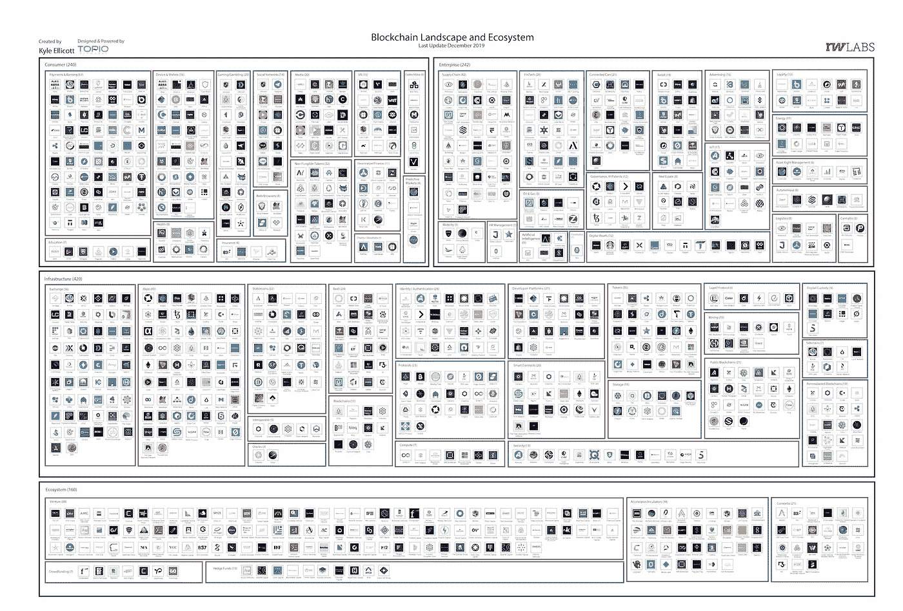

# Shopify，InBev & Reebonz Go 区块链/ Dfinity 的开放社交网络/ Stablecoins 正在进化金融

> 原文：<https://medium.com/coinmonks/shopify-inbev-reebonz-go-blockchain-dfinitys-open-social-network-stablecoins-are-evolving-5baa66cc333c?source=collection_archive---------4----------------------->

Photo by [Alex Holyoake](https://unsplash.com/@stairhopper?utm_source=unsplash&utm_medium=referral&utm_content=creditCopyText) on [Unsplash](https://unsplash.com/s/photos/street-art?utm_source=unsplash&utm_medium=referral&utm_content=creditCopyText)

*2020 年 1 月 29 日*

*2020 年的第一个月就要结束了，今年我们期待一个激动人心的 Q1 2020。让我们跟上区块链最近发生的一切，DApps & DLT 风景。* ***Dfinity*** *发布了一个名为 LinkedUp 的开放式社交网络，与 LinkedIn 竞争。六大央行联手数字货币* ***国际清算银行*** *(BIS)研究央行数字货币。****Shopify****，* ***英博*** *，奢侈品市场，* ***Reebonz，*** *都在本周以动作深化其区块链举措。据****【Dapp.com】*******以太坊*** *DApps 记录 2019 年活跃用户增长 900%。****stable coins****代表金融不可避免的未来，****Ripple****分享他们对 2020 年的预测，我为本周介绍一个新的部分，重点关注****DeFi****。**

**我们甚至在大量的研究中找到了补习的余地(* [*Q4 2019 区块链景观*](https://www.topionetworks.com/markets/blockchain-landscape-5bf43854b9abe4633c1f87da)*&*[*DApps 景观*](https://www.topionetworks.com/markets/dapps-stack-landscape-5de8d07eb9abe453e04203f8) *) &书籍(关于* [*数字资产*](https://www.scribd.com/document/430637579/Current-Market-Overview-of-Digital-Assets)&[！)、基础设施、DApps、比特币、经济学、交易所和 Stablecoins。为了了解更多信息，让你跟上时代的步伐，这里有一张本周业内热门新闻的快照。](https://www.amazon.com/dp/B07Z3LJCHW/ref=cm_sw_r_tw_dp_U_x_C6iSDbACJJN2Z)*

## *📈 [Dfinity 推出针对社交网络巨头的开源平台](https://techcrunch.com/2020/01/23/dfinity-launches-an-open-source-platform-aimed-at-the-social-networking-giants/)*

*Dfinity ( [dfinity-network](https://medium.com/u/f46cd59473d8?source=post_page-----5baa66cc333c--------------------------------) )发布了一个名为 LinkedUp 的开放社交网络。可以称之为开源版的 LinkedIn。但与 LinkedIn 不同，它不属于任何公司实体。该公司发布了这个开源平台，以展示一个应用程序将如何在其最近推出的青铜版“互联网计算机”上运行… [阅读更多](https://techcrunch.com/2020/01/23/dfinity-launches-an-open-source-platform-aimed-at-the-social-networking-giants/)*

## *📈[六大央行合作研究数字货币](https://cointelegraph.com/news/six-major-central-banks-to-collaborate-on-digital-currency-research)*

*根据英格兰银行的说法，六大央行与国际清算银行(BIS)联合成立了一个小组，研究央行数字货币。该小组将研究经济和技术方面、功能和跨境互操作性，并将分享他们在新兴技术方面的经验……[阅读更多信息](https://cointelegraph.com/news/six-major-central-banks-to-collaborate-on-digital-currency-research)*

## *📖[基于区块链的 Shopify 插件确保消费者收到正品](https://cointelegraph.com/news/blockchain-based-shopify-plugin-ensures-consumers-receive-authentic-products)*

*由超过 50 万家活跃在线商店组成的流行电子商务平台 Shopify 计划在今年的第一届 Q1 上正式发布 Spotify 插件。旧金山初创公司 Real Items Foundation 正在测试一个 Shopify 插件，以确保向在线购物者出售的是真实物品。该插件结合了区块链技术和一个名为 TAM 的基于云的应用程序，使品牌能够生成附加到实物资产上的 NFT，购买包含 NFT 的产品的消费者可以扫描以了解产品的真实性……[阅读更多信息](https://cointelegraph.com/news/blockchain-based-shopify-plugin-ensures-consumers-receive-authentic-products)*

## *📖[百威老板英博用区块链帮助非洲农民](https://cointelegraph.com/news/blockchain-used-by-budweiser-owner-inbev-to-help-african-farmers)*

*比利时-巴西跨国饮料和酿造公司百威英博(AB InBev)与班曲(BanQu)合作开发了一个基于区块链的分布式总账系统，以跟踪百威英博的所有当地供应商，取代书面记录。这种分布式分类账系统将允许供应商向当地银行证明其收入，从而开立银行账户和信用额度……[阅读更多](https://cointelegraph.com/news/blockchain-used-by-budweiser-owner-inbev-to-help-african-farmers)*

## *📖 [Hyperledger Fabric、Quorum、锯齿、Besu、Corda 和 Multichain 的工程师人数在过去三年中增加了 12 倍](https://www.forbes.com/sites/benjessel/2020/01/23/hyperledger-fabric-quorum-sawtooth-besu-corda-and-multichain-saw-a-12-fold-increase-in-engineers-in-the-last-three-years)*

*总部位于新加坡的 Chainstack 最近发布了一份题为“2020 年企业区块链协议进化指数”的报告，重点介绍了开源企业区块链领域的协议工程现状。该报告的主要亮点显示，从 2016 年第三季度到 2019 年第四季度，开发人员群体增长了 12 倍… [阅读更多信息](https://www.forbes.com/sites/benjessel/2020/01/23/hyperledger-fabric-quorum-sawtooth-besu-corda-and-multichain-saw-a-12-fold-increase-in-engineers-in-the-last-three-years)*

## *📖 [Reebonz 实现区块链解决方案，将产品数字化；成为首家提供端到端跟踪服务的时尚技术公司](https://finance.yahoo.com/news/reebonz-implements-blockchain-solution-digitize-130010499.html)*

*Reebonz 是一个在线奢侈品市场和平台，自 2019 年 1 月以来，它已经实施了区块链技术，为 Reebonz 库存中销售的所有产品提供数字证书。数字证书将附带一个二维码，其中包含产品详情、交易详情、历史记录和所有权来源等信息……[阅读更多信息](https://finance.yahoo.com/news/reebonz-implements-blockchain-solution-digitize-130010499.html)*

# *本周的更多内容:*

*📖[能做出承诺的电脑](https://a16z.com/2020/01/27/computers-that-make-commitments/)作者[克里斯·迪克森](https://medium.com/u/a8e3741de9e2?source=post_page-----5baa66cc333c--------------------------------)*

*📖[分散生态系统中的增长](https://blog.blockstack.org/growth-in-a-decentralized-ecosystem/)作者: [Blockstack](https://medium.com/u/19349106268a?source=post_page-----5baa66cc333c--------------------------------) 的 [Patrick Stanley](https://medium.com/u/26609736e6d5?source=post_page-----5baa66cc333c--------------------------------)*

*♎来认识一下摩根·贝勒，这位 26 岁的女性是脸书制造自己货币计划的幕后策划者*

*📖[伊维斯·拉·罗斯的《EOS 国度](/equilibrium-eosdt/yves-la-rose-of-eos-nation-a495f5157712)由[平衡 _EOSDT](https://medium.com/u/5db4a8782ba2?source=post_page-----5baa66cc333c--------------------------------)*

*💰[“数字货币不能私有，”法国银行行长警告说](https://decrypt.co/17756/digital-currency-cannot-be-private-warns-bank-of-france-governor)*

*💰[关于央行数字货币你需要知道的一切](https://media.consensys.net/everything-you-need-to-know-about-central-bank-digital-currencies-6826177cecc7)由 [ConsenSys](https://medium.com/u/6c7078bf7b01?source=post_page-----5baa66cc333c--------------------------------)*

# *分散式应用程序手表*

## *📖[用户保持:DApps 超越流行语地位的圣杯](https://cointelegraph.com/news/user-retention-the-holy-grail-for-dapps-moving-beyond-buzzword-status)*

*与 2018 年相比，2019 年 DApp 的活跃用户数量翻了一番，从 148 万增长到 311 万。大约 277 万新用户体验了分散式应用，尽管用户保留仍然是 d apps 的一个重大障碍——2019 年只有 34.8 万老用户保持活跃，占所有活跃用户的 11%……[阅读更多](https://cointelegraph.com/news/user-retention-the-holy-grail-for-dapps-moving-beyond-buzzword-status)*

## *📖 [ArcBlock (ABT) dApp 平台推出代币互换服务和资产链](https://btcmanager.com/arcblock-abt-dapp-platform-token-swap-service-asset-chain/?q=/arcblock-abt-dapp-platform-token-swap-service-asset-chain/&)*

*[ArcBlock](https://medium.com/u/24f0ce349daf?source=post_page-----5baa66cc333c--------------------------------) 为其本土的 ABT 币推出了双向代币互换服务和资产链。根据 ArcBlock 团队的说法，令牌交换和资产链采用“灰度”发布系统。该公司表示，灰度发布将允许一些用户使用产品功能 A，而其他用户开始使用产品功能 B。如果功能 B 出来没有问题，那么所有用户都将转移到产品 B。”……[阅读更多信息](https://btcmanager.com/arcblock-abt-dapp-platform-token-swap-service-asset-chain/?q=/arcblock-abt-dapp-platform-token-swap-service-asset-chain/&)*

## *📖[以太坊 DApps 2019 年活跃用户增长 900%](https://eng.ambcrypto.com/ethereum-dapps-recorded-900-increase-in-active-users-in-2019/)*

*根据[Dapp.com](https://medium.com/u/52849c27fcd5?source=post_page-----5baa66cc333c--------------------------------)最近发布的年度 DApp 报告，2019 年，“9 大区块链”的本土代币在 2019 年达到 100 多亿美元，年增长率为 58.5%。该报告还揭示了一年中超过 32.6 亿笔交易是如何在这些区块链上发生的……[阅读更多信息](https://eng.ambcrypto.com/ethereum-dapps-recorded-900-increase-in-active-users-in-2019/)*

*📖[Dapp.com](https://www.dapp.com/article/embracing-data-privacy-with-new-dapps)[用新的 dapp](https://medium.com/u/52849c27fcd5?source=post_page-----5baa66cc333c--------------------------------)拥抱数据隐私*

*📖[血浆的生死](/dragonfly-research/the-life-and-death-of-plasma-b72c6a59c5ad)作者[阿什温·拉马钱德兰](https://medium.com/u/219cb19c97a8?source=post_page-----5baa66cc333c--------------------------------)*

# *💰DeFi 围捕*

*为本周增加了一个新的部分，包括来自社区的几篇关注分散金融(又名 DeFi)的文章。尽情享受吧！*

## *📖[不可阻挡的轨迹:稳定的信贷正在发展传统金融](https://cointelegraph.com/news/the-unstoppable-trajectory-stablecoins-are-evolving-traditional-finances)*

*Stablecoins 可能代表 crypto 获得主流成功和传统金融系统认可的最佳机会。稳定的资本提供了巨大希望的一个领域是税收。稳定的货币代表了金融不可避免的未来:可以借、花、存或交换的资产。这可能需要几年时间，但是，逐渐地，世界看待金钱的方式将会改变… [阅读更多](https://cointelegraph.com/news/the-unstoppable-trajectory-stablecoins-are-evolving-traditional-finances)*

## *📖 [Ripple 对金融服务业 2020 年的预测](https://www.fintechmagazine.com/fintech/ripples-2020-predictions-financial-services-industry)*

*Ripple 的客户成功 SVP 马库斯·崔彻(Marcus Treacher)预测，金融业将如何超越金融科技革命。他强调了 80%的数字资产交易量来自亚洲地区，这标志着对创新的渴望和对更好的支付基础设施的最大需求。使用像 Ripple 这样的区块链技术来解决流动性、实施速度和资本成本问题将会有巨大的机会。… [阅读更多](https://www.fintechmagazine.com/fintech/ripples-2020-predictions-financial-services-industry)*

## *📖[探索围绕以太坊定义的“黑天鹅”问题](https://blockonomi.com/exploring-black-swan-ethereum-defi/)*

*以太坊的 DeFi 空间令人印象深刻，非常值得乐观。但黑天鹅事件永远不能被排除，DeFi 及其脆弱性是重大不幸事件的沃土。也许会发生一场相关的灾难，也可能是多年以后。但无论发生什么，谨慎无疑是必要的。如果在不久的将来，一个重大的黑天鹅事件确实击中了 DeFi 项目，它可能会引起全球金融监管机构更多的负面关注。因此，避免任何金融灾难符合以太坊利益相关者的利益。没有代码是不会出错的，所以我们不知道未来会发生什么。但是 DeFi 是一个需要格外小心的竞技场… [阅读更多](https://blockonomi.com/exploring-black-swan-ethereum-defi/)*

> **👉下载新版* [*区块链面向基础设施的景观*](https://www.topionetworks.com/events/5d79268b78e00230faba6f77) *Q4 2019 版&**DApps【栈】景观**

**

***Q4 2019 Edition** of the Blockchain for Infrastructure & Ecosystem Landscape*

*不想等到下周，[现在就订阅](http://click1.m.readwritelabs.com/xsdqkbbrgsdtqkmntpjlstcnkytvpvphsnhsqlvbrhhd_yfqbfcmslnskglmckvqv.html?source=post_page---------------------------)📥有关区块链、DApps 等的实时行业见解！*

> *[在您的收件箱中直接获得最佳软件交易](https://coincodecap.com/?utm_source=coinmonks)*

****