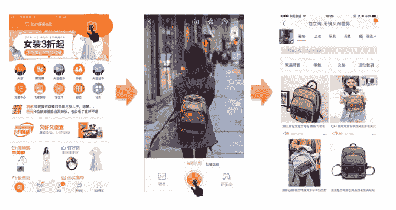
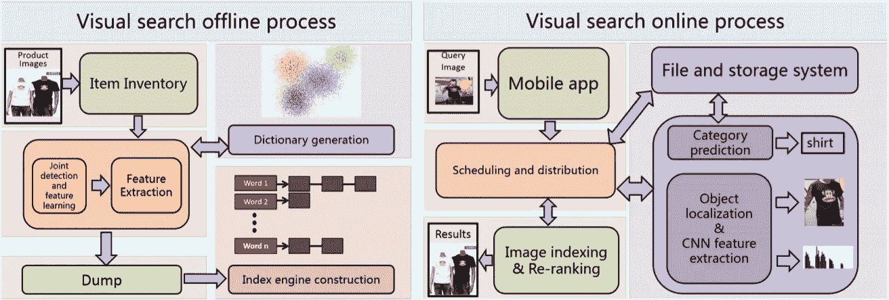

# 用你的相机购物:视觉图像搜索与阿里巴巴的电子商务相遇

> 原文：<https://medium.com/coinmonks/shopping-with-your-camera-visual-image-search-meets-e-commerce-at-alibaba-8551925746d0?source=collection_archive---------3----------------------->

*本文是* [***学术阿里巴巴***](/@alitech_2017/academic-alibaba-b56f4176a838) *系列的一部分，摘自 2018 KDD 接受的由张言好、、、、张颖雅、任晓峰和金荣撰写的题为“阿里巴巴的视觉搜索”的论文。全文可以在这里阅读***。**

*从搜索引擎到社交媒体，近年来在线照片的流行呈指数级增长。毫不奇怪，视觉图像搜索，也被称为“基于内容的图像检索”，也越来越受欢迎。阿里巴巴的技术团队将这一概念带到了一个领域，一张好照片可以决定成败:网上购物。*

*阿里巴巴与机器智能技术实验室合作开发了 Pailitao，这是一款将视觉图像搜索原理应用于电子商务的应用程序，允许用户通过拍摄查询对象的照片来搜索商品。只需按下一个按钮，派力陶就会自动返回淘宝上视觉上相似的商品。这使得顾客几乎可以接触到任何物品，无论是在街上还是在脸书和 Instagram 等社交媒体平台上。*

*如果你认为这听起来像是一个有用的特性，有数百万人会同意。Pailitao 在 2014 年推出时一炮而红，到 2017 年已积累了 1700 万日活跃用户(DAU)的用户群。在那一年的双 11 全球购物节——阿里巴巴在中国的年度购物盛会——期间，使用率达到峰值，DAU 计数上升到超过 3000 万。*

**

*With Pailitao, an item seen on one’s morning commute can end up in one’s shopping cart with a few easy clicks*

# *发展中的派力陶*

*虽然已经有大量关于视觉图像搜索的研究，但研究人员在开发 Pailitao 时面临一系列独特的挑战。*

*与电子商务网站上精心策划的库存照片不同，用户在拍拍淘上的查询来自现实生活。查询图像通常质量较低，并且包括会使对象定位复杂化的复杂背景特征。此外，大多数视觉搜索解决方案都无法达到阿里巴巴的规模。随着阿里巴巴拥有许多细粒度类别的大型图像集合，视觉图像搜索技术需要海量数据架构，维护深度模型的训练数据可能非常昂贵。*

**

*A diagram of Pailitao’s visual search architecture*

*考虑到这些实际挑战，研究人员提出了一种可扩展的高效视觉搜索系统。他们引入了一种有效的类别预测方法，使用基于模型和搜索的融合来减少搜索空间。与传统方法相比，这允许更好的可伸缩性，并且对于混淆类别和域限制实现了更好的性能。*

*研究人员还提出了具有分支的深度卷积神经网络(CNN)模型，用于联合检测和特征学习。该模型是弱监督的，最小化了人工标记数据的开销。该模型在没有背景干扰的情况下同时发现检测掩模和精确的鉴别特征。研究人员随后建立了一个检索流程，使用二进制索引引擎和重新排序来训练模型并提高客户参与度。*

*结合起来，这些功能形成了一个强大的大规模索引和检索技术，允许在几毫秒内响应，以及无损召回。*

# *远非美照菲尼莎*

*研究人员进行了广泛的实验来评估系统中每个模块的性能，收集了 15 万张最高回忆图像以及检索结果的相同项目标签。在那里，Pailitao 模型和其他几个视觉图像解决方案在类别预测、搜索相关性、对象定位和索引/重新排序方面进行了测试。*

*在每个实验中，Pailitao 模块都与竞争对手的最先进网络不相上下，甚至更胜一筹。该数据验证了派力淘端到端架构服务于其数百万日活跃用户的有效性。展望未来，研究人员希望将这种视觉搜索技术融入更多的商业应用中。*

**

**全文可在此阅读***。***

# **阿里巴巴科技**

**关于阿里巴巴最新技术的第一手深度资料→脸书: [**【阿里巴巴科技】**](http://www.facebook.com/AlibabaTechnology) 。Twitter:[**【AlibabaTech】**](https://twitter.com/AliTech2017)。**

> **[直接在您的收件箱中获得最佳软件交易](https://coincodecap.com/?utm_source=coinmonks)**

****