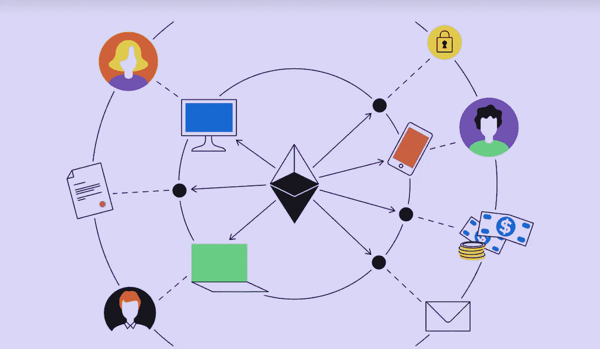
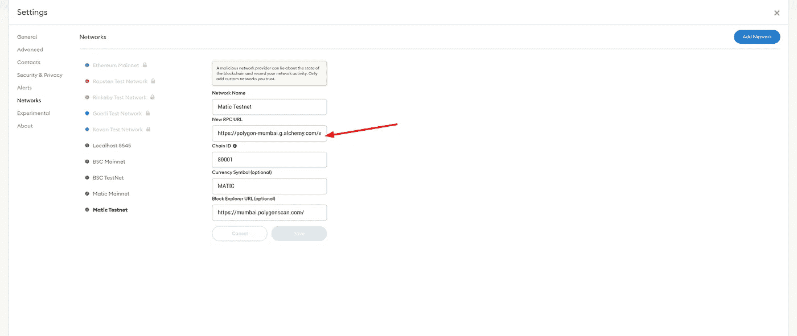
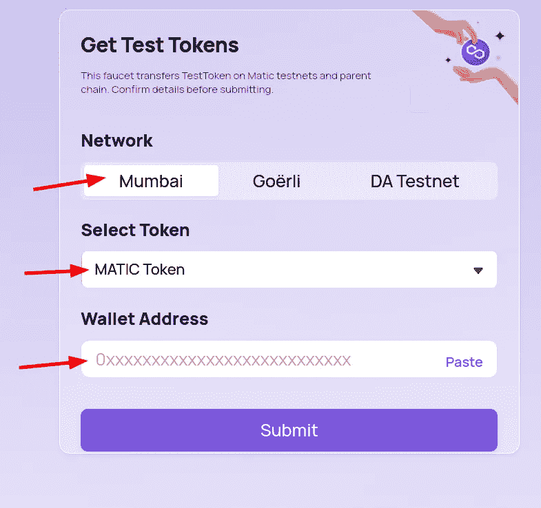
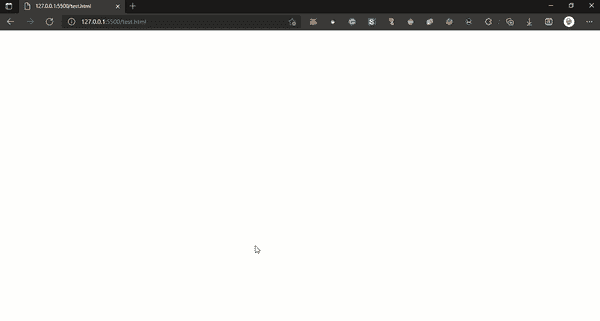

# 第一次 dapp 的简短指南

> 原文：<https://medium.com/coinmonks/short-guide-for-your-first-dapp-2292f9b9d319?source=collection_archive---------9----------------------->

a dapp is any application (not necessarily frontend javascript) that has the blockchain as the ‘backend’

1.  开始之前:

你需要有一些基础的东西，了解一些东西，比如钱包、合同地址、RPC URL、dapps、汽油限量、汽油价格

在做任何事情之前，你必须先上一堂历史课

 [## #以太坊简史

### 从鸟瞰的角度来看，区块链技术并没有存在很长时间。虽然基本概念…

consensys.net](https://consensys.net/blog/blockchain-explained/a-short-history-of-ethereum/)  [## 以太坊到底是怎么运作的？

### 你可能听说过以太坊区块链，不管你是否知道它是什么。这在新闻里出现过很多次…

www.preethikasireddy.com](https://www.preethikasireddy.com/post/how-does-ethereum-work-anyway)  [## 以太坊如何工作第 2 部分:智能合约、天然气和 Dapps | ConsenSys

### 本文是以太坊如何工作第 1 部分的续篇，第 1 部分着重于理解比特币。你所有的背景…

consensys.net](https://consensys.net/blog/blockchain-explained/how-ethereum-works-part-2-smart-contracts-gas-and-dapps/) 

和两篇非常重要的文章(短小精悍),它们将在未来为您节省大量资金

 [## #以太坊区块链的 Gas 指南

### 2018 年 1 月 1 日至 2018 年 1 月 3 日期间，在以太坊区块链执行交易的平均成本…

consensys.net](https://consensys.net/blog/blockchain-explained/a-guide-to-gas/)  [## 以太坊:你想知道的关于气体的一切

### 气体让以太坊区块链保持活力。在这篇博文中，我将解释气体是什么？如何使用？以及为什么它…

blog.softwaremill.com](https://blog.softwaremill.com/ethereum-everything-you-want-to-know-about-the-gas-b7c8f5c17e7c) 

[https://coin telegraph . com/ether eum-for-初学者/ether eum-wallets-a-初学者-存储指南-eth](https://cointelegraph.com/ethereum-for-beginners/ethereum-wallets-a-beginners-guide-to-storing-eth)

 [## 以太坊智能合约编程入门

### 从 noobs 到以太坊的发展。

medium.com](/@ConsenSys/a-101-noob-intro-to-programming-smart-contracts-on-ethereum-695d15c1dab4) 

# 你知道的够多了吗？

学习永无止境，但是…如果你不知道下面所有问题的答案，那么这意味着你不知道基础知识…应该通过更多的学习来解决这个问题

1.私钥、公钥和地址的区别是什么？什么是种子？什么是随机数。

2.什么是“卫”、“圭”

3.如何从以太坊内部获取 USD / ETH 汇率？神谕是什么？

4.什么是高清钱包？Metamask 里面有高清钱包吗？

5.什么是 RPC 节点？你如何连接到它

6.Metamask 有哪些替代品？

7.RPC 节点和 Signer 节点有什么区别？

8.什么是气价，什么是气限？

9.如果你把气价设低了会怎么样，如果你把气限设低了会怎么样？

10.什么是 ERC20？ERC721？ERC1155

11.总供应量、最大供应量、循环供应量之间的差异是什么

12.谁是维塔利克，约瑟夫·卢宾？

13.康尼斯公司是做什么的？

14.ETH2.0 会有什么超过 1.0 的？

1.  因为建立你自己的以太网节点只是为了特定的项目，通常你想要的是得到一个到以太坊(或任何以太网兼容的)区块链的 RPC 连接。通常由:[https://www.alchemy.com/](https://www.alchemy.com/)，[https://www.quicknode.com/](https://www.quicknode.com/)，[https://blockdaemon.com/](https://blockdaemon.com/)， [https://infura.io](https://infura.io) (仅限 ETH)，[https://nodesmith.io/](https://nodesmith.io/)挑一个你喜欢的，只使用免费计划(不升级任何东西)

2.出于测试目的，我建议你使用多边形测试网(称为孟买)。[稍后编辑:在他们解决 EIP1559 的问题之前，测试网是不可用的！用别的，也许 rinkeby]为什么？因为这是最快的测试网，你会想要快速的反馈。

设置多边形测试网:

在您的元掩码中，添加一个新的网络，并根据您在步骤#1 中获得的网络配置 RPC url。

您在元掩码中的所有地址在所有 ETH 兼容的区块链之间共享。

去孟买水龙头[https://faucet.polygon.technology/](https://faucet.polygon.technology/)

离开孟买网络，令牌自动令牌

把你的钱包地址写在这里。点击提交，等待 1 分钟，再次点击提交。你的钱包里应该有大约 2 MATIC 用于测试

3.90%的流量将来自桌面—有了元掩码，这意味着这种方法必须完美运行。

有两种方法可以连接到元掩码。1.web3.js(又老又丑的方式…但是有很多文档)，2。ethers.js(新的、更简单的…更少的文档)。我会选择 ethers.js

从阅读这个开始:

[**https://docs.ethers.io/**](https://docs.ethers.io/)**->只要看完介绍部分然后继续这个**

 [## 用 Ethers.js - LogRocket 博客构建 DApp

### 区块链、以太坊、DApps、智能合约...如果你在互联网上，你很可能在附近见过这些词…

blog.logrocket.com](https://blog.logrocket.com/building-dapp-ethers-js/) 

end result

最后，有了一个非常简单的前端，您应该能够传输一些简单的 erc20 令牌。

**最后**

你需要对你的代码进行审计。我推荐 [https://to.wtf](https://to.wtf) 成为市场上最好的审计师:)

有许多好的教程可以遵循，学习永无止境

从这个开始:

 [## NFT 发展——融入

### 在编程中，NFT 不是一张图片或 gif，而是一个拥有钱包的数字。

inblockchainwetrust.medium.com](https://inblockchainwetrust.medium.com/nft-development-into-825e6443eb44) 

然后从这两个中选一个

 [## 如何编写和部署 NFT(NFT 系列教程的 1/3)| ethereum.org

### 本教程是 NFTs 系列的第 1 部分，它将带您一步一步地学习如何编写和部署一个不可替代的…

ethereum.org](https://ethereum.org/pt/developers/tutorials/how-to-write-and-deploy-an-nft/)  [## 用 Javascript & Solidity 创建你自己的 NFT 指南🚀(第 1 部分，共 3 部分)

### 什么是 NFT？

medium.com](/coinmonks/guide-to-creating-your-own-nft-with-javascript-solidity-part-1-of-3-7909b80fae94)