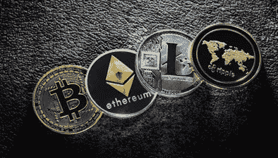
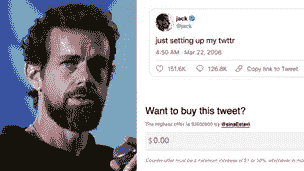

# 我应该为区块链和加密货币费心吗？

> 原文：<https://medium.com/coinmonks/should-i-bother-with-blockchain-and-cryptocurrencies-f886b05624d4?source=collection_archive---------10----------------------->

2017 年 9 月，我在美国印第安纳波利斯工作了三周。我在空闲时间发现了这个国家，在乔爷爷的牧场骑马，或者去电影院，在那里你的座位变成了沙发，他们在电影期间提供晚餐。我喜欢看网飞最新一季的《行尸走肉》，这部电影在荷兰还没有上映。我做了一个关于加密货币的在线课程。这是在大多数人听说过比特币或以太坊之前。

我很感兴趣，并决定在课程结束后购买一些加密货币。这是第一次意义重大的比特币泡沫，而我是其中的一员！在三个月内，我的钱翻了两番，又过了三个月，我的钱被挥霍一空。真是过山车啊！从那以后，我一直在交易加密货币，并密切关注该领域的发展。在这篇文章中，我想给你一点我所学到的见解。请记住，我只是一个普通的加密用户，而不是任何方面的专家，但我想我可能会为那些不太了解它的人提供一些启发。

首先，这不是投资加密货币的建议。尽管幸运的话你可以成为百万富翁，但你也可能很快失去所有的钱。所以如果你这么做了，准备好放弃你的投资吧。自 2017 年第一次比特币泡沫以来，我已经看到了四个以上涨为主的市场时期(牛市)，随后是毁灭性的崩盘(熊市)。上个月，市场上涨很快，涨幅达 50%，但在一些坏的经济消息后，这一涨幅在一天之内就消失了。这有点像买彩票。如果你运气好，你会赢很多。如果你运气不好，你就失去了一切，或者你赢得了彩票的价格。

警告过大家，先来讨论一下是什么。当人们谈论加密货币时，你经常会听到区块链这个词。这是因为加密货币是建立在区块链技术之上的。换句话说，区块链技术使加密货币成为可能。所以，让我们先谈谈区块链。区块链的问题在于它相当复杂，而且很容易迷路。我不想解释所有的，我把它简化成这三个基本要素。

> 区块链去中心化
> 
> 区块链有可靠的数学支持
> 
> 区块链需要共识算法

# 区块链去中心化。

区块链是指发布一系列包含已验证信息的块，这些信息在发布后不能更改。总是涉及许多计算机或节点，它们必须使用特定的软件来就真相达成一致。一个接一个的区块被发布并链接到前一个区块，导致一个连接区块链，它可以告诉你在它发布的时间点上所有后续真相的整个历史。这里重要的是，它不是一个中央权威机构告诉你真相，而是很多独立的节点确定了它，并公布出来让大家永远看到。它可以用于无数的事情。你可以同意谁拥有什么，你签署了哪些合同，或者跟踪交易。这里要记住的主要一点是，这是在没有政府、银行或其他中央机构参与的情况下发生的。它只是一组基于全球的计算机节点，运行相同的软件并一起工作。

请注意与银行的巨大区别，我们相信银行会保留关于谁拥有多少钱的准确信息。我们实际上无法看到或验证它是真的。而且，因为银行是中央权威，他们成为市场的重要组成部分。这就是为什么大银行被认为是系统银行，政府会拯救它们免于破产，正如我们在 2008 年金融危机中看到的那样。

# 区块链有坚实的数学做后盾

构建区块链的方法是使用块之间的链接。每个块都有一个数学代码，称为哈希，通过使用整个块及其所有先前块的确切内容来计算。因此，如果有人改变了链中任何一个块中的一个字符，这将导致一个不同的散列。这就是如何验证块没有改变。哈希计算在数学上是合理的，并且被证明对黑客攻击是安全的。但是，从理论上讲，还有许多其他方法可以打败区块链。区块链开发者和科学家研究这些，并找到解决方案。已经记录了两百多种潜在的弱点类型。当有人试图花费相同的硬币两次时，您可能会听到“双重花费攻击”或当有人试图获得超过 50%的节点的控制权时，您可能会听到“共识 51%攻击”这样的术语。我不会用所有的细节来打扰你，但是相信我，这是经过深思熟虑的。大多数理论上的攻击都停留在理论上，因为它们很难被利用，或者已经被软件中的逻辑有效地阻止了。当然，有人可能偶尔会利用漏洞，但这与当前的金融系统没有什么不同。

# 区块链需要共识算法

如前所述，每个块都是在大多数节点同意并验证该块是准确和有效的之后发布的。为了达成这样的协议，每个节点必须证明它们被授权加入共识过程。有几种方法可以做到这一点。最广为人知的算法叫做工作证明，是比特币和以太坊的基础。它需要节点执行复杂的密码难题，如果他们解决了它，他们将获得奖励，并获得参与验证该块的权利。问题是，这需要大量的计算机功率和能量使用。这就是为什么现在有许多替代方案，如信任证明、烧录证明、股权证明、股权委托证明、容量证明或已用时间证明。在任何情况下，你都需要提供一些有价值的东西来参与。由于工作证明如此浪费，以太坊现在正计划在升级到以太坊 2.0 时从工作证明转移到股权证明，计划在 2021 年底或 2022 年初。

# 加密货币

那么它对加密货币意味着什么呢？如今，市场上有数千种加密货币，每一种都有自己的一套规则和应用。他们可以被分成许多种类，但这是任意的，许多人会对他们进行不同的分类。在这篇文章的底部，我列出了最重要的几个。如果我漏了几个或者我把一个代币或硬币分类错了，不要开枪打我。不同团体开发所有这些加密货币的事实也使它们很难被跟踪。它们是如何相互关联的？哪些币是竞争对手？哪个硬币建立在另一个硬币上？哪些硬币是长期的，哪些只是短期炒作？

没有一个权威可以回答你所有的问题。这有点像“狂野西部”的重演。每个人都使用不同的术语和词语，过一会儿，你就看不到所有的东西了。为了帮助更好地理解它，我在本文末尾澄清了几个术语。

那么，这一切将走向何方，你又何必为此烦恼呢？

加密货币的市场是巨大的，并且正在以天文数字的速度增长。我认为我们仍处于开始阶段，未来几年和几十年将因此而改变社会。影响其走向的主要因素有:

政府参与

金融机构的反应

公众的接受度

# 政府参与

越来越多的政府正在考虑通过立法来控制加密货币市场。一些政府大步向前，开始接受比特币作为官方货币，就像萨尔瓦多最近所做的那样。其他政府将试图完全阻止它们，就像中国今年 6 月禁止几乎所有中国比特币矿场一样。

大多数国家在这方面还没有走得很远，但可以预见的是，随着加密市场中涉及的资金量迅速增加，他们将很快这样做。今年涉及的资金总额已经从 1 月份的大约 7000 亿美元增加到现在的超过 2 万亿美元。随着许多知名投资者加入加密市场，可以肯定的是，更多的资金将流入这个市场，政府将希望看到他们如何确保对所有这些资金征税。

另一种可能性是，一些政府担心对金融市场及其稳定性的影响，将通过法律限制加密市场。

最后但并非最不重要的一点是，政府可能认为他们需要保护消费者免受加密市场波动带来的风险，并将努力为此采取措施。

很难预测会发生什么。尽管如此，政府会发现很难控制加密市场，因为它们本质上是全球性的，这需要国际合作。让我想起了互联网，也是去中心化的。针对政府控制，现在出现了政府无法控制的加密暗网。或许类似的事情也会发生在加密货币上。

# 金融机构的反应

另一个关键因素是银行的反应。他们冒着失去作为经济重要组成部分的地位的风险。他们可以试图游说政府减少威胁，或者他们可以向前一步，开始自己提供加密服务或投资加密服务。时间会证明他们是否会成功。

# 公众的接受度

最后一个要考虑的因素是公众的接受程度。如果大众接受加密服务并开始使用它们，它们会大量增加并成为主流。同样，当苹果推出第一款 iPhone 时，手机市场也出现了爆炸式增长。

我认为现在很明显，有许多不确定性，没有人知道它将如何展开。但是我们知道风险很高，而且很快会在很多方面影响你我的生活。所以，我的建议是关注它，关注加密货币的新闻。

— — — — — — — — — — — — — — — — — -

术语

# 经纪人或交易所

几个中介方可以帮助你存储、发送和交易加密货币。他们通过交易佣金赚钱。最著名的经纪商是币安、Bitfinex、双子座、北海巨妖和比特币基地。但是还有很多。您不需要使用它们，但它们使事情变得非常简单，因为它们建立了到区块链的所有连接，并处理了块发布的所有等待时间。这很方便，因为它们为你消除了复杂性。

# 代币

你经常听到的另一个词是“令牌”代币也是加密货币，但运行在另一个加密平台上，用于特定目的。显然，有许多金融应用，但它们也可以用于云计算、供应链、游戏、赌博、社交媒体和营销。应用程序的数量是无止境的，取决于开发者满足市场特定需求的创造力。

# 比特币挖矿

为验证区块链上的块所做的工作证明称为挖掘。但是还有一种重要的活动叫做采矿。它是寻找新的硬币，例如，比特币。比特币的固定数量为 2100 万枚，直到今天，大约有 1800 万枚被发现。在这 1800 万个比特币中，大约有 400 万个比特币已经永远丢失。找到最后 300 万个比特币变得越来越困难，你只能通过做大量的计算工作，解决一个密码难题来做到这一点。这就是为什么会有比特币挖矿农场，除了找比特币什么都不做。如果你找到一个，你可以使用它，随着比特币价格上涨了很多，这仍然是值得的。比特币的总数是有限的，这是价格上涨如此之多的原因之一。它很稀有，就像黄金一样，所以当需求上升时，价格就会上涨，因为没有额外的供应。在撰写本文时，一个比特币的交易价格约为 40，000 美元。

# 立桩标界

有时，令牌也用于在特定网络本身中下注，给予参与该网络变化决策的权利，有时甚至赚取利息。这有助于管理一种货币的发展，因为它需要不断变化来解决问题或增加额外的功能。

# 可替代或不可替代

令牌可以是可替换的，也可以是不可替换的。如果一个令牌是可替换的，这意味着它可以被换成其他东西。和一美元一样，和其他任何一美元一样好。一个不可替代的令牌，或 NFT，代表一种独特的资产，不能用来交换类似的东西。每个 NFT 都有自己的价值，取决于它所代表的意义。

一个例子是皮普尔的《每一天:前 5000 天》这是一件数字艺术品，可以拍卖或出售，因为一个单独的 NFT 代表了这件艺术品。它不能被复制或分割。2021 年已经拍卖到 6930 万美元。

另一个例子是 Twitter 的首席执行官杰克·多西的第一条推文，他以 NFT 的身份将平台上的第一条推文(制作于 2006 年 3 月 21 日)卖了近 300 万美元。

这在将来会有更多的应用。有些人会在 3D 虚拟游戏世界里为一栋漂亮的房子花费大量金钱。这一切都可以用 NFT 氏症来支持。

— — — — — — — — — — — — — — — — — -

加密货币列表

货币，如比特币、比特币现金、以太币、莱特币或 Dash

智能合约平台，如以太坊、Solano、Cardano、Tezos、Avalanche、Algorand、NEO 或 EOS

将区块链彼此连接起来，像宇宙、波尔卡多特、多边形或量子

连接到真实世界，提供真实世界的结果、价格和数据，如区块链或占卜

云工具，可以使用计算和存储，比如 Storj 或互联网计算协议

分散的自治组织，如制造商或复合组织

分散式财务应用程序(DeFI)

o 稳定的硬币，如泰索、戴或美元硬币

o 分散式交换，如 Uniswap 或 Airswap

o 借贷，像 Aave 或者达摩

o 资产管理，如 Metamask 或 Gnosis Safe

o 合规性，如 KYT 或 Codefi 合规性

o 身份管理，如公民或 uPort

o 保险，如 Etherisc 或 Nexus Mutual

像福尔库姆或 DDEX 的保证金交易

o 在线市场，如 Gitcoin 或 Ethlance

o 付款，如 Ripple、恒星流明、Valora 或土拨鼠

供应链，像维琴，或沃尔顿链

赌博，像游乐场或眨眼

游戏，如金恩，MobileGo，织机，离子，分散或创

内容、社交媒体和营销，如 Steemit、Bitchute、Hive、Brave 或 Dtube

物联网，比如 IOTA (IOTA 用的是 Tangle，是一个块的网络，而不是一个块的链)。

没什么。有些硬币是作为一个玩笑而创造的，比如 Dogecoin 或 INU 柴币。不久前，埃隆·马斯克在推特上发布了 Dogecoin 后，它的价值提高了很多，尽管这种硬币本来就一文不值。

这篇文章太长了，无法详细介绍它们，如果你愿意，网上有足够的信息来满足你的好奇心。

> 加入 Coinmonks [电报频道](https://t.me/coincodecap)和 [Youtube 频道](https://www.youtube.com/c/coinmonks/videos)了解加密交易和投资

## 另外，阅读

*   [用于 Huobi 的加密交易信号](https://blog.coincodecap.com/huobi-crypto-trading-signals) | [HitBTC 审核](/coinmonks/hitbtc-review-c5143c5d53c2)
*   [如何在 FTX 交易所交易期货](https://blog.coincodecap.com/ftx-futures-trading) | [OKEx vs 币安](https://blog.coincodecap.com/okex-vs-binance)
*   [OKEx vs KuCoin](https://blog.coincodecap.com/okex-kucoin) | [摄氏替代品](https://blog.coincodecap.com/celsius-alternatives) | [如何购买 VeChain](https://blog.coincodecap.com/buy-vechain)
*   [币安期货交易](https://blog.coincodecap.com/binance-futures-trading)|[3 commas vs Mudrex vs eToro](https://blog.coincodecap.com/mudrex-3commas-etoro)
*   [如何购买 Monero](https://blog.coincodecap.com/buy-monero) | [IDEX 评论](https://blog.coincodecap.com/idex-review) | [BitKan 交易机器人](https://blog.coincodecap.com/bitkan-trading-bot)
*   [尤霍德勒 vs 科恩洛 vs 霍德诺特](/coinmonks/youhodler-vs-coinloan-vs-hodlnaut-b1050acde55a) | [Cryptohopper vs 哈斯博特](https://blog.coincodecap.com/cryptohopper-vs-haasbot)
*   [顶级付费加密货币和区块链课程](https://blog.coincodecap.com/blockchain-courses)
*   [MXC 交易所评论](/coinmonks/mxc-exchange-review-3af0ec1cba8c) | [Pionex vs 币安](https://blog.coincodecap.com/pionex-vs-binance) | [Pionex 套利机器人](https://blog.coincodecap.com/pionex-arbitrage-bot)
*   [如何在印度购买比特币？](/coinmonks/buy-bitcoin-in-india-feb50ddfef94) | [瓦济克斯审查](/coinmonks/wazirx-review-5c811b074f5b)
*   [印度的加密交易所](/coinmonks/bitcoin-exchange-in-india-7f1fe79715c9) | [比特币储蓄账户](/coinmonks/bitcoin-savings-account-e65b13f92451)
*   [币安收费](/coinmonks/binance-fees-8588ec17965) | [僵尸加密审查](/coinmonks/botcrypto-review-2021-build-your-own-trading-bot-coincodecap-6b8332d736c7) | [热点审查](/coinmonks/hotbit-review-cd5bec41dafb)
*   [我的加密副本交易经历](/coinmonks/my-experience-with-crypto-copy-trading-d6feb2ce3ac5) | [AAX 交易所评论](/coinmonks/aax-exchange-review-2021-67c5ea09330c)
*   [Bybit 融资融券交易](/coinmonks/bybit-margin-trading-e5071676244e) | [币安融资融券交易](/coinmonks/binance-margin-trading-c9eb5e9d2116) | [Overbit 审核](/coinmonks/overbit-review-9446ed4f2188)
*   [有哪些交易信号？](https://blog.coincodecap.com/trading-signal) | [Bitstamp vs 比特币基地](https://blog.coincodecap.com/bitstamp-coinbase)