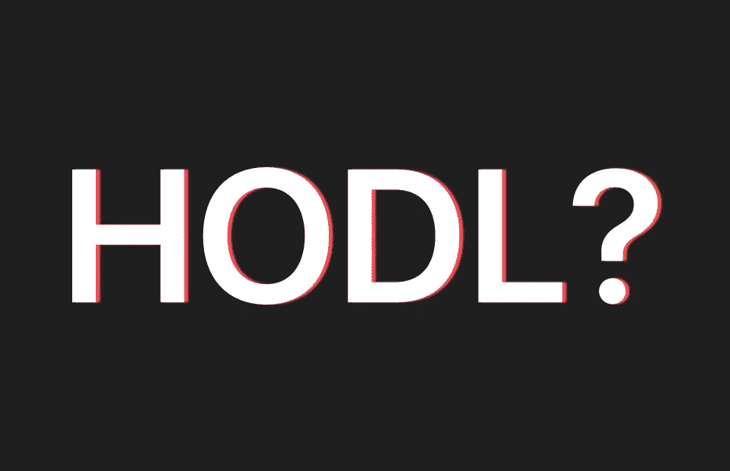
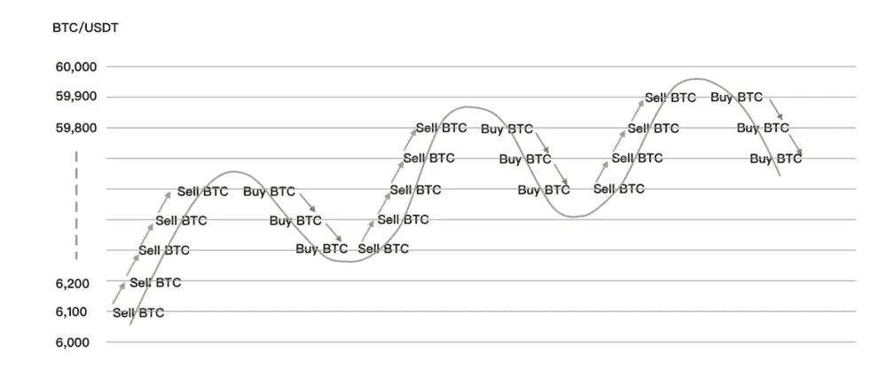
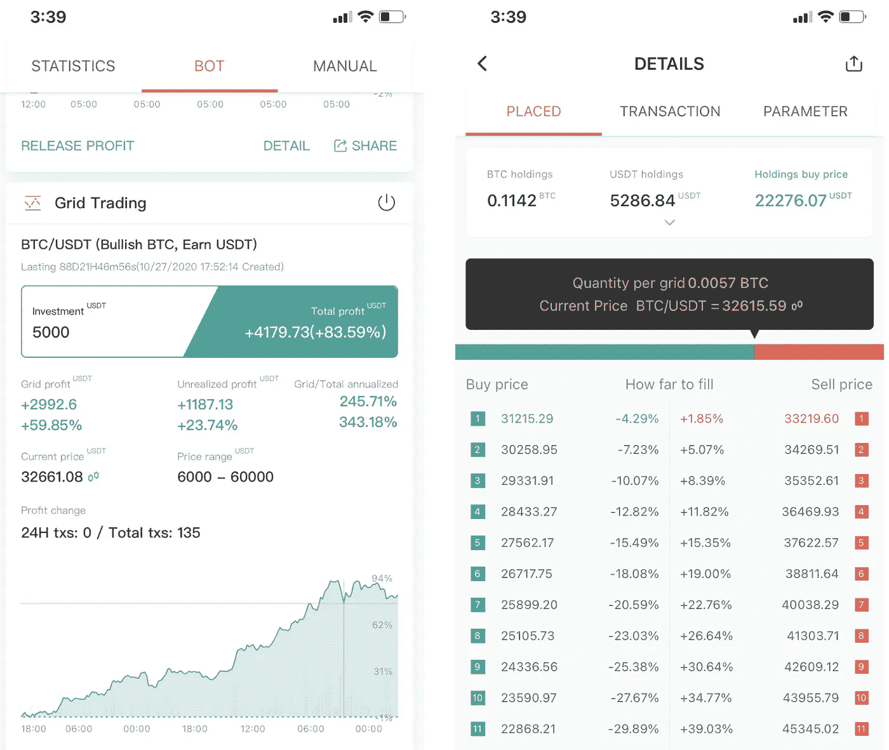

# 我现在应该购买比特币吗？| 2021 年适合新手的最佳比特币交易策略

> 原文：<https://medium.com/coinmonks/should-i-buy-bitcoin-now-the-best-bitcoin-trading-strategy-for-newbies-in-2021-345bd3b9d1a7?source=collection_archive---------1----------------------->

> “嗯……比特币确实让我兴奋不已。在那次大撤退中，我昨晚把所有比特币都卖了。”我的一个朋友来找我，抱怨昨晚的市场。
> 
> “如果我告诉你，你不是第一个跟我说这些的人会怎么样。你现在觉得舒服多了吗？”我尽量安慰他。“人们总是告诉你把比特币卖给 HODL。他们会说，你对整个比特币技术没有足够的信心和远见。”
> 
> “的确如此！！我的大多数朋友都这么回答！”他同意我的看法。
> 
> “嗯……HODL 听起来是对的，但对大多数投资者来说这是不可能的。有好几次**我都没能把手中的股票套现，直到我学会了一种特殊的技巧**。通过这种策略，我赚了 500%以上。”

# HODL 听起来是对的。但对大多数投资者来说这是不可能的。

**“买入 HODL。”**当我决定投资加密货币时，大多数加密货币投资者都这么说。

**但在这个市场操纵者搞了几次拉锯战之后，他们中没有一个人归还了自己的包裹。** FOMO 上台让我们做出错误的决定。来自 HODL 的成功是我们投资旅程中所涉及的情绪的复杂原因。

作为人类，我们总是试图买入底部，卖出顶部。我们更喜欢关注短期的 PNL，而不是长期的利润。 **HODL 反对人类的反应方式和我们的情绪。**

很好。所以你的意思是说 HODL 不可能拥有比特币？既有肯定也有否定。

假设你愿意在比特币价格达到 1 万美元时全力买入。你对比特币的理想目标是 10 万美元。如果你能按照这个交易计划，这笔交易将带来 10 倍的利润。但如果价格再也达不到 1 万美元怎么办？如果需要十年才能达到 10 万美元呢？你认为你可以遵循你的交易计划，坚持纪律，即使是这么长的时间？

对大多数投资者来说答案是否定的。

> 现在就试试 Pionex，开始购买比特币吧。

# 这是你应该做的，而不是霍德林。

现在你们都同意我的看法，霍德林是不可能的，并正在寻找一些改变你未来的投资策略。

我们的交易计划如下:

*   一旦比特币价格达到 1 万美元，就买入
*   比特币价格达到 10 万美元时卖出

作为一个有经验的投资者，我不会空手而归。相反，我会立即以当前价格购买一些比特币。保留一些美元与我和梯级购买时，价格下降。为了防止价格永远不会达到 100，000 美元，我会继续梯级出售时，价格飙升。

你明白我的意思吗？我把我的原则分成几个小部分。当价格上涨时，我卖出我的比特币的一部分，当价格下跌时，我买入更多的比特币。这是一个简单的策略，你不必学习几个指标来预测市场。

*当我们做出正确的预测时，感觉棒极了，但当我们做错时，感觉糟透了。*

这是我的秘密收据。你的下一个问题是，我如何遵循这个策略？一次又一次下订单是件麻烦事。有什么更容易处理的方法吗？

这些可重复的任务可以由机器人轻松完成。电网交易机器人来了。

# 让 HODL 成为可能的工具。

网格交易是一种从波动中获利的策略；它所做的是在特定的价格范围内低买高卖。Grid Trading Bot 帮助您全天候执行这一策略。

> 下载 Pionex app:【www.pionex.com/download 

了解如何在 Pionex 上设置网格交易机器人。

只需将 BTC/USDT 的价格范围设定在 10，000 美元到 100，000 美元之间。它将在当前水平购买一些比特币，用机器人保留一些 USDT，如果价格保持在价格范围内，就进行阶梯式买卖。

# 这种策略在当前价格下行得通吗？我来晚了吗？

是的，现在还能用。只要你看好比特币，那么就用这个策略来防止你被动荡的市场所动摇。

如果这是你第一次遵循这个策略，你可能会感到焦虑。成功的关键是只使用你投资组合中你愿意用这种策略损失的一小部分。这将是我的余额的 5%，你可以改变你喜欢的百分比。

赢得长期投资的另一个技巧是，即使使用这种策略，也不要全押。当价格下跌 10%时，再投资 10%购买一个新机器人，当价格再次下跌时，再投资 10%购买另一个新机器人。

如果你已经知道如何启动一个网格交易机器人，这里有你可以用于这个 HODL 的参数如果你已经知道如何启动一个网格交易机器人，这里有你可以用于这个 HODL 策略的参数:

*   上限:10 万美元
*   下限:10，000 美元
*   网格数量:150

# 退出这一策略的最佳时机

整篇文章我们都在讲入场策略。退出策略呢？我应该什么时候关闭机器人，带着我的利润离开？

让我们回到你最初的交易计划，我们计划在价格达到 100，000 美元时获利。这是我们关闭机器人的时刻。当价格达到 100，000 美元时，机器人已经帮助你卖掉了你所有的股份，这就是我们关闭机器人的时刻。

# 常见问题解答

**我可以保留这个电网交易机器人多长时间？**

这个超宽 BTC 网格交易机器人是一项长期战略。BTC 在价格范围内波动的时间越长，你赚的利润就越多。

如果价格下跌呢？我应该停止机器人吗？

不。一旦价格下跌，那就是你开始另一个机器人的机会。当价格下降时，尝试创建更多的机器人，而不是关闭你的机器人。买蘸酱，不卖蘸酱。

**这种策略只适用于比特币吗？**

你可以用这个策略搭配任何你喜欢的包包。只要你长期看好，就用这个策略来 HODL 你的袋子。

*   包括附属链接。

> 加入 Coinmonks [电报集团](https://t.me/joinchat/EPmjKpNYwRMsBI4p)，了解加密交易和投资

## 另外，阅读

*   什么是[闪贷](https://blog.coincodecap.com/what-are-flash-loans-on-ethereum)？
*   最好的[密码交易机器人](/coinmonks/crypto-trading-bot-c2ffce8acb2a)
*   [3 商业评论](/coinmonks/3commas-review-an-excellent-crypto-trading-bot-2020-1313a58bec92) | [Pionex 评论](/coinmonks/pionex-review-exchange-with-crypto-trading-bot-1e459d0191ea) | [Coinrule 评论](https://blog.coincodecap.com/coinrule-review-a-perfect-trading-bot)
*   [AAX 交易所评论](/coinmonks/aax-exchange-review-2021-67c5ea09330c) | [德里比特评论](/coinmonks/deribit-review-options-fees-apis-and-testnet-2ca16c4bbdb2) | [FTX 密码交易所评论](/coinmonks/ftx-crypto-exchange-review-53664ac1198f)
*   [n 零审核](/coinmonks/ngrave-zero-review-c465cf8307fc)
*   [Bybit Exchange 审查](/coinmonks/bybit-exchange-review-dbd570019b71) | [Bityard 审查](https://blog.coincodecap.com/bityard-reivew)
*   [3Commas vs Cryptohopper](/coinmonks/3commas-vs-pionex-vs-cryptohopper-best-crypto-bot-6a98d2baa203)
*   最好的比特币[硬件钱包](/coinmonks/the-best-cryptocurrency-hardware-wallets-of-2020-e28b1c124069?source=friends_link&sk=324dd9ff8556ab578d71e7ad7658ad7c)
*   [总账与 n 平均](https://blog.coincodecap.com/ngrave-vs-ledger)
*   [密码本交易平台](/coinmonks/top-10-crypto-copy-trading-platforms-for-beginners-d0c37c7d698c)
*   [莱杰 nano s vs x](https://blog.coincodecap.com/ledger-nano-s-vs-x)
*   [Vauld 评论](https://blog.coincodecap.com/vauld-review) | [YouHodler 评论](/coinmonks/youhodler-4-easy-ways-to-make-money-98969b9689f2) | [区块链评论](/coinmonks/blockfi-review-53096053c097)
*   最好的[加密税务软件](/coinmonks/best-crypto-tax-tool-for-my-money-72d4b430816b) | [硬币追踪评论](/coinmonks/cointracking-review-a-reliable-cryptocurrency-tax-software-5114e3eb5737)
*   最佳[加密贷款平台](/coinmonks/top-5-crypto-lending-platforms-in-2020-that-you-need-to-know-a1b675cec3fa)
*   [莱杰纳米 S vs 特雷佐 one vs 特雷佐 T vs 莱杰纳米 X](https://blog.coincodecap.com/ledger-nano-s-vs-trezor-one-ledger-nano-x-trezor-t)
*   [block fi vs Celsius](/coinmonks/blockfi-vs-celsius-vs-hodlnaut-8a1cc8c26630)|[Hodlnaut 审查](https://blog.coincodecap.com/hodlnaut-review)
*   [Bitsgap 审查](/coinmonks/bitsgap-review-a-crypto-trading-bot-that-makes-easy-money-a5d88a336df2) | [四国审查](/coinmonks/quadency-review-a-crypto-trading-automation-platform-3068eaa374e1)
*   [埃利帕尔泰坦评论](/coinmonks/ellipal-titan-review-85e9071dd029) | [赛克斯斯通评论](https://blog.coincodecap.com/secux-stone-hardware-wallet-review)
*   [BlockFi 评论](/coinmonks/blockfi-review-53096053c097) |在您的密码中赚取高达 8.6%的利息
*   [DEX Explorer](https://explorer.bitquery.io/ethereum/dex) 和[区块链 API](https://explorer.bitquery.io/graphql)
*   [加密套利](/coinmonks/crypto-arbitrage-guide-how-to-make-money-as-a-beginner-62bfe5c868f6)指南:新手如何赚钱
*   最佳[加密制图工具](/coinmonks/what-are-the-best-charting-platforms-for-cryptocurrency-trading-85aade584d80)
*   了解比特币最好的[书籍有哪些？](/coinmonks/what-are-the-best-books-to-learn-bitcoin-409aeb9aff4b)

> [直接在您的收件箱中获得最佳软件交易](/coinmonks/newsletters/coinmonks)

