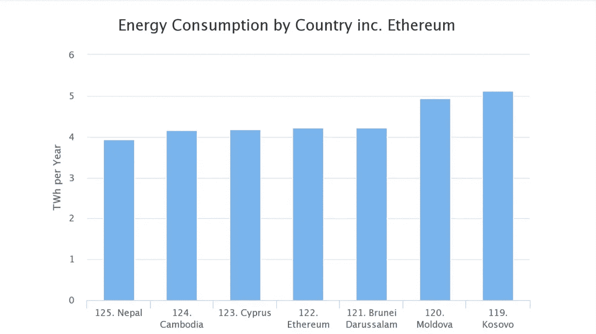
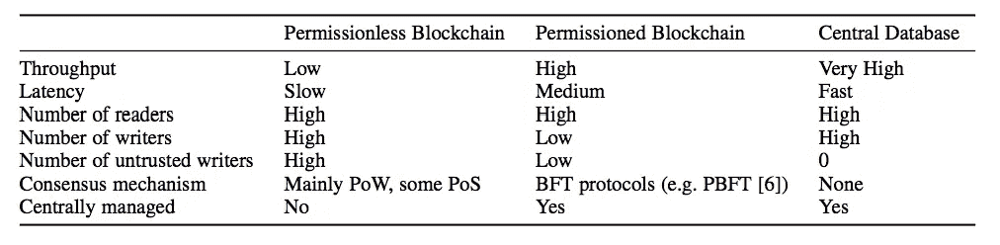
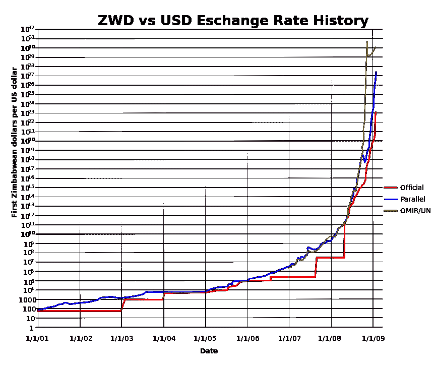

# 我应该为区块链发展吗？

> 原文：<https://medium.com/coinmonks/should-i-develop-for-blockchain-d3321a6faecd?source=collection_archive---------6----------------------->

## 我们有什么选择

EOS? Ethereum? Ripple? Waldo?

在浏览了比特币论文之后，我仍然不知道是否应该继续挖掘区块链。作为一名开发人员，我对实用知识和一定的产出感兴趣。所以去建造一个 DApp — [很简单](http://truffleframework.com/tutorials/pet-shop)！

但是我到底该不该用以太坊呢？有更好的选择吗？什么选择？我们需要分权吗？普通 DB 还不够吗？这时大部分工作都是在协议层面上完成的，为什么敢在更高的层面上工作？

# 简单化

在不深入了解不同共识机制、硬币、营销、利益或技术限制的情况下，我们如何简化区块链能够/可能提供的内容？

区块链[与数据库](http://www.ise.tu-berlin.de/fileadmin/fg308/publications/2017/2017-tai-eberhardt-klems-SALT.pdf)共享一些属性，但是它们更擅长什么？

**去中心化&对故障的鲁棒性:**他们可以提供无人能改变的分布式存储，故障节点不是问题。所有这些都是基于激励的“免费”(你不需要服务提供商，也不需要维护它)。

一个成熟的应用是存储数字资产(比特币)。以太坊也让我们梦想一台分散的计算机。两者都有可伸缩性(以太坊支持每秒 15 次交易)和能耗问题。

[Different consensus mechanisms](https://arxiv.org/abs/1710.09437) solve above issues in different ways, but there is always a tradeoff

# 选择您的工具

当从开发人员的角度考虑区块链应用程序时，我们必须考虑几个因素。

## 种类

[本文](https://eprint.iacr.org/2017/375.pdf)将区块链分为三类:

*   无权限:任何节点都可以自由加入网络，没有中央权威机构可以决定谁是合法用户。(比特币/以太坊)
*   许可:中央实体将权利赋予想要加入网络的节点。它可以是公共的，也可以是私有的，这取决于谁可以看到(并验证)存储的数据。(纹波/ R3 跳线)
*   中央数据库:我们非常了解的东西。(REST API / GraphQL)

这篇文章的观点是，只有当我们不能信任第三方时，我们才需要一个没有权限的区块链。我们被告知，不信任是金融服务的一个很好的用例，但真的是这样吗？难道我们最终不会有第三方服务在争议中帮助我们，比如 Paypal/银行，并回到以信任为导向的模式吗？也许吧，但寻找反对意见的认知努力比找到合适的用例更容易，因为这项技术还远远没有做好生产准备，而一系列创新才是导致实用性的原因。

Zimbabwe Hyperinflation

例如，央行可以通过发行新钞票来贬值货币，或者任何人都可以创造数字货币的事实本身就创造了用例(ICOs 或为特定目的创造硬币)。

有很多关于区块链天生进化缓慢的批评，但大多数批评都是在应用层面。该协议可以缓慢发展，但这并不意味着基于它构建的应用程序会以同样的速度发展。

被许可的区块链呢？好吧，如果你知道谁会给这个链写信，你可以把它作为一个分布式的分类帐来添加来自几个来源的信息。听起来更有企业精神。

## 共识机制

每个区块链都必须以某种方式达成共识，其特征由所选择的机制定义(即[工作证明](/@sgerov/bitcoin-white-paper-explained-part-1-4-16cba783146a)(PoW)[利益证明](https://github.com/ethereum/wiki/wiki/Proof-of-Stake-FAQ)(PoS)[委托利益证明](https://hackernoon.com/explain-delegated-proof-of-stake-like-im-5-888b2a74897d)(DPoS)[能力证明](https://en.wikipedia.org/wiki/Proof-of-space)(PoC)[实用拜占庭容错](https://www.quora.com/Are-smart-contracts-better-on-a-Distributed-Ledger-PBFT-or-on-a-blockchain-PoW)(PBFT)[分布式非循环图](https://forum.iota.org/t/iota-consensus-masterclass/1193)(Tangle)[权威证明](https://en.wikipedia.org/wiki/Proof-of-authority)y(PoA)[证明)](https://www.coindesk.com/space-time-how-bittorrents-creator-is-attacking-bitcoins-waste-problem/)

这种多样性使得选择更加困难，但这就是我之前提到的协议级开发。您可能会获得更高或更低的事务输出，更高或更低的去中心化程度，但是请考虑一下在理想的场景中您想要构建什么来扩展您所选择的链的边界。在技术如此不成熟的情况下，你无法寻求终极 app。

## 那又怎样？

好吧，分散式存储可以让许多用例受益，但是现在作为开发人员我们能做些什么呢？

*   创建一个聪明的([或者不那么聪明的](https://en.bitcoin.it/wiki/Script))契约:他们有图灵或几乎图灵的完整语言，允许定义复杂的业务逻辑。UX 的主要痛点是面向区块链用户和缺乏可扩展性。[点击这里查看平台列表](https://github.com/Overtorment/awesome-smart-contracts#platforms-list)。
*   创造一种(次级)货币:你可以克隆任何现存的硬币并开始挖掘。当然应该有一些附加值，否则纯粹的复制不会得到任何采用。查看一张[硬币地图](http://mapofcoins.com/)。
*   帮助开发一个链:如果你相信一些实现背后的哲学和人，他们中的许多人对贡献者是开放的。
*   在工具上工作:开发过程在大多数情况下是非常痛苦的，所以大量工具的缺失给开发人员带来了快乐。
*   创建自己的链:需要深入了解当前的实现才能创新。

# 结论

我在这里想说的是，没有任何个人的贡献可以成为今天实用的区块链用例。只是试验和破解其他人开发的化合物。

好的一面是，聪明的人会涉足这个领域，如果你看不到(像我一样)你将获得的知识的直接应用，不要紧张。只要开心就好，如果它让你兴奋，回报就会到来。最终——正如区块链的一贯作风(无法避免，对不起✌️).

在 [twitte](https://twitter.com/sgerov) r @sgerov 上和我联系！