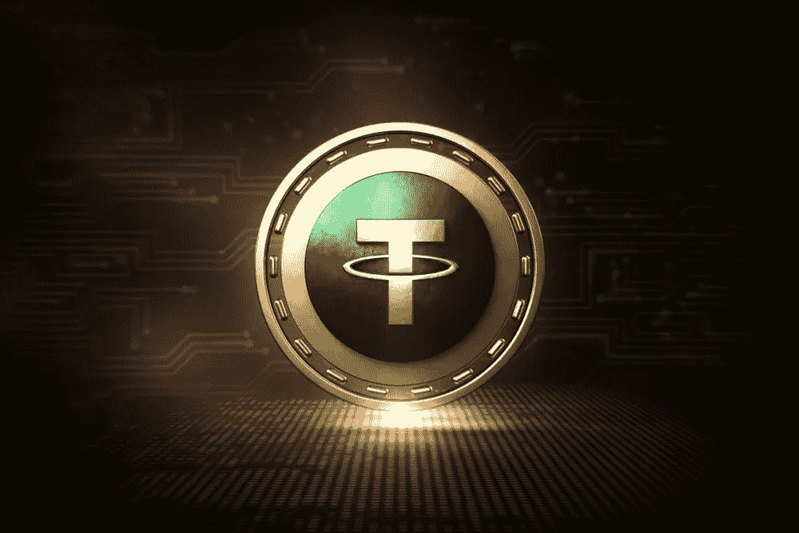

# 系绳稳定币会让你担心吗？

> 原文：<https://medium.com/coinmonks/should-the-theter-stablecoin-worry-you-b4d3bb6181ca?source=collection_archive---------2----------------------->

对于加密市场来说，资金比以往任何时候都更加重要。你可以说，密码市场像一根线一样挂在他们身上，他们像一把达摩克利斯之剑一样悬在他们头上。谣言声称，系绳美元是由热空气操纵加密价格向上。它有什么真实性吗？我们总结了这些指控，并看看两名 Tether 员工是怎么说的，他们最近在一个播客中谈到了这件事。