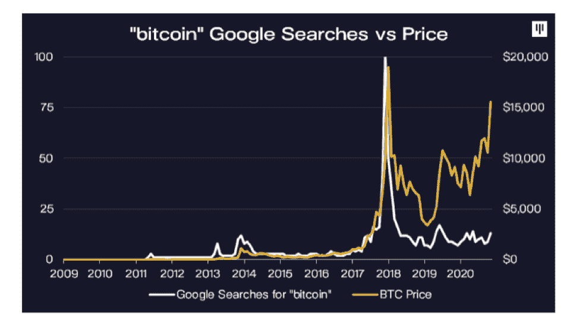

# 该不该买比特币？深入的分析

> 原文：<https://medium.com/coinmonks/should-you-buy-bitcoin-an-in-depth-analysis-the-finance-brief-d4adeeb1e976?source=collection_archive---------1----------------------->

Picture from Pixabay

# 比特币事件的有趣转变

从 2018 年的崩溃中恢复过来，比特币的价格已经上涨，重新测试了 19783 美元的峰值。正因为如此，投资者对这种资产越来越感兴趣。和许多知名人士一样，在《权力的游戏》中扮演艾莉亚·史塔克的麦茜·威廉姆斯最近在推特上投票:“我应该做多比特币吗？”，导致许多知名投资者也加入了这个话题。那么该不该买比特币呢？

在我深入探讨这个话题之前，最好先讨论一下比特币的工作原理，因为围绕这种货币的大部分炒作都来自于它的技术。

# 比特币是如何运作的？

由于已经有大量的资源来解释比特币背后的技术，我将只做一个简短的总结。如果你对更深入的解释感兴趣，可以参考 YouTube 上 3Blue1Brown 的这个视频:[但是比特币实际上是如何工作的呢？](https://www.youtube.com/watch?v=bBC-nXj3Ng4&t=32s)

如果您已经了解这项技术，请跳到下一节。(为什么应该购买比特币)

# 区块链

我相信你们很多人都听说过区块链这个术语。本质上，区块链是一种以块为单位存储数据并将每个新块链接到前一个块的数据库。这样做，你就能保持一个长期的交易历史。区块链非常依赖密码学，这是计算机科学中的一个领域，研究在敌人面前安全通信的技术。

# 密码散列法

在比特币的环境中，这是通过加密哈希实现的:

*   每个块包含 3 样东西:关于事务细节的数据，它的散列和前一个块的散列。
*   哈希的作用类似于指纹，因为它是基于存储的数据和前一个块的哈希生成的。

我知道这个解释可能很复杂，但请耐心听我解释:

*   假设你有块 1 链接到块 2，块 2 链接到块 3。
*   如果您更改块 1 的数据，其散列将会更改，从而断开与块 2 的链接。
*   这是因为块 2 的哈希是基于块 1 的原始哈希生成的。
*   但是现在，如果您重新计算块 2 以不中断与块 1 的链接，块 2 将生成新的哈希，中断与块 3 的链接。
*   如果您有大量链接在一起的块，您将不得不重新计算大量的块来更改单个事务

然而，由于计算机速度极快，这仍然是可能的，这使我想到了下一个工具:工作证明。

# 工作证明

为了减缓添加和重新计算区块的过程，比特币迫使矿工解决复杂的数学问题，这需要大约 10 分钟。因此，每个新块只能每 10 分钟生成一次。因此，重新计算所有的块需要很长时间。

查看这篇文章获得更深入的解释:[工作证明，解释](https://cointelegraph.com/explained/proof-of-work-explained)

但你可能会问谁是矿工？这让我想到了比特币使用的下一个机制，分布式账本。

# 分布式分类帐

与法定货币不同，比特币是由一个去中心化的机构通过其共识算法来运营的。基本上，世界各地的任何人都可以访问比特币区块链，并参与交易的验证和认证。这些是比特币矿工，他们处理工作问题的证明，希望如果他们解决了问题，就能收到比特币。因此，分类帐的副本存在于世界各地的所有参与者中(这些副本也称为节点)。因此，如果您想要更改任何事务，您必须更改 51%的节点上的记录，这也称为 51%攻击。

查看这篇文章，了解有关分布式分类帐的更多信息:[分布式分类帐](https://www.investopedia.com/terms/d/distributed-ledgers.asp)

# 为什么你应该购买比特币

# Paypal 和 Square 允许用户购买、持有和出售加密货币

Image from Paypal depicting new Cryptocurrency Payment function

10 月， [Paypal 宣布](https://newsroom.paypal-corp.com/2020-10-21-PayPal-Launches-New-Service-Enabling-Users-to-Buy-Hold-and-Sell-Cryptocurrency)将允许比特币等加密货币在其平台上买卖。这使得加密货币成为超过 2600 万商家的资金来源，部分解决了许多人对使用比特币作为交易媒介的担忧。

为了支持这一功能，[据报道，Paypal 已经购买了超过 70%的新铸造比特币](https://panteracapital.medium.com/bitcoin-shortage-172a9205dc0)。加上 Square(Paypal 的竞争对手)例行的比特币购买，超过 100%的新铸造的比特币被这两家公司购买，这与比尔·米勒在美国消费者新闻与商业频道的声明相呼应

> 比特币的故事非常简单，它是供应和需求，比特币的供应量以每年 2.5%左右的速度增长，而需求的增长速度要快于此，比特币的数量将是固定的。
> 
> [莱格梅森资本管理公司前董事长比尔·米勒](https://markets.businessinsider.com/currencies/news/bitcoin-price-legendary-investor-bill-miller-resilience-better-every-day-2020-11-1029776469)

# 知名投资者的支持

鉴于辨别比特币价值的难度，其价格在很大程度上受到知名投资者观点的影响。这来自于像沃伦·巴菲特(“[那不是投资](https://finance.yahoo.com/news/warren-buffett-buying-bitcoin-not-investing-110702015.html)”)、查理·芒格(“[恶心……愚蠢……狗屎](https://sports.yahoo.com/warren-buffetts-business-partner-charlie-munger-bitcoin-disgusting-stupid-immoral-turds-202914916.html)”)和摩根大通首席执行官杰米·戴蒙(“[欺诈……比郁金香球根](https://finance.yahoo.com/news/jamie-dimon-bitcoin-fraud-thats-180222751.html)”)这样的人。然而，自 2018 年崩盘以来，比特币获得了全球主要对冲基金和首席执行官的机构支持。出人意料的是，摩根大通在其全球市场战略部门的一篇文章中改变了对比特币的看法:

> 鉴于随着时间的推移，千禧一代将成为投资者世界中更重要的组成部分，比特币的潜在长期上涨空间相当大，因为它作为“替代”货币与黄金的竞争更加激烈……从机械上讲，比特币的市值必须从现在起上涨 10 倍，才能与私人部门通过 ETF 或金条和金币对黄金的投资总额相匹配……从长期来看，即使黄金作为“替代”货币被适度挤出，也意味着比特币的价格将上涨一倍或两倍。
> 
> 摩根大通全球市场战略部

此外，贝莱德首席执行官里克·里德对比特币有如下看法

> 但我认为这是一种可以在很大程度上取代黄金的持久机制吗？是的，我喜欢，因为它比传递一根金条要有用得多。我认为它是持久的，而且你已经看到了谈论数字货币的中央银行。我认为数字货币以及对技术和加密货币的接受度——尤其是千禧一代的接受度——是真实的。数字支付系统是真实存在的，所以我认为比特币会继续存在。
> 
> [贝莱德全球固定收益部首席信息官 Rick Rieder](https://news.bitcoin.com/blackrock-cryptocurrency-bitcoin-replace-gold/)

# 机构收养

在之前的牛市中，金融和非金融媒体陷入狂热，许多媒体首次报道比特币。比特币百万富翁的故事在互联网上扩散，导致许多投资者购买该货币，其中许多人在 2018 年价格暴跌时遭受了重大损失。

然而，这一次对比特币的报道很少，很大程度上是受到机构投资者兴趣增加的推动。这种不断增长的兴趣帮助最大的加密投资公司 gray investments 在第三季度的资产达到 100 亿美元。今年在 Q2，超过一家[知名华尔街公司披露了他们在灰度比特币信托](https://www.forbes.com/sites/michaeldelcastillo/2020/08/06/valuable-sec-data-on-20-institutional-bitcoin-investors-could-soon-disappear/?sh=6aeace291de2)的投资，此外，比特币基地也经历了“流入资本的爆炸”，其托管资产目前为[200 亿美元，其中 140 亿美元是自 4 月以来积累的。](https://news.bitcoin.com/coinbase-20-billion-cryptocurrency-custody-institutional-investors/)

Graph of Bitcoin Price and Google trends report. Image from [Pantera Capital](https://panteracapital.medium.com/bitcoin-shortage-172a9205dc0)

当前牛市的大部分是由机构兴趣而非散户兴趣的增加支撑的。这给了投资者信心，因为精明的资金正在推动价格。此外，鉴于散户的参与度较低，有很大一部分场外资本可能会进入加密货币市场。

# 整体奖励减半

今年 5 月，比特币的大宗奖励减少了一半，这一事件往往会给其价格带来上行压力。从本质上讲，通过将集体奖励减半，比特币矿工将以更慢的速度开采比特币，从而减少比特币供应的增加。随着需求的激增，比特币的价格自事件发生以来大幅上涨。

# 疫情刺激和货币政策

自疫情启动以来，全球已宣布并实施了总计 6 万亿美元的直接税和支出措施。此外，世界各国央行通过购买政府债券实施了大规模量化宽松。再加上联邦基金利率降至 0.25%，为金融市场注入了急需的流动性。

然而，随之而来的是对通胀卷土重来的担忧，这促使投资者转向可以对冲通胀的替代资产。在这里，比特币长期以来一直被支持者认为是数字黄金，因为它的供应量有限，可预测(2100 万)并且能够在中央银行控制之外发挥作用。

> 我推荐比特币的原因是因为它是通胀交易的一个菜单，就像黄金、盈亏平衡点、铜、长期收益率曲线一样，我得出的结论是，比特币将是最好的通胀交易
> 
> [保罗·都铎·琼斯，亿万富翁对冲基金经理](https://www.bloomberg.com/news/articles/2020-05-07/paul-tudor-jones-buys-bitcoin-says-he-s-reminded-of-gold-in-70s)

尽管考虑到病毒造成的重大供应中断，通胀的可能性可能不高，但将一小部分投资组合投资于通胀对冲仍是明智的。

如果你对新冠肺炎对经济和投资决策的影响感兴趣，可以看看我的另一篇文章:[新冠肺炎的影响:你应该如何投资？](https://thefinancebrief.com/2020/11/18/the-impact-of-covid-19-how-should-you-invest-your-money/)

# 为什么你不应该购买比特币

大多数反对比特币的观点源于对其充当货币的能力的怀疑。下面是货币的 [3 个主要功能](https://opentextbc.ca/principlesofeconomics/chapter/27-1-defining-money-by-its-functions/):

**交换媒介**

当货币在商品和服务的交换中充当中介时，它是在履行交换媒介的职能。这是对过去物物交换经济的巨大改进，在过去，货物必须直接交换。要发挥交换媒介的功能，一种货币需要被买卖双方广泛接受。

**记账单位**

此外，货币还是衡量商品、服务和其他交易市场价值的标准数字单位。要发挥记账单位的功能，货币必须可以分成更小的单位，可以互换(一个单位被视为与其他单位一样，价值不变)并且可以计数。比特币肯定可以作为一个记账单位，因为它的 2100 万个最大硬币可以分成 1 亿个小智。然而，它是否会被用作记账单位是另一回事。

**储值**

最后，货币还充当价值储存手段，这意味着它必须随着时间的推移保持其价值，并在需要时用作交换媒介。

# 比特币缺乏与现实世界的联系

在这里，比特币最强的资产变成了它最大的负债。比特币最初受到关注是因为它的去中心化和不受央行监管的能力。这种观点得到了很多支持，因为世界各地的央行都在大举印钞和量化宽松，以抑制疫情的经济影响，导致怀疑者担心货币贬值。然而，在《纽约时报》的一篇文章中，著名的经济学教授保罗·克鲁格曼认为

> 在正常生活中，人们不会担心印有已故总统肖像的绿色纸片的价值来自哪里:我们接受美元纸币，因为其他人会接受美元纸币。然而，美元的价值并不完全来自自我实现的预期:最终，它得到了美国政府将接受美元作为纳税义务的事实的支持——因为它是一个政府，所以它能够强制执行这些义务。如果你愿意，法定货币有潜在价值，因为持枪的人说他们有。这意味着他们的价值不是一个一旦人们失去信心就会崩溃的泡沫。
> 
> [保罗·克鲁格曼，经济学杰出教授](https://www.nytimes.com/2018/07/31/opinion/transaction-costs-and-tethers-why-im-a-crypto-skeptic.html)

不像美元等法定货币完全由政府支持，比特币的价值完全取决于信心，因此“完全崩溃是一种真实的可能性”。

# 比特币具有高波动性

一种货币要充当价值储存手段，就必须稳定。然而，作为一种资产，比特币经常经历闪电崩盘，其价值可能在一天内下跌超过 10%。在 2018 年的崩盘中，比特币价格从其市场峰值下跌了 80%:想象一下，一觉醒来，你的一生积蓄下降了 80%。因此，比特币固有的波动性损害了它作为货币储存手段的能力。

# 比特币仍未被完全接受为交易媒介

虽然加密领域有所发展，允许商家接受加密货币作为 Square 和 Paypal 的支付方式，但全球大多数商店仍不接受加密货币，这可能是由于其固有的波动性。此外，Paypal 上的商家将使用法定货币而不是加密货币支付，即使买家用加密货币支付。**这或许暗示，PayPal 可能对货币的稳定性及其商家接受货币的意愿心存疑虑。**

# 政府禁令的威胁

在一系列推文中，[雷伊·达里奥(世界上最大的对冲基金 Bridgewater Associates 的创始人)讨论了他为什么对比特币持怀疑态度](https://www.marketwatch.com/story/dalio-says-he-might-be-missing-something-about-bitcoin-challenges-twitter-to-change-his-mind-11605637663):

> 如果它变得足够成功，足以参与竞争，并对政府控制的货币构成足够大的威胁，政府就会宣布其为非法，并使其使用起来过于危险。
> 
> [Bridgewater Associates 的创始人雷伊·达里奥](https://www.marketwatch.com/story/dalio-says-he-might-be-missing-something-about-bitcoin-challenges-twitter-to-change-his-mind-11605637663)

尽管他承认自己可能是错的，但这个论点并非没有价值。许多主要经济理论的诞生，如凯恩斯主义经济学和货币主义，塑造了我们的全球金融体系，并为政府应该如何行动提供了指导。政府控制经济的最大方式之一是通过控制本国货币，无论是通过在美国印刷货币来支持经济(增加市场流动性和购买政府债券来为扩张性财政政策提供资金)，还是通过在中国贬值人民币来刺激出口。不可否认，失去对人民币的控制将对一个政府领导经济的能力造成巨大打击。

从逻辑上来说，比特币在央行控制之外运行的能力威胁到政府主权，使其有可能被禁止。

# 总结:应该投资比特币吗？

# 比特币很难确定

比特币作为一种资产很难确定:它是一种货币吗？是像黄金一样的避险天堂吗？它是像股票一样的风险资产吗？还是完全投机？这种模糊性就是为什么你经常看到交易者找到比特币与标准普尔 500 和黄金等传统资产的相关性，试图为其表现编造一个故事:

> 今天，比特币与作为通胀对冲工具的黄金相关，但明天它将与作为风险资产的股票相关。那到底是哪个？黄金还是股票？虽然金融界的专家喜欢在他们的观点中表现出确定性，但事实是，关于比特币，没有人真正知道。作为一种资产，比特币只存在了短短的 12 年，它使用的技术我们才刚刚开始发现更多。

虽然与 2017 年相比，加密领域有了巨大的发展，智能资金的参与也有所增加，但资产的基本面没有改变。**归根结底，比特币作为交易媒介还有很长的路要走，鉴于其波动性，它作为价值储存手段的功能充其量也是不稳定的。**

**投资者如果把比特币视为一种投机资产，投资比特币会有所收获。**2017 年美联储主席珍妮特·耶伦(Janet Yellen sa id:

> 此时的比特币在支付体系中的作用非常小。它不是稳定的价值来源，也不构成法定货币。这是一种高度投机的资产，
> 
> [珍妮特·耶伦，前美联储主席](https://www.cnbc.com/2017/12/13/fed-chief-yellen-says-bitcoin-is-a-highly-speculative-asset.html)

尽管消息是积极的，而且有可能像摩根大通分析师所说的那样出现大幅上涨，但这在很大程度上取决于比特币可能取代黄金或作为交易媒介的希望，这是难以预测的两个因素。

# 如果你还想投资比特币，可以考虑这几点

# 你的风险承受能力是多少

鉴于资产的波动性及其价值与股票等收益等基本面无关，你应该明确评估自己愿意承担多大的风险。一如既往，“睡眠测试”(当你拿着资产时，你是否能睡着)将是一个很好的指标。你能承受在短时间内损失 40%的投资吗？如果价格下跌，你会拒绝出售吗？

# 你的时间范围是什么

另一点要注意的是你的时间范围，时间范围较长的年轻投资者可以承担更高的风险，因为你仍然有更多的时间来实现你的财务目标。

# 使不同

一如既往，在资产类别内和资产类别之间分散投资，是相对于所冒风险实现回报最大化的最佳方式。不要只投资比特币。雷伊·达里奥在这段视频中很好地解释了多样化的力量:[雷伊·达里奥打破了他的圣杯。](https://www.youtube.com/watch?v=Nu4lHaSh7D4)

# 只投资少量

由于比特币肯定会损失很大一部分价值，你应该只投资一小部分投资组合，以抵御下行风险。如果你比较数学，我**强烈建议阅读这篇关于** [**凯利准则**](/@nickyoder/the-kelly-criterion-cd986d037d87) **的优秀文章。**本质上，赌徒和投资者使用该公式计算最佳下注规模。关键的想法是，负几何阻力(获得 10%然后失去 10%的事实实际上让你损失 1 %)可能导致回报远低于投资。虽然这个公式需要精确的回报值和概率，而这在现实生活中很难实现，但这个概念可以作为一个不可思议的心智模型来指导投资决策。

Image from article depicting the Kelly Curve. The Kelly Optimal Point is where returns are maximised

# 结论:应该投资比特币吗？

比特币可谓是革命性的:区块链技术已经在多个领域找到了许多应用，而比特币被认为是对国家主权的最大威胁之一。作为一种投资类别，比特币确实拥有巨大的上涨潜力。许多参与 HODL 运动的投资者梦想着价格超过 10 万美元，现在主要机构(精明的投资者)也开始跳上炒作的列车。然而，由于人们对比特币作为价值储存手段和交易媒介的功能存在疑虑，比特币也具有显著的波动性和下行风险。

比分相等。价格在上涨。该不该买比特币？我将引用本杰明·格拉哈姆在他的书《聪明的投资者:

> 这些风险与投资结论有关，这些结论主要来自对未来的一瞥，并没有当前可论证价值的支持。然而，严格遵循基于实际结果的冷静计算所设定的价值界限，或许也有同样的危险。投资者不能两者兼得。他可以富有想象力，为高额利润而战，这是对被事件证明是明智的远见的回报；但这样一来，他就必须承担或大或小的误判风险。或者他可能是保守的，拒绝为尚未证实的可能性多付一点额外费用；但在这种情况下，他必须为以后错过的黄金机会做好准备。
> 
> *本杰明·格拉哈姆，聪明的投资者*

比特币能赚钱吗？是的，但这不会是免费的。

前往我们的主页阅读我们的其他文章:[金融简报](https://thefinancebrief.com)

## 另外，阅读

*   最好的[密码交易机器人](/coinmonks/crypto-trading-bot-c2ffce8acb2a)
*   [Deribit 审查](/coinmonks/deribit-review-options-fees-apis-and-testnet-2ca16c4bbdb2) |选项、费用、API 和 Testnet
*   [FTX 密码交易所评论](/coinmonks/ftx-crypto-exchange-review-53664ac1198f)
*   最好的比特币[硬件钱包](/coinmonks/the-best-cryptocurrency-hardware-wallets-of-2020-e28b1c124069?source=friends_link&sk=324dd9ff8556ab578d71e7ad7658ad7c)
*   [密码本交易平台](/coinmonks/top-10-crypto-copy-trading-platforms-for-beginners-d0c37c7d698c)
*   最好的[加密税务软件](/coinmonks/best-crypto-tax-tool-for-my-money-72d4b430816b)
*   [最佳加密交易平台](/coinmonks/the-best-crypto-trading-platforms-in-2020-the-definitive-guide-updated-c72f8b874555)
*   最佳[加密贷款平台](/coinmonks/top-5-crypto-lending-platforms-in-2020-that-you-need-to-know-a1b675cec3fa)
*   [莱杰 vs 特雷佐](/coinmonks/ledger-vs-trezor-best-hardware-wallet-to-secure-cryptocurrency-22c7a3fd391e)
*   [block fi vs Celsius](/coinmonks/blockfi-vs-celsius-vs-hodlnaut-8a1cc8c26630)vs Hodlnaut
*   Bitsgap 评论——一个轻松赚钱的加密交易机器人
*   为专业人士设计的加密交易机器人
*   [PrimeXBT 审查](/coinmonks/primexbt-review-88e0815be858) |杠杆交易、费用和交易
*   [在线评论](/coinmonks/haasonline-review-d8d1a3400419)享受九折优惠
*   Bitmex 上的[保证金交易的白痴指南](/coinmonks/the-idiots-guide-to-margin-trading-on-bitmex-dbbd7742c6fc?source=friends_link&sk=7bfa99d2a181142510c8442c8ddb0786)
*   [eToro 评论](/coinmonks/etoro-review-78807ddeb33c) |交易股票、密码、交易所交易基金、差价合约和商品
*   [Bitmex 高级保证金交易指南](/coinmonks/bitmex-advanced-margin-trading-guide-2270c195ce25?source=friends_link&sk=1d986cca731f5084b9a2db4a4bc4a7ad)
*   开发人员的最佳加密 API
*   [最佳区块链分析工具](https://bitquery.io/blog/best-blockchain-analysis-tools-and-software)
*   [加密套利](/coinmonks/crypto-arbitrage-guide-how-to-make-money-as-a-beginner-62bfe5c868f6)指南:新手如何赚钱
*   顶级[比特币节点](https://blog.coincodecap.com/bitcoin-node-solutions)提供商
*   最佳[加密制图工具](/coinmonks/what-are-the-best-charting-platforms-for-cryptocurrency-trading-85aade584d80)
*   了解比特币最好的[书籍有哪些？](/coinmonks/what-are-the-best-books-to-learn-bitcoin-409aeb9aff4b)

> [直接在您的收件箱中获得最佳软件交易](https://coincodecap.com?utm_source=coinmonks)

*原载于 2020 年 11 月 25 日*[*【https://thefinancebrief.com】*](https://thefinancebrief.com/2020/11/25/should-you-buy-bitcoin-an-in-depth-analysis/)*。*