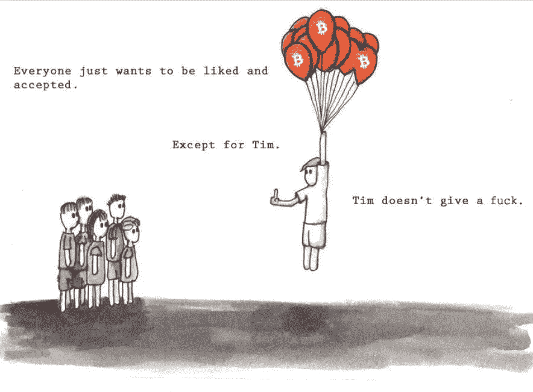

# 你现在应该买比特币吗？买，但不要卖

> 原文：<https://medium.com/coinmonks/should-you-buy-bitcoin-right-now-buy-but-dont-sell-ac66d96ef45a?source=collection_archive---------8----------------------->

又是一周，又是一个高潮。随着今年接近尾声，比特币的价格飙升，并创下历史新高。纵观 2020 年，一整年都在风起云涌。自 2020 年 1 月以来，这种最大的数字货币上涨了 160%，自 3 月 15 日以来上涨了 190%，此前在 3 月的第二周价格下跌了 25%。当我写这篇文章时，比特币的价格徘徊在 18.5 千美元左右