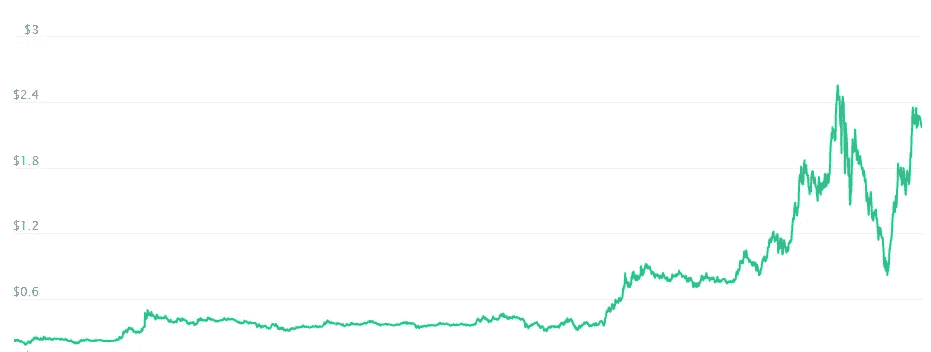
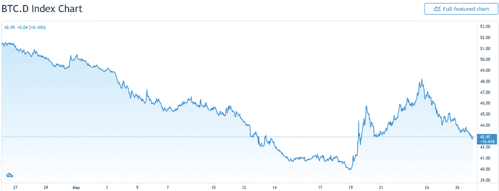
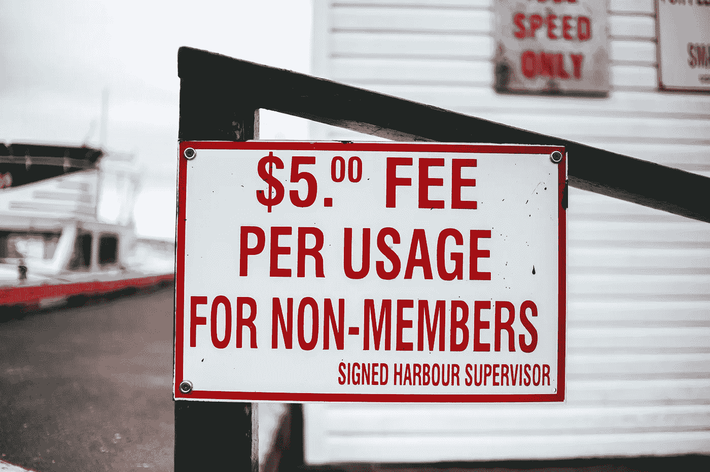

# 你应该买多边形令牌吗？

> 原文：<https://medium.com/coinmonks/should-you-buy-the-polygon-token-43a46487815c?source=collection_archive---------5----------------------->

如果我们看看 Matic/Polygon 的图表，我们可以很容易地看到，在更大规模的加密货币崩溃之前，令牌一直在向上波动，达到了 2.45 的历史高点。

Credit — CoinMarketCap

如果我们看看比特币的统治力图表，我们可以看到，随着更大的加密货币市场作为资金的“避风港”崩溃，大量资本重新流入比特币。随着个人和实体寻找下一个 10 倍或 100 倍的机会，事情正在慢慢回到牛市的姿态，稳步看到美元从比特币流入另类硬币。随着 Polygon 过去几天的价格上涨，这对这些投资者来说是一个绝好的机会。

Credit — TradingView

幸运的是，围绕 Polygon 的炒作不仅仅出现在图表中。Polygon 拥有一个稳固的领导和开发团队，这可以追溯到 2017 年，当时他们正在为以太坊开发“等离子”解决方案。他们拥有久经考验的知识，意识到每次都以定制的一次性版本支持开发人员是不可持续或不可扩展的。因此，他们使用 Polygon 的方法为开发人员提供了一套可伸缩性解决方案，他们可以选择自己真正想要和开发的内容。

这种方法非常成功。随着 Defi(分散式金融)背后的需求不断增长，开发人员纷纷涌向 Polygon，以获取他们的技术并快速推出他们的产品/服务。事实上，在一个月内，Polygon 使用他们的技术获得了 30 多个新的 Dapp(分散化应用程序)，包括同期超过 75，000 个新的活跃用户钱包。

当然，我们都知道在以太网上交易的荒谬的汽油费。一旦以太坊 2.0 推出，对可伸缩性的需求可能只会增加，因为对网络的需求会更大。尽管在这个领域也有竞争者，也就是乐观主义——我们最近一次听到它是在三月份，它的发布被推迟到了七月份。

Credit — Pexels

事实上，Polygon 的赌注奖励本身就非常有利可图，包括 Celsius 支付 13.99%的 Polygon 代币(在撰写本文时)，这为购买和持有代币提供了相当诱人的机会。

当然，这不是财务建议，谁能说未来会怎样。但是，在我个人看来，Polygon 有一个非常光明的未来，它是我投资组合中的一个关键部分。

如果你喜欢这个内容，一定要看看我的 Youtube 频道，我们在那里涵盖了新兴加密货币趋势和个人金融的主题。

和平

无人驾驶飞机

[https://www.youtube.com/c/NoAutoPilot](https://www.youtube.com/c/NoAutoPilot)