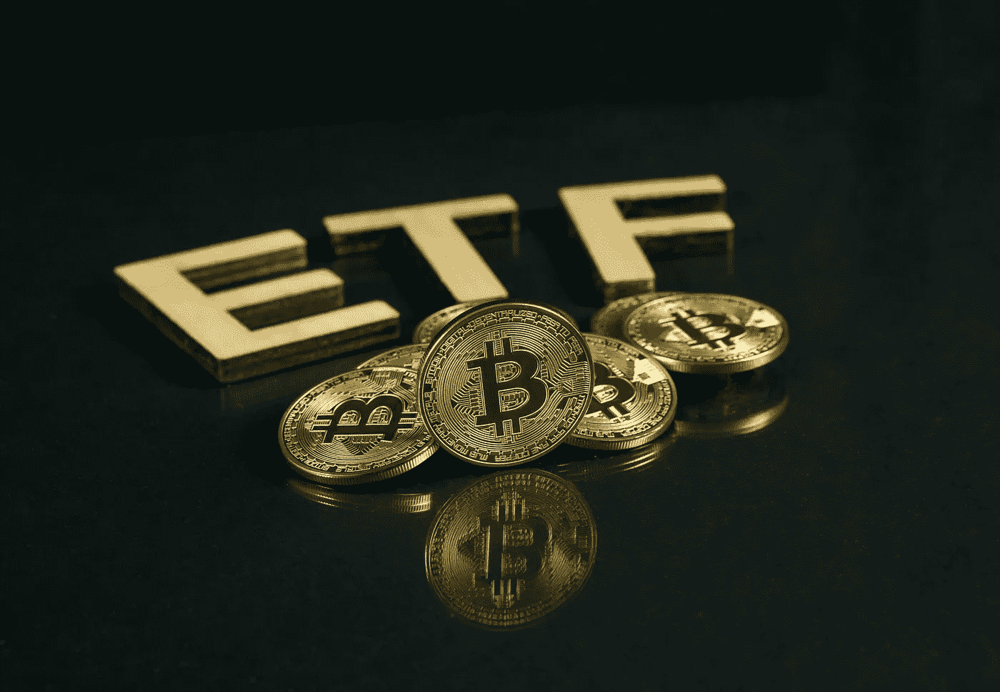

# 应该投资持有比特币期货合约的比特币 ETF 吗？

> 原文：<https://medium.com/coinmonks/should-you-invest-in-a-bitcoin-etf-holding-bitcoin-futures-contracts-19eaed741ca8?source=collection_archive---------11----------------------->

这意味着什么？

ETF(交易所交易基金)是一种证券(股票、债券等)的集合，可以方便地在受监管的定价交易所进行交易。像股票一样，ETF 将有一个市场定价。这样做的好处是，你不必投资于每一种证券，你只需有效地投资于单一的 ETF。美国有超过 1000 只 ETF 交易活跃，代表了各种投资策略。由于交易所交易基金受美国证券交易委员会监管，你可以通过经纪账户直接投资，甚至作为退休账户的一部分，如个人退休帐户。

首只专注于比特币的 ETF(pro shares bit coin Strategy ETF)最近开始交易，首日上涨 5%，盘中交易了约 9.81 亿美元的股票，成为有史以来交易量第二高的 ETF。有趣的是，这只 ETF 不持有任何比特币，而是专门持有比特币期货合约，这使得受监管机构有可能获得比特币的敞口，尽管是间接的，正如我们将看到的…

用他们自己的话说，ProShare 的这只 ETF 的目标是“提供与比特币表现大体对应的投资结果。”他们将试图通过对比特币期货合约的有管理的敞口来实现这一结果，这是美国证交会要求的一个复杂因素。

为了衡量这种 ETF 是否是一种好的投资，让我们首先了解什么是“期货合约”,以及它们为什么存在。

以种植玉米的农民鲍勃为例。Bob 在春天购买种子和肥料(固定成本)，整个夏天支付员工工资(另一个固定成本)，但在秋天收获时收到所有收入，因为他没有储存手段，所以必须在冬天之前卖掉所有玉米。

鲍勃的问题是，玉米的价格非常依赖于每年秋天的净收成，鲍勃和所有其他玉米农民生产的玉米数量。再加上当时对玉米的需求。虽然鲍勃的费用是已知的和固定的，但他的收入是一个不可预测的变量。

在任何一年，农民鲍勃都可能赚钱或赔钱，这对大多数人来说都是一种压力。

还将假设，在任何一年，农民鲍勃将生产 900-1100 蒲式耳的玉米，这取决于天气等。

声明:我不知道什么是蒲式耳，也不知道玉米是不是用蒲式耳来计量的。

虽然农民鲍勃可能是那种喜欢掷骰子的人，要么被异常低的价格击败，要么被高价格惊喜，但这将是例外。我们大多数人不喜欢赌博，认为适度盈利的保证比随机掷骰子要好。

现在考虑玉米面包制造商爱丽丝的例子。她面包店的一项主要支出是玉米成本，如果她的支出波动太大，她很难经营一家高效的企业。Alice 希望在提货之前锁定玉米价格，而不受最后一分钟价格波动的影响。

所需要的只是鲍勃和爱丽丝之间的协议。

假设在过去十年中，玉米价格在每蒲式耳 100 美元到 200 美元之间波动。虽然农民 Bob 更喜欢 200 美元的价格，但考虑到 1000 蒲式耳的平均收成，他的盈亏平衡价格是 135 美元。另一方面，虽然 Alice 喜欢 100 美元的低价，但她的盈亏平衡价格是 155 美元。

双方都不知道对方的盈亏平衡价格，但这意味着有谈判的空间，双方都可以接受 140 美元到 150 美元之间的价格，在这个价格范围内，双方都可以适度和可预测地盈利。

假设在春季谈判后，他们双方同意一份“期货合同”，即从现在起六个月后，收获后，爱丽丝将以 145 美元从鲍勃手中购买 500 蒲式耳玉米，净购买额为 72，500 美元。

已经达成协议；一份合法的合同已经签订。

通过承诺以一个已知的价格出售大约一半的收成，Bob 降低了这一年的风险。如果收获价格低于平均水平，下跌空间较小；如果价格高于平均水平，利润就会减少。

Alice 也降低了风险，因为她现在获得了以已知价格购买所需玉米的权利，这保证了她的企业获得适度的利润。

然后有趣的事情发生了。正如贷款如何成为独立于出借人和借款人的可交易金融资产([如我的书](https://www.wthisaneconomy.com/)所述)，这个“期货合约”成为可交易金融资产，独立于 Bob 和 Alice。

为什么这样

因为有闲钱的随机伙计查理认为玉米的价格在收获季节实际上会是 160 美元。他对自己的预测如此自信，以至于查理愿意以每蒲式耳 150 美元的价格从爱丽丝那里购买一些期货合约。虽然爱丽丝可能不愿意卖掉整个合同，但为什么不卖掉一部分来快速获利呢？结果是 Alice 以 145 美元持有 400 蒲式耳的期货合约，而 Charlie 持有 100 蒲式耳的期货合约，仍然是 145 美元。

Charlie 给 Alice 开了一张 15，000 美元的支票，Alice 很快就赚了 500 美元，(150-145 美元)x 100。

如果查理是正确的，那么到了收获季节，他将以 145 美元的价格从鲍勃那里购买 100 蒲式耳，然后立即以 160 美元的价格在市场上出售，这样他就获得了 1500 美元的利润，如果记得他以每蒲式耳 150 美元的价格从爱丽丝那里购买了合同，那么他的投资回报率为 1000 美元。

但是市场价格实际上是 140 美元吗？嗯，查理可能会赔钱，因为根据合同，他需要在到期日之前以 145 美元的价格从鲍勃那里购买 100 蒲式耳。所以除非他有地方储存这些玉米，否则他将不得不亏本出售。

请注意，农民 Bob 不受 Charlie 投机的影响，因为仍然有以 145 美元净购买 500 蒲式耳玉米的承诺。

但是等一下，另一个随机投机者丹尼斯出现了，他在春天同样确信玉米收获后的价格将会是 135 美元！如果她可怕的预测是正确的，她如何获利？

类似于[做空股票，](https://johnsonrsf.medium.com/short-selling-and-gamestop-a7e1e6e84051) Denise 与 Alice 签订了一份附带协议，向 Alice“借”了价值 100 蒲式耳的期货合同，在收获前归还给 Alice。Alice 收到一笔利息付款，作为该金融资产“贷款”的交换。

丹尼斯立即将这 100 蒲式耳期货合约以 150 美元的价格卖给查理。

临近收获季节，丹尼斯是正确的，玉米的市场既定价格正在下降，看不到底部。为了尽量减少损失，Charlies 同意以 135 美元的价格将 100 蒲式耳的期货合约卖回给 Denise，Denise 再将它们返还给 Alice。

丹尼斯净赚了 1500 美元，查理失去了他的短裤，鲍勃和爱丽丝不在乎。

如果玉米价格高于预期，情况或多或少会相反…

在现实中，会有两个以上的投机交易者参与其中，因为这需要期货合约市场具有深度和流动性，这是任何交易所都需要的特征。不止一个农场主和一个面包师锁定未来价格，对冲或限制他们对未来价格波动的敞口。

重要的一点是要理解玉米期货合约市场建立的价格不同于玉米本身建立的价格，因为这是两个独立的交易所。玉米价格完全由玉米本身的供求决定，而期货价格反映了对玉米未来价格的预期，这是多头和空头投机者之间的一种平衡。

这不是一场愚蠢的冒险游戏。期货合约市场的好处是让“套期保值者”鲍勃和爱丽丝免受价格波动的影响，这是一种保险。而“投机者”提供了流动性，使这成为可能。

再回到比特币。

为什么人们会投资一只试图匹配比特币表现的比特币 ETF，而不是简单地购买比特币本身？而这个 ETF 会准确跟踪比特币的价格，还是会出现“跟踪误差？”不幸的是，解释一个由期货组成的 ETF 如何跟踪一个标的资产超出了本文的范围，也许也超出了我的范围！

就我个人而言，我会购买比特币，随着比特币的上涨，享受 1:1 的线性回报，如果比特币下跌，则相反。不涉及杠杆。

购买这种 ETF 的一个可能原因是，许多人不想被理解如何在网络货币交易所购买比特币以及如何将比特币安全地存储在硬件钱包中所困扰。工作太多。

另一个原因是，许多人可能希望在他们的退休账户中拥有比特币，这一 ETF 使之成为可能。我明白了。

这个 ETF 是否直接提高了比特币的价格？不尽然，因为它既不出售也不购买比特币。然而，我的猜测是，这种 ETF 将增加比特币的合法性，从而鼓励其他人直接购买和存储比特币，希望将其存储在硬件钱包中。

毫无疑问，其他比特币交易所交易基金将紧随其后，有些是看跌的，有些是看涨的，有些将允许你利用你的赌注获得惊人的收益或损失。我会亲自传达。

想了解更多？

[www.WTHisAnEconomy.com](http://www.WTHisAnEconomy.com)