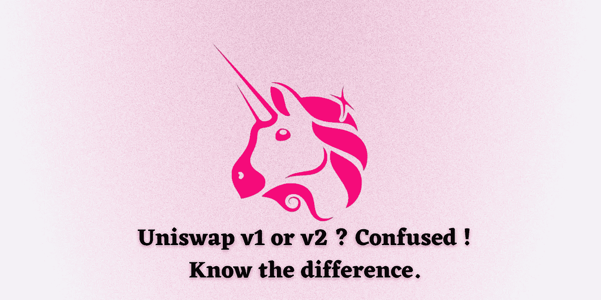

# 应该使用 Uniswap v1 还是 v2？

> 原文：<https://medium.com/coinmonks/should-you-use-uniswap-v1-or-v2-70f8e6cb3c2c?source=collection_archive---------0----------------------->

在我上一篇关于 Uniswap 的文章中，我提供了一个关于如何使用分散交换的详细指南。与其他集中交易所相比，Uniswap 带来了许多好处。它引发了整个以太坊去伪存真生态系统的发展。

Uniswap 有两个版本(v1 和 v2)。很明显，Uniswap v2 是对 v1 的升级，但是，作为一个分散式交换机，v1 仍然是活动的(V1 和 v2 同时运行！).我们详细看看 v2 带来了什么好处，以及为什么完整的权重会慢慢向 v2 转移。

Uniswap V1 是一个概念验证。v1 的成功带动了 v2 的发展。

v2 包含多项新功能，包括:

ERC20 / ERC20 对

价格先知

闪存互换

核心/辅助架构

技术改进

通往可持续发展的道路

测试网和发布详情

## **ERC20 / ERC20 对**

在 Uniswap v1 中，您只能在 ETH 和单个 ERC20 令牌之间交换。

Uniswap V2 公司在核心合同中使用包裹乙醚(WETH)。这允许将任何 ERC20 令牌直接与任何其他 ERC20 令牌进行池化。

## **价格神谕**

Uniswap V1 价格输入并不是分散的，可以被操纵。用起来不安全。

Uniswap V2 公司的 Oracle 系统高度分散，不易操作。先知衡量操纵价格的成本。

## **闪存交换**

在 Uniswap v2 中，用户可以提取任何金额的任何 ERC20 令牌，无需预付任何费用。这就是所谓的闪存交换。这方面的先决条件包括以下任何一项:

支付全部提取的 ERC20 代币

支付部分 ERC20 代币，并返还剩余部分

归还所有提取的 ERC20 代币

## **核心/辅助架构**

uni WAP v2 智能合约被称为 uni WAP v2 核心。这包括一些有趣的功能，如:

v2 引入了 wet 而不是 ETH。用户可以直接使用 ETH，路由器在 ETH 和 weh 之间转换。

这些路由器处理滑动安全检查和多跳交易的逻辑。

v1 在 ERC20 代币合约中存储了 ERC 20 余额。在 v2 中，核心在内部存储 ERC20 令牌余额。

## **技术改进**

Uniswap v2 带来了几项技术改进，包括:

v2 是用 Solidity 而不是 Vyper 写的

修复了 Uniswap v1 的“缺失 return”er C20 令牌问题

与 ERC777 和其他非标准 ERC20 令牌兼容

Uniswap v1 在失败的交易中使用了所有剩余的 gas。v2 修复了这个错误

## **可持续发展之路**

Uniswap v2 引入了 0.30%的流动性提供商费用。如果协议收费开启，将变为 0.05%，流动性提供者费用为 0.25%。这一特征对于确保自我管理和可持续性非常重要。

## **测试网和发布详情**

Uniswap v2 仍处于测试阶段，存在风险。智能合同目前正在接受正式验证和安全审计。v2 将是 UX 的一大进步。API、开发者 SDK、文档也在更新。

## **结论**

我们很幸运处在密码革命的时代。看到 Uniswap 发展壮大是一种享受。v1 创造了下一代 DEX 的基础。v2 将确保自我可持续性

## 另外，阅读

*   [最好的加密交易机器人](/coinmonks/whats-the-best-crypto-trading-bot-in-2020-top-8-bitcoin-trading-bot-c16adeb13317)
*   [德里比特评论](/coinmonks/deribit-review-options-fees-apis-and-testnet-2ca16c4bbdb2) |选项、费用、API 和 Testnet
*   [FTX 密码交易所评论](/coinmonks/ftx-crypto-exchange-review-53664ac1198f)
*   最好的比特币[硬件钱包](/coinmonks/the-best-cryptocurrency-hardware-wallets-of-2020-e28b1c124069?source=friends_link&sk=324dd9ff8556ab578d71e7ad7658ad7c)
*   [密码本交易平台](/coinmonks/top-10-crypto-copy-trading-platforms-for-beginners-d0c37c7d698c)
*   最好的[加密税务软件](/coinmonks/best-crypto-tax-tool-for-my-money-72d4b430816b)
*   [最佳加密交易平台](/coinmonks/the-best-crypto-trading-platforms-in-2020-the-definitive-guide-updated-c72f8b874555)
*   最佳[加密借贷平台](/coinmonks/top-5-crypto-lending-platforms-in-2020-that-you-need-to-know-a1b675cec3fa)
*   [莱杰 vs 特雷佐](/coinmonks/ledger-vs-trezor-best-hardware-wallet-to-secure-cryptocurrency-22c7a3fd391e)
*   [block fi vs Celsius](/coinmonks/blockfi-vs-celsius-vs-hodlnaut-8a1cc8c26630)vs Hodlnaut
*   Bitsgap 评论——一个轻松赚钱的加密交易机器人
*   为专业人士设计的加密交易机器人
*   [PrimeXBT 审查](/coinmonks/primexbt-review-88e0815be858) |杠杆交易、费用和交易
*   HaasOnline 评论享受九折优惠
*   Bitmex 的[保证金交易的白痴指南](/coinmonks/the-idiots-guide-to-margin-trading-on-bitmex-dbbd7742c6fc?source=friends_link&sk=7bfa99d2a181142510c8442c8ddb0786)
*   [eToro 评论](/coinmonks/etoro-review-78807ddeb33c) |交易股票、密码、交易所交易基金、差价合约和商品
*   [Bitmex 高级保证金交易指南](/coinmonks/bitmex-advanced-margin-trading-guide-2270c195ce25?source=friends_link&sk=1d986cca731f5084b9a2db4a4bc4a7ad)
*   [开发人员的最佳加密 API](/coinmonks/best-crypto-apis-for-developers-5efe3a597a9f)
*   [最佳区块链分析工具](https://bitquery.io/blog/best-blockchain-analysis-tools-and-software)
*   [加密套利](/coinmonks/crypto-arbitrage-guide-how-to-make-money-as-a-beginner-62bfe5c868f6)指南:新手如何赚钱
*   顶级[比特币节点](https://blog.coincodecap.com/bitcoin-node-solutions)提供商
*   最佳[加密制图工具](/coinmonks/what-are-the-best-charting-platforms-for-cryptocurrency-trading-85aade584d80)
*   了解比特币的[最佳书籍有哪些？](/coinmonks/what-are-the-best-books-to-learn-bitcoin-409aeb9aff4b)

> [直接在您的收件箱中获得最佳软件交易](https://coincodecap.com?utm_source=coinmonks)

