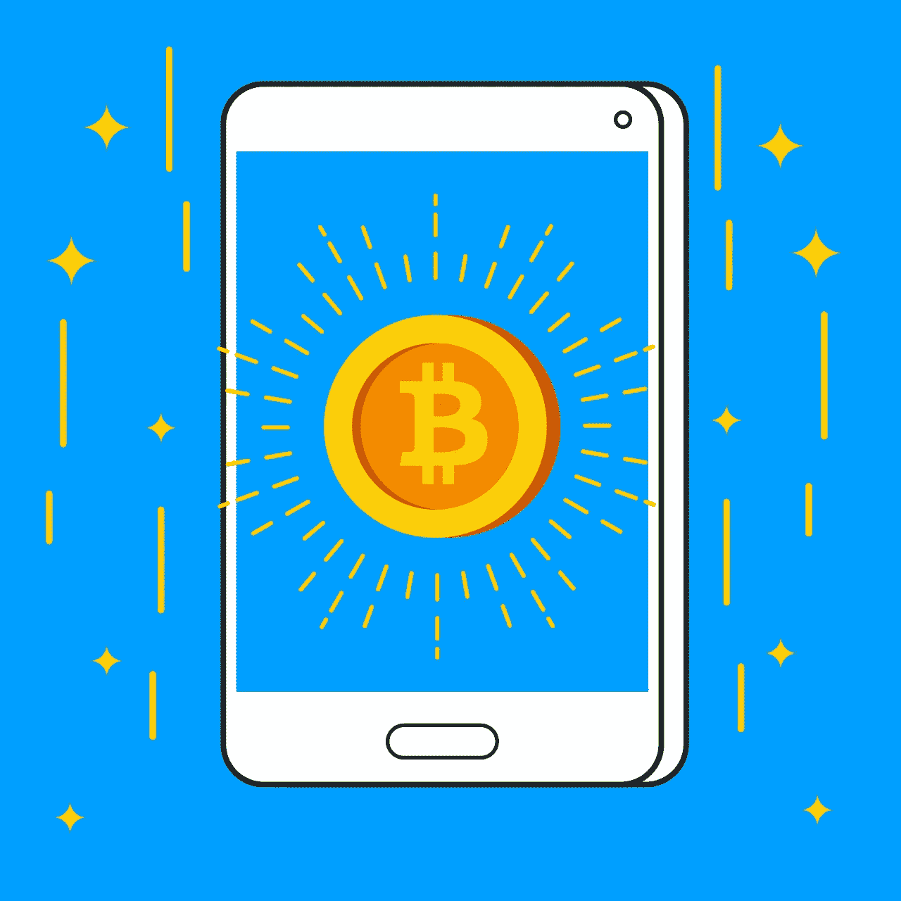

# 加密领域的工作机会

> 原文：<https://medium.com/coinmonks/side-hustles-in-the-crypto-space-time-to-make-money-3c777516733a?source=collection_archive---------2----------------------->

[Image By DavidRockDesign On Pixabay](https://pixabay.com/images/id-2832620/)

在过去十年中，加密货币一直是 20 大趋势话题之一，并且越来越受欢迎。

人们已经能够获得工作的机会。

随着越来越多的人涉足加密领域，就业机会也越来越多。

[Image by Oik789 On Pixabay](https://pixabay.com/images/id-28978/)

人们会问，在加密货币领域工作需要哪些技能。

首先，我要说的是，在开始加密领域的旁门左道之前，你应该对数字货币有一些现实世界的经验，比如投资。除此之外，你已经准备好了。

当谈到学习一项可以让你赚很多钱的加密技术时，你可以参加网上的课程来掌握它。

我挑选了一些在这个领域很受欢迎的技能，可以让你赚很多钱。大部分工作机会都是远程工作。

> 远程工作是指你可以在线工作，而不必现在就在现场的工作。

这些都是额外的技巧，学习其中的任何一项都会让你走上获得可持续收入的道路。

我属于一个加密社区，在那里我们讨论和分享加密工作机会。我分享了这篇文章末尾的链接，这样你就可以加入了。

社区中的技能示例包括对以下技能的需求:

平面设计师

作家

产品经理

数字营销人员

数据分析师

社区经理

区块链开发者

前端 Web 开发人员(全栈开发人员实际上更受欢迎)

我还想把其他人加到名单上，但我想长话短说。

一旦你选择了一项技能，花 3 到 10 个月去学习它。

[Image by Megan_Rexazin On Pixabay](https://pixabay.com/images/id-4158205/)

## 你如何为你的技能或导师找到合适的课程？

有很多人在教授这样或那样的技能，所以很难选择合适的课程来学习。

你应该从导师那里寻找的第一件事是实践他教授的技能并从中赚钱的人。你明白吗？

不要挑那些唯一收入来源来自向教他们的人收费的人。

所以谷歌一下教这种技能的前 10 个人，然后选择其中一个。

根据导师的情况，他应该有多个社交媒体渠道，定期分享教育内容。

一些导师有一个专门的社区，他们也在那里与观众分享更有价值的内容。

如果有人有偿提供指导，你可以在使用他们的免费内容后付费，你已经获得了足够的价值来教你基本的技能。

如果你负担不起，你可以在用他们的免费内容练习的同时存点钱。

## 练习技能的重要性

一旦你开始学习你的技能，不要等到将来有人雇佣你的时候才开始练习。

此外，在公众面前练习和分享你的作品样本是为自己建立责任感的一种方式，这样你就可以坚持练习。

这也有助于通知在社交媒体上关注你的人你正在学习的东西，没有人知道 fam，他们可以成为你寻求的安置的联系人。

在公共场合谈论你正在学习的东西可能会令人恼火。但是从我的内心来说，我已经学会了永远不要羞于谈论我正在学习的东西，也请不要这样。

因此，总而言之，在加密领域找到工作的方法是选择一项技能，练习，并通过你的社交媒体页面谈论它..

不要等待谁来雇用你，你可以为自己创造机会。

点击 [Cryptojobdiscussions](http://t.me/cryptojobslist_community) 加入求职群。加入我@ [斯蒂芬诺迪](https://www.instagram.com/stephenodie_/)，并随时询问你的任何问题。

我希望这个指南是最有帮助的，我祝你在加密领域拥有一份工作一切顺利。

请拍拍这个帖子，跟我来。谢谢！

> 加入 Coinmonks [电报频道](https://t.me/coincodecap)和 [Youtube 频道](https://www.youtube.com/c/coinmonks/videos)了解加密交易和投资

## 也阅读

 [## 杠杆代币[多头代币]终极指南

### 杠杆化令牌是具有杠杆化风险敞口的 ERC20 令牌，不考虑保证金、要求、管理…

medium.com](/coinmonks/leveraged-token-3f5257808b22)  [## 最佳加密交易所| 2021 年十大加密货币交易所

### 加密货币交易所的加密交易需要了解市场，这可以帮助你获得利润。之前…

blog.coincodecap.com](https://blog.coincodecap.com/crypto-exchange)  [## 2021 年最佳加密借贷平台| 6 大比特币借贷平台

### 获得比特币和其他加密货币的最佳贷款利率

medium.com](/coinmonks/top-5-crypto-lending-platforms-in-2020-that-you-need-to-know-a1b675cec3fa)  [## 2021 年最佳免费加密交易机器人

### 2021 年币安、比特币基地、库币和其他密码交易所的最佳密码交易机器人。四进制，位间隙…

medium.com](/coinmonks/crypto-trading-bot-c2ffce8acb2a)