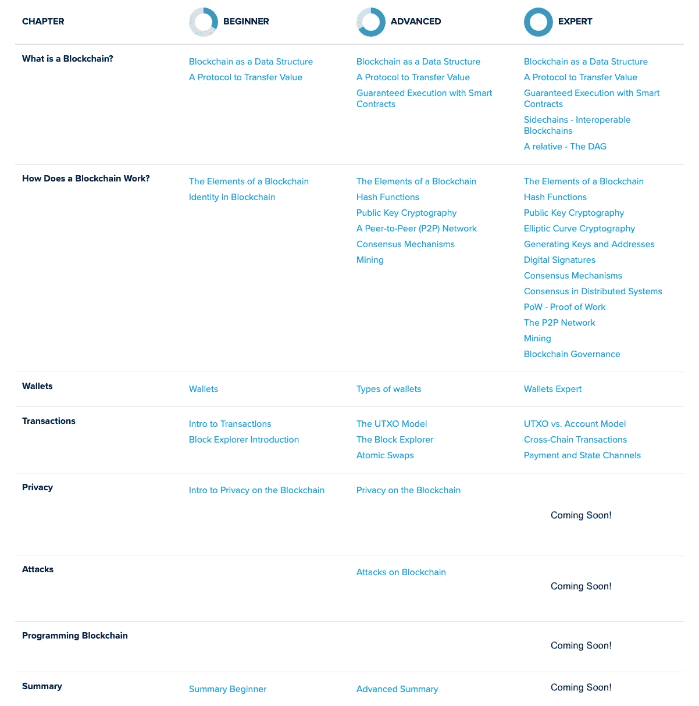

# 侧链 Zendoo 协议中的可互操作区块链

> 原文：<https://medium.com/coinmonks/sidechains-interoperable-blockchains-in-the-zendoo-protocol-fbde17fafd2d?source=collection_archive---------1----------------------->


## Horizen 最近发布了一个高度创新的侧链协议。在这里，我将介绍侧链和 Zendoo 协议。

*本文是* [*堀场书院*](https://bit.ly/3dcZxnH) *专家内容及章节* [*什么是区块链？*](https://bit.ly/310g4sK)

*区块链技术提供了一些独特的属性，例如在未知行为者之间达成共识，并为诚实行为提供强大的激励机制。然而，在区块链技术上构建真实世界的应用程序可能具有挑战性。*

*在区块链上构建应用程序的第一个挑战是安全性。随着网络参与者数量的增加，区块链的安全性也在提高。因此，仅由少数几个利益相关方构建一个小型的特定于应用程序的区块链，并不能提供与利用一个已有数千个节点的系统相同的安全级别。*

*反过来，区块链的安全模式依赖于利用一种具有实际价值的代币，这种代币可以在成熟的市场上交易。这适用于[工作证明](https://devweb-academy.horizen.global/technology/expert/proof-of-work/)区块链的案例，在该案例中，矿工因其计算能力而获得一个令牌作为奖励，也适用于股权证明区块链，在该案例中，验证者的保证金需要具有经济权重。因此，具有真实价值的本地令牌激励用户为网络提供额外的安全性(通过挖掘/标桩),并允许应用程序轻松转移价值。*

*直接在公共区块链上建造还会带来其他挑战。首先，区块链不太适合处理大量数据和交易。第二，部署一个新特性，这对于一个给定的应用程序来说可能是必要的，将需要在整个涉众社区中建立共识。如果只有一小部分参与者从该特性中受益，它就不太可能被实现。最后，如果特性和应用程序直接构建在主链上，代码库将很快变得难以管理。*

*总之，构建公共区块链的三个主要障碍是安全性和可伸缩性、引入新功能所需的繁琐的治理过程，以及缺乏具有真实价值的令牌。*

**

*M eet 侧链。侧链受益于底层主区块链的去中心化和安全性，并保持解决高度特定用例的灵活性。在侧链上添加和删除功能并不取决于主链的社区共识，因为新功能只会影响侧链用户。此外，新功能可以添加到单独的侧链分类帐，减少主链上的压力。*

*侧链不能从主链获得 100%的安全性；它们仍然需要专用节点。但是可以建立激励机制，使得现有的主链节点也支持建立在其上的侧链。*

# *侧链的使用案例*

*为了说明上面提到的好处，让我们看一些实际的侧链用例。*

# *可量测性*

*侧链的使用案例包括数据或事务密集型应用。*

*交易密集型用例可以是实时游戏内支付系统，用户可以在其中赚取和消费代币。如果系统有几千个并发用户，并且在主链上记录所有奖励，传统的区块链将不适合处理负载。具有短块间隔的侧链和有效验证事务的集中一致机制是一种更可行的方法。*

*数据密集型用例可以是供应链跟踪系统。如果生产商、物流公司、零售商和其他第三方使用该系统，数据量将很快超过大多数公共区块链节点愿意处理的极限。一个带有附加数据字段的专用侧链可能是一个可行的解决方案，用于存储特定于产品的元数据。块大小可能会增加，以适应每单位时间更多的数据存储。*

# *管理*

*部署特定于域的侧链可以绕过公共网络上使用的共识构建过程，从而实现快速的功能迭代。这种分离保护了主链，因为新特性部署产生的错误只会影响目标侧链。*

*Horizen 正在评估先开发哪些侧链。选项包括支持复杂(图灵完成)[智能合约](https://devweb-academy.horizen.global/technology/expert/guaranteed-execution-with-smart-contracts/)的侧链，接近即时支付结算，或处理 Zen 区块链基金会国库资金的侧链。*

*虽然 Horizen 的主链不支持自定义令牌，但侧链可以提供这一功能。任何开发者都可以自由地在 Horizen 的主链上构建和部署侧链，无需许可，也没有破坏东西的风险。*

*侧链是扩展分布式分类帐功能并使其适用于更广泛的用例的重要技术步骤。*

# *侧链的历史*

*侧链是人们谈论多年的一个概念。第一个侧链提案写于 2014 年，从那以后，几个团队用不同的方式实现了它们。*

## *钉住的侧链*

*Adam Back 等人在 2014 年发表的一篇论文中首次提到了侧链。“[利用钉住的侧链实现区块链创新](https://blockstream.com/sidechains.pdf)”引入了*钉住的*侧链的技术概念，允许资产从一个链转移到另一个链。这篇论文介绍了许多至今仍在使用的关于侧链的术语。*

## *对称与非对称 Peg*

*作者区分了*对称*和*非对称钉*。在对称栓接侧链结构中，主链监控侧链，反之亦然。因为两个系统都知道对方，所以跨链传输的工作方式是相同的——它们是对称的。*

*在不对称双向 peg 结构中，侧链监控主链，但主链不跟踪侧链。在这种结构中，资产从主链到侧链的转移，即*正向转移*，非常简单，因为侧链节点可以自己验证传入的交易。资产向主链的转移，即*反向转移*，更加复杂。主链需要被“告知”即将到来的转账，并依赖于一些先前的交易验证。该文件的结论之一如下:*

> *“关键的观察是，比特币脚本的任何增强都可以在外部实现，方法是让一个相互不信任的工作人员组成的可信联盟评估脚本，并通过签署普通的多重签名脚本来接受。”— [利用挂钩侧链实现区块链创新](https://blockstream.com/sidechains.pdf)*

*换句话说，非对称侧链可以支持大多数可以想到的应用程序和内部交易，只要一组认证者以它支持的格式验证并转发相关交易到主链。*

*不对称侧链结构是理想的，因为它允许部署许多不同的侧链，而不需要社区的一致同意。对称的侧链将要求主链随着每个新的侧链部署而更新——使得减少的治理优势变得无用。*

## *权威证明侧链*

*一个著名的基于以太坊区块链的侧链是由 [POA Network](https://www.poa.network/) 团队建造的。作者巴里诺夫、巴拉诺夫和卡胡林"[提出了](https://hackmd.io/@F67-rdJCQ0yHlzTN8AoRfw/HkV8Vw7_-?type=view)一个基于以太坊协议的开放许可网络，由独立验证者提供权威共识证明这种设计是不对称的:侧链监控主链，反之则不然。他们假设在智能合约上部署侧链比在基于比特币的系统上部署区块链更简单。他们声称前向和后向传输可以通过智能契约逻辑而不是核心协议来处理。*

*尽管如此，POA 网络中的每个侧链都依赖于一组个体，验证反向传输并将它们广播到以太坊主链。*

> *部署桥的每个项目必须考虑它自己的验证器。对于项目来说，确定被指派来验证桥接事务的一组个人/节点是绝对必要的。需要注意的是，任何 bridge 发布都需要验证程序。”— [POA 网络，介绍 ERC20 至 ERC20 TokenBridge](/poa-network/introducing-the-erc20-to-erc20-tokenbridge-ce266cc1a2d0)*

## *其他侧链结构*

*几个团队正在研究其他侧链结构。驱动链是建立在[比特币网络](https://blog.coincodecap.com/a-candid-explanation-of-bitcoin/)上的侧链，其中主链矿工执行从驱动到主链的交易验证。*

*大多数边链协议都是建立在以太网上的。除了 POA 网络，等离子体是另一个值得注意的例子。它是由 Joseph Poon 和 Vitalik Buterin 在 2017 年提出的，基于以太坊主网上部署的智能合同。*

*上述侧链结构假定了两种情况之一:*

*该设计是对称的，要求主链监控所有侧链以验证反向传输。该结构是非对称的，并且主链依赖于某种认证器来验证和广播从侧链到主链的事务。*

*Horizen 侧链构造的第一次迭代[也依赖于认证者签署撤回证书中的批量向后转移。](https://www.horizen.global/assets/files/Horizen-Sidechains-Decoupled-Consensus-Between-Chains.pdf)*

# *Zendoo 协议*

*Horizen 目前的侧链实现 [Zendoo 协议](https://arxiv.org/abs/2002.01847)于 2020 年初发布。它引入了“一种标准化的机制来注册独立的侧链系统并与之交互。通过交互，我们指的是跨链传输协议，它能够以安全和可验证的方式将本机资产发送到侧链并接收回来，而主链不知道任何关于内部侧链构造或操作的信息。”*

*更概括地说，Zendoo 协议允许基于比特币的区块链协议与任何特定领域的区块链或区块链类系统一起运行。[区块链协议](https://devweb-academy.horizen.global/technology/expert/a-protocol-to-transfer-value/)只升级了一次，引入了部署侧链的机制，支持跨链传输。*

*Zendoo 允许主链验证后向转移，而不依赖于外部验证器或认证器。主链不监控侧链(不对称 peg ),也不了解它们的内部结构。Zendoo 通过为每个侧链状态转换生成递归证明来实现这一点。*

## *Zendoo 中的主要组件*

*大多数侧链结构由三部分组成:*

*   *主链共识协议— MCP*
*   *跨链传输协议— CCTP*
*   *侧链共识协议(SCP)*

*根据侧链的结构，这些组分可以是高度相互依赖的，也可以是高度解耦的。Zendoo 协议允许关于 SCP 的各种自由度。跨链传输协议充当 MCP 和所有侧链之间的桥梁。*

**

## *主链共识协议— MCP*

*Horizen 的主链共识协议包括[工作证明](https://devweb-academy.horizen.global/technology/expert/proof-of-work/)和 Nakamoto 共识算法、 [UTXO 会计模型](https://devweb-academy.horizen.global/technology/expert/utxo-vs-account-model/)和交易逻辑。MCP 的 Zendoo 特定部分是通过特殊的引导交易部署新的侧链、向侧链转移资产的新交易类型以及验证来自侧链的传入反向转移。*

## *跨链传输协议— CCTP*

*跨链传输协议是主链和侧链之间的桥梁，由主链共识协议统一固定。它的两个主要组成部分是向前和向后转移。在正向传输中，ZEN 从主链发送到侧链。在反向传输中，ZEN 返回到主链。*

*因为侧链监控主链，所以它们可以自己验证正向传输。由于主链不监控侧链，Zendoo 引入了一种更强的机制，能够在不依赖认证者的情况下验证反向传输。*

*跨链转移协议的一个重要组成部分是*撤销证书*。该证书将给定时间段内从侧链进行的所有反向传输(即*撤销时期*)进行分组，并将它们广播到主链。每个侧链都需要一种机制来生成有效的提款证书。每个侧链还需要定义一个证明系统，以便主链可以验证传入的反向传输。我们很快会谈到验证系统。*

## *侧链共识协议(SCP)*

*侧链共识方案包括侧链的所有参数。通常，共识算法将描述对历史的单一版本达成一致的机制。*

*Zendoo 中的侧链可以运行与主链不同的[共识机制](https://devweb-academy.horizen.global/technology/expert/consensus-mechanisms/)、[会计模型](https://devweb-academy.horizen.global/technology/expert/utxo-vs-account-model/)或[数据结构](https://devweb-academy.horizen.global/technology/expert/blockchain-as-a-data-structure/)。侧链甚至不一定是区块链，只要它遵守跨链传输协议，它就能够与主区块链通信。*

*Horizen 兼容侧链允许很大的自由度。作为第一步，Horizen 提供了一个名为 Latus 的侧链共识协议的参考实现，该协议基于一个受 [Ouroboros Praos](https://eprint.iacr.org/2016/889.pdf) 启发的委托证明利益共识机制。Latus 构造的详细描述超出了本文的范围。我们建议感兴趣的读者参考我们的 [Zendoo 论文](https://www.horizen.global/assets/files/Horizen-Sidechain-Zendoo-A_zk-SNARK-Verifiable-Cross-Chain-Transfer-Protocol.pdf)以了解更多信息。*

# *主链协议的修改*

*有必要对主链协议进行一些修改，以允许在基于比特币的区块链上部署和使用侧链。*

*   *首先，也是最重要的，引入了一种选择类型的引导事务来部署侧链。*
*   *第二，需要一种机制来处理和验证收到的*取款凭证*。*
*   *第三，新的数据字段*侧链事务提交*被添加到主链块报头，其中记录了所有侧链相关事务的 Merkle 根。*
*   *最后，*撤回保障*作为一种机制被引入，以防止硬币供应的意外膨胀。*

*在接下来的部分中，我们将讨论允许部署和使用侧链的主链修改。在关于事务的[一章中，我们用整整一篇文章来讨论](https://devweb-academy.horizen.global/technology/expert/transactions/)[跨链和侧链内部事务](https://devweb-academy.horizen.global/technology/expert/cross-chain-transactions/)。*

*理解主链如何在不直接跟踪的情况下验证传入的侧链事务，对于理解所有其他主链协议变化至关重要；因此，我们将首先研究这种机制。*

## *反向转移的核实*

*大多数侧链协议依靠认证者作为链之间的桥梁。这些实体监控一个或多个侧链，收集和验证反向事务，并在主链上广播它们。认证者可以是一组受信任的集中式参与者，也可以是一组受激励遵守协议的分散式网络参与者。虽然我们假设大多数验证者是诚实的，但是仍然存在恶意活动的可能性。*

*理想情况下，反向转移是客观可验证的，不需要依赖中介。这种消除中介的需求是 Horizen 建立反向转移机制的动机，这种机制依赖于证明系统，而不是由人类实体运行的软件实例。*

## *证明系统*

*在最高层次上，证明系统允许证明者向验证者证明给定的陈述是真实的。验证者可以生成结果正确性的证明，而不是重做整个计算来验证结果。证明由一组值组成，验证者使用这些值来计算二进制输出——真或假。当验证函数返回 true 时，计算被正确执行，如果它返回 false，则它没有被正确执行。*

*验证系统中的状态转换是证明系统的一个很好的用例。从这个意义上来说，区块链是一个状态机，每个模块都在分类账中记录新的交易，从而改变系统的状态。节点在将每个块添加到自己的分类帐版本之前会对其进行验证。他们检查交易是否附有有效的[数字签名](https://devweb-academy.horizen.global/technology/expert/digital-signatures/)，是否仅花费了先前[未花费的交易输出](https://devweb-academy.horizen.global/technology/expert/utxo-vs-account-model/)，以及是否附有区块的[工作证明](https://devweb-academy.horizen.global/technology/expert/proof-of-work/)满足当前[难度](https://academy.horizen.global/technology/expert/proof-of-work/#finding-a-nonce)。使用证明系统，挖掘器可以生成状态转换(新块)是根据协议执行的证明。所有其他节点将只需验证证明是否正确，并且可以省去单独验证块的每个部分。*

*zkSNARKs 等零知识证明因其在隐私保护加密货币中的应用而闻名。Horizen、Zcash 和其他协议利用 zkSNARKs 来实现私人转账。当凭证被用于私人转账时，用户根据区块链协议创建交易。用户生成交易有效的证明并广播该证明，而不是以明文形式向网络广播该交易。证明需要关于交易的所有必要信息:先前未花费的输入和满足输入的花费条件的[数字签名。](https://devweb-academy.horizen.global/technology/expert/digital-signatures/)*

*一旦广播，节点将验证证据而不是明文交易。为此，证明系统的一个基本属性归结为*健全性*和*完整性*。*

*   **可靠性*是指一个证明实际上不可能是伪造的。*
*   **完整性*意味着一个有效的证明在被验证时总是评估为真。*

*虽然完整性可以从数学上得到保证，但可靠性实际上是有保证的，因为没有任何实体拥有无限的(从字面意义上来说)计算资源。*

*在 Zendoo 中，侧链会生成状态转换的证据。向主链提交撤销证书时，会附上正确状态转换的证明。主链上的矿工在将取款凭证包含在主链块中之前验证该证明。这就是一个算法如何取代认证者。但是状态转换的证明究竟是如何产生的呢？递归！*

## *递归*

*要理解状态转移证明的生成，我们需要理解递归的概念。递归不仅有助于理解侧链设计，也是普通计算机科学中的一个重要概念。*

> *“计算机科学中的递归是一种解决问题的方法，其解决方案依赖于同一问题的较小实例的解决方案。”—维基百科*

*递归解决问题意味着解决问题的函数可以调用自己。这在一个例子中得到最好的说明。最常见和直观的例子是计算给定数字的[阶乘](https://en.wikipedia.org/wiki/Factorial)。一个数的阶乘的一般表达式是:*

**

*因此，5 的阶乘是*

**

*使用递归可以很好地编写一个计算给定数字的阶乘的函数。其思想是数字 5 的阶乘等于数字 4 的阶乘的 5 倍:5！=5 ⋅ 4!。问题的解决办法 *5！*然后取决于同一个问题的一个更小的实例: *4！*。*

**

*在上面的例子中，递归函数从第一个递归案例 5！=5⋅4!，然后启动计算 *4！* —以此类推。这一直持续到到达*基本情况*为止。基本情况是数字 2 的阶乘，等于 2。*

*在将结果返回给函数的下一个最高实例后，函数的实例随后被关闭。在上面的例子中，基本情况将 2 返回给下一个最高的实例，它将使用结果来计算 *3！*等等。最后一步，返回 120，函数的最高实例被关闭。*

*在 C 语言中，计算阶乘的函数可以写得很漂亮。下面可以看到函数`factorial`是在函数本身(`factorial(n-1)`)内部使用的。即使没有对软件开发的基本理解，您也可能会欣赏它的简单性。我们可以用四行代码计算任意给定数字的阶乘。*

```
*long factorial(int n)
{
  if (n == 0)   //Base Case
    return 1;
  else          //Recursive Case(s)
    return (n*factorial(n-1));
}*
```

***注意**:在之前的图中，为了简单起见，我们称 2 ⋅ 1 为基础案例。*

*我们希望在侧链的上下文中实现状态转换的证明。如果状态转换被证明，那么产生的状态以及所有的向后转移都会被自动证明。但是递归如何应用于此呢？*

## *状态转换证明*

*区块链的*状态转换逻辑*是将当前状态 *s(i)* 和最近一组事务 *t(i)* 作为输入，并返回下一个状态 *s(i+1)* 作为输出的函数。五的阶乘表示为计算四的阶乘的函数结果的五倍。还可以基于当前转换和用于计算最后状态的函数的结果来计算当前状态。让我们看一个具体的例子。*

**

*让我们假设一个侧链从状态 *s(1)* 开始，带有它的起源块。第一转换 t(1)由应用于第一状态的第一“实际”块中包括的所有事务组成。假设输入构成了`update`函数的有效参数，transition 函数，我们称之为`update`，接受这两个参数，初始状态(Genesis 块)和第一次转换(read: transactions)，并计算下一个状态 s(2)。*

**

*同样的逻辑适用于第二次状态转换。基于状态 s(2)和第二个转换 t(2)`update`函数计算第三个状态 s(3)。*

**

*现在，侧链的当前状态总是可以从初始状态 s(1)和系统经历的所有跃迁来计算。它允许人们随后计算系统经历的每个状态。在我们的例子中，第三状态 s(3)可以计算为*

**

*我们只是将本节第二个公式中的 s(2)替换为第一个方程的右项。*

## *递归状态转移证明*

*上面显示的构造遵循我们在计算阶乘时讨论的相同模式。你认识递归模式吗？函数`update`随后调用自身，并打开同一函数的新实例，直到到达基本情况。*

**

*这里的基本情况是导致状态 s(2)的第一个状态转换。一旦达到这个基本情况，`update`函数的不同实例将它们的结果返回给同一函数的下一个最高实例，直到最后返回当前状态，并且关闭该函数的所有实例。*

*一个通用的数学表达式是*

**

*这种结构对于可验证的侧链有很大的价值。不仅可以递归计算状态，还可以证明每个状态和状态转换。Zendoo 协议需要的是一个声明的证明:*

***存在一系列状态转换(t(1)，…，t(n))，并且通过将这些状态转换一个接一个地应用到初始状态 s(1)，达到状态 s(n+1)。***

*我们现在理解了如何递归地计算状态。但是为什么我们要为每一个转变计算一个证明呢？请记住，主链不会监控不同的侧链，也不会验证状态转换。*

*为了避免监控所有的侧链，我们可以验证每一个收到的提款证明提交的证明。验证后，如果侧链按预期运行，该证明将返回`true`，如果没有，则返回`false`。当且仅当所附证明评估为`true.`时，主链才接受取款凭证中包含的反向转账*

## *使用 SNARKS—**S**uccinct**N**on-Interactive**Ar**arg**K**knowledge*

*那么，对于给定的侧链，如何准确地生成证明呢？首先，存在广泛的证据制度。用于 Zendoo 侧链构建的证明系统是一个 SNARK 证明系统，是*简洁的非交互式知识论证*的缩写。让我们深入探讨一下:*

*   **简洁*指的是证明在生成和验证的计算开销方面“简短”。*
*   **非交互式*意味着证明者和验证者不必同时在线。使用非交互式证明，证明者可以在不需要与验证者通信的情况下构造证明。这种证明可以记录在区块链上，随时加以核实。*
*   **知识论证*描述了证明在计算上是可靠的，即没有对手能够构造虚假证明，即使访问巨大的计算资源。*

*有了 SNARKs，我们可以为几乎任何类型的计算提供恒定大小的证明。一个 SNARK 证明系统由三个算法组成:*设置*、*证明*和*验证*。*

**

*设置 SNARK 系统时，为系统 *C* 生成证明密钥 pkpk 和验证密钥 vkvk。侧链部署时，验证密钥在主链上注册。*

**

*为了证明一个计算被正确地执行(或者，用更一般的术语来说，一个*语句*),一个证明▆被生成。基于四个输入产生从状态 s1s1 到最终状态 snsn 的正确状态转移 tt 的证明:*

*   *验证密钥 *pk**
*   *初始状态 s(1)*
*   *过渡测试*
*   *和结果状态 s(n)。*

**

*就像我们递归计算状态一样，我们也可以递归计算证明。逻辑是完全相同的:从一个基本情况(第一次状态转换)开始，证明被顺序合并，直到对于所讨论的状态剩下一个证明。*

*这个证明现在在主链上广播，在那里被验证。基于四个输入来验证状态 n snsn 的证明:*

*   *验证密钥 vk*
*   *初始状态 s(1)*
*   *最终状态 s(n)*
*   *证明π*

**

*侧链逻辑的正确执行的证明是周期性生成的，每个提款期一个。只有证明和最终状态必须被传送到主区块链。初始状态可以取自引导交易或最近的撤销证书。自部署以来，验证密钥就驻留在主链上。值得注意的是，证据的生成并不一定发生在不可信的环境中。如果一组可信的认证者生成证明，侧链也可以使用授权证明方案。*

*现在对什么是证明系统，递归如何工作，以及如何应用它来为侧链的任何状态(块)以及所有撤销生成证明有了基本的理解，我们继续看启用侧链所需的对主链的其余修改。*

## *SNARK 在 Latus 侧链中的使用*

*最终由侧链开发人员决定如何构造状态转换的证据。在 Horizen 的参考侧链实现 Latus 侧链中，首先为单个事务生成证明。然后将这些证明成对合并，以获得整个块的证明。另一个侧链实现可能会像上面的例子那样顺序合并它们。开发者可以选择他们喜欢的方法。*

*一旦撤销时期结束，包含在该时期中的所有块的证明被合并。这产生了整个时期和其中所有事务的证明。该撤销时期证明用于生成附加到该时期的撤销证书的最终证明。这个最终证明使所有向后传输到主链的操作合法化，证明所有主链块都被引用，并且所有向前传输都被包括在内。*

*密钥和证据生成以及证据验证的整个过程相当复杂。这里描述的一些机制被简化以将概念传达给更广泛的受众。请阅读全文以获得更详细的描述。在第五章中，我们还仔细研究了零知识证明及其数学基础。*

## *侧链交易承诺*

*升级了主链块标题的结构，并引入了一个新的数据字段，即侧链事务提交(`SCTxsCommitment`)。`SCTxsCommitment`基本上是一个额外的 [Merkle 树](https://academy.horizen.global/technology/expert/blockchain-as-a-data-structure/#merkle-trees)的 Merkle 根。除了包括在作为所有事务摘要的块头中的常规 Merkle 根之外，第二个 Merkle 树包括所有侧链相关的事务，即:*

*   ***正向转移(FTs)** 将资产从主链转移到副链*
*   ***取款凭证(WCerts)** 向主链传递反向转账*
*   ***反向传输请求(btr)**从主链内部发起反向传输*
*   ***停止侧链提取(CSW)** 允许用户从已经失效的侧链中提取资产*

*所有这些与侧链相关的事件都放在一个 Merkle 树中，通过侧链标识符分组到不同的分支中。生成的 Merkle 树根放在主链块头中，作为侧链事务提交。*

**

*将该数据包含在[块头](https://bit.ly/2BfMpRF)中允许侧链节点轻松同步和验证侧链相关事务(侧链监控主链)，而无需传输整个主链块。此外，它允许构建一个 SNARK，证明给定主链块的所有与侧链相关的事务都已被正确处理。*

## *撤回保障*

*不受控制的货币供应膨胀是区块链可能遭受的最具破坏性的问题之一。我们必须考虑这样一种情况，即发生故障的侧链试图向主链转移比它最初接收到的更多的资产。这可能是恶意的，也可能只是无心之过。*

*Horizen 实施了一项撤回保障措施来防止这种情况。主链跟踪向给定的侧链转移了多少资金，并且只接受不超过该金额的反向转移。这样，不受控制的通货膨胀就变得不可能了。*

## *侧链部署*

*Zendoo 中的一个新的侧链需要使用一种特殊类型的事务向主链注册，这种事务称为引导事务。任何用户都可以构建新的侧链，并提交定义了几个基本参数的引导事务。*

*首先，在引导事务中定义了侧链的唯一标识符`ledgerId`。接下来，定义从哪个主链块开始，侧链将变为活动的。*

*为每个侧链声明多个密钥，即验证侧链上生成的证明所需的验证密钥。有一个用于撤回凭证样张的验证密钥 vk(WCert)，一个用于[反向传送请求](https://academy.horizen.global/technology/expert/cross-chain-transactions/#backward-transfer-requests)样张的验证密钥 vk(BTR)，以及一个用于[停止侧链撤回](https://academy.horizen.global/technology/expert/cross-chain-transactions/#ceased-sidechain-withdrawals)样张的验证密钥 vk(CSW)。*

*最后，定义了如何将证明数据从侧链提供给主链(包括的数据元素的数量和类型)。*

# *摘要*

*这是一个相当长的阅读！让我们回顾一下。*

*首先，我们阐述了为什么侧链是有用的。它们提高了系统的可扩展性，并允许部署新的实验功能，而不必在所有网络参与者之间达成共识。它们还保持了代码库的可管理性，并允许开发人员通过即时访问已建立价值的令牌来构建新的分类帐系统。*

*存在几种侧链实现，其中一些比另一些更接近生产。一个常见的缺点是，这些结构通常要么依赖主链跟踪侧链，要么需要某种认证器来处理从侧链到主链的反向传输。Zendoo 协议允许不对称的侧链结构，其中主链不监控侧链，但可以依靠客观可验证的证据来验证反向传输。*

*Zendoo 包含三个主要元素:主链共识协议、侧链共识协议(Latus reference 实现为其提供)和跨链传输协议。MCP 和 CCTP 是固定的，而 SCP 有许多自由度。*

*接下来，我们查看了对 Horizen 主链协议的必要修改，以允许部署侧链。为了理解允许在没有证明者的情况下验证向后转移的递归证明系统，我们介绍了一般的证明系统。我们展示了如何使用递归来优雅地解决数学问题，例如计算一个数的阶乘，以及相同的概念如何用于计算状态转换和证明。*

*对主链的另一个修改是添加了侧链事务承诺(SCTxsCommitment ),它以 Merkle 树的形式汇总了主链上所有与侧链相关的事务。撤回保障措施，防止意外的通货膨胀源于一个错误的或恶意的侧链。最后，引入了一种特殊类型的引导事务，以允许侧链的无权限部署。*

*在第四章中，涵盖了[事务](https://bit.ly/3eOqobo)，我们将回到我们的侧链结构来仔细看看[跨链事务](https://devweb-academy.horizen.global/technology/expert/cross-chain-transactions/)。*

*如果你觉得这篇文章很有价值，请考虑访问[](https://bit.ly/3dcZxnH)**。在那里你还会找到一个* ***延伸阅读*** *列表，下面列出了大多数文章，引用了同一主题的伟大文章。***

***Horizen Academy 文章有三种复杂程度:初级、高级和专家。如果你开始阅读一篇文章，只是意识到它太详细或不够详细，你可以简单地使用侧边栏切换级别。***

***下面有一段* [*概述了*](https://bit.ly/3fFoTMz) *写作时的全部内容。***

**如果你想在推特上关注我:[给你](https://twitter.com/SLebur)；)**

****

> **[直接在您的收件箱中获得最佳软件交易](https://coincodecap.com/?utm_source=coinmonks)**

**[](https://coincodecap.com/?utm_source=coinmonks)**