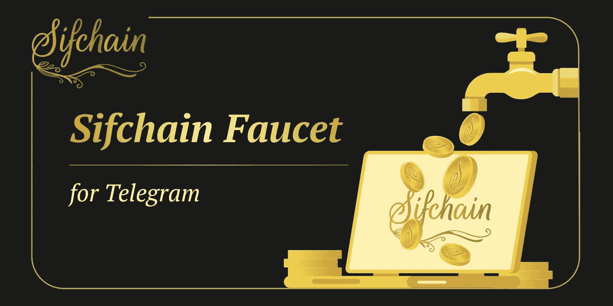

# Sifchain 和 SmartNodes 协作

> 原文：<https://medium.com/coinmonks/sifchain-smartnodes-collaboration-6e3b678cf5ca?source=collection_archive---------12----------------------->

## *“志愿者不一定有时间；他们有心脏。”*

**—伊莉莎白·安德鲁**

在 [SmartNodes](https://smartnodes.one/) ，作为 15 个 [Cosmos Network](https://medium.com/u/e8cb21d22b0b?source=post_page-----6e3b678cf5ca--------------------------------) 连锁店的验证者，我们首先重视我们验证的网络及其社区的实力和声誉，以及委托人的信任。

我们一直在寻找回馈社区的方式，并开发能够提高参与度的产品。这种社区驱动的方法和协作精神催生了 Telegram([t.me/sifchainfaucet](https://twitter.com/nodes_smart/status/1449888736947277828?s=20))的 Sifchain 水龙头。

[Sifchain](https://sifchain.finance/) 是首只 [Omnichain DEX](https://dex.sifchain.finance/#/swap?from=uatom&to=rowan&slippage=1.0) ，目前连接 IBC 和 ERC-20 资产。截至目前，DEX 允许用户汇集和交换 ERC-20 资产，而没有以太坊 mainnet 的低效率和高汽油费。未来的更新将建立与其他顶级区块链的桥梁。计划还包括将备受期待的深边际功能带到宇宙中。

我们的水龙头的预期用途是为 Sifchain DEX 用户提供一些 [$ROWAN](https://www.coingecko.com/en/coins/sifchain) ，以便在 DEX 上进行他们的第一笔交易。Sifchain 团队有先见之明，为新用户实现了 Twitter 水龙头，但我们发现它有一些缺点，包括潜在暴露用户的地址和身份，只能与全新的 Sifchain 地址一起使用，以及一般的技术故障。我们的目标是解决这些问题，并为新用户提供尽可能多的机会来开始使用 Sifchain。

SmartNodes Validator ⚛团队已经非正式地向希望开始使用 DEX 的用户分发了 ROWAN，因此我们看到了利用我们的技能和资源造福社区的机会。

作为概念验证，我们建造并[资助了水龙头](https://www.reddit.com/r/smart_nodes/comments/qgl74k/sifchain_smartnodes_collaboration/?utm_medium=android_app&utm_source=share)，并将其用于 beta 测试目的，以获得我们的 SmartNodes 家族和 [Sifchain 社区](https://twitter.com/sifchain?s=20)的反馈。这些测试取得了巨大的成功。

在与 Sifchain 团队密切合作以使水龙头适应他们所需的规格后，我们的 [SmartNodes Sifchain 水龙头](https://i.reddit.com/r/Sifchain/comments/qd3oz5/new_sifchain_faucet_for_telegram_from_smartnodes/)被正式采用为 Telegram([https://t.me/sifchain/263757](https://t.me/sifchain/263757))的 Sifchain 水龙头。我们继续代表 Sifchain 团队并为了社区的利益资助和维护水龙头。

我们的水龙头由我们的专利机器人 Smarty 驱动。这是 Smarty 的第一个任务，但我们有许多进一步的实施计划，我们很高兴开发。

我们要感谢我们的 beta 测试人员、Sifchain 团队和社区，尤其是我们的 [SmartNodes](https://smartnodes.one/#choose) 家族，感谢你们无止境的信任和支持！

电报([https://t.me/sifchain/263757](https://t.me/sifchain/263757))
Sifchain 社区的 SIF chain 公告

我们很高兴地宣布，与我们的[验证器](https://www.mintscan.io/sifchain/validators/sifvaloper1hz9rznf0dp5j9gk449969hr2y550pxsnxqfav6) : SmartNodes 合作，我们已经为 Telegram 推出了一款新的 Sifchain 水龙头！

这个水龙头是为了给新用户一些交易费 ROWAN 开始对 DEX。

只需点击下面的链接即可开始。机器人会解释剩下的。

sifchain faucet | Smartnodes validator…….. #Blockchain

由 Smartnodes 管理员撰写的文章

# 关于智能节点

Smartnodes Validator 提供利益相关证明服务。您的资产受到我们 100%的斜线和双标志退款保护。

1.  我们完全融入了宇宙，并乐于尽我们所能帮助他人。社区是我们前进的动力。由 [Smartnodes validator](https://smartnodes.family/) 对想法进行主动投票，以确保有效的治理。
2.  只有最好的基础设施中最好的才被 Smartnodes 所采用，并且有 10 层保护来保护您的投资。
3.  查看我们的 [**网站**](https://smartnodes.family/) 以了解更多关于我们的验证器节点的信息。我们目前在 33 个加密货币链上提供利益证明服务(POS ),并且还在增加。
4.  如果您有任何其他疑问，请随时通过我们的社交媒体平台或电子邮件(hello@smartnodes.one)与我们联系。

SmartNodes is an infrastructure provider for Proof-Of-Stake blockchains and decentralized projects.

# 在社交媒体上关注我们

[Reddit](https://www.reddit.com/user/Smart_nodes)|[Twitter](https://twitter.com/nodes_smart)|[网站](https://smartnodes.family/) | [电报](https://t.me/smartnodesvalidators) | [Instagram](https://www.instagram.com/smartnodes_validator/?igshid=YmMyMTA2M2Y%3D) | [不和](https://discord.com/invite/TA3UVPwn6D)

> 交易新手？尝试[加密交易机器人](/coinmonks/crypto-trading-bot-c2ffce8acb2a)或[复制交易](/coinmonks/top-10-crypto-copy-trading-platforms-for-beginners-d0c37c7d698c)