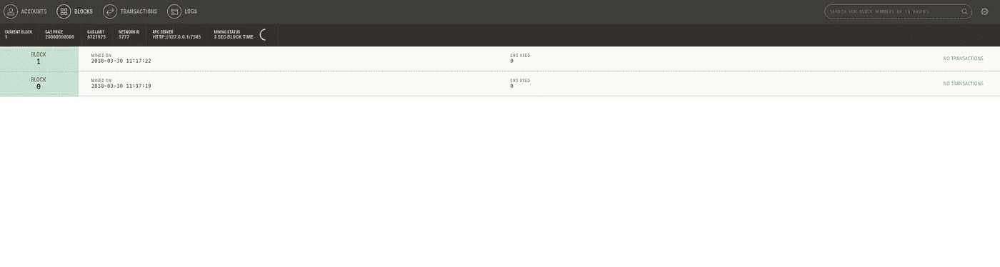
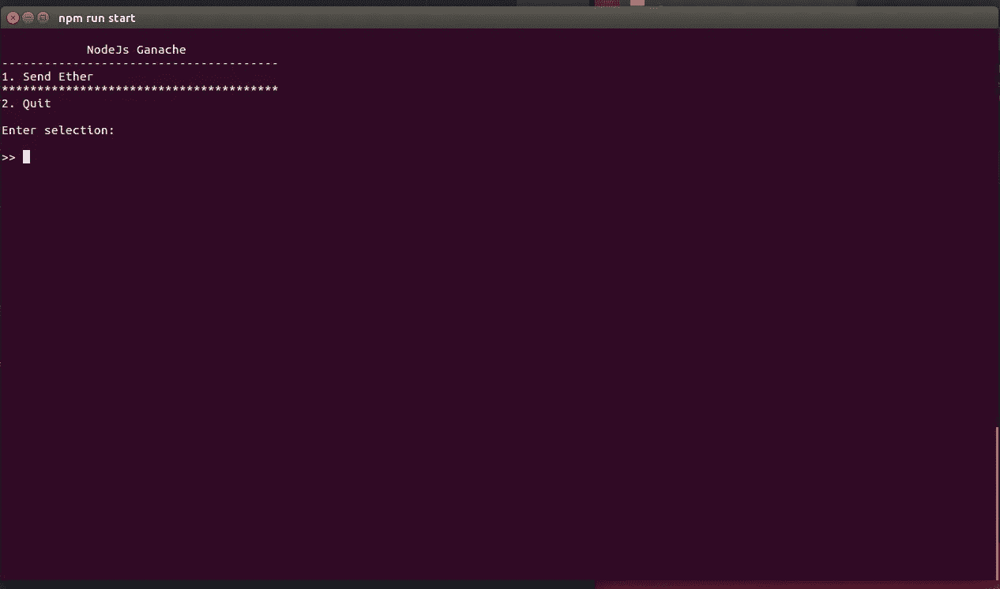
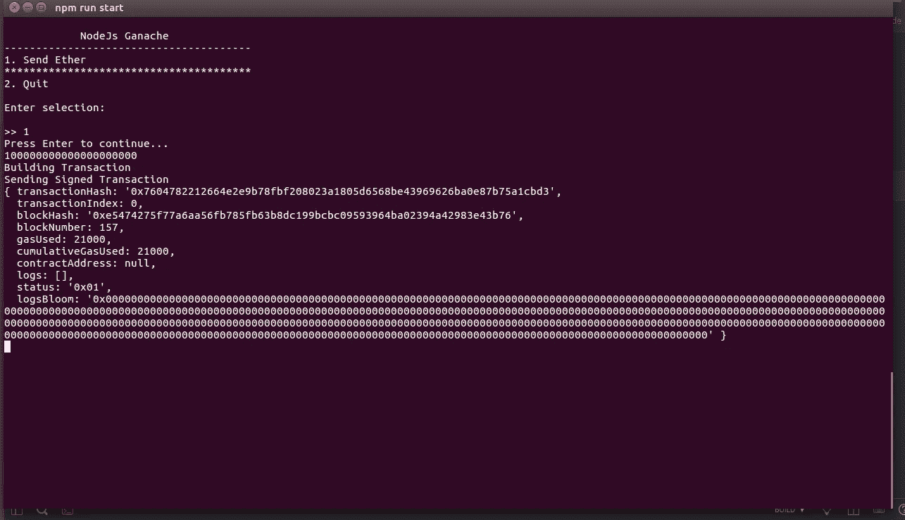
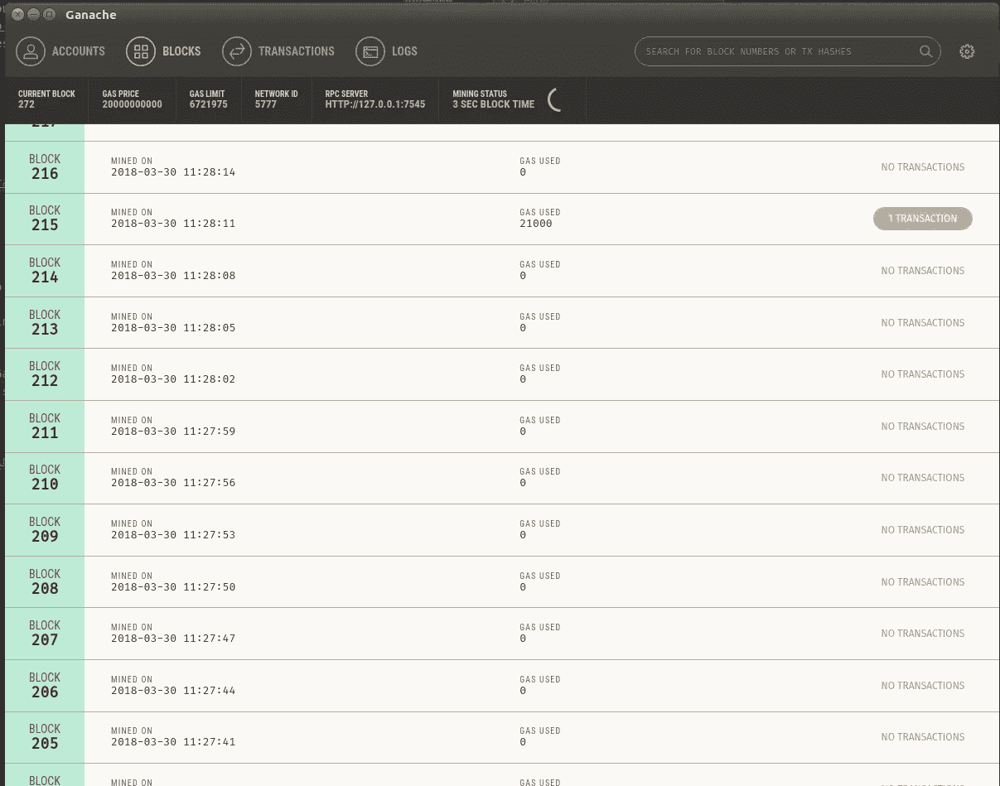
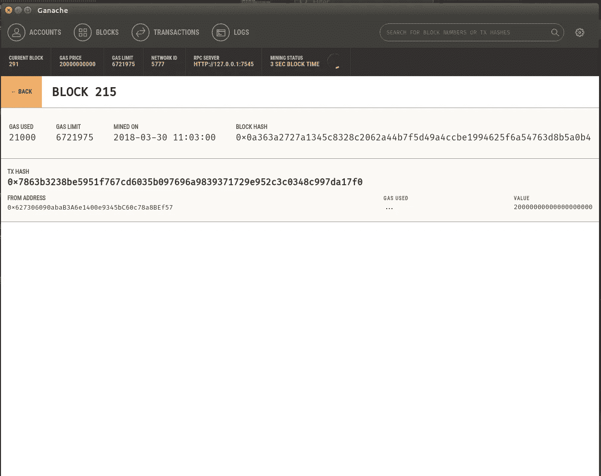

# 离线签署以太坊交易

> 原文：<https://medium.com/coinmonks/sign-an-ethereum-transaction-off-line-d3e38fbda677?source=collection_archive---------0----------------------->

在这篇文章中，我们将看看如何使用[以太坊 js-tx](https://github.com/ethereumjs/ethereumjs-tx) 和 [Node.js](https://nodejs.org/en/) 对以太坊交易进行离线签名。回购可用[此处](https://github.com/NFhbar/nodeJS-ETH-transaction)。

# 设置您的本地实例

将 [repo](https://github.com/NFhbar/nodeJS-ETH-transaction) 克隆到您的本地机器上:

```
git clone git@github.com:NFhbar/nodeJS-ETH-transaction.git
```

安装它:

`$ npm install`

你还需要 [Ganache](http://truffleframework.com/ganache/) 。

# 发送以太网

让我们看看这是如何工作的。首先启动本地 Ganache 实例:



First couple blocks in Ganache.

启动 Ganache 后，您应该会看到块开始填充。我把我的封锁时间设置为 3 秒，但你可以把它设置为任何你喜欢的。

接下来，让我们开始节点菜单，cd 到您的项目文件夹，并:

```
$ npm run start
```



Node.js menu.

太好了！现在让我们尝试发送一个事务。按 1 将乙醚从一个 Ganache 帐户发送到另一个帐户:



Send Ether receipt.

如果您看到此屏幕，这意味着交易已成功发送！您看到的是您的交易收据，包括块散列、交易散列、使用的气体等。

您还可以在 Ganache 中检查您的交易:



Ganache showing tx.

点击交易了解更多详情:



Ganache tx details.

酷，让我们看看代码。

# 离线签署交易

繁重的工作由 [ethereumjs-tx](https://github.com/ethereumjs/ethereumjs-tx) 完成，它允许您轻松地创建原始事务、签署它们并序列化它们。让我们复习一下逻辑。

首先，我们需要 web3 连接到本地 Ganache 实例:

```
import Web3 from 'web3';var web3 = new Web3(new Web3.providers.HttpProvider('[http://127.0.0.1:7545'](http://127.0.0.1:7545')));export default web3;
```

我们现在可以在任何需要的地方导入我们的 web3 实例。

接下来，我们来看看交易是如何准备和发送的:

有三种导入方式:

*   web3 的 Ganache 连接实例
*   我们账户文件中的账户
*   交易生成器文件来传递我们的交易数据

然后，我们的函数获得交易所需的所有值:估计天然气、天然气价格、交易计数等。发送的数量被设置为 20 eth，但是如果你愿意的话，你可以很容易地将它设置为由菜单动态接受。然后，我们构建一个事务数据结构，并将其传递给我们的事务构建器:

有三种导入方式:

*   web3 的 Ganache 连接实例
*   来自 ethereumjs-Tx 的 tx 实例
*   请保存我们的私钥

我们通过以下方式获取我们的私钥:

```
var privateKey = new Buffer(process.env["PRIVATE_KEY"], "hex");
```

然后，我们使用 web3 util 将我们的值设置为十六进制:

```
const nonceHex = web3.utils.toHex(nonce);
const valueHex = web3.utils.toHex(value);
const limitHex = web3.utils.toHex(gasLimit);
const priceHex = web3.utils.toHex(gasPrice);
```

现在我们可以构建一个原始事务对象:

```
switch (method) {
    case 'sendEther':
    rawTx = {
      nonce: nonceHex,
      gasPrice: priceHex,
      gasLimit: limitHex,
      to: toAddress,
      value: valueHex
    };
    break;
  }
```

您可以为您喜欢执行的任何交易添加更多案例。

最后，我们可以签署我们的交易并将其退回发送:

```
var tx = new Tx(rawTx);
tx.sign(privateKey);
var serializedTx = tx.serialize();return serializedTx;
```

很好，现在我们可以简单地通过 web3 方法发送它:

```
await web3.eth.sendSignedTransaction('0x' + rawTx.toString('hex'));
```

就是这样！如你所见 [ethereumjs-tx](https://github.com/ethereumjs/ethereumjs-tx) 是一个非常棒的小模块。

非常感谢你阅读这篇文章！如果你觉得这篇文章很有用**，请点击这篇文章，并确保关注我的更多常规内容**，也请查看我的 [Github](https://github.com/NFhbar) ，因为我定期发布示例代码和项目。如果你有任何问题，欢迎在下面回复或者给我发邮件。

> [直接在您的收件箱中获得最佳软件交易](https://coincodecap.com/?utm_source=coinmonks)

[](https://coincodecap.com/?utm_source=coinmonks)

编码快乐！