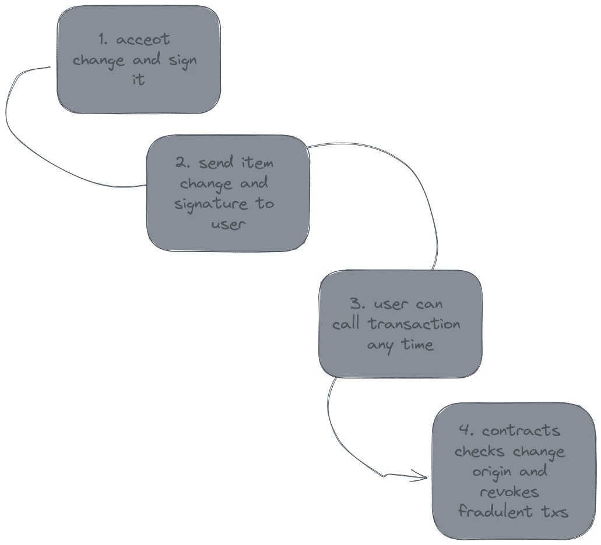
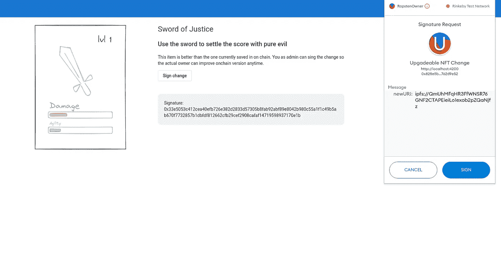
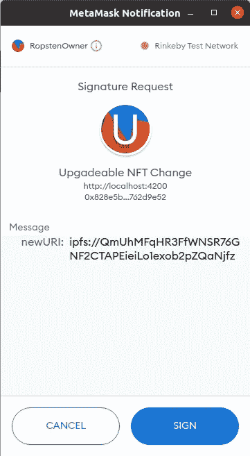

# 与 EIP-712 签署交易

> 原文：<https://medium.com/coinmonks/signing-transactions-with-eip-712-f8f3243d39fd?source=collection_archive---------5----------------------->

回想一下上一篇文章的观点，游戏开发者需要签署游戏物品变更。通过这种方式，更改(链接到 metadata.json)和签名的组合是公共数据，不能被破坏。



# 游戏开发者签名更改



允许数据签名的 JS 部分如下:

```
async sign() { const domain = { name: 'Upgadeable NFT Change', version: '1', chainId: 4, verifyingContract: 'contractAddress', }; // The named list of all type definitions const types = { Change: [{ name: 'newURI', type: 'string' }], }; // The data to sign const value = { newURI:"ipfs://path-to-content" }; const signer = this.provider.getSigner(); const signature = await signer._signTypedData( domain, types, value ); }
```

运行这段代码的结果如下:



这非常方便，因为对于签名的内容没有疑问，整个消息都呈现在元掩码接口中，几乎没有出错的地方。

# 用户对更改的验证

code

# 视频摘要

*原载于 2021 年 12 月 19 日*[*https://rotynski . dev*](https://rotynski.dev/signing-transactions-with-eip-712/)*。*

> 加入 Coinmonks [电报频道](https://t.me/coincodecap)和 [Youtube 频道](https://www.youtube.com/c/coinmonks/videos)了解加密交易和投资

## 也阅读

[](/coinmonks/leveraged-token-3f5257808b22) [## 杠杆代币[多头代币]终极指南

### 杠杆化令牌是具有杠杆化风险敞口的 ERC20 令牌，不考虑保证金、要求、管理…

medium.com](/coinmonks/leveraged-token-3f5257808b22) [](https://blog.coincodecap.com/crypto-exchange) [## 最佳加密交易所| 2021 年十大加密货币交易所

### 编辑描述

blog.coincodecap.com](https://blog.coincodecap.com/crypto-exchange) [](https://blog.coincodecap.com/best-swap-platforms) [## 2021 年最佳加密交换平台| CoinCodeCap

### 编辑描述

blog.coincodecap.com](https://blog.coincodecap.com/best-swap-platforms)  [## 10 大最佳网上赌场[2021] |赢取免费 BTC | CoinCodeCap

### 编辑描述

blog.coincodecap.com](https://blog.coincodecap.com/best-online-casinos) [](/coinmonks/top-5-crypto-lending-platforms-in-2020-that-you-need-to-know-a1b675cec3fa) [## 2021 年最佳加密借贷平台| 6 大比特币借贷平台

### 获得比特币和其他加密货币的最佳贷款利率

medium.com](/coinmonks/top-5-crypto-lending-platforms-in-2020-that-you-need-to-know-a1b675cec3fa) [](/coinmonks/the-best-cryptocurrency-hardware-wallets-of-2020-e28b1c124069) [## 2021 年 6 大最佳硬件钱包|顶级加密硬件钱包[更新]

### 最好的加密货币硬件钱包是绝对必要的。我们将在 NGRAVE、Ledger Nano X 和…

medium.com](/coinmonks/the-best-cryptocurrency-hardware-wallets-of-2020-e28b1c124069) [](/coinmonks/crypto-trading-bot-c2ffce8acb2a) [## 2021 年最佳免费加密交易机器人

### 2021 年币安、比特币基地、库币和其他密码交易所的最佳密码交易机器人。四进制，位间隙…

medium.com](/coinmonks/crypto-trading-bot-c2ffce8acb2a)