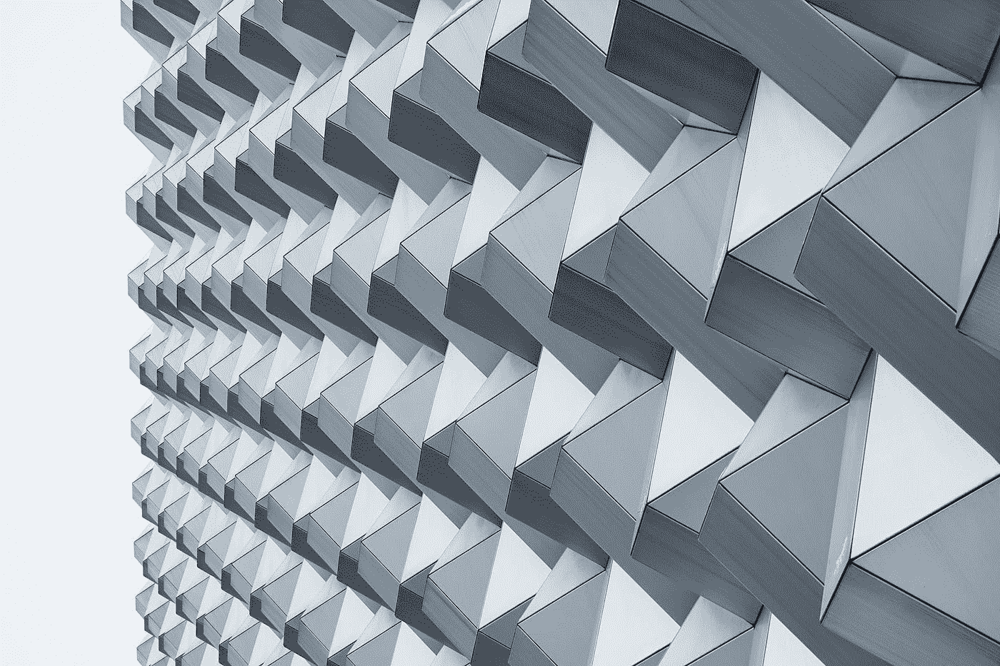
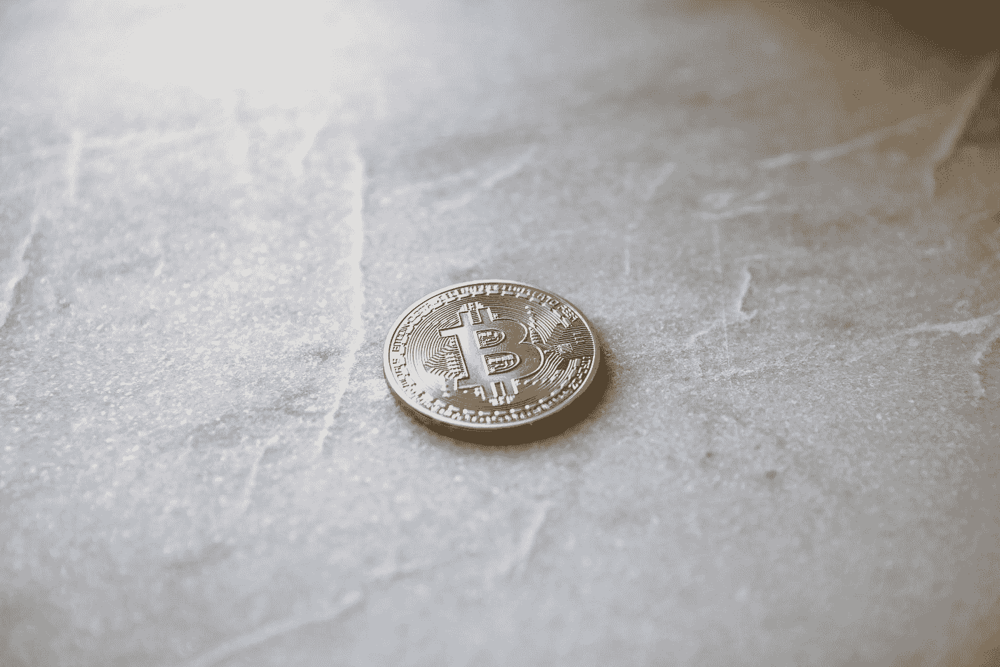

# 随着替代硬币和 ico 获得势头，白银和钻石进入加密市场

> 原文：<https://medium.com/coinmonks/silver-and-diamonds-enter-the-crypto-market-as-altcoins-and-icos-gain-momentum-118ae85c60d6?source=collection_archive---------1----------------------->

## 各行各业的公司都希望从不断增长的加密市场中分一杯羹。

“An abstract pattern in a gray building facade in Dresden” by [Dmitri Popov](https://unsplash.com/@dmpop?utm_source=medium&utm_medium=referral) on [Unsplash](https://unsplash.com?utm_source=medium&utm_medium=referral)

让他们的企业参与加密货币和区块链技术，让公司和投资者都有机会获得巨额利润——因为加密技术的价格可能会突然飙升。

> [在您的收件箱中直接获得最佳软件交易](https://coincodecap.com/?utm_source=coinmonks)

最近进入加密社区的名字之一是矿业公司，[曼斯菲尔德-马丁勘探矿业公司](http://mansfieldmartin.com) ( [OTC Pink: MCPI](https://finance.yahoo.com/quote/mcpi?ltr=1) )。对于该公司的投资者来说，未来看起来相当令人兴奋，因为曼斯菲尔德-马丁公司为他们提供了相当大的交易。

Mansfield-Martin [透露](https://finance.yahoo.com/news/mansfield-martin-exploration-mining-inc-123000375.html)它已经扩大了与 Qu Ltd .的初步安排。两家公司之间的协议授权 Qu Ltd .获得 500 万盎司的银多尔，为 Silverback 初始硬币发行(ICO)提供支持。

那些作为合资企业所有者参与矿山运营计划的人现在可以选择通过几种方式获得回报:银背、银多雷、美元，甚至是 Qu Ltd .目前期限为 60 天的 ICO。在期限内，如果购买的硬币少于 75 %,所有资金将返还给投资者。

# **银背加入了高增长潜力替代币的行列**

银背是一种通过以太坊区块链运作的另类硬币。每枚硬币由一盎司 0.999 银支撑，曲有限公司将总共提供 500 万枚硬币。至于银背的价格，投资者将不得不关注以太坊的价格走势，这是一个好消息，因为这种加密技术再次成为绿色，其价格现在为每枚硬币 950 美元。

Photo by [Andre Francois](https://unsplash.com/@silverhousehd?utm_source=medium&utm_medium=referral) on [Unsplash](https://unsplash.com?utm_source=medium&utm_medium=referral)

不过，Silverback 与以太坊的不同之处在于，它将对现货白银定价进行滑动折扣。根据新闻稿，滑动折扣将在“前 10 天的百分之五十；在第二个 10 天内增加 25 %;第三个 10 天增加 10 %;第四个 10 天增加了 5%。”

# **钻石和隐密钻石**

曼斯菲尔德-马丁公司并不是唯一一家试图将原材料价格与加密货币趋势相结合的公司。据《国土报》报道，就在几周前，这颗钻石镶嵌的钻石在以色列钻石交易所推出。每枚硬币的价格将取决于以色列市场上宝石的当前价格。它希望推动该国的钻石业，许多钻石爱好者已经对这个想法感兴趣，从而给克拉的价格带来更多的增长空间。

鉴于 Silverback 的价格严重依赖以太坊的价格，这将是一个很好的替代硬币，也可能会提振该公司的股价。据[钱包投资者](https://walletinvestor.com/forecast/ethereum-prediction)预测，到 2018 年底，以太坊的价格约为 2000 美元。Mine Run 计划的成员应该考虑获得 Silverback，因为它有巨大的增长潜力。