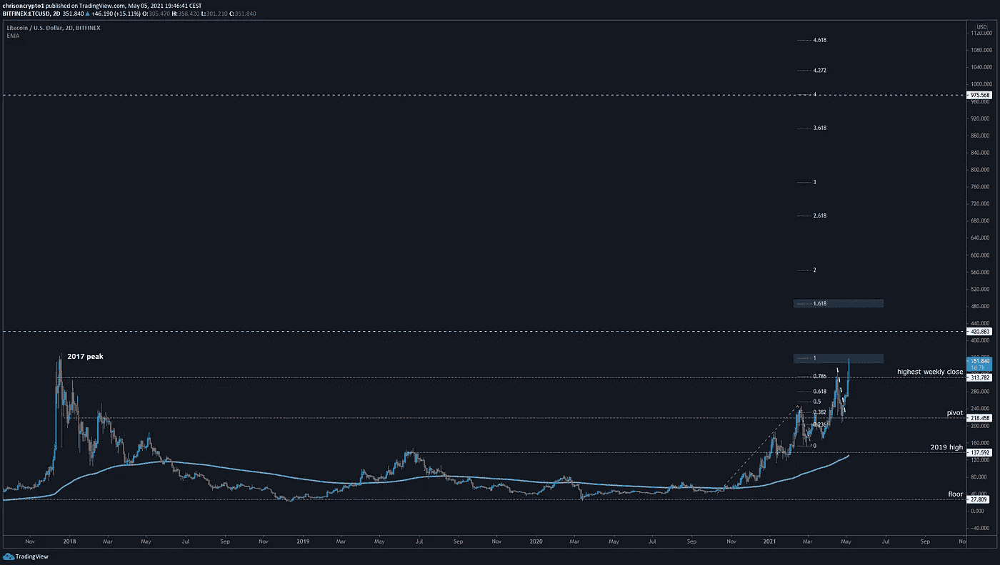
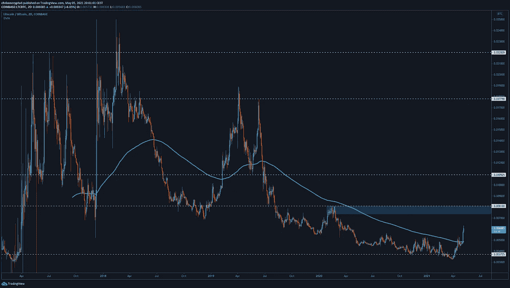
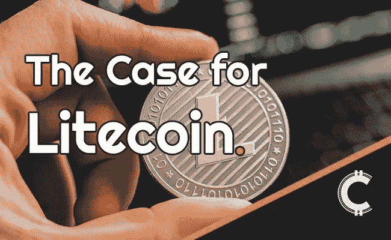

# 白银到比特币的黄金？莱特币的案例

> 原文：<https://medium.com/coinmonks/silver-to-bitcoins-gold-the-case-for-litecoin-356dc4b7b882?source=collection_archive---------4----------------------->

人们常说莱特币是“比特币的黄金”。在这一期中，我们探索了在快速移动的加密环境中以 QE 无限为背景的莱特币案例。

我们来挖一下。

# 白银到比特币的黄金？莱特币的案例

Litecoin 是一个家喻户晓的加密名称，已经存在了十多年。它最初是由查理·李在 2011 年创建的，作为比特币的一次升级尝试，自那以来，它一直是比特币在全球成功的主要受益者，赢得了信誉和高度流动的市场——同时在 coingecko 等加密排名网站上保持着前 10 名的位置。

是时候讨论拥有莱特币的终极案例了。

**详见** [全篇](https://chrisoncrypto.com/blog/f/silver-to-bitcoins-gold-the-case-for-litecoin) **！**

***获取本新闻稿。*** [***订阅邮件列表***](http://www.chrisoncrypto.com) ***！***

# 技术上来说

## BTC 仍然无趣

BTC/美元继续区间波动，没有高时间框架的参考点来推断潜在的设置。自周一以来，比特币开始回调至 52，900 美元，但一天后又回到 57，000 美元。因此，上一期新闻简报中的评论仍然适用。

不过，这两个大公司在 4 月份的回报是值得注意的。与以太坊相比，BTC/美元表现不佳，回报率为-1.70%，而以太坊的回报率为+45%。

然而，根据加密托管公司 NYDIG 的说法，这一趋势可能会在未来几个月内发生变化，因为今年将有数百家美国银行使用比特币。这意味着到年底，3 亿个美国银行账户将能够购买、持有和兑换比特币。

这个消息比任何图表都重要。

## 莱特币接近历史高点

LTC 可能是一枚恐龙币，但它肯定是一只健壮的恐龙。

随着比特币占据主导地位，许多替代币的价格都有上涨趋势(BTC。d)不断走低，LTC/USD 显示出无可争议的强势迹象。

在本文发表时，LTC/USD 对的交易价格高于 352 美元，距离 2017 年的历史高点(372 美元)仅差 20 点。如果广泛的市场势头持续下去，几乎可以肯定的是，这对组合将受益于新的资本流入，超过 2017 年的水平甚至更多。

通常情况下，莱特币和比特币走势一致，部分原因是强烈的“白银对比特币的黄金”叙事，但也有其他原因，这些原因在莱特币的[论证案例中有所解释。值得注意的直接领域将是 420 美元的目标，这仅仅是因为这个数字所推断的“迷因”，以及上面描述的标准 fib 扩展水平。](https://chrisoncrypto.com/blog/f/silver-to-bitcoins-gold-the-case-for-litecoin)

记住 doge coin——一种由 [13 个地址持有总供应量](https://bitinfocharts.com/top-100-richest-dogecoin-addresses.html)46%的硬币——现在的总市值为 800 亿英镑，公平地说，420 美元的莱特币即使不是保守的数字，也是一个适中的数字。

对于那些考虑持有 dogecoin 的人来说，考虑一下 meme coin 比传统的银行和金融部门更加集中。一旦出现市场低迷(或者这些地址中的任何一个决定脱手)，考虑分销可能随之而来是不是太多了？

与此同时，Litecoin 的市值为 230 亿美元。

## LTC/BTC 显示出生命的迹象

随着₿0.0037 的背离和回调，这对组合继续走高，直到到达₿0.0048 水平，用 2 天 200 指数移动平均线(EMA)表示。在短暂的整理后，莱特币在撰写本文时交易于₿0.0061 上方，下一个目标是₿0.008。

另一方面，一次失败的 R/S 翻转对硬币来说可能是灾难性的，为负面价格发现打开了大门。然而，考虑到最近的价格走势，世界末日的说法就没那么吸引人了。从历史上看，价格在 200 均线以上的波动会持续几个月，直到找到顶部。这可能就是这样一个时刻。

此外，LTC/美元对的明显强势受到 LTC/BTC 的支撑，为恐龙币的牛市复苏提供了急需的汇合点。

遗留硬币的一个好处是，它经受住了时间的考验(连续 10 年)，而不是在一个加密周期中创建的随机空洞的项目。这建立了一定程度的信任，很少有项目可以诚实地宣传——实际上只有两个。当然，这对莱特币的近期价格目标几乎没有影响，但寻求平均美元成本的投资者可以获得一些视角，因为他们知道[莱特币项目](https://chrisoncrypto.com/blog/f/silver-to-bitcoins-gold-the-case-for-litecoin)不太可能很快消失。

如果以史为鉴，莱特币应该会在比特币的未来继续扮演关键角色。

公牛领路。

下次再见。

**加入** [电报](https://t.me/chrisoncryptochannel) **频道，实时更新&设置！
关注我** [推特](https://twitter.com/ChrisOnCrypto1) **&** [多嘴多舌](https://gab.com/chrisoncrypto) **下面还有我的社交门户。**

[https://www.paypal.com/donate?hosted_button_id=C9VRLGTBHQX2N](https://www.paypal.com/donate?hosted_button_id=C9VRLGTBHQX2N)

# 阅读更多:白银到比特币的黄金？莱特币的案例

[https://chrisoncrypto.com/blog/f/silver-to-bitcoins-gold-the-case-for-litecoin](https://chrisoncrypto.com/blog/f/silver-to-bitcoins-gold-the-case-for-litecoin)

[http://www.chrisoncrypto.com/](http://www.chrisoncrypto.com/)

你也可以用比特币支持我！
**BTC** 地址:**3 eydseypjhn 68 axkncuqbb 7 ebqcxrejamr**

最诚挚的问候，
T21 克里斯托
克里斯托
上的加密创始人[www.cityam.com](https://www.cityam.com)上的
直接接通:[电报](https://t.me/chrisoncrypto)

*最初发布于*[*https://mailchi . MP*](https://mailchi.mp/3bf08542b521/silver-to-bitcoins-gold-the-case-for-litecoin?e=[UNIQID])*。*