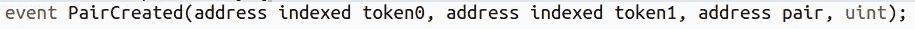

# 获取最新 Uniswap 对列表的简单 API

> 原文：<https://medium.com/coinmonks/simple-apis-to-get-latest-uniswap-pair-listing-5806aac69185?source=collection_archive---------4----------------------->


Uniswap API

在上一篇文章中，我们向您展示了如何使用简单的 rest APIs 获得 [Uniswap 交易](https://blog.bitquery.io/dex-data-apis)。今天，我们将展示如何使用一个 GraphQL 查询获得最新的 Uniswap 清单。

在继续之前，我们先了解一下什么是 Uniswap pair listing？

任何人都可以在 Uniswap 上创建两个令牌池。在创建时，他们需要为两个令牌提供初始流动性(无论他们想要什么),以进行价格发现。该池是一个 ERC20 令牌智能合约，由 Uniswap 工厂合约创建。

不用担心；随着我们的进展，我们将向你展示每样东西的例子。

现在，让我们从 Uniswap 获取新创建的池列表。

**注:**本文中我们是 Uniswap V2。

## 获取新创建的 Uniswap 池

要获得最新的 Uniswap 池，我们需要运行以下 GraphQL 查询。这里—【https://graphql.bitquery.io/】T4。这也是我们的 GraphQL APIs 的端点。

```
{
  ethereum {
    arguments(smartContractAddress: 
      {is: "0x5c69bee701ef814a2b6a3edd4b1652cb9cc5aa6f"},
      smartContractEvent: {is: "PairCreated"}, 
      options: {desc: "block.height", limit: 3}) {
      block {
        height
      }
      argument {
        name
      }
      reference {
        address
      }
    }
  }
}
```

## **结果**

```
{
  "data": {
    "ethereum": {
      "arguments": [
        {
          "block": {
            "height": 10836664
          },
          "argument": {
            "name": "token0"
          },
          "reference": {
            "address": "0x930ed81ad809603baf727117385d01f04354612e"
          }
        },
        {
          "block": {
            "height": 10836664
          },
          "argument": {
            "name": "pair"
          },
          "reference": {
            "address": "0x7bc3a77b1b8daa4bf4b38c710119b932c5b27925"
          }
        },
        {
          "block": {
            "height": 10836664
          },
          "argument": {
            "name": "token1"
          },
          "reference": {
            "address": "0xdf5e0e81dff6faf3a7e52ba697820c5e32d806a8"
          }
        }
      ]
    }
  }
}
```

## 理解查询和结果

在此查询中，我们从 Uniswap 事件中提取数据。每当创建池时，Uniswap 都会发出一个名为' **PairCreated'** 、带有 3 个主要参数的事件。

*   令牌 0 —一个 ERC20 令牌
*   令牌 1 —另一个 ERC20 令牌
*   对—新创建的对(即池)令牌地址



我们将在查询中使用“PairCreated”事件来获取最新的 Uniswap 对/池。

如果您注意到，我们在查询中使用了 [Uniswap Factory](https://explorer.bitquery.io/ethereum/smart_contract/0x5c69bee701ef814a2b6a3edd4b1652cb9cc5aa6f) 联系地址(0x 5c 69 bee 701 ef 814 a2 b 6 a3 edd 4b 1652 CB 9 cc 5a a6 f)和一个 limit 3 来获取最新的 3 个参数。

正如您在结果中看到的，这些参数是令牌 0 地址、令牌 1 地址和新创建的地址对。

## 了解代币

要了解令牌的详细信息，只需使用令牌地址运行以下查询。

例如，如果我们想从上面的结果中了解 token0 的详细信息。

```
{
  ethereum {
    address(address: {is: "0x930ed81ad809603baf727117385d01f04354612e"}) {
      annotation
      address
      smartContract {
        contractType
        currency {
          symbol
          name
          decimals
          tokenType
        }
      }
      balance
    }
  }
}
```

## **结果**

```
{
  "data": {
    "ethereum": {
      "address": [
        {
          "annotation": "",
          "address": "0x930ed81ad809603baf727117385d01f04354612e",
          "smartContract": {
            "contractType": "Token",
            "currency": {
              "symbol": "SOLARITE",
              "name": "SOLARITE",
              "decimals": 18,
              "tokenType": "ERC20"
            }
          },
          "balance": 0
        }
      ]
    }
  }
}
```

## 学习配对(池)

现在，让我们看一下新创建的池的一些细节。

## 获得资金池的初始流动性

正如我们上面提到的，在创建一个池的同时，你需要为两个令牌提供流动性；因此，如果我们想知道池中两个令牌的初始数量，请运行以下查询。

这里我们得到了池(对)收到的前两个事务。

**注**:0x 7 BC 3a 77 B1 b 8 da a4 BF 4b 38 c 710119 b 932 C5 b 27925 从上面的结果来看是池(对)地址。

```
{
  ethereum {
    transfers(options: {asc: "block.timestamp.time", limit: 2}, amount: {gt: 0}, receiver: {is: "0x7bc3a77b1b8daa4bf4b38c710119b932c5b27925"}) {
      block {
        timestamp {
          time(format: "%Y-%m-%d %H:%M:%S")
        }
        height
      }
      address: sender {
        address
        annotation
      }
      currency {
        address
        symbol
      }
      amount
      transaction {
        hash
      }
      external
    }
  }
}
```

## 结果

```
{
  "data": {
    "ethereum": {
      "transfers": [
        {
          "block": {
            "timestamp": {
              "time": "2020-09-10 22:10:16"
            },
            "height": 10836664
          },
          "address": {
            "address": "0x37d50885b44500a2eacab7c93dd349590600f05f",
            "annotation": null
          },
          "currency": {
            "address": "0x930ed81ad809603baf727117385d01f04354612e",
            "symbol": "SOLARITE"
          },
          "amount": 0.08,
          "transaction": {
            "hash": "0xf69e4560ae36fd2948cfe5b6a5d22654b46307fe0ef04022bc68c8a3ee55f957"
          },
          "external": true
        },
        {
          "block": {
            "timestamp": {
              "time": "2020-09-10 22:10:16"
            },
            "height": 10836664
          },
          "address": {
            "address": "0x37d50885b44500a2eacab7c93dd349590600f05f",
            "annotation": null
          },
          "currency": {
            "address": "0xdf5e0e81dff6faf3a7e52ba697820c5e32d806a8",
            "symbol": "yDAI+yUSDC+yUSDT+yTUSD"
          },
          "amount": 200,
          "transaction": {
            "hash": "0xf69e4560ae36fd2948cfe5b6a5d22654b46307fe0ef04022bc68c8a3ee55f957"
          },
          "external": true
        }
      ]
    }
  }
}
```

## 获取池中不同代币的总余额

假设现在您想要检查 Uniswap 池中两个令牌的余额。您可以使用下面的查询。

默认情况下，每个池/对货币名称都是“统一 V2”。记住，我们提到过池本身是一个 ERC20 令牌。

```
{
  ethereum {
    address(address: {is: "0x7bc3a77b1b8daa4bf4b38c710119b932c5b27925"}) {
      balances {
        currency {
          symbol
        }
        value
      }
    }
  }
}
```

**结果**

```
{
  "data": {
    "ethereum": {
      "address": [
        {
          "balances": [
            {
              "currency": {
                "symbol": "UNI-V2"
              },
              "value": 0
            },
            {
              "currency": {
                "symbol": "SOLARITE"
              },
              "value": 619.42286725
            },
            {
              "currency": {
                "symbol": "yDAI+yUSDC+yUSDT+yTUSD"
              },
              "value": 199915.11344483
            }
          ]
        }
      ]
    }
  }
}
```

## 包扎

我们的 GraphQL APIs 是高度灵活和高性能的。您可以编写 GraphQL 查询来从任何以太坊协议获取任何数据。在以后的文章中，我们将展示如何为不同的 DeFi 协议获取数据。如果您有任何问题，请通过我们的[电报](https://t.me/Bloxy_info)频道联系我们。

**亦读:**

*   [获取以太坊供应和数据的简单 API](https://blog.bitquery.io/get-ethereum-total-supply)
*   [获取以太坊令牌余额的单一 API](https://bitquery.io/blog/etheruem-token-api)
*   [获取 Uniswap 数据的简单 rest API](https://blog.bitquery.io/dex-data-apis)(DEX 数据 API)

## 关于 Bitquery

[**Bitquery**](https://bitquery.io/?source=blog&utm_medium=about_coinpath) 是一套软件工具，以统一的方式解析、索引、访问、搜索和使用区块链网络上的信息。我们的产品是:

*   [**coin path**](https://bitquery.io/products/coinpath?utm_source=blog)**API**为超过 24 个区块链提供[区块链资金流分析](https://blog.bitquery.io/coinpath-blockchain-money-flow-apis)。使用 Coinpath 的 API，您可以监控区块链交易，调查比特币洗钱等加密犯罪，并创建加密取证工具。阅读[开始使用 Coinpath](https://blog.bitquery.io/coinpath-api-get-start) 。
*   [**数字资产 API**](https://bitquery.io/products/digital_assets?utm_source=blog&utm_medium=about) 提供与所有主要加密货币、硬币和代币相关的索引信息。
*   [**DEX API**](https://bitquery.io/products/dex?utm_source=blog&utm_medium=about) 提供 Uniswap、Kyber Network、Airswap、Matching Network 等不同 DEX 协议上的实时存款和交易、交易及其他相关数据。

如果您对我们的产品有任何疑问，请通过我们的[电报频道](https://t.me/Bloxy_info)提问，或发邮件至 [hello@bitquery.io](mailto:hello@bitquery.io) 联系我们。此外，请订阅我们下面的时事通讯，我们将为您提供加密货币世界的最新动态。

*原载于 2020 年 9 月 14 日*[*https://bit query . io*](https://bitquery.io/blog/uniswap-pool-api)*。*