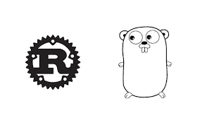

# 简单的区块链实现

> 原文：<https://medium.com/coinmonks/simple-blockchain-implementations-58eecabefd8?source=collection_archive---------0----------------------->

Go Vs. Rust

我在 [200 行代码](https://github.com/lhartikk/naivechain)中遇到了一个区块链，我认为看到相同实现的跨语言性能会很有趣。

我选择了 Rust、Golang 和 Javascript。

# 表演

**锈** ~130 次交易/秒

**Golang** ~ 70 交易/秒

**Javascript** ~ 240 事务/秒

我不会相信这些数字。我毫不怀疑，将项目升级到生产就绪状态会像你所期望的那样重新排序这些语言，Rust 领先，紧随其后，Javascript 勉强跟上。

我以前看过 Rust，大约一年前，那时他们甚至没有一个合适的数学图书馆，所以我没有看。然而现在，他们有非常好的依赖管理器，我发现开发过程非常引人注目。如果我需要快速的低级语言，我会抓住机会使用 Rust。

> [直接在您的收件箱中获得最佳软件交易](https://coincodecap.com/?utm_source=coinmonks)

事实证明，编写一个简单的区块链是微不足道的。这令人鼓舞，也令人沮丧。随着我越来越深入地研究白皮书和突然出现的新项目，我继续感到许多项目有些容易复制，这意味着竞争对手成群结队。

好消息是这项技术以及它所能解决的一些问题对于大多数开发者来说都是触手可及的。