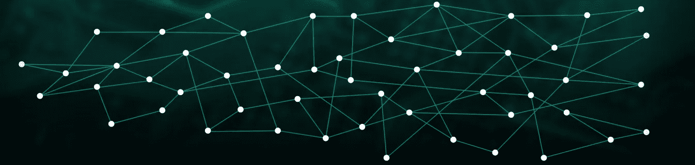

# Python 中简单的有向无环图(IOTA-like)实现

> 原文：<https://medium.com/coinmonks/simple-directed-acyclic-graph-iota-like-implementation-in-python-8e07677c55b5?source=collection_archive---------1----------------------->

## 对于那些仅仅区块链是不够的。



Picture taken from [https://ukcryptocurrency.com/iota/introduction-what-is-iota/](https://ukcryptocurrency.com/iota/introduction-what-is-iota/)

大约在一年前的同一时间，我在《密码世界》中有了“信仰的飞跃”。我阅读了数十份白皮书，数千篇 Reddit 帖子，访问了无数次聚会，直到我发现了 IOTA 并加入了 crypto-rage。作为一个干渣现在有一个知识想和观众分享。受到像 [this](https://hackernoon.com/learn-blockchains-by-building-one-117428612f46) 或 [this](/crypto-currently/lets-build-the-tiniest-blockchain-e70965a248b) 这样的区块链教程的可访问性和易用性的启发，以及缺乏类似的有向无环图(DAG)教程的情况，我想也做点贡献。这里有一个类似 IOTA 的分布式账本技术的简单实现 Tangle！要点页与完整的代码可以找到[这里](https://gist.github.com/stkubr/0469ab30b1f992e2817f6060e4bf576f)。

让我们从添加我们将需要的库开始:

```
import hashlib
import random
import string
import time
from collections import OrderedDict
```

然后我们将 Tangle 表示为三个独立的字典:

```
tangle_graph = {'genesis_branch': [],
                'genesis_trunk': []}

tangle_data = {}

tangle_ledger = {'iota_satoshi': 100}
```

`tangle_graph`将表示图形数据结构——每个字典键是一个事务，每个值是键引用的另外两个事务的列表，即所谓的:分支和主干。我们开始与一些创世纪的树枝和树干纠缠在一起。`tangle_data`包含事务到数据有效负载的映射，而`tangle_ledger`是公钥到值的映射。在实际的 IOTA 实现中，这些数据结构不是分离的，而是混乱的，但是为了教程的可见性，我们让它保持原样。

这里为了简单起见，我们将不使用任何非对称加密，如 RSA 或量子抗 Winternitz 签名，只需记住`'iota_satoshi'`是一个公钥或一个**地址**，任何拥有相应私钥的人都可以从这个地址使用。

然后我们需要一个散列函数，让我们以简单的 SHA1 为例:

```
def calc_hash(msg):
    hasher = hashlib.sha1(msg.encode())
    return hasher.hexdigest()
```

现在我们引入一个基本块——Block 类(双关语):

```
class Block:
    def __init__(self, branch, trunk):
        self.branch = branch
        self.trunk = trunk
        self.timestamp = time.time()
        self.data_payload = get_random_string()
        self.value_tx = None

    def get_hash(self):
        return calc_hash(str(OrderedDict(self.__dict__)))
```

块包含分支和主干分支、时间戳和一些数据。这里`get_random_string()`只是为 block 的`data_payload`提供随机字符串。

此外，我们定义了向 Tangle 添加块的函数:

```
def add_tx(block: Block):
  if block.branch in tangle_graph and block.trunk in tangle_graph:
      tangle_graph[block.get_hash()]=[block.branch,block.trunk]
      tangle_data[block.get_hash()] = block.data_payload
```

基本上，该函数检查分类帐中是否存在 block 的分支和主干分支，如果存在，则向 Tangle 添加新交易。

现在，我们需要某种算法来从现有的混乱事务中选择事务，作为新事务的分支和主干:

```
def find_tips():
    return tuple(random.sample(set(tangle_graph.keys()), 2))
```

这是最简单的均匀随机 tips 选择算法——它只是从所有事务中选择两个不同的随机事务。事实上，事情要复杂得多。

这就是了！有了一个类和三个函数，我们就可以运行 Tangle 了—让我们运行`add_tx(Block(*find_tips()))`:

```
tangle_graph
Out[24]: 
{'e0d5787db72c7a0bea6d9621f73bd4b21f47546f': 
['genesis_trunk','genesis_branch'],
 'genesis_branch': [],
 'genesis_trunk': []}
```

我们刚刚添加了引用‘genesis _ trunk’和‘genesis _ branch’的事务`‘e0d5787db72c7a0bea6d9621f73bd4b21f47546f’`。让我们通过多跑几次`add_tx(Block(*find_tips()))`来增加更多！

```
{'2b503d9c90eec329b96b89cde4dc54efa826b0df': 
['genesis_trunk','580e464bd9cef52e4af07508171ce84369b258d5'], '37379d02f49e9dc57a6e08ff33e218a12c39f9de': 
['genesis_branch','e0d5787db72c7a0bea6d9621f73bd4b21f47546f'], '580e464bd9cef52e4af07508171ce84369b258d5':['37379d02f49e9dc57a6e08ff33e218a12c39f9de','genesis_trunk'], 'e0d5787db72c7a0bea6d9621f73bd4b21f47546f':
 ['genesis_trunk','genesis_branch'], 'genesis_branch': [],
 'genesis_trunk': []}
```

如您所见，Tangle 在增长，新事务开始随机引用旧事务。至于`tangle_data`看起来是这样的:

```
{'2b503d9c90eec329b96b89cde4dc54efa826b0df': 'yxgcs',
 '37379d02f49e9dc57a6e08ff33e218a12c39f9de': '1lyf8',
 '580e464bd9cef52e4af07508171ce84369b258d5': '1y4vu',
 'e0d5787db72c7a0bea6d9621f73bd4b21f47546f': 'nct8w'}
```

只是一些随机数据。

现在我们要转移一些资金，但是为了这样做，我们需要给我们的`Block`类添加额外的函数:

```
def add_value_tx(self, sender, receiver, amount, signature):
        self.value_tx = {'sender': sender,
                         'receiver': receiver,
                         'amount': amount,
                         'signature': signature
                         }
```

这将为块对象添加**非零事务**状态:

```
# prepare block usual way
value_block = Block(*find_tips())# add value transition in block
value_block.add_value_tx('iota_satoshi', 'iota_foundation_address', 50, 'calligraphic_signature_of_satoshi_himself')
```

显然`calligraphic_signature_of_satoshi_himself`是公钥/地址`iota_satoshi`的加密签名。现在我们需要为值事务处理一个逻辑，它将修改`tangle_ledger`:

```
def check_value_tx(value_tx):
    if value_tx['sender'] in tangle_ledger:
      if value_tx['amount'] <=  tangle_ledger[value_tx['sender']]:
            # if signature is valid too
            res = True
    return resdef move_money(sender, receiver, amount):
    tangle_ledger[sender] -= amount
    if receiver in tangle_ledger:
        tangle_ledger[receiver] += amount
    else:
        tangle_ledger[receiver] = amount
```

首先检查`sender`地址是否存在，是否有足够的钱花。第二个将资金从`sender`移动到`receiver`，如果分类帐上不存在，则添加后者。(人们仍然可以发送负金额并把某人扔进 dept😱)

有待修改的所有内容`add_tx()`:

```
def add_tx(block: Block):
    if block.branch in tangle_graph 
       and block.trunk in tangle_graph:
        if block.value_tx:
            if check_value_tx(block.value_tx):
                move_money(block.value_tx['sender'],
                           block.value_tx['receiver'],
                           block.value_tx['amount'])
                tangle_graph[block.get_hash()] = [block.branch,   
                                                  block.trunk]
                tangle_data[block.get_hash()] = block.data_payload
        else:
            tangle_graph[block.get_hash()] = [block.branch, 
                                              block.trunk]
            tangle_data[block.get_hash()] = block.data_payload
```

现在，我们可以添加一个带有值事务的块`add_tx(value_block)`,这种纠结将看起来像:

```
tangle_graph
{'2b503d9c90eec329b96b89cde4dc54efa826b0df': 
['genesis_trunk','580e464bd9cef52e4af07508171ce84369b258d5'],'37379d02f49e9dc57a6e08ff33e218a12c39f9de': 
['genesis_branch','e0d5787db72c7a0bea6d9621f73bd4b21f47546f'],'580e464bd9cef52e4af07508171ce84369b258d5':['37379d02f49e9dc57a6e08ff33e218a12c39f9de','genesis_trunk'],'c33f585243abac2f59494eb092a600d3fe97423a': ['genesis_branch',
  '580e464bd9cef52e4af07508171ce84369b258d5'],'e0d5787db72c7a0bea6d9621f73bd4b21f47546f':
 ['genesis_trunk','genesis_branch'],'genesis_branch': [],
 'genesis_trunk': []} tangle_ledger
{'iota_foundation_address': 50, 'iota_satoshi': 50} tangle_data
{'2b503d9c90eec329b96b89cde4dc54efa826b0df': 'yxgcs',
 '37379d02f49e9dc57a6e08ff33e218a12c39f9de': '1lyf8',
 '580e464bd9cef52e4af07508171ce84369b258d5': '1y4vu',
 'e0d5787db72c7a0bea6d9621f73bd4b21f47546f': 'nct8w',
 'c33f585243abac2f59494eb092a600d3fe97423a': 
  {'data_payload': 'ps697',
   'value_payload': 
    {('sender', 'iota_satoshi'),
     ('receiver', 'iota_foundation_address'),
     ('amount', 50),
     ('signature', 'calligraphic_signature_of_satoshi_himself')}
}
```

这是最简单的 DAG 实现，当然它缺乏一致性、密钥加密、验证和网络拓扑，但是它应该给读者一个 IOTA 如何工作的直观理解。

完整代码的要点页面可以在[这里](https://gist.github.com/stkubr/0469ab30b1f992e2817f6060e4bf576f)找到。你可以通过 IOTA Discord 的 stkubr#1936 或 Twitter [@KubrakStan](https://twitter.com/KubrakStan) 联系我。如果你喜欢我的工作，并希望我继续将本教程扩展到第二部分，添加节点共识，Flask 网络服务器等。请随意捐赠一些 Iotas，地址:

ehnqjbgfaiutjkpmsucsdmih 9 xthanmjbvezlfyuruxjuartgkg 9 kdbhtczhdkzzogt 9 engemhposlhpwxaelupsdx

感谢您的关注:)

> [在您的收件箱中直接获得最佳软件交易](https://coincodecap.com/?utm_source=coinmonks)

[](https://coincodecap.com/?utm_source=coinmonks)