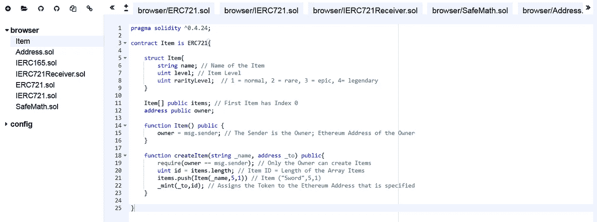

# 🔮简单的游戏 ERC-721 令牌模板🔮

> 原文：<https://medium.com/coinmonks/simple-game-erc-721-token-template-2dff953c066f?source=collection_archive---------3----------------------->

非常简单的 **ERC-721 智能合约模板**在**以太坊**区块链上创建你自己的 **ERC-721 令牌**，有许多可定制的选项🔮

ERC-721 是一个自由、开放的标准，描述了如何在区块链以太坊上构建不可替代的或唯一的令牌。虽然大多数令牌是可替换的(每个令牌都与其他令牌相同)，但 **ERC-721** 令牌都是唯一的。

最著名的 ERC-721 令牌的例子之一是加密小猫([https://www.cryptokitties.co/](https://www.cryptokitties.co/))，其中每只猫都是唯一的 ERC-721 令牌。😺

在这个小例子中，我们创建了一个 **ERC-721** 令牌，可以用作游戏中的物品。⚔️

**实体代码**的每一行都有一个注释，解释正在发生的事情。📝

设置相当简单，你只需要点击[混音链接](https://remix.ethereum.org/#version=soljson-v0.4.25+commit.59dbf8f1.js&optimize=false&gist=6dfc6f9a27c0e6220094943657e3d834)或者使用[要点链接](https://gist.github.com/AYIDouble/6dfc6f9a27c0e6220094943657e3d834)就完成了。如果你有问题，你也可以用老办法，分别添加每个文件。(需要 1 分钟)([所有文件 GitHub](https://github.com/AYIDouble/Simple-Game-ERC-721-Token-Template) )

Remix IDE 链接:[https://remix . ether eum . org/# version = sol JSON-v 0 . 4 . 25+commit . 59 DBF 8 f 1 . js&optimize = false&gist = 6 DFC 6 f 9 a 27 c 0 e 6220094943657 e3d 834](https://remix.ethereum.org/#version=soljson-v0.4.25+commit.59dbf8f1.js&optimize=false&gist=6dfc6f9a27c0e6220094943657e3d834)

GitHub Gist 链接:[https://Gist . GitHub . com/ayi double/6 DFC 6 f 9 a 27 c 0 e 6220094943657 e3d 834](https://gist.github.com/AYIDouble/6dfc6f9a27c0e6220094943657e3d834)

GitHub 上所有可用的文件:[https://GitHub . com/ayi double/Simple-Game-ERC-721-Token-Template](https://github.com/AYIDouble/Simple-Game-ERC-721-Token-Template)

# 📝[再混合—固化 IDE](https://remix.ethereum.org/#version=soljson-v0.4.25+commit.59dbf8f1.js&optimize=false&gist=6dfc6f9a27c0e6220094943657e3d834) 📝



## 代码的解释:

**第 5-9 行**:在**结构**中，定义了**项**及其所有属性(**名**、**级**、**级**)。

**第 11 行**创建数组，将合同所有人的所有**项**保存在数组中。

**第 14-16 行**我们定义**业主**为本合同的使用人。

**第 18 行**:我们定义了一个函数 **createItem** ，其中 Item 的名称(**_ name】**)是一个参数，而 Ethereum 地址( **_to** )是我们发送项目的地方。

**第 19 行**:我们定义只有合同的**所有人**才能创建项目。

**第 20 行**:我们每次创建**项**时，都会将**项**数组的当前长度作为该项的 ID。(每个**项**都有唯一的标识)

**第 21 行**:创建**项目**并添加到我们的**项目**中

**第 22 行**:来自 **ERC721** 库的 **_mint** 功能用于将我们的物品发送到特定的地址。例如，需要将创建的项目发送到您的以太网地址或任何其他地址。

# ⚔️项目. sol ⚔️ (ERC-721 Token)

**示例:剑作为物品保存在以太网封锁链中。**

```
pragma solidity ^0.4.24;contract Item is ERC721{

    struct Item{
        string name; // Name of the Item
        uint level; // Item Level
        uint rarityLevel;  // 1 = normal, 2 = rare, 3 = epic, 4= legendary
    }

    Item[] public items; // First Item has Index 0
    address public owner;

    function Item() public {
        owner = msg.sender; // The Sender is the Owner; Ethereum Address of the Owner
    }

    function createItem(string _name, address _to) public{
        require(owner == msg.sender); // Only the Owner can create Items
        uint id = items.length; // Item ID = Length of the Array Items
        items.push(Item(_name,5,1)) // Item ("Sword",5,1)
        _mint(_to,id); // Assigns the Token to the Ethereum Address that is specified
    }

}
```

> [直接在您的收件箱中获取最佳软件交易](https://coincodecap.com/?utm_source=coinmonks)

[](https://coincodecap.com/?utm_source=coinmonks)