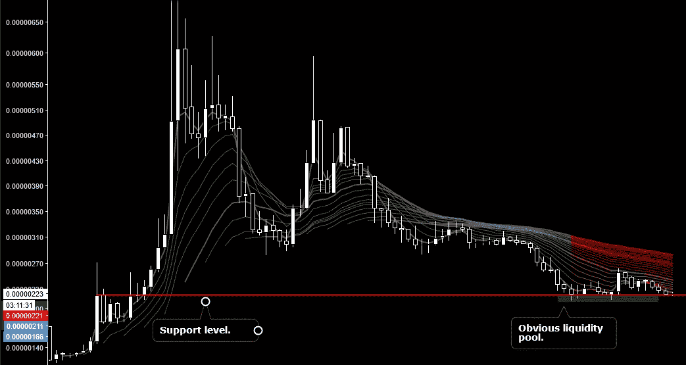
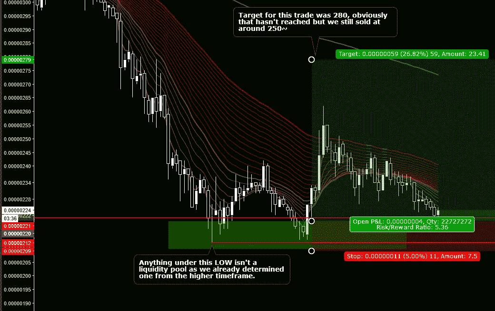
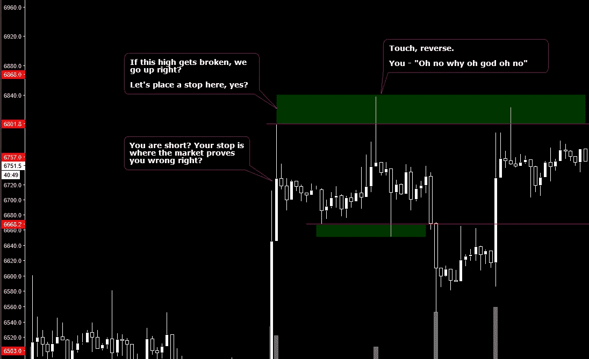
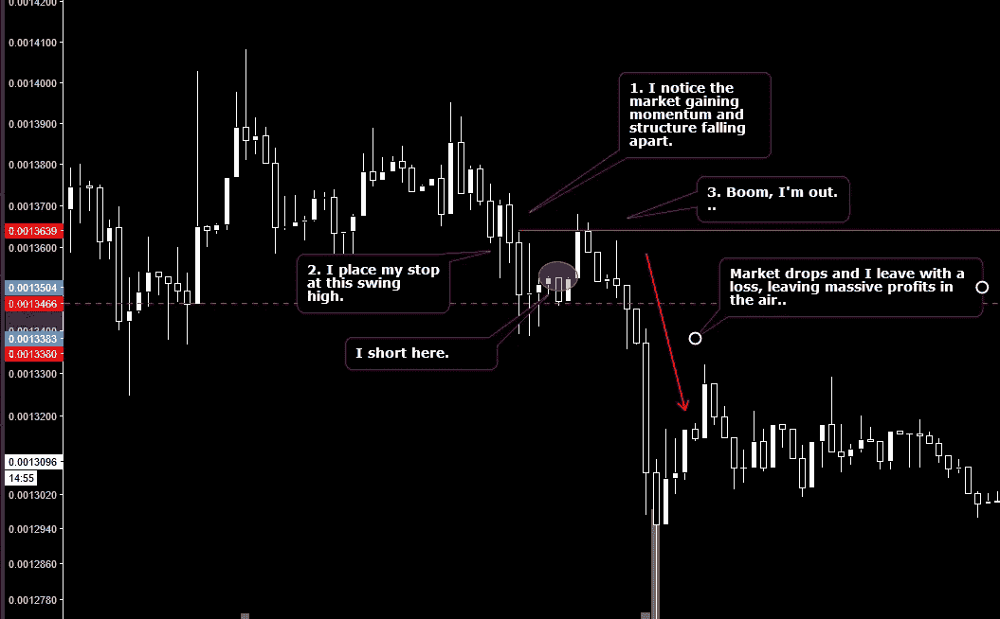
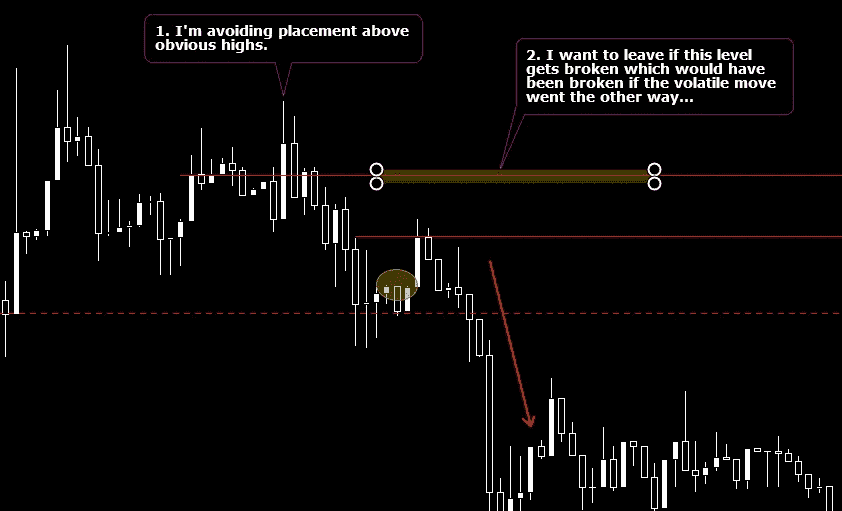
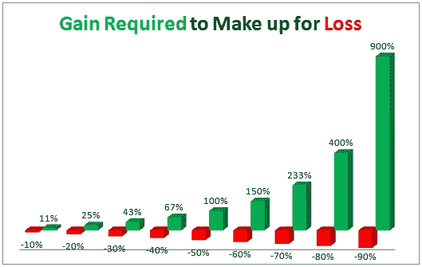
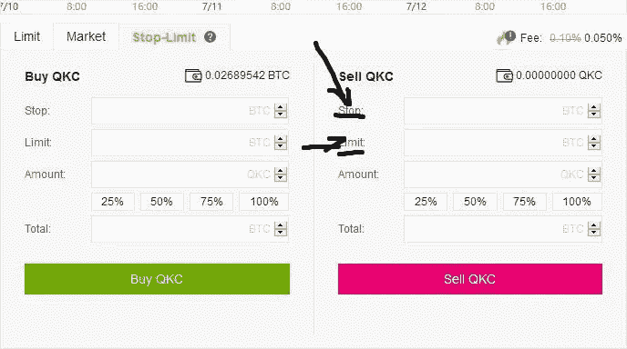

# 设置止损的简单指南

> 原文：<https://medium.com/coinmonks/simple-guide-to-setting-stop-losses-686acda316a6?source=collection_archive---------4----------------------->

怎么了，我的朋友们。
**TraderTyler** 在这里，也被称为在这个神秘的世界里，唯一一个不把两句话写成一篇完整的博士论文的家伙，教你基本的**止损。**

> 让我们得到它。

顾名思义，这种类型的订单是用来防止交易者在交易中损失太多的钱。

对于一个交易者来说,**止损**的要点是一旦市场证明交易者错了就退出交易。

*在你的每一笔交易中严格遵守止损原则，也能防止你在交易失败时成为* ***【霍德勒】*** *。*

*   **关键是你要灵活，不要被困在亏损的交易中。**
*   **快速减少损失，继续前进**

> 如何开始使用止损？

我们将讨论很多例子，但首先让我们看看在绘制交易设置图时，我们在哪里以及如何确定止损点。

Example of a set-up on KEY

Where the stop loss was placed and where the target was.

使用简单的技术分析，我已经确定了我的止损，目标和进场。只有现在我才会去确定我的仓位大小…

> 交易者的止损应该基于技术分析。

对我来说，决定我头寸大小的是我愿意承担的风险。使用以下变量，您可以遵循一个公式。

**位置尺寸**

*   **每笔交易的风险** : *交易者愿意每笔交易损失投资组合的多大比例*
*   **仓位大小** : *一笔资产买入的单位数*
*   **从进场到止损的距离:**不言自明，你甚至可以在图表中看到，就是这条红线。

**位置尺寸公式**

> **(** *总投资组合* **x** *每笔交易的风险* **) /** *从进场到止损的距离*

*Ex。(100 x 0.03) / 0.05 = 60*

> 请注意:一个使用这个公式的交易者现在已经确定他的交易将是他投资组合的 60 美元，这是相当大的一笔交易，但是他已经完全最小化了他的风险，并且当交易者通过了解他的风险和潜在利润而开始交易时，他没有感到焦虑。
> 
> **留给交易者的唯一事情就是执行，让市场替他完成工作。**

你可能已经注意到我指出了明显的流动性池，为什么？
**我们都遇到过以下问题……**

## 我的止损被击中，但市场在填充后反转，这种情况一直发生！

最常见的问题是**止损**以及为什么很多人不使用它们，因为**有可能你的止损点被击中**只是为了让你看到市场**反转**和**反弹**——打你的脸和**离开你。**

A simple liquidity pool, be careful, not every swing high/low is a pool.

为了阅读更多关于流动性池的内容，我在我的文章→ [*中对它们进行了更全面的解释，这是你所能看到的最好的交易指南。*](/@getgoodcrew/best-guide-to-trading-barts-you-will-ever-see-c4fb0db24ff)

寻找出口时，你必须遵循一些原则。

> 止损原则。

*   交易者的止损应该设置在你的交易不再有意义并且被市场证明是错误的水平。你的止损是通过技术分析找到的。
*   固定的止损百分比是不可能的，因为**市场中的每个**时刻都是独特的，这是一个**可怕的**策略。
*   在每笔交易之前，你必须知道你的出场和目标。

> 止损设得太紧。

许多交易者把止损点设得很紧，把目标设得很远，然后看一眼风险/回报，说“哦，伙计，多棒的交易啊。”后来他们的止损被触发，市场在没有他们的情况下继续运行，交易者错过了利润，因为他太害怕进场。

紧止损要么被用于在那个**时刻**押注反转，并希望一旦你被证明稍有错误就退出交易**，要么被用于**非常不稳定的市场**，同样，如果运气不好，你希望尽快离开。**

让我们来看一个我两周前做的交易中严重止损的例子。

VERY bad stop.

我设置止损点的理由/借口是，我预计很快会出现非常不稳定的波动，这就是为什么如果出现错误，我想快速离场。

这是我应该如何放置它..

So I’m placing it ON THE WAY to the obvious swing high.

这个好多了。拿出计算器证实了我的止损位置是好的，因为风险/回报仍然是非常好的 3，相比之下，糟糕的位置使它成为 8R 交易——当然是风险/回报更好的交易，但是如果你的止损位置是古怪的，你的 R 也没关系。

> 结论:

就像交易、制图和早上醒来一样——设置止损非常简单，唯一难的是真正努力去**计划**你的交易，而不是仅仅因为“看起来不错”就进场。

Cut your losers quickly, be grateful you can set a stop-loss.

## 额外小费

Setting a stop on binance.

*永远把你的* ***限价*** *卖出订单略低于你的* ***止损*** *订单，否则市场可能会忽略你而不给你补仓。*

> 来源:

推荐看 **CryptoCred 的**关于该话题的视频，并阅读下面这篇文章:→ [避免](/@cryptocreddy/5-stop-loss-mistakes-to-avoid-bea274857371)的 5 个止损错误

**观看以下视频** → [风险管理—技术分析系列](https://www.youtube.com/watch?v=ofwtsc20hOY)

大声喊出来@**trader Dante**@**trader 1 SZ @ cryptocred**和@**cane OFC**——这些是他们的 twitter 账号，许多有用的帖子，难以置信的分析和这些朋友的精彩帖子。

> 觉得这篇文章有参考价值/有用吗？这只是冰山一角..
> 免费电报频道→[https://t.me/getgoodta](https://t.me/getgoodta)
> 最健康的密码社区→[https://t.me/getgoodchat](https://t.me/getgoodchat)
> 关注我们的推特→[https://twitter.com/GetGoodTA](https://twitter.com/GetGoodTA?lang=en)

你知道你自己可以在这篇文章上留下 50 个掌声吗？请尝试一下，请，请我必须养活我的家人。