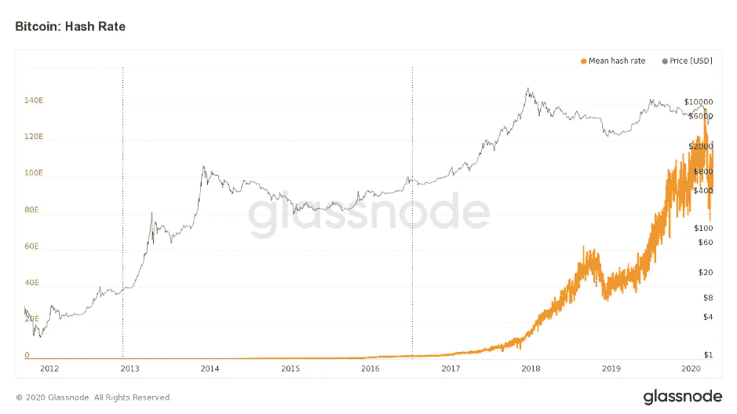
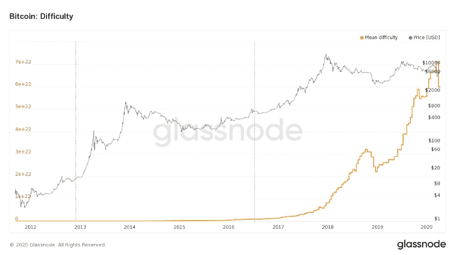
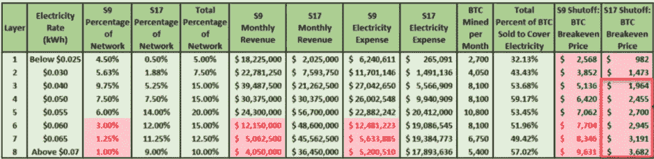
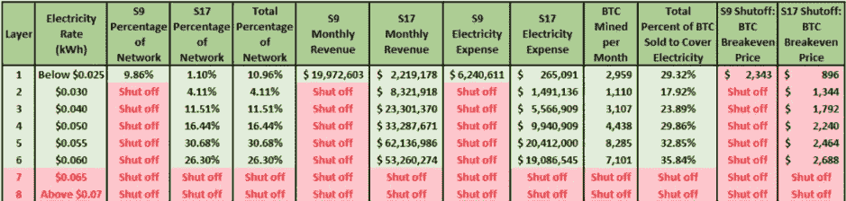

# 简单:采矿和它对减半的影响

> 原文：<https://medium.com/coinmonks/simple-mining-and-the-effect-it-has-on-the-halving-df245d79cb5e?source=collection_archive---------2----------------------->

我们距离比特币减半只有一步之遥，每个人都在猜测价格将走什么路线，等待采矿社区的是什么命运，更具体地说，是矿工将做什么。

这篇文章旨在具体说明减半对采矿领域真正意味着什么。在这里，我们将深入研究比特币采矿生态系统的激励结构，概述矿工盈利与否的所有影响，最后展示减半后可能发生的几个场景。

比特币存在挖矿的原因是出于安全目的。矿工的作用是确保没有非法行为者，并确认网络上发生的交易。

有 **4 个关键因素**影响采矿和矿工的盈利能力:

**散列率:**是衡量比特币网络投入了多少计算能力的指标。
**难度:**找到一个 hash(获得一个比特币方块奖励)有多难
**采矿硬件:**矿工用来采矿的实际机器
**电费:**矿工必须运行他们的采矿机器的电费

[*Source*](https://www.glassnode.com)

如果散列率非常高，这意味着比特币网络非常安全，并且存在大量的采矿力量(许多矿工或许多强大的采矿机器)来确认交易；当然，这对网络来说是一件好事，因为它变得更加安全。然而，比特币网络希望这些区块平均每 10 分钟被开采一次，以保持大约 4 年的持续通胀率，因此第二个因素“难度”开始发挥作用。

[*Source*](https://www.glassnode.com)

难度规定了挖掘者找到一个散列的难度/费力程度，意味着难度越大，实际求解该散列所需的计算能力就越大。(解决杂凑给予矿工区块奖励)

这就引出了第三个因素，采矿硬件。就像零售电脑一样，你的电脑功能有多有少。同样的二分法也存在于采矿机器中，你有更老的机器，如 S9 的，也有更新的机器，如 S17 的，它们产生 300%以上的散列功率。

最后，矿工从事采矿业务，并因其计算能力而获得集体奖励，目前为 12.5 BTC。自然，这些矿工是由利润驱动的，能够计算出产生足够的 BTC 来支付电费；否则商业运作不起作用。
成本包括:采矿机器+运行这些机器的成本(电力成本)
电力成本因此是矿工是否盈利的很大一部分——因此可以在特定的比特币价格下保持他们的机器运行与否。

所以简而言之:矿工加入网络→造块率(哈希率)增加→挖掘时间减少→挖掘难度得到调整→造块难度加大，往下走

并且整个循环重复，并且基于更多的采矿电力加入或离开网络而进行改变。

## **BTC 的价格**

如前所述，为了让矿商盈利，他们的运营成本需要低于 BTC 价格。如果不是，他们就是在亏本开采。

## **那么所有这些与减半有什么关系呢？**

在[比特币减半](https://blog.coincodecap.com/bitcoin-halving-the-public-perception-and-charts-2020/)中，矿工奖励减半，从每块 12.5 BTC 降至 6.25 BTC。这意味着 BTC 价格对矿商来说更加重要。

让我们看两个场景，一个在减半之前，一个在减半之后:

## 减半前价格为 7500 美元的比特币

[*Source*](https://www.blockwaresolutions.com/research-and-publications/2020-halving-analysis)

BTC 的价格是 7500 美元，矿工们为每块 12.5 BTC 而竞争，这意味着他们将得到 93750 美元的奖励。如果矿工使用的是旧机器，电费高于 0.055 美元，他们的成本就超过了利润。他们正在亏本开采。按照这个价格，任何电费低于 0.055 美元的人仍在盈利。现在，如果你看看新的 S17 机器，使用这些机器采矿的人实际上可以获得 0.07 美元的高电价，并且仍然比使用 0.050 美元的旧 S9 机器的人采矿更有利可图。

## 减半后的比特币价格为 7500 美元

[*Source*](https://www.blockwaresolutions.com/research-and-publications/2020-halving-analysis)

另一方面，减半后的整个生态系统看起来非常不同。只有电价极低(低于 0.025 美元)的矿工才能使用旧的 S9 机器盈利。较新的 S17 机器正在以的电价盈利。他们有几个选择:
-获得某种金融信贷或贷款来支付成本，并希望比特币价格升值，这样他们就可以再次盈利。
-开始出售他们的比特币国债(储蓄)以维持运营，希望比特币价格会升值。(当然，这带来了卖出压力)

如果我们考虑到矿工不会亏本开采，也就是说他们会关掉机器，那么杂碎率将会下降，6.25 英镑的 BTC 奖金的竞争也会减少。

明白了这一点后，比特币矿工必须考虑四件事:散列率和难度，或者换句话说，还有多少其他采矿力量存在，以及获得批量奖励的难度，还必须考虑他们使用的是什么机器，以及他们的电价是多少。

现在有趣的竞争部分开始了。考虑到整体奖励减半，盈亏平衡点增加(因为给予的奖励减少，但电价和机器运行价格保持不变)，矿工将如何行动？
他们是通过出售所有的比特币来赌博并涌入市场，还是持有所有的比特币，因为他们意识到，他们今天开采的每个区块给他们的回报与减半后开采两个区块的回报相同？

矿商将会做什么仍然令人感兴趣，然而，我们作为比特币买家和持有者所知道的是，不管怎样，通货膨胀正在发生，如果需求保持不变，因为它是一半，那么我们无疑会在某个时间点看到价格上涨。只有在短期内，我们才能看到巨大的下行波动，将人们和矿工从系统中摇出来。

减半发生在五月中旬的某个时候，让我们看看会发生什么。

[比特币减半倒计时](https://www.bitcoinblockhalf.com/)

*想要更深入吗？想想下面的:*

*-如果矿商的盈亏平衡价格非常低，那么他们通过在市场上抛售比特币来串通压低价格，以便在短期内用旧的昂贵机器淘汰矿商，这有意义吗？*

*   一旦价格减半，只有保本价低的矿商生存下来，他们会持有比特币以减轻抛售压力，并由此造成更大的供应短缺吗？

> [直接在您的收件箱中获得最佳软件交易](https://coincodecap.com/?utm_source=coinmonks)

