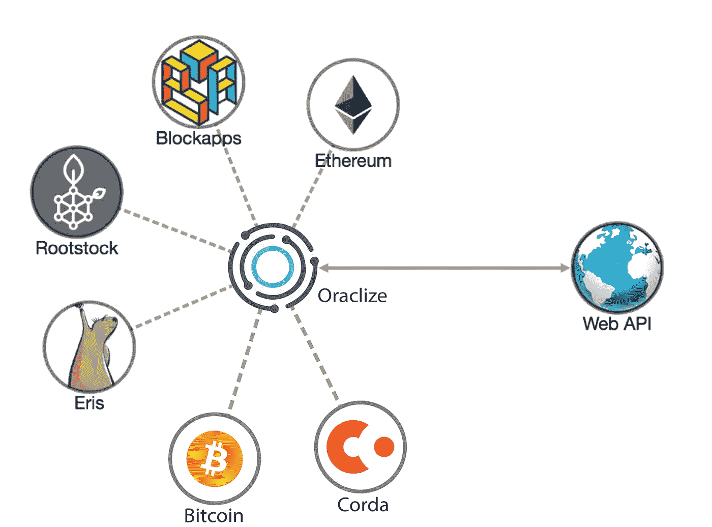
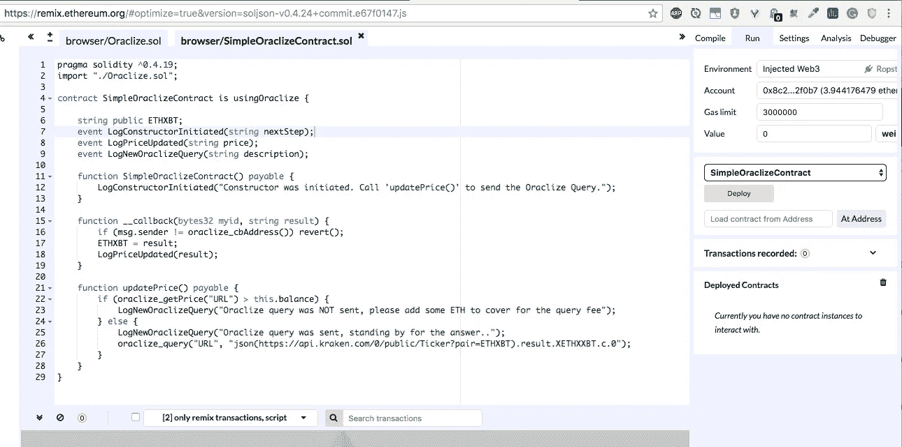
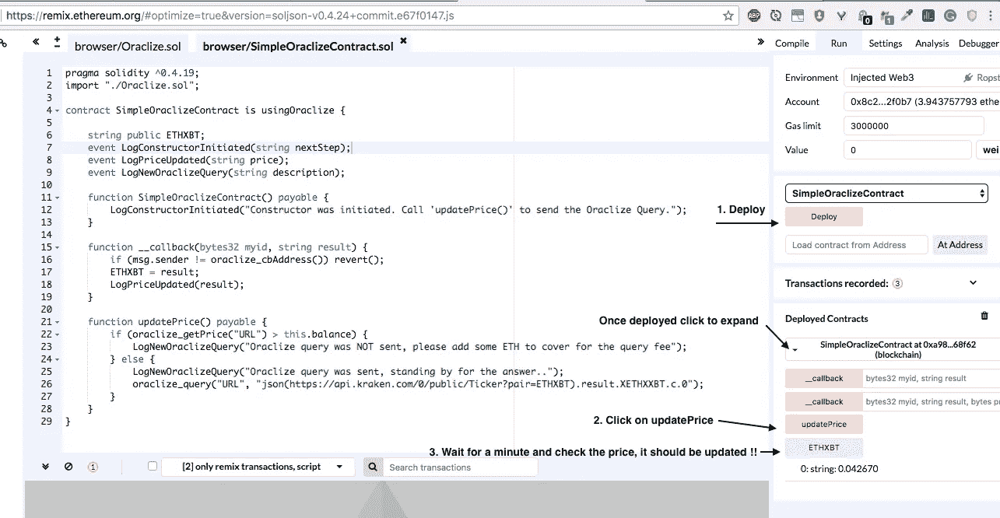

# 具有可靠性的简单组织示例

> 原文：<https://medium.com/coinmonks/simple-oraclize-example-with-solidity-68b6811902da?source=collection_archive---------5----------------------->

我已经和 Solidity smart contracts 一起工作了一段时间。今天我将展示我们如何使用 **Oraclize** 从外部世界获取数据到以太坊智能合约中。这个特性将使我们的智能合约非常动态，并处理许多好的用例。这个故事的重点是让您从一个简单的工作示例开始。

source: blog.oraclize.it

首先，你可能会想为什么我们需要外部世界的数据。嗯，有各种各样的使用案例，其中您需要在您的智能合同外链数据。即

*   如果您的智能合约处理天气状况，请查询天气数据
*   获取股票价格
*   生成安全随机数(因为在链上生成随机数不是很安全)
*   通过 WolframAlpha 做一些复杂的计算
*   等等。

## 例如:ETH/BTC 价格检查器

对于我们的示例，我们将使用 **Oraclize** 从北海巨妖交易所获取最新的一对 ETH/BTC，并将其存储在我们的智能合约中。这是我们的`SimpleOraclizeContract`:

Oraclize 的使用非常简单，我们只需要导入 [Oraclize.sol](https://gist.github.com/bishesh16/34cd6dff58f8d5b2865576a6157996b6) 契约，然后从`usingOraclize`契约继承我们的`SimpleOraclizeContract`契约，可以在这里找到:
https://gist . github . com/bishesh 16/34c D6 dff 58 F8 d5b 2865576 a 6157996 b 6 或
https://github . com/Oraclize/ethereum

只需将上述联系人的内容粘贴到一个新文件中，并将该文件命名为“Oraclize.sol”。

就是这样！！！

## **使用 Metamask 在 Remix IDE 上测试它**

使用 [remix](https://remix.ethereum.org/) IDE 复制上述两个文件，并与 Ropsten、Kovan、Rinkeby testnets 甚至 main-net 上的智能合约进行交互:)

Deploying the contract on Ropsten network. Metamask is required !

检验契约的步骤:
1 .部署合同
2。使用少量以太网调用`updatePrice()`函数，即 0.05 以太网(使用类似 Ropsten 的测试网络)
如果一分钟后之前的交易成功，Oraclize 将调用我们的合同并更新价格对 ETH/XBT
3。查价格 ETHXBT，应该更新了:)

**注意:**为了调用 Oraclize，您需要将一些乙醚转移到您的智能合约，否则它将无法查询 Oraclize ( [在此检查费用](http://docs.oraclize.it/#pricing))。

**参考资料:**
Github 回购:[https://github.com/bishesh16/simple-oraclize-solidity](https://github.com/bishesh16/simple-oraclize-solidity)Oraclize docs:[http://docs.oraclize.it/#home](http://docs.oraclize.it/#home)