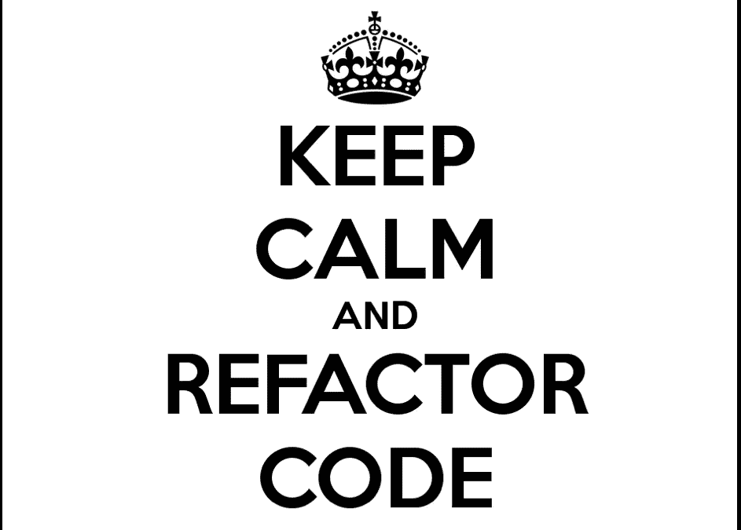

# 简单可靠的重构

> 原文：<https://medium.com/coinmonks/simple-refactoring-with-solidity-f37c1c1208a8?source=collection_archive---------5----------------------->



[Image Source](https://artandlogic.com/2016/09/why-refactor/)

经典的电影台词是“我喜欢早晨重构的味道”，对吗？我就是这么记得的。

我最近在研究一个客户的代码库，虽然我的任务只是确保代码按预期工作，但我不能停下来，而是认为一点点重构将大大有助于使代码更加简洁，运行成本更低，更容易阅读。

下面是一个(非常)干净的初始代码版本。

```
pragma solidity ^0.4.22;contract Voting { address[] public candidates;
  mapping(address => uint) public votesReceived; function Voting(address[] candidateNames) public { *//330717 gas w/ 5 candidates* candidates = candidateNames;
  } function voteForCandidate(address candidate) public { *//21404 gas*
    require(isValidCandidate(candidate));
    votesReceived[candidate] += 1;
  } function totalVotesFor(address candidate) view public returns (uint) {
    require(isValidCandidate(candidate));
    return votesReceived[candidate];
  } function isValidCandidate(address candidate) view public returns (bool) {
    for(uint i = 0; i < candidates.length; i++) {
      if (candidates[i] == candidate) {
        return true;
      }
    }
    return false;
  }
}
```

引起我注意的第一件事是对构造函数使用了现在已被否决的语法。在 Solidity 中，一个契约的构造函数曾经被定义为与契约本身具有完全相同的名称。也就是说，如果契约名为“ *Voting* ”，那么名为“ *Voting* ”的函数将被理解为它的构造函数，这是一个在部署时只运行一次的特殊函数，但名为“ *voting* ”(小型大写字母)的函数将是一个普通的、普遍可访问的函数。这种语法结构是许多代价高昂的错误的来源，因为部署的合同未初始化，敏感的“管理”函数对任何 [*devops199*](https://cryptoshirt.io/products/devops199-quote-i-accidentally-killed-it-tee) 开放… [现在](https://solidity.readthedocs.io/en/latest/contracts.html)我们使用一个名为“构造函数”的函数，这很难被忽略。

接下来是数据结构。存储一个包含所有有效候选地址的数组代价很高。我的意思是，理想的成本是一个效用函数，让合同可以访问数据进行操作，所以在做出判断之前，我们需要看看合同用它做了什么。在这里，它通过使用“ *isValidCandidate* ”函数和“ *require* ”关键字来进行输入清理。呀，那肯定很贵。

编写智能合同更接近于嵌入式设备的开发，而不是 web 开发，因为每一项计算都是通过“gas”机制进行计算和成本估算的。这使得循环和从状态的过度写入和读取是不明智的，因为如果从不同的智能契约调用，即使调用只读的“view”函数也将花费大量的时间，这是好的，因为这样一来，一个糟糕的开发人员将比一个好的开发人员花费更多的时间:-)

我们知道，Solidity 为标识为“public”的数据类型提供了免费的 getter 函数，“ *totalVotesFor* ”和“ *isValidCandidate* ”函数只是通过简单地调用“*candidateAddr”来复制已经可用的功能。选票*和*候选人[_candidateAddr]。isValid* ”分别，所以我决定把它们去掉。

```
pragma solidity ^0.4.25;contract RefactoredVoting { struct CandidateStruct {
        bool isValid;
        uint64 votes;
    }
    mapping(address => CandidateStruct) public candidates; constructor(address[] _candidates) public { *//205108 gas w/ 5 candidates*
        for (uint i = 0; i < _candidates.length; i++) {
            candidates[_candidates[i]].isValid = true;
        }
    } function voteForCandidate(address _candidate) public { *//5910 gas*
        candidates[_candidate].votes += 1;
    }
}
```

用 5 个候选地址运行一个简单的测试表明，在天然气成本方面取得了一些良好的进展。部署现在花费大约 205k 汽油，低于大约 330k，而“voteForCandidate”功能只需要大约 6k 汽油，低于原始代码中的大约 21k。

通过将投票保持为 uint256(以太坊使用 32 字节的字)可以减少部署时的开销，但是投票函数膨胀到大约 20k gas，老实说，我认为没有人会需要超过 9223372036854775807 的投票。:-)

> [在您的收件箱中直接获得最佳软件交易](https://coincodecap.com/?utm_source=coinmonks)

[](https://coincodecap.com/?utm_source=coinmonks)