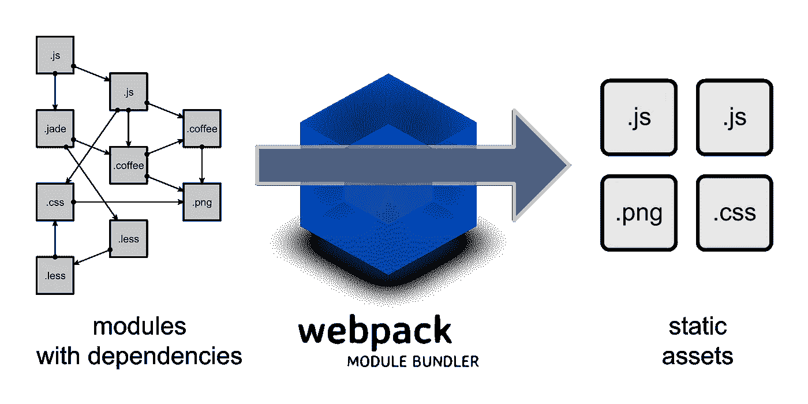
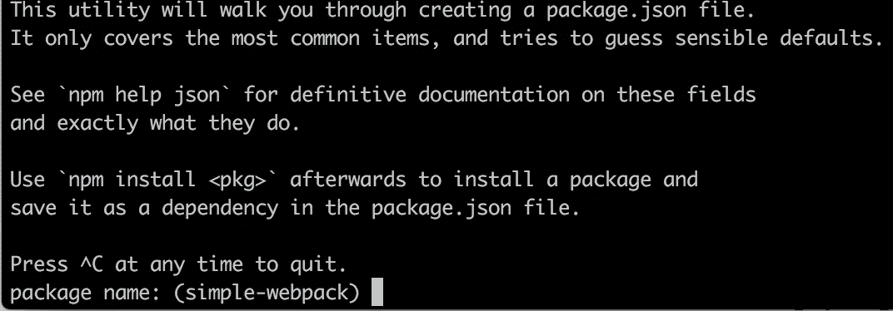
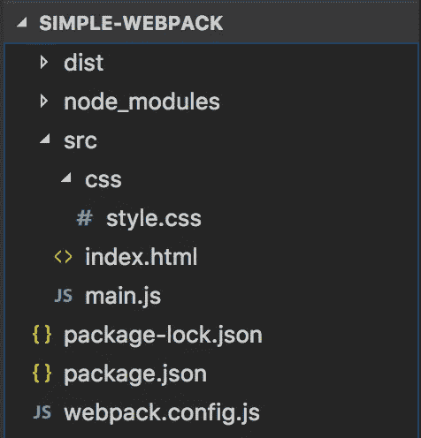
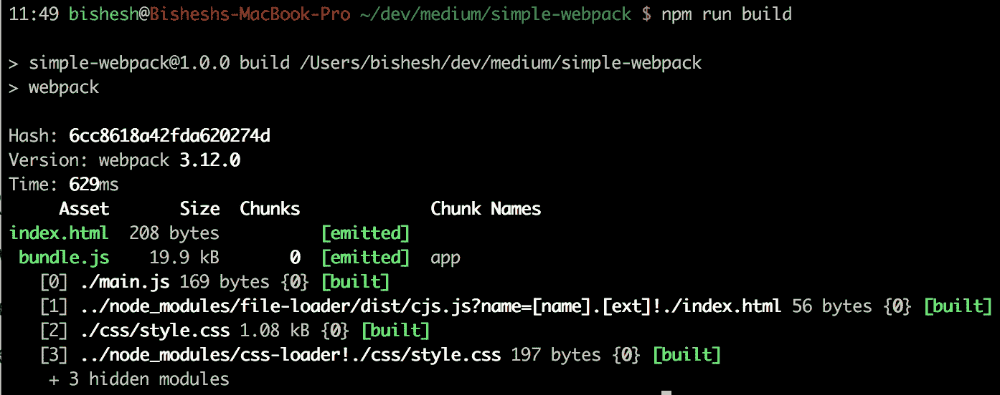
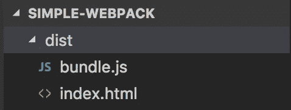
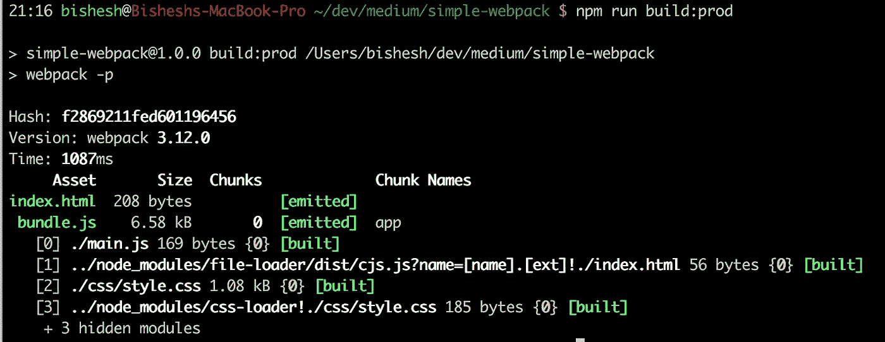
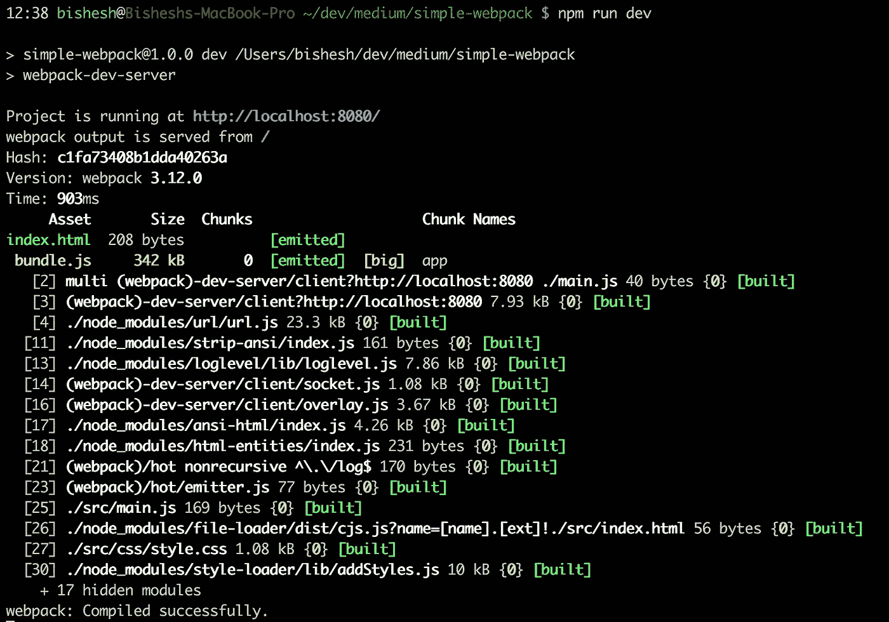
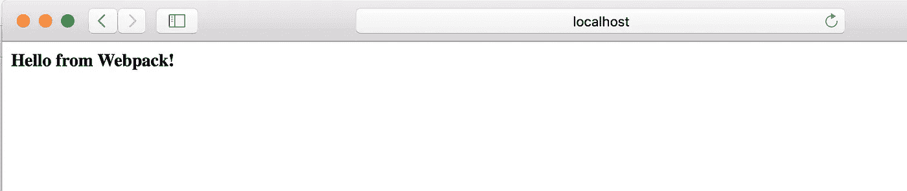
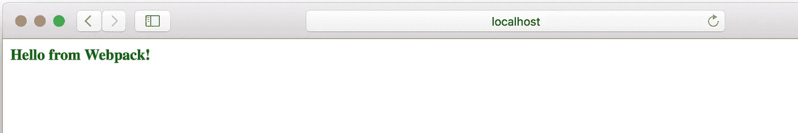
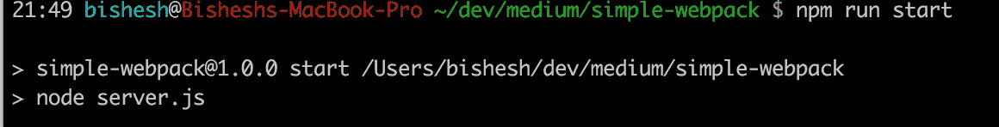

# 简单 webpack 3 教程

> 原文：<https://medium.com/coinmonks/simple-webpack-3-tutorial-3e8c5936681a?source=collection_archive---------1----------------------->

几个月前，我开始使用 webpack，我还记得让它运行起来所经历的痛苦。我从网上不同的教程中收集的信息非常混乱；其中一些已经过时，并给出了奇怪的 npm 错误，其他的正在进入 webpack 的高级功能。正是因为这个原因，我决定为和我有类似问题的人写一个非常简短的 webpack 3 教程来使用 webpack。

**Webpack** 是一个模块捆绑器，它允许你用 JS、HTML & CSS 编写的多个模块创建一个 web 应用程序。webpack 的美妙之处在于它能够将整个应用程序及其依赖项捆绑在少数静态资产(即 HTML/CSS/JS)中。



所以让我们开始吧！我们将从设置项目、配置 webpack 和构建一个简单的 webpack 3 应用程序开始。

## 项目设置

*   创建一个空文件夹并初始化:
    `> mkdir simple-webpack && cd simple-webpack && npm init`



Hit ENTER multiple times to accept the default options.

*   创建`src`和`dist`文件夹:
    和`> mkdir src dist src/css`
*   创建包含 webpack 所有配置的`webpack.config.js`。
    
*   安装`webpack`和`webpack-dev-server` :
    `> npm install -D webpack@3 webpack-dev-server@2`
*   让我们编辑`package.json`文件来添加 webpack 和 webpack-dev-server 命令:

## 配置 webpack

Webpack 附带一个配置文件`webpack.config.js`，其结构如下:

```
var config = {
    **entry**: { ... },
    **output**: { ... },
    module: {
        **rules**: [ ...
        ]
    }
}
```

配置文件主要有三个部分:
- `entry`:定义你的源文件在哪里。
-**-**-`output`:是 webpack 创建捆绑资产的文件夹
- `rules`:包含适用于每种文件类型(即. js、.css，。scss 等)

*   配置条目和输出非常简单，我们只需要指向我们之前创建的源文件夹和输出文件夹。

```
context: __dirname + '**/src**', // base folder for our source files
**entry**: {
  app: './main.js',
},
**output**: {
  path: __dirname + '**/dist**',
  filename: 'bundle.js',
},
```

对于我们的教程，我们需要添加一些基本的装载器。加载器是一种工具，它负责预处理特定类型的文件(JS、CSS、…)并将其转换成 javascript 包。
在我们的示例中，我们将使用 3 种基本装载机:

*   `babel-loader`对于 JS 文件:
    `> npm install -D babel-loader babel-core`
    让我们通过在`webpack.config.js`的`module/rules`部分添加一个规则来配置这个加载器

```
 module: {
  rule: [
    {        
      **test**: /**\.**js$/, // rule for .js files        
      exclude: /node_modules/,        
      **loader**: "babel-loader" // name of the loader   
    }
  ]
}
```

这非常简单，我们只需要提供一个正则表达式来匹配我们想要应用加载器的文件和加载器的名称。

*   `style-loader`和`css-loader`为 CSS 文件:
    `> npm install -D css-loader style-loader`

```
{        
    **test**: /**\.**css$/,        
    **use**: ['style-loader', // order is important !
          'css-loader'] // this is loaded first
}
```

*   `file-loader`加载 HTML 文件:
    

这是我们最后的`webpack.config.js`

## 构建一个简单的应用程序

这就是 webpack 配置，让我们继续创建由 3 个文件组成的基本应用程序:

*   主页. js

The first line is used to load the index.html file, and inject the css file on that file.

*   index.html:

Notice we don’t import css in this file, webpack will include that in the bundle.js

*   css/style.css

```
#hello {
  font-weight: bold;
}
```

所以，如果你已经正确地遵循了，这就是你的文件夹结构应该看起来的样子。



## 构建应用程序

让我们使用 webpack 来构建我们的应用程序。非常简单，我们只需要运行我们之前定义的脚本。

**Webpack 处于开发模式** `> npm run build`这将在开发模式下运行 Webpack，并在`./src`下编译我们的代码，并在`./dist`下构建编译后的资产



继续检查您的`./dist`文件夹，您应该能够找到已编译的资产。



**生产模式中的 web pack** 生产模式应用了一系列优化来使我们的目标文件变得更小，它还混淆了 JS，使编译后的 JS 对其他人来说更难阅读。
`> npm run build:prod`



如果你很好奇，想看看生产模式和开发模式有什么不同，可以随意对比一下`./dist/bundle.js`文件的内容。

> 这很好，但我如何在浏览器中看到我的应用程序？

当然，我们将使用`webpack-dev-server`在浏览器上显示我们的应用程序。

**在浏览器中运行应用** `webpack-dev-server`是一个很好的开发工具，它不仅可以运行 webpack，还可以提供文件，因此我们可以在 web 浏览器中查看应用。它还支持热重新加载，因此我们可以修改任何源文件，webpack 将重新编译，自动捆绑它并刷新页面，而无需我们刷新浏览器。

说够了，让我们看看它的行动。

`> npm run dev`



就这样，应用程序现在可以在网络浏览器上查看了！！在浏览器上输入`http://localhost:8080`。



现在，我们来试试**热重装**功能；按如下方式更改`style.css`并保存文件:

```
#hello {
  font-weight: bold;
  color: green;
}
```



这就对了，网页已经自动刷新，文本的样式也改变了。是不是很酷:)？

## 额外收获:使用 Express server 提供文件服务

如果你和我一样，想在你的本地机器上用 express server 服务编译好的资产，那么继续阅读。Express 是一个非常强大且易于使用的网络服务器。让我们安装它。

`> npm install -D express@4`

*   让我们创建一个`server.js`来从。`/dist`文件夹

最后，让我们使用生产模式构建我们的应用程序，并使用 Express Server 在本地提供服务。

*   `> npm run build:prod`
*   `> npm run start`将在`http://localhost:3000`为应用提供服务



就是这样！现在，您已经有了一个运行在本地机器上的生产级 webpack 应用程序。

正如我提到的，这应该是一个关于 webpack 的非常基础的教程，还有更多的内容要介绍…如果我有时间，我可能会在不久的将来写第二篇文章介绍其他的加载器和插件。

希望你喜欢这篇文章，如果你有任何问题，建议或如果你需要澄清，请随时评论:)

参考资料:

**Github**:[https://github.com/bishesh16/simple-webpack](https://github.com/bishesh16/simple-webpack)