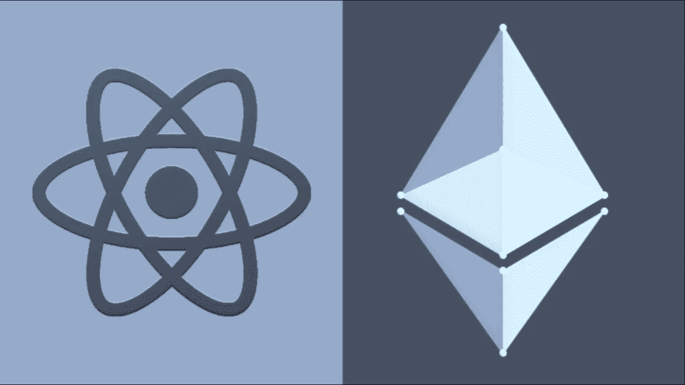
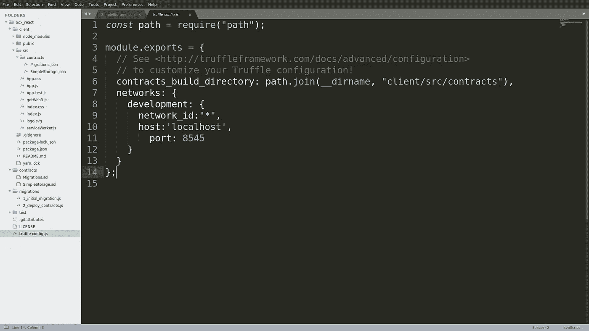
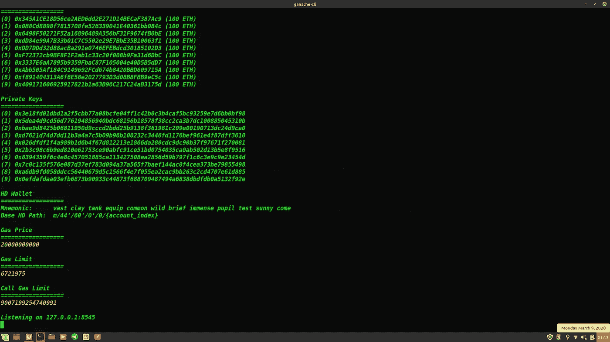
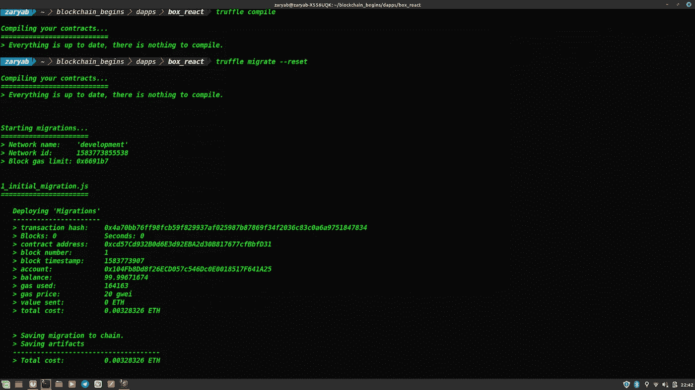
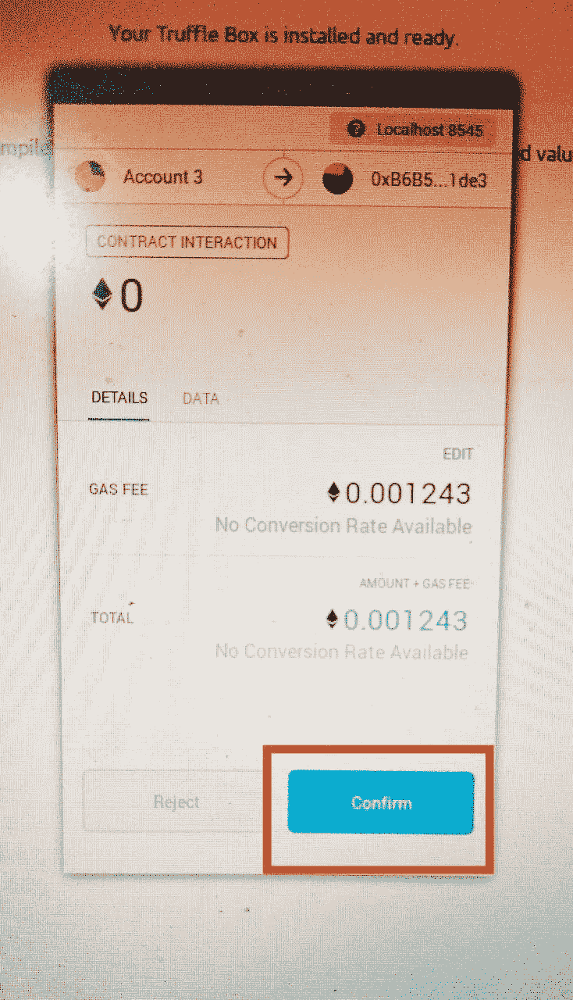
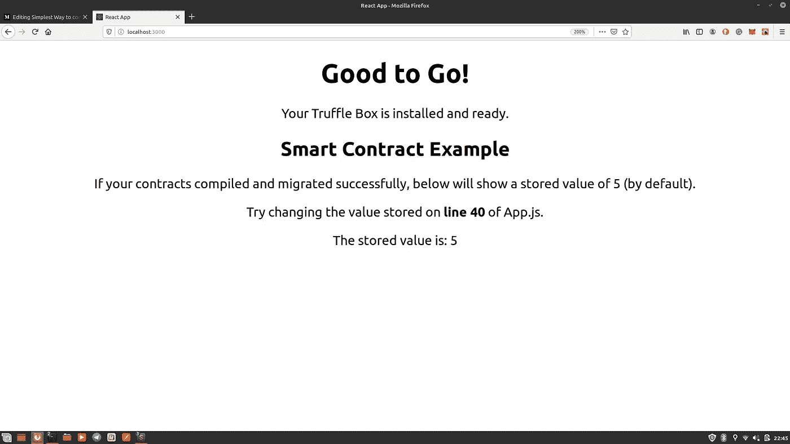

# 用 Web3.js 将智能合约连接到前端(REACT)的最简单方法

> 原文：<https://medium.com/coinmonks/simplest-way-to-connect-your-smart-contracts-to-the-front-end-react-with-web3-js-1e75702ea36a?source=collection_archive---------0----------------------->

所以你已经被基于区块链技术开发去中心化应用程序的整个想法震撼了，你最终学会了大多数 Solidity、Web3 和你在这个旅程中可能需要的大多数必要工具。

然而，在这个过程中存在一个两难的点，它可能会把你的热情打成碎片。 ***那就是通过 Web3 把你的智能合约(Solidity code)连接到用户界面。***

以防万一，你也是那些仍在努力寻找可靠解决方案的初学者之一，那么这无疑是你必读的博客。

***2 命令式组件***

在我们深入实际过程之前，我只想对一个非常重要的细节做一个非常简短的修改。

因为众所周知，Web3 是一个真正帮助我们将智能合同连接到前端的库。然而，为了成功连接到智能合约，Web3 首先还需要两个非常关键的组件。

这两个组成部分是:

> ***应用二进制接口(ABI) :*** 其基本上包含了智能合约中所有的功能、它们的权限以及其他很多细节，以 JSON 格式。
> 
> ***地址:*** 这是您迁移 solidity 代码后生成的智能合约的地址。

现在，请记住这些细节，让我们进一步尝试将智能合约连接到前端的实际流程。

# 先决条件

1.  Ganache CLI :为了让这个过程真正简单，Ganche CLI 确实是最好的入门方式。它基本上可以被视为一个可定制的区块链模拟器，为您提供 10 个免费的以太账户，每个账户携带 100 个以太。

> 安装:`**$npm install -g ganache-cli**`

2. **Metamask 扩展:**这无疑是最迫切的需求，因为它有助于我们在 Firefox 或 Chrome 等普通浏览器中访问支持以太坊的分布式应用(DAPPs)。

> 在这里获取元掩码扩展:[***https://metamask.io/***](https://metamask.io/)

3.这是最好的开发工具，它包括所有必要的文件和环境，你不仅可以部署和开发你的智能合约，还可以测试它。

> 安装:`**$npm install -g truffle**`

# 让我们最终连接起来

现在，考虑到您已经成功安装了所有的先决条件，现在让我们将智能合约连接到前端。

尽管有多种框架可供您选择来开发前端，但是现在，让我们使用 react。

不可否认，考虑到 React 本身的复杂性，从头开始编写所有代码可能会很麻烦。嗯，truffle 在这里支持你，因为它为你提供了一些连接 React 和 Web3 的模板代码。你所要做的就是安装松露的反应盒。

> **安装:***$松露拆箱反应*

**第一步:**

**编辑 Truffle-config.js :** 一旦从 Truffle 中解包 react 组件，第一项工作就是编辑 module.export 部分中的**网络对象**。将 ***主机设置为 localhost*** ，将 ***端口设置为 8545。***

> **为什么这样做？**
> 
> 我们需要把我们的 dapp 和当地的区块链联系起来。在我们的例子中，Ganche CLI 将完成这项工作。最重要的是，Ganache CLI 监听端口 8545，这就是为什么我们在 tuffle.js 中将端口设置为 8545。

第二步:

**启动 Ganache CLI :** 下一步就是运行命令 ***ganache-cli*** 你的终端激活 Ganache。

> **注意** : Ganache CLI 正在监听端口 8545。

**第三步:**

**设置元掩码:**

说实话，这是事情可能变得丑陋的部分。因此，让我们了解一下这一步的基础知识。

Metamask 可以简单地视为一种工具，它可以将普通浏览器(如 Firefox 或 Chrome)转换为可以与区块链对话的浏览器。

开发时，这可以通过提供适当的端口到这个元掩码扩展，并设置它与我们的开发帐户的连接。

为此，您有两个用于开发目的的可靠端口。

> 端口 7545 :-使用 Ganache GUI 时
> 
> 端口 8545 :-使用 Ganche CLI 时

因此，假设您已经在您最喜欢的浏览器上成功地建立了 Metamask 扩展，现在让我们从主要部分开始。

正如你所看到的，默认情况下，这个扩展连接到 ***主以太坊网络，*** 这并不是所有你想用于开发目的的账号(除非你真的很有钱，拥有大量以太)。所以点击下拉菜单，选择 ***Localhost 8545。*** *(因为 Ganache CLI 正在使用端口 8545)。*

一旦设置好端口，现在点击右上角的圆形按钮，选择 ***导入账户*** 选项。

在这里，您将被要求输入您想要使用的帐户的私钥。请记住，Ganche CLI 已经为我们提供了 10 个拥有 100 个免费醚的帐户。那么，从这 10 个账户中选择任意一个私钥，然后粘贴到这里。

好了，现在你已经准备好启动开发流程了，因为你的帐户已经设置好了。

**最后，用 REACT** 启动前端

现在，既然您已经完成了困难的部分，那么是时候开始前端部分了。

遵循以下步骤:

移动到你打开松露反应的目录。

Compiling and Migrating the contract

1.  输入**命令*松露编译。***
2.  然后输入**命令*松露迁移。***

> ***注*** :只要你一迁移你的智能契约，就会因气而扣除少量乙醚。因此，单击浏览器上的 Metamask 扩展，检查是否扣除了一些金额。如果是，您的设置完全正常，您可以开始工作了。

4.转到客户端目录并输入命令 ***npm start。***

5.打开浏览器并转到 localhost:3000。

您可能会看到这样的元掩码弹出窗口。

这只是一个简单的交易，你需要批准，以获得从智能合同到前端部分的价值。只需点击确认按钮。

The FINAL FRONT END

> ***注:*** 你看到那行写着，*存储的值是:5。*此处的值 5 来自智能合约，因此象征着您的前端与您的合约同步。

就是这样。您已经成功地将 React 与您的 Solidity smart contract 和 WEB3 以及 Ganache CLI 集成在一起。

> 加入 Coinmonks [电报频道](https://t.me/coincodecap)和 [Youtube 频道](https://www.youtube.com/c/coinmonks/videos)获取每日[加密新闻](http://coincodecap.com/)

## 另外，阅读

*   [复制交易](/coinmonks/top-10-crypto-copy-trading-platforms-for-beginners-d0c37c7d698c) | [加密税务软件](/coinmonks/crypto-tax-software-ed4b4810e338)
*   [网格交易](https://coincodecap.com/grid-trading) | [加密硬件钱包](/coinmonks/the-best-cryptocurrency-hardware-wallets-of-2020-e28b1c124069)
*   [密码电报信号](/coinmonks/top-3-telegram-channels-for-crypto-traders-in-2021-8385f4411ff4) | [密码交易机器人](/coinmonks/crypto-trading-bot-c2ffce8acb2a)
*   [币安交易机器人](/coinmonks/binance-trading-bots-d0d57bb62c4c) | [OKEx 审查](/coinmonks/okex-review-6b369304110f) | [阿塔尼审查](https://coincodecap.com/atani-review)
*   [最佳加密交易信号电报](/coinmonks/best-crypto-signals-telegram-5785cdbc4b2b) | [MoonXBT 评论](/coinmonks/moonxbt-review-6e4ab26d037)
*   [如何在 Bitbns 上购买柴犬(SHIB)币？](https://coincodecap.com/buy-shiba-bitbns) | [购买 Floki](https://coincodecap.com/buy-floki-inu-token)
*   [CoinFLEX 评论](https://coincodecap.com/coinflex-review) | [AEX 交易所评论](https://coincodecap.com/aex-exchange-review) | [UPbit 评论](https://coincodecap.com/upbit-review)
*   [十大最佳加密货币博客](https://coincodecap.com/best-cryptocurrency-blogs) | [YouHodler 评论](https://coincodecap.com/youhodler-review)
*   [AscendEx 保证金交易](https://coincodecap.com/ascendex-margin-trading) | [Bitfinex 赌注](https://coincodecap.com/bitfinex-staking)
*   [最好的卡达诺钱包](https://coincodecap.com/best-cardano-wallets) | [Bingbon 副本交易](https://coincodecap.com/bingbon-copy-trading)
*   [最佳加密交易所](/coinmonks/crypto-exchange-dd2f9d6f3769) | [印度最佳加密交易所](/coinmonks/bitcoin-exchange-in-india-7f1fe79715c9)
*   [面向开发人员的最佳加密 API](/coinmonks/best-crypto-apis-for-developers-5efe3a597a9f)
*   最佳[密码借贷平台](/coinmonks/top-5-crypto-lending-platforms-in-2020-that-you-need-to-know-a1b675cec3fa)
*   [免费加密信号](/coinmonks/free-crypto-signals-48b25e61a8da) | [加密交易机器人](/coinmonks/crypto-trading-bot-c2ffce8acb2a)
*   [杠杆代币](/coinmonks/leveraged-token-3f5257808b22)终极指南