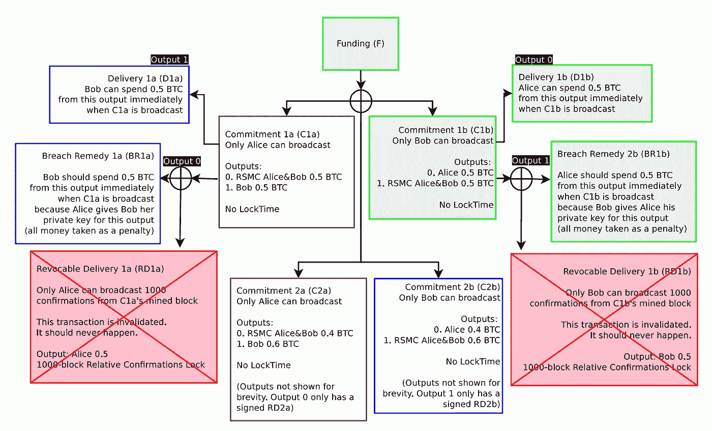

# 比特币闪电网络简化代码第二部分——消费违约补救

> 原文：<https://medium.com/coinmonks/simplified-code-of-bitcoin-lightning-network-part2-spend-breach-remedy-997de8a21f29?source=collection_archive---------9----------------------->

雷电网络的基本概念很简单。为了进一步理解，参考[白皮书](https://lightning.network/lightning-network-paper.pdf)，将 lightning 网络交易流程表示为 javascript 代码。

这是第二篇解释闪电网络流程的文章。这一次，我将解释如何采取违约补救措施，这与白皮书中的图 9 相对应。

Github 上的代码:[闪电网 tx 流](https://github.com/tak1827/lightning-network-tx-flow/tree/spend-BR)

前置:[比特币闪电网简码——消费可撤销交割](/@t.tak/simplified-code-of-bitcoin-lightning-network-spend-revocable-delivery-90e50f0256d5)

下一篇:[比特币闪电网络简化代码第三部分——消费 HTLC 执行可撤销交割](/@t.tak/simplified-code-of-bitcoin-lightning-network-part3-spend-htlc-execution-revocable-delivery-49991e3cfe34)



## 采取违约补救措施的 10 个步骤

由于重复的解释，我跳过了第 4 步。所以想了解请参考[之前的博文](/@t.tak/simplified-code-of-bitcoin-lightning-network-spend-revocable-delivery-90e50f0256d5)。

1.  *多签名资助*
2.  *建立 C1a 和 C1b(无标志)*
3.  *构建 RD1a 和 RD1b*
4.  *C1a 和 C1b 交换签名*
5.  *建立 C2a 和 C2b(无标志)*
6.  建造 RD2a 和 RD2b
7.  *C2a 和 C2b 的交换签名*
8.  *建造 BR1a 和 BR1b*
9.  *花 C1b*
10.  *花 BR1b*

## *5。构建 C2a 和 C2b(无标志)*

结构与 C1a 相同。请注意，2 个输入也与 C1a 相同，因为 C1a 在这一刻还没有花费。该交易更新了 Alice 和 Bob 之间比特币余额。对于比特币 Mainnet 来说，只有最终输出才是重要的。如果爱丽丝花了 C2a，比特币主网无法感知 C1a 的存在。

```
let C2a = new Transaction(
  [
    new TxIn( // This is same as C1a
      fTxAH, 
      0, 
      { 
        type: 'MULTI',
        sig: [ 
          redeemScript.pubKeyHashs[0], 
          redeemScript.pubKeyHashs[1] 
        ],
        redeemScript
      }
    ),
    new TxIn( // This is same as C1a
      fTxBH, 
      0, 
      { 
        type: 'MULTI',
        sig: [ 
          redeemScript.pubKeyHashs[0], 
          redeemScript.pubKeyHashs[1] 
        ],
        redeemScript
      }
    )
  ],
  [
    new TxOut(
      40000000, 
      { 
        type: 'RSMS',
        pubKeyHash: [ 
          getPubKeyHash(AliceKeys[4]), 
          getPubKeyHash(BobKeys[4]) 
        ]
      }
    ),
    new TxOut(
      60000000, 
      { 
        type: 'NORMAL',
        pubKeyHash: getPubKeyHash(BobKeys[4])
      }
    )
  ]
)
```

## *6。构建 RD2a 和 RD2b*

RD2a 和 RD2b 的建造过程与 RD1a 和 RD1b 几乎相同。所以让我跳过。请参考[上一篇博文](/@t.tak/simplified-code-of-bitcoin-lightning-network-spend-revocable-delivery-90e50f0256d5)中的 RD1a 和 RD2b 构建部分。

## *7。C2a 和 C2b 的交换签名*

和 C1a 部分一样，Alice 把 C2a 交给 Bob，让他签字。现在爱丽丝和鲍勃可以花 C2a 和 C2b 了。如果爱丽丝意外地花掉了 C1a，她会失去所有 BTC，所以爱丽丝可以安全地取消 C1a。

```
// Alice hand over C2a to Bob, and let him sign
C2a = signTx(C2a, BobKeys[1]);
```

同样的，鲍勃让爱丽丝签了 C2b。

## *8。构建 BR1a 和 BR1b*

爱丽丝建造 BR1a 并签名，然后将 BR1a 交给鲍勃。请注意，BR1a 的输出是给 Bob 的。本来，这个输出就是属于爱丽丝的。

如果 Alice 不与 Bob 合作并且她花费 C1a，即使 C2a 和 C2b 已经交换了，Alice 因为她的违约而失去所有 BTC。

```
let BR1a = new Transaction(
  [
    new TxIn(
      '', // Keep empty because C1a have not yet spent
      0, 
      { 
        type: 'BR',
        sig: [ 
          getPubKeyHash(AliceKeys[2]), 
          getPubKeyHash(BobKeys[2]) 
        ],
      }
    )
  ],
  [
    new TxOut(
      50000000, 
      { 
        type: 'NORMAL',
        pubKeyHash: getPubKeyHash(BobKeys[3]) // For Bob
      }
    )
  ]
)// Alice hand over signed BR1a to Bob. This output is for Bob
BR1a = signTx(BR1a, AliceKeys[2]);
```

Json 格式 BR scriptSig 如下。

```
scriptSig = { 
  type: 'BR',
  sig: [ 
    {
     signature: signature, 
     pubKey: pubKey1 
    },
    {
     signature: signature, 
     pubKey: pubKey2
    }
  ],
}
```

同样，鲍勃把烧焦的 BR1b 交给爱丽丝。

## *9。花费 C1b*

Bob 意外花了 C1b。不幸的是，他永远失去了整个 BTC。

```
// Sign by himself(Bob)
C1b = signTx(C1b, BobKeys[1]);// Validate transaction
validateTx(C1b, Blocks);// Mine block as adding transactions
Blocks = mineBlock(Blocks, createNewBlock([C1b], Blocks));
```

## 10.花费 10 亿英镑

爱丽丝可以立刻花掉 BR1b，没有任何时间锁定。请注意，如果时间锁过期，Bob 可以使用 RD1b。所以，爱丽丝早点花 BR1b 比较好。

```
// Set C1b transaction hash
BR1b.txIns[0].txPrev = calculateTxHash(C1b);// Inherently, this BTC is for Bob, but now belong to Alice.
// Bob lose for his breach.
BR1b = signTx(BR1b, AliceKeys[2]);validateTx(BR1b, Blocks);Blocks.push( createNewBlock([BR1a], Blocks) );
```

> [在您的收件箱中直接获得最佳软件交易](https://coincodecap.com/?utm_source=coinmonks)

[](https://coincodecap.com/?utm_source=coinmonks)