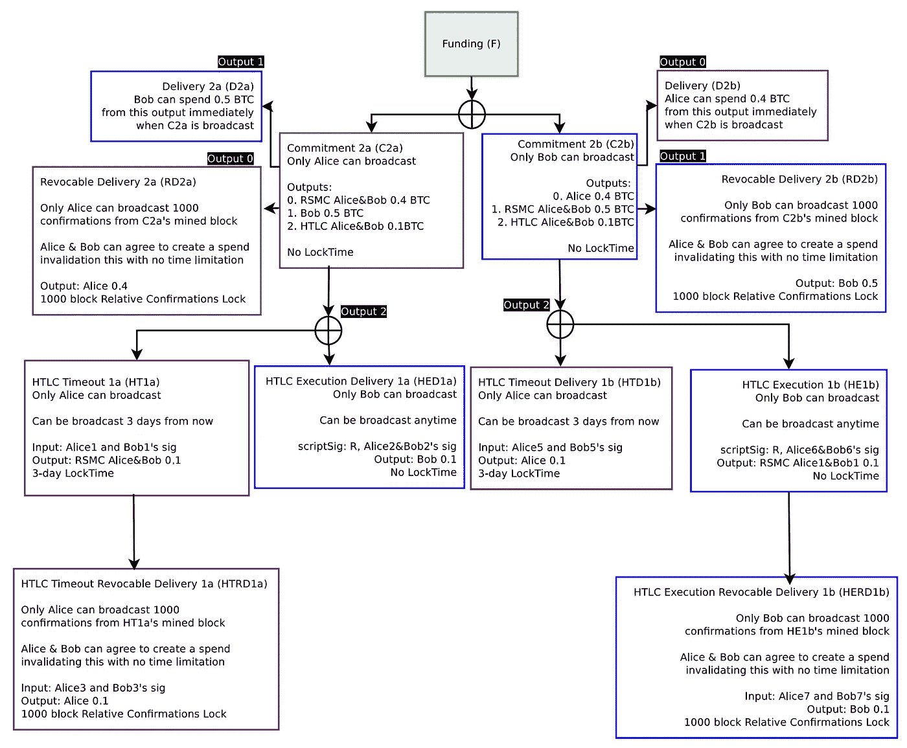

# 比特币闪电网络简化代码第三部分——消费 HTLC 执行可撤销交付

> 原文：<https://medium.com/coinmonks/simplified-code-of-bitcoin-lightning-network-part3-spend-htlc-execution-revocable-delivery-49991e3cfe34?source=collection_archive---------6----------------------->

雷电网络的基本概念很简单。为了进一步理解，参考[白皮书](https://lightning.network/lightning-network-paper.pdf)，将 lightning 网络交易流程表示为 javascript 代码。

如果我在一篇博文中解释所有的交易流程，会很难读懂。所以我分成几篇博文。这篇博客文章的目标是花 HTLC 执行可撤销交付，这是相应的白皮书图 12。

Github 上的代码:[闪电网 tx 流](https://github.com/tak1827/lightning-network-tx-flow/tree/spend-HERD)

前置:[比特币闪电网络简化代码第二部分——消费违约补救](/@t.tak/simplified-code-of-bitcoin-lightning-network-part2-spend-breach-remedy-997de8a21f29)

下一篇:[比特币闪电网络简化代码第四部分——花 HTLC 违约补救](/@t.tak/simplified-code-of-bitcoin-lightning-network-part4-spend-htlc-breach-remedy-61ebc5587fc4)



## 花费 HTLC 执行可撤销交付的 14 个步骤

由于重复的解释，我跳过了第 4 步。所以想了解请参考[之前的博文](/@t.tak/simplified-code-of-bitcoin-lightning-network-spend-revocable-delivery-90e50f0256d5)。

1.  *多签名资助*
2.  *建立 C1a 和 C1b(无标志)*
3.  *构建 RD1a 和 RD1b*
4.  *C1a 和 C1b 交换签名*
5.  *建立 C2a 和 C2b(无标志)*
6.  建造 RD2a 和 RD2b
7.  *构建 HTD1b*
8.  *建造 HE1b*
9.  *打造 HERD1b*
10.  *C2a 和 C2b 的交换签名*
11.  *建造 BR1a 和 BR1b*
12.  *花 C2b*
13.  *花合 1b*
14.  *花掉 HERD1b*

## 5.建立 C2a 和 C2b(无标志)

首先，爱丽丝创建了前像 R，还创建了相应散列 H。只有当鲍勃知道前像 R 时，爱丽丝才想要向鲍勃支付 0.1 BTC。对于鲍勃，当 H 由爱丽丝提供时，他应该回答 R 以接收 0.1 BTC。此时，Alice 使用私钥作为 R，公钥作为 h。

```
// Use private key as preimage R
const preimageR = generatePrivateKey();// Preimage H is public key
const preimageH = getPubKey(preimageR);let C2a = new Transaction(
  [
    new TxIn( // This is same as C1a
      fTxAH, 
      0, 
      { 
        type: 'MULTI',
        sig: [ 
          redeemScript.pubKeyHashs[0], 
          redeemScript.pubKeyHashs[1] 
        ],
        redeemScript
      }
    ),
    new TxIn( // This is same as C1a
      fTxBH, 
      0, 
      { 
        type: 'MULTI',
        sig: [ 
          redeemScript.pubKeyHashs[0], 
          redeemScript.pubKeyHashs[1] 
        ],
        redeemScript
      }
    )
  ],
  [
    new TxOut(
      40000000, 
      { 
        type: 'RSMS',
        pubKeyHash: [ 
          getPubKeyHash(AliceKeys[4]), 
          getPubKeyHash(BobKeys[4]) 
        ]
      }
    ),
    new TxOut(
      50000000, 
      { 
        type: 'NORMAL',
        pubKeyHash: getPubKeyHash(BobKeys[4])
      }
    ),
    new TxOut(
      10000000, 
      { 
        type: 'HTLC',
        pubKeyHash: [
          getPubKeyHash(AliceKeys[4]),
          getPubKeyHash(BobKeys[4])
        ],
        preimageH // Alice provide H, Bob need to know R
      }
    )
  ]
)
```

Json 格式 scriptPubKey 如下。

```
scriptPubKey = { 
  type: 'HTLC',
  pubKeyHash: [
    pubKeyHash1,
    pubKeyHash2
  ],
  preimageH: preimageH
}
```

用同样的方法，鲍勃建立 C2b。

## 6.构建 RD2a 和 RD2b

跳过重复解释。请参考[上一篇](/@t.tak/simplified-code-of-bitcoin-lightning-network-spend-revocable-delivery-90e50f0256d5)中的“*构建 RD1a 和 RD1b* ”部分。

## 7.构建 HTD1b

如果 Bob 不能回答 R，只有 Alice 可以广播该交易以在 3 个确认时间锁定之后退还 0.1 BTC。对于 Bob，最好回答 R，直到该时间锁定到期。

```
let HTD1b = new Transaction(
  [
    new TxIn(
      '', 
      2, 
      { 
        type: 'HTLCT',
        sig: [ 
          getPubKeyHash(AliceKeys[4]), 
          getPubKeyHash(BobKeys[4])
        ],
        sequence: 3
      }
    )
  ],
  [
    new TxOut(
      10000000, 
      { 
        type: 'NORMAL',
        pubKeyHash: getPubKeyHash(AliceKeys[5])
      }
    )
  ]
)// Alice hand over HTD1b to Bob and let him sign
HTD1b = signTx(HTD1b, BobKeys[4]);
```

Json 格式 scriptSig 如下。

```
scriptSig = { 
  type: 'HTLCT',
  sig: [ 
    {
     signature: signature, 
     pubKey: pubKey1 
    },
    {
     signature: signature, 
     pubKey: pubKey2
    }
  ],
  sequence: 3
}
```

请注意，HT1a 与 HTD1b 略有不同，因此请参考 [Gitbub](https://github.com/tak1827/lightning-network-tx-flow/tree/spend-HERD) 。

## 8.构建 HE1b

鲍勃可以在任何时候广播这个交易，只要他知道 r。不幸的是，他没有从这个交易中获得 0.1 BTC。

```
let HE1b = new Transaction(
  [
    new TxIn(
      '', 
      2, 
      { 
        type: 'HTLCE',
        sig: [ 
          getPubKeyHash(AliceKeys[4]), 
          getPubKeyHash(BobKeys[4])
        ],
        preimageR // Bob answer required R
      }
    )
  ],
  [
    new TxOut(
      10000000, 
      { 
        type: 'RSMS',
        pubKeyHash: [ 
          getPubKeyHash(AliceKeys[5]), 
          getPubKeyHash(BobKeys[5]) 
        ]
      }
    )
  ]
)// Bob hand over HE1b to Alice and let her sign
HE1b = signTx(HE1b, AliceKeys[4]);
```

Json 格式 scriptSig 如下。

```
scriptSig = { 
  type: 'HTLCE',
  sig: [ 
    {
      signature: signature, 
      pubKey: pubKey1 
    },
    {
      signature: signature, 
      pubKey: pubKey2
    }
  ],
  preimageR: preimageR  
}
```

请注意 HED1a 与 HE1b 略有不同，因此请参考 [Gitbub](https://github.com/tak1827/lightning-network-tx-flow/tree/spend-HERD) 。

## 9.构建 HERD1b

Bob 只能在 10 个确认时间锁定后广播该事务。最后，鲍勃从这笔交易中得到 0.1 BTC。

```
let HERD1b = new Transaction(
  [
    new TxIn(
      '', 
      0, 
      { 
        type: 'RD',
        sig: [ 
          getPubKeyHash(AliceKeys[5]), 
          getPubKeyHash(BobKeys[5])
        ],
        sequence: 10 // 10 block confirmation time lock
      }
    )
  ],
  [
    new TxOut(
      10000000, 
      { 
        type: 'NORMAL',
        pubKeyHash: getPubKeyHash(BobKeys[6])
      }
    )
  ]
)// Bob hand over HERD1b to Alice and let her sign
HERD1b = signTx(HERD1b, AliceKeys[5]);
```

请注意，HTRD1a 与 HERD1b 略有不同，因此请参考 [Gitbub](https://github.com/tak1827/lightning-network-tx-flow/tree/spend-HERD) 。

## 10.C2a 和 C2b 的交换签名

爱丽丝让鲍勃签 C2a。现在，爱丽丝可以随时广播这个交易。

```
// Alice hand over C2a to Bob, and let him sign
C2a = signTx(C2a, BobKeys[1]);
```

同样的，鲍勃让爱丽丝签了 C2b。

## 11.建造 BR1a 和 BR1b

跳过重复解释。请参考[上一篇](/@t.tak/simplified-code-of-bitcoin-lightning-network-part2-spend-breach-remedy-997de8a21f29)中的“*构建 BR1a 和 BR1b* 部分。

## 12.消费 C2b

鲍勃消费 C2b。即使他知道 R，他也不能立即接收到 Alice 的 0.1 BTC，因为时间锁定在她的 D1b 上。

但是，如果爱丽丝花 C2a，鲍勃只要知道 r 就可以立即收到。

```
// Sign by himself(Bob)
C2b = signTx(C2b, BobKeys[1]);// Validate transaction
validateTx(C2b, Blocks);// Mine block as adding transactions
Blocks = mineBlock(Blocks, createNewBlock([C2b], Blocks));
```

## 13.花费 HTD1b

鲍勃用这笔交易来回答 r

```
// Set C2b transaction hash
HE1b.txIns[0].txPrev = calculateTxHash(C2b);HE1b = signTx(HE1b, BobKeys[4]);validateTx(HE1b, Blocks);Blocks.push( createNewBlock([HE1b], Blocks) );
```

## 14.花掉她 1b

鲍勃花这笔交易获得 0.1 BTC 后，10 个时间锁定。

```
// Set HE1b transaction hash
HERD1b.txIns[0].txPrev = calculateTxHash(HE1b);HERD1b = signTx(HERD1b, BobKeys[5]);// Wait 10 confirmations for time lock
Blocks = mineBlock(Blocks, createNewBlock([], Blocks));
Blocks = mineBlock(Blocks, createNewBlock([], Blocks));
Blocks = mineBlock(Blocks, createNewBlock([], Blocks));
Blocks = mineBlock(Blocks, createNewBlock([], Blocks));
Blocks = mineBlock(Blocks, createNewBlock([], Blocks));
Blocks = mineBlock(Blocks, createNewBlock([], Blocks));
Blocks = mineBlock(Blocks, createNewBlock([], Blocks));
Blocks = mineBlock(Blocks, createNewBlock([], Blocks));
Blocks = mineBlock(Blocks, createNewBlock([], Blocks));
Blocks = mineBlock(Blocks, createNewBlock([], Blocks));validateTx(HERD1b, Blocks);Blocks.push( createNewBlock([HERD1b], Blocks) );
```