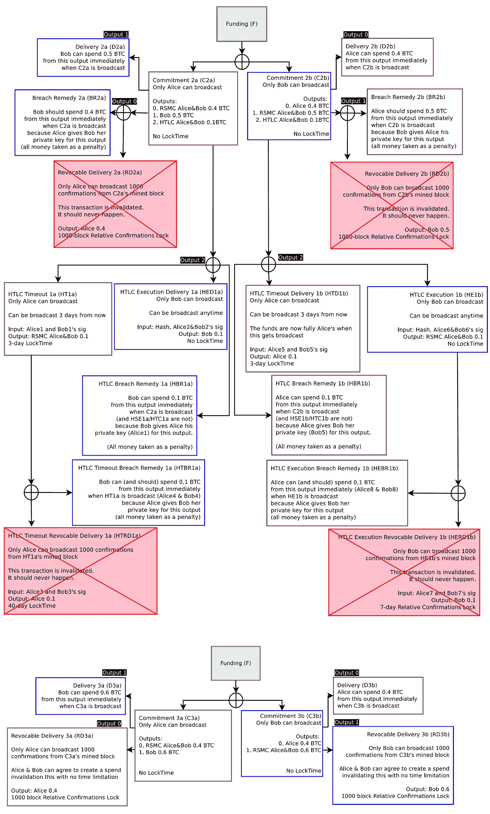

# 比特币闪电网络的简化代码第四部分——消费 HTLC 违约补救

> 原文：<https://medium.com/coinmonks/simplified-code-of-bitcoin-lightning-network-part4-spend-htlc-breach-remedy-61ebc5587fc4?source=collection_archive---------7----------------------->

雷电网络的基本概念很简单。为了进一步理解，参考[白皮书](https://lightning.network/lightning-network-paper.pdf)，将 lightning 网络交易流程表示为 javascript 代码。

如果我在一篇博文中解释所有的交易流程，会很难读懂。所以我分成几篇博文。这是最后一个帖子。

这篇博文的目标是花费 HTLC 违约补救措施，这对应于白皮书的图 13 + 14。

Github 上的代码:[闪电网 tx 流](https://github.com/tak1827/lightning-network-tx-flow/tree/spend-HBR)

前置:[比特币闪电网络简化代码 part 3——花 HTLC 执行可撤销交割](/coinmonks/simplified-code-of-bitcoin-lightning-network-part3-spend-htlc-execution-revocable-delivery-49991e3cfe34)



## 花费 HTLC 违约补救的 19 个步骤

由于重复的解释，我跳过了第 11 步。所以想了解请参考[之前的博文](/coinmonks/simplified-code-of-bitcoin-lightning-network-part3-spend-htlc-execution-revocable-delivery-49991e3cfe34)。

1.  *多签名资助*
2.  *构建 C1a 和 C1b(无标志)*
3.  *构建 RD1a 和 RD1b*
4.  *C1a 和 C1b 交换签名*
5.  *建立 C2a 和 C2b(无标志)*
6.  *构建 RD2a 和 RD2b*
7.  *打造 HTD1b*
8.  *建造 HE1b*
9.  *打造 HERD1b*
10.  *C2a 和 C2b 的交换签名*
11.  *建造 BR1a 和 BR1b*
12.  *构建 C3a 和 C3b(无标志)*
13.  *构建 RD3a 和 RD3b*
14.  *交换 C3a 和 C3b 的签名*
15.  *公开私钥*
16.  *花 C2b*
17.  *建造和花费 D2b*
18.  *建造和花费 BR2b*
19.  *建造和花费 HBR1b*

## *12。构建 C3a 和 C3b(无标志)*

现在，Alice 和 Bob 想要关闭 HTLC，以便构建 C3a 和 C3b 来更新 Lightning 网络状态。请注意产量平衡。鲍勃比爱丽丝多收到 0.1 BTC。这一次，爱丽丝不要求鲍勃回答前像 r。

```
let C3a = new Transaction(
  [
    new TxIn(
      fTxAH, 
      0, 
      { 
        type: 'MULTI',
        sig: [ 
          redeemScript.pubKeyHashs[0], 
          redeemScript.pubKeyHashs[1] 
        ],
        redeemScript
      }
    ),
    new TxIn(
      fTxBH,
      0, 
      { 
        type: 'MULTI',
        sig: [ 
          redeemScript.pubKeyHashs[0], 
          redeemScript.pubKeyHashs[1] 
        ],
        redeemScript
      }
    )
  ],
  [
    new TxOut(
      40000000, 
      { 
        type: 'RSMS',
        pubKeyHash: [ 
          getPubKeyHash(AliceKeys[7]), 
          getPubKeyHash(BobKeys[7]) 
        ]
      }
    ),
    new TxOut(
      60000000, // Bob receive 0.1 BTC more than Alice
      { 
        type: 'NORMAL',
        pubKeyHash: getPubKeyHash(BobKeys[7])
      }
    )
  ]
)
```

## *13。构建 RD3a 和 RD3b*

跳过重复解释。请参考[上一篇](/@t.tak/simplified-code-of-bitcoin-lightning-network-spend-revocable-delivery-90e50f0256d5)中的“*构建 RD1a 和 RD1b* ”部分。

## *14。C3a 和 C3b 的交换签名*

爱丽丝让鲍勃签 C3a。现在，爱丽丝可以随时广播这个交易。

```
// Alice hand over C3a to Bob, and let him sign
C3a = signTx(C2a, BobKeys[1]);
```

同样的，鲍勃让爱丽丝签了 C3b。

## 15.公开私钥

Alice 和 Bob 分别公开了他们的私钥来撤销 C2a 和 C2b 输出。如果爱丽丝意外广播了 C2a，她会丢失所有 BTC，因此爱丽丝可以安全地撤销 C2a。

起初，爱丽丝透露了`AliceKeys[4]`。使用这把钥匙，鲍勃可以自己建造并花费 BR2a 和 HBR1a 来获得爱丽丝的 BTC。

其次，爱丽丝披露`AliceKey[5]`。使用这个密钥，Bob 可以自己构建 HEBR1a。

同样，鲍勃向爱丽丝透露了`BobKey[4]`和`BobKey[5]`。

## 16.消费 C2b

鲍勃出人意料地播出了 C2b。不幸的是，由于他的违约，他失去了整个 BTC。

```
// Sign by himself(Bob)
C2b = signTx(C2b, BobKeys[1]);validateTx(C2b, Blocks);// Mine block as adding transactions
Blocks = mineBlock(Blocks, createNewBlock([C2b], Blocks));
```

## 17.构建和花费 D2b

爱丽丝花 D2b 女巫输出本来是属于爱丽丝的。

```
const hashC2b = calculateTxHash(C2b);let D2b = new Transaction(
  [
    new TxIn(
      hashC2b, 
      0, 
      { 
        type: 'SINGLE',
        sig: [ 
          getPubKeyHash(AliceKeys[4]) 
        ],
      }
    )
  ],
  [
    new TxOut(
      40000000, 
      { 
        type: 'NORMAL',
        pubKeyHash: getPubKeyHash(AliceKeys[8])
      }
    )
  ]
)D2b = signTx(D2b, AliceKeys[4]);validateTx(D2b, Blocks);Blocks = mineBlock(Blocks, createNewBlock([D2b], Blocks));
```

## 18.构建和花费 BR2b

Alice 可以使用公开的 Bob 的私钥签署 BR2b。她立即收到了鲍勃 BTC 奖。

```
const c2bHash = calculateTxHash(C2b);let BR2b = new Transaction(
  [
    new TxIn(
      c2bHash,
      1, 
      { 
        type: 'BR',
        sig: [ 
          getPubKeyHash(AliceKeys[4]), 
          getPubKeyHash(BobKeys[4]) 
        ],
      }
    )
  ],
  [
    new TxOut(
      40000000, 
      { 
        type: 'NORMAL',
        pubKeyHash: getPubKeyHash(AliceKeys[8]) // For Alice
      }
    )
  ]
)// Alice can sign, because she know Bob's private key.
BR2b = signTx(BR2b, BobKeys[4]);// Inherently, this BTC is for Bob, but now belong to Alice.
// Bob lose for his breach.
BR2b = signTx(BR2b, AliceKeys[4]);validateTx(BR2b, Blocks);Blocks.push( createNewBlock([BR2b], Blocks) );
```

## 19.构建和花费 HBR1b

同样，Alice 可以使用公开的 Bob 的私钥签署 HBR1b。她立即收到了鲍勃 BTC 奖。

```
let HBR1b = new Transaction(
  [
    new TxIn(
      c2bHash,
      2, 
      { 
        type: 'BR',
        sig: [ 
          getPubKeyHash(AliceKeys[4]), 
          getPubKeyHash(BobKeys[4]) 
        ],
      }
    )
  ],
  [
    new TxOut(
      10000000, 
      { 
        type: 'NORMAL',
        pubKeyHash: getPubKeyHash(AliceKeys[8]) // For Alice
      }
    )
  ]
)// Alice can sign, because she know Bob's private key.
HBR1b = signTx(HBR1b, BobKeys[4]);// Inherently, this BTC is for Bob, but now belong to Alice.
// Bob lose for his breach.
HBR1b = signTx(HBR1b, AliceKeys[4]);validateTx(HBR1b, Blocks);Blocks.push( createNewBlock([HBR1b], Blocks) );
```