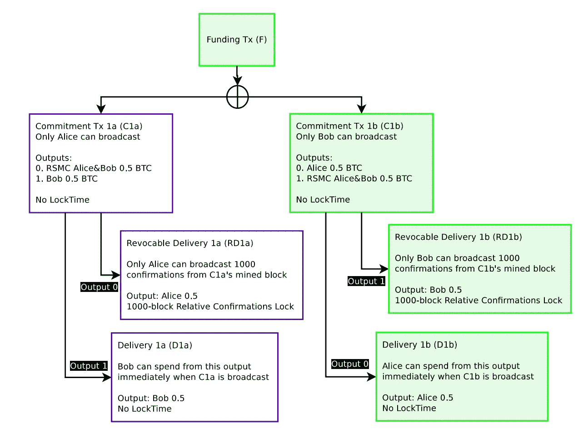

# 比特币闪电网的简化代码——消费可撤销交付

> 原文：<https://medium.com/coinmonks/simplified-code-of-bitcoin-lightning-network-spend-revocable-delivery-90e50f0256d5?source=collection_archive---------6----------------------->

雷电网络的基本概念很简单。为了进一步理解，参考[白皮书](https://lightning.network/lightning-network-paper.pdf)，将 lightning 网络交易流程表示为 javascript 代码。

如果我在一篇博文中解释所有的交易流程，会很难读懂。所以我分成几篇博文。这篇博文的目标是花费可撤销的交付，这对应于白皮书的图 5。

Github 上的代码:[闪电网 tx 流](https://github.com/tak1827/lightning-network-tx-flow/tree/spend-RD)

下一篇:[比特币闪电网络简化代码之二——消费违约补救](/@t.tak/simplified-code-of-bitcoin-lightning-network-part2-spend-breach-remedy-997de8a21f29)



## 简化的块和交易结构

真实的比特币很复杂，所以我尽量简化了。定义的块和事务结构如下。

```
class Block {
  constructor(hashPrev, txs) {
    this.hashPrev = hashPrev;
    this.txs = txs;
  }
}class Transaction {
  constructor(txIns, txOuts) {
    this.txIns = txIns;
    this.txOuts = txOuts;
  }
}class TxIn {
  constructor(txPrev, index, scriptSig) {
    this.txPrev = txPrev;
    this.index = index;
    this.scriptSig = scriptSig;
  }
}class TxOut {
  constructor(value, scriptPubKey) {
    this.value = value;
    this.scriptPubKey = scriptPubKey;
  }
}
```

块只包含以前散列和事务。同样，交易只包含输入和输出。

## 花费可撤销交付的 6 个步骤

我把可撤销交付的所有过程分为如下 6 个步骤。请注意，C1a 或 C1b 等写在上面的图像。

1.  *多签名资助*
2.  *建立 C1a 和 C1b(无标志)*
3.  *构建 RD1a 和 RD1b*
4.  *C1a 和 C1b 交换签名*
5.  *花 C1b*
6.  *花掉 D1b*
7.  *花掉 RD1b*

## 1.*多方签名资助*

首先，Alice 和 Bob 创建了 2to2 多重签名。这是不准确的，只是简化了一个。请参考[我之前的博文](/@t.tak/understand-how-bitcoin-multi-signature-work-by-javascript-18ed10f35941)进一步了解。

```
const redeemScript = { 
  n: 2, 
  m: 2, 
  pubKeyHashs: [ 
    getPubKeyHash(AliceKeys[1]), // Alice pubKeyHash
    getPubKeyHash(BobKeys[1]) // Bob pubKeyHash
  ]
}const redeemScriptHash = CryptoJS.RIPEMD160(CryptoJS.SHA256(
  JSON.stringify(redeemScript)
)).toString();
```

爱丽丝基金比特币到这个‘救赎脚本哈希’(这就像一个地址)。

爱丽丝和鲍勃已经分别存入 0.5 比特币作为创世纪区块。于是，爱丽丝把这 0.5 个比特币用来资助 mulisig。

```
// Create blockchain
let Blocks = [genesis];const gTxH = calculateTxHash(Blocks[0].txs[0]);// Create unsingned transaction
let fundingTxAlice = new Transaction(
  [
    new TxIn(
      gTxH,
      0, 
      { 
        type: 'SINGLE', 
        sig: getPubKeyHash(AliceKeys[0]) // Place pubKeyHash for signing instead.
      }
    )
  ],
  [
    new TxOut(
      50000000, 
      { 
        type: 'NORMAL', 
        pubKeyHash: redeemScriptHash 
      }
    )
  ]
);// Sign transaction by Alice wallet
fundingTxAlice = signTx(fundingTxAlice, AliceKeys[0]);// Create new Block as adding transactions
const newBlock = createNewBlock(
  [fundingTxAlice, fundingTxBob], 
  Blocks
)// Mine block 
Blocks = mineBlock(Blocks, newBlock);
```

我不能运行比特币的操作码，所以我将 scriptSig 和 scriptPubKey 定义为 json 格式。

```
scriptSig = { 
  type: 'SINGLE', 
  sig: {
   signature: signature,
   pubKey: pubKey
  }
}scriptPubKey = { 
  type: 'NORMAL', 
  pubKeyHash: pubKeyHash
}
```

以同样的方式，鲍勃为 multisig 提供资金，因此 multisig 现在持有 1 个比特币

## *2。建造 C1a 和 C1b(无标志)*

使用 Alice 和 Bob 之前创建的两个事务，Alice 构建 C1a。请注意，C1a 开关类型的第一个输出是“RSMS”。确切的名称是可撤销序列到期合同。这需要 2 个签名才能消费。由此，可撤销交付将被创建。另一个输出是通常的输出。

这时，鲍勃不签字了。如果 Bob 签字，Alice 可以立即花费这笔交易。在爱丽丝是恶意的且爱丽丝不签 RD1a 的情况下，鲍勃永远失去 0.5 个比特币，这样鲍勃就不应该签。

```
const fTxAH = calculateTxHash(fundingTxAlice);
const fTxBH = calculateTxHash(fundingTxBob);let C1a = new Transaction(
  [
    new TxIn(
      fTxAH, 
      0, 
      { 
        type: 'MULTI',
        sig: [ 
          redeemScript.pubKeyHashs[0], 
          redeemScript.pubKeyHashs[1] 
        ],
        redeemScript
      }
    ),
    new TxIn(
      fTxBH,
      0, 
      { 
        type: 'MULTI',
        sig: [ 
          redeemScript.pubKeyHashs[0], 
          redeemScript.pubKeyHashs[1] 
        ],
        redeemScript
      }
    )
  ],
  [
    new TxOut(
      50000000, 
      { 
        type: 'RSMS',
        pubKeyHash: [ 
          getPubKeyHash(AliceKeys[2]), 
          getPubKeyHash(BobKeys[2]) 
        ]
      }
    ),
    new TxOut(
      50000000, 
      { 
        type: 'NORMAL',
        pubKeyHash: getPubKeyHash(BobKeys[2])
      }
    )
  ]
)
```

Json formate scriptSig 和 scriptPubKey 如下。请注意，我将赎回脚本包含在 scriptSig 中，以使用 multisig 基金。

```
scriptSig =  { 
  type: 'MULTI',
  sig: [ 
     {
      signature: signature,
      pubKey: pubKey1 
     },
     {
      signature: signature,
      pubKey: pubKey2
     }     
  ],
  redeemScript: redeemScript
}scriptPubKey = { 
  type: 'RSMS',
  pubKeyHash: [ 
    pubKeyHash1,
    pubKeyHash2,
  ]
}
```

用同样的方法，Bob 构建 C1b。

## *3。建造 RD1a 和 RD1b*

RD1a 有时间锁定。如果爱丽丝花了 C1a，爱丽丝不能收到 0.5 比特币，直到时间锁定期结束。我将时间锁定指定为 3，这样 Alice 需要等待 3 个块确认。另一方面鲍勃可以立即收到 0.5 个比特币，因为 D1a 没有时间锁。

顺便说一下，时间锁在实际用例中可能是 1000。

请不要忘记 TxIn 中的前一笔交易是空的。因为 C1a 还没有消费，所以不可能计算交易散列。为了实现这一点，lightning 开发团队倡导新的操作码为`SIGHASH_NOINPUT`

请不要忘记 RD1a 是由鲍勃签署的。Alice 需要将 RD1a 交给 Bob 并让他签字，这样 RD1a 就需要 Bob 签字才能消费。

```
let RD1a = new Transaction(
  [
    new TxIn(
      '', // Keep empty because C1a have not yet spent
      0, 
      { 
        type: 'RD',
        sig: [ 
          getPubKeyHash(AliceKeys[2]), 
          getPubKeyHash(BobKeys[2]) 
        ],
        sequence: 3
      }
    ),
  ],
  [
    new TxOut(
      50000000, 
      { 
        type: 'NORMAL',
        pubKeyHash: getPubKeyHash(AliceKeys[3])
      }
    )
  ]
);// Hand over RD1a to Bob and let him sign
RD1a = signTx(RD1a, BobKeys[2]);
```

Json formate RD scriptSig 如下。这包含时间锁定。

```
scriptSig = { 
  type: 'RD',
  sig: [ 
    {
    signature: signature,
    pubKey: pubKey1 
   },
   {
    signature: signature,
    pubKey: pubKey2
   }
  ],
  sequence: 3
}
```

用同样的方法，Bob 构建 RD1b。

## 4.C1a 和 C1b 的交换签名

Alice 收到 Bob 签名的 RD1a，因此是时候交换 C1a 的签名了。爱丽丝把 C1a 交给鲍勃，让他签字。现在，爱丽丝可以随时消费 C1a。

```
C1a = signTx(C1a, BobKeys[1]);
```

同样的，鲍勃让爱丽丝签 C1b。

## 5.花费 C1b

让我们来考虑一下 Bob spend C1b 的案例。鲍勃自己签 C1b。验证后，Bob 转移 C1b 并添加到区块链。

```
// Sign by himself(Bob)
C1b = signTx(C1b, BobKeys[1]);// Validate transaction
validateTx(C1b, Blocks);// Mine block as adding transactions
Blocks = mineBlock(Blocks, createNewBlock([C1b], Blocks));
```

## 6.花费 D1b

爱丽丝可以在没有任何时间锁定的情况下花费 D1b，因为 multisig 资助的比特币被鲍勃作为 C1b 交易花费。如果 Bob 是恶意的，不与 Alice 合作，Bob 可能会在没有 Alice 同意的情况下消费 C1b。在这种情况下，鲍勃承担时间锁。

```
const hashC1b = calculateTxHash(C1b);let D1b = new Transaction(
  [
    new TxIn(
      hashC1b, 
      0, 
      { 
        type: 'SINGLE',
        sig: [ getPubKeyHash(AliceKeys[2]) ],
      }
    )
  ],
  [
    new TxOut(
      50000000, 
      { 
        type: 'NORMAL',
        pubKeyHash: getPubKeyHash(AliceKeys[3])
      }
    )
  ]
)D1b = signTx(D1b, AliceKeys[2]);validateTx(D1b, Blocks);Blocks = mineBlock(Blocks, createNewBlock([D1b], Blocks));
```

## 7.花费 10 亿元人民币

起初，Bob 试图立即花掉 RD1b。但结果是失败的，因为时间锁定。

```
// Set previous transaction hash to txIn
RD1b.txIns[0].txPrev = calculateTxHash(C1b);RD1b = signTx(RD1b, BobKeys[2]);validateTx(RD1b, Blocks); // => Fail, because of block time lock
```

添加 2 块后，Bob 可以成功使用 RD1b，因为时间锁已经过期。

```
// Set previous transaction hash to txIn
RD1b.txIns[0].txPrev = calculateTxHash(C1b);RD1b = signTx(RD1b, BobKeys[2]);// Add 2 blocks for time lock
Blocks = mineBlock(Blocks, createNewBlock([], Blocks));
Blocks = mineBlock(Blocks, createNewBlock([], Blocks));validateTx(RD1b, Blocks); // => Success, because time lock expireBlocks = mineBlock(Blocks, createNewBlock([RD1b], Blocks));
```

> [在您的收件箱中直接获得最佳软件交易](https://coincodecap.com/?utm_source=coinmonks)

[](https://coincodecap.com/?utm_source=coinmonks)