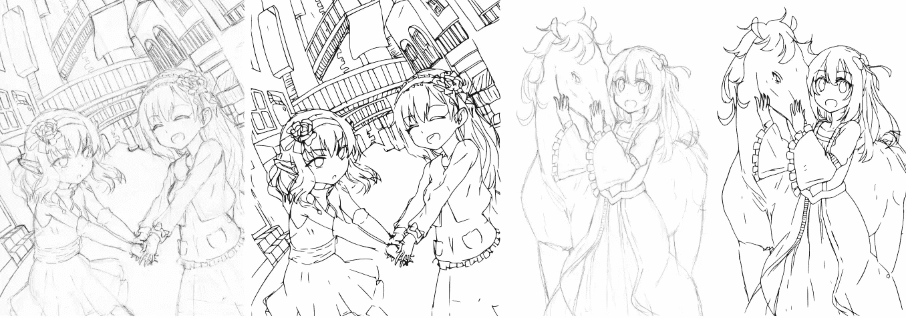
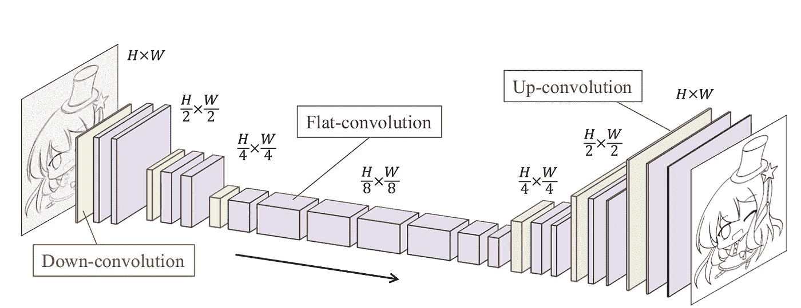
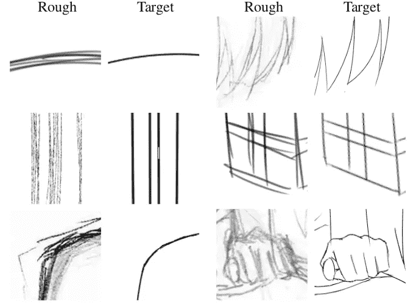
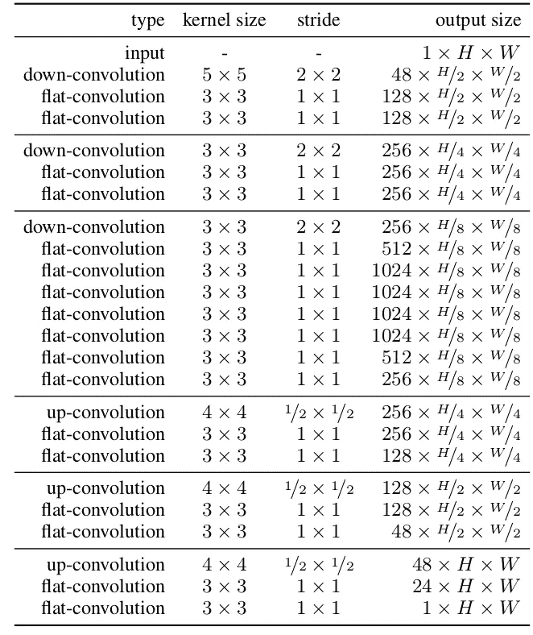
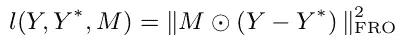
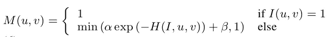
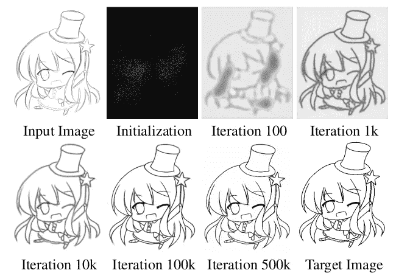

# 使用深度学习简化草图

> 原文：<https://medium.com/coinmonks/simplifying-rough-sketches-using-deep-learning-c404459622b9?source=collection_archive---------1----------------------->

> 草图是表达艺术想法的基本第一步，也是设计改进迭代过程的开始。它允许艺术家在纸上快速呈现他们的想法。当务之急是快速表达概念和想法，而不是展示精细的细节，这会导致粗略的草图。在最初的草图之后，
> 反馈被用来反复完善设计，直到最后的作品
> 被制作出来。这种反复的细化迫使艺术家们不得不不断地将他们的草图整理成简化的图纸，因此意味着额外的工作量。正如
> 所料，手动
> 描摹草图以生成清晰图纸的过程相当繁琐耗时。

因此，如果有一种方法可以从我们的草图中立即得到清晰的草图，不管它有什么样的笔画，那不是更好吗？很迷人，不是吗？在这篇文章中，我将讨论一种深度学习技术，它使用完全卷积网络从粗糙的草图中生成干净的草图。



left : rough sketches right: clean sketch generated source: Original Paper, link in the footnotes.

嗯，并不是说更早的时候没有任何软件可以做到这一点，是有，但问题是他们以前只能处理**矢量图像**而不能处理**光栅图像。**让我们从什么是矢量和光栅图像开始！

## **矢量和光栅图像？**

**光栅图像，**也称为**位图，**由单独的颜色像素组成。每个彩色像素对整个图像都有贡献。

光栅图像可以比作点画，点画是由一系列单独着色的颜料点组成的。点彩绘画中的每个绘画点可能代表光栅图像中的一个像素。当看做一个单独的点时，它只是一种颜色；但是从整体来看，这些彩色的点组成了一幅生动而细致的画。光栅图像中的像素以相同的方式工作，这提供了丰富的细节和逐像素编辑。


left: full picture(without zoom) right: on zooming the individual pixels can be seen

与光栅图形不同，光栅图形由排列显示图像的彩色像素组成，**矢量图形由路径**组成，每个路径都有一个数学公式(矢量)来告诉路径它是如何成形的，以及它的边框或填充颜色是什么。

由于数学公式规定了图像的渲染方式，因此无论大小如何，矢量图像都会保持其外观。它们可以无限缩放。


the difference between vector and raster on scaling up

## 模型架构



Model architecture source: original paper

这个模型最好的部分是，它可以处理光栅图像，并将多条粗略的草图线转换成一条清晰的线。



multiple lines to clean single line

这种结构的另一个优点是，任何维数的图像都可以输入到网络中，并且输出与输入图像维数相同的图像。

该架构相当简单，**第一部分充当编码器并对图像进行空间压缩，第二部分处理并提取图像中的基本线条，第三部分即最后一部分充当解码器，将更简单的小表示转换为与输入分辨率相同的灰度图像**。这都是使用卷积完成的。

下卷积和上卷积架构看起来类似于简单的滤波器组
。然而，重要的是要认识到，在分辨率较低的处，通道的
**数量要大得多，例如，尺寸为 1/8 的
1024。**这确保引导
清理线路的信息通过低分辨率部分**传送；网络
被训练来选择由编码器-
解码器架构携带哪些信息。**

填充用于补偿内核大小，并确保使用步长 1 时输出与输入的大小相同。合并层被具有更大跨度的卷积层取代，以降低来自前一层的分辨率。

```
**# The input dimensions can be replaced with the dimensions of the image.****class** **Net**(torch.nn.Module):
    **def** __init__(self):
        super(Net, self).__init__()
        self.downconv1 = torch.nn.Sequential(
            torch.nn.Conv2d(1, 48, 5, 2, 2),
            torch.nn.BatchNorm2d(48),
            torch.nn.ReLU(),

            torch.nn.Conv2d(48, 128, 3, 1, 1),
            torch.nn.BatchNorm2d(128),
            torch.nn.ReLU(),

            torch.nn.Conv2d(128, 128, 3, 1, 1),
            torch.nn.BatchNorm2d(128),
            torch.nn.ReLU(),
        )
        self.downconv2 = torch.nn.Sequential(
            torch.nn.Conv2d(128,256, 3, 2, 1),
            torch.nn.BatchNorm2d(256),
            torch.nn.ReLU(),

            torch.nn.Conv2d(256, 256, 3, 1, 1),
            torch.nn.BatchNorm2d(256),
            torch.nn.ReLU(),

            torch.nn.Conv2d(256, 256, 3, 1, 1),
            torch.nn.BatchNorm2d(256),
            torch.nn.ReLU(),
        )
        self.downconv3 = torch.nn.Sequential(
            torch.nn.Conv2d(256, 256, 3, 2, 1),
            torch.nn.BatchNorm2d(256),
            torch.nn.ReLU(),

            torch.nn.Conv2d(256, 512, 3, 1, 1),
            torch.nn.BatchNorm2d(512),
            torch.nn.ReLU(),

            torch.nn.Conv2d(512, 1024, 3, 1, 1),
            torch.nn.BatchNorm2d(1024),
            torch.nn.ReLU(),
        )
        self.flat = torch.nn.Sequential(
            torch.nn.Conv2d(1024, 1024, 3, 1, 1),
            torch.nn.BatchNorm2d(1024),
            torch.nn.ReLU(),

            torch.nn.Conv2d(1024, 1024, 3, 1, 1),
            torch.nn.BatchNorm2d(1024),
            torch.nn.ReLU(),

            torch.nn.Conv2d(1024, 1024, 3, 1, 1),
            torch.nn.BatchNorm2d(1024),
            torch.nn.ReLU(),

            torch.nn.Conv2d(1024, 512, 3, 1, 1),
            torch.nn.BatchNorm2d(512),
            torch.nn.ReLU(),

            torch.nn.Conv2d(512, 256, 3, 1, 1),
            torch.nn.BatchNorm2d(256),
            torch.nn.ReLU(),
        )

        self.upconv1 = torch.nn.Sequential(
*#             torch.nn.Conv2d(256, 256, 4, 0.5, 1),*
            torch.nn.ConvTranspose2d(256, 256, 4, 2, 1),
            torch.nn.BatchNorm2d(256),
            torch.nn.ReLU(),

            torch.nn.Conv2d(256, 256, 3, 1, 1),
            torch.nn.BatchNorm2d(256),
            torch.nn.ReLU(),

            torch.nn.Conv2d(256, 128, 3, 1, 1),
            torch.nn.BatchNorm2d(128),
            torch.nn.ReLU(),
        )
        self.upconv2 = torch.nn.Sequential(
*#             torch.nn.Conv2d(128, 128, 4, 0.5, 1),*
            torch.nn.ConvTranspose2d(128, 128, 4, 2, 1),            
            torch.nn.BatchNorm2d(128),
            torch.nn.ReLU(),

            torch.nn.Conv2d(128, 128, 3, 1, 1),
            torch.nn.BatchNorm2d(128),
            torch.nn.ReLU(),

            torch.nn.Conv2d(128, 48, 3, 1, 1),
            torch.nn.BatchNorm2d(48),
            torch.nn.ReLU(),
        )
        self.upconv3 = torch.nn.Sequential(
*#             torch.nn.Conv2d(48, 48, 4, 0.5, 1),*
            torch.nn.ConvTranspose2d(48, 48,4, 2, 1),
            torch.nn.BatchNorm2d(48),
            torch.nn.ReLU(),

            torch.nn.Conv2d(48, 24, 3, 1, 1),
            torch.nn.BatchNorm2d(24),
            torch.nn.ReLU(),

            torch.nn.Conv2d(24, 1, 3, 1, 1),
            torch.nn.Sigmoid (),
        )

    **def** forward(self, x):
        conv1_out = self.downconv1(x)
        conv2_out = self.downconv2(conv1_out)
        conv3_out = self.downconv3(conv2_out)
        flat_out = self.flat(conv3_out)
        upconv1_out = self.upconv1(flat_out)
        upconv2_out = self.upconv2(upconv1_out)
        upconv3_out = self.upconv3(upconv2_out)
        **return** upconv3_out
```



model summary where H and W are height and width of input image

## 损失函数

使用加权均方标准计算模型损耗，



loss function

其中 Y 是模型输出，Y*是目标输出，M 是损耗图，对它们执行逐元素矩阵乘法，以计算损耗。现在，根据论文作者对各种损失图的测试，他们发现下面给出的损失图表现更好。损失图减少了较粗线的损失，以避免模型聚焦于较粗线而忽略较细线。



loss map

我们通过查看地面真实(目标)标签中每个像素周围的直方图来构建损失图。 *H(I，u，v)是像素 I(u，v)所在的局部归一化直方图的柱的值。使用 b_h 仓，使用从中心开始的 d_h 像素内的所有像素来构建直方图。*



visualization of the training of the model

由于用于训练的图像数量非常少，因此使用各种数据扩充技术来创建数据集。使用了传统的变换，如旋转等，但同时使用了 Adobe Photoshop 来改变色调，模糊图像，并添加噪声，以创建更多的样本。

> 这是一个最先进的模型，其性能甚至比 Portrace 和 Adobe Live Trace 还要好。

**参考文献 *:***

火炬代号:[https://github.com/bobbens/sketch_simplification](https://github.com/bobbens/sketch_simplification)

论文:[http://hi . cs . waseda . AC . jp/~ esimo/publications/simoserrasiggraph 2016 . pdf](http://hi.cs.waseda.ac.jp/~esimo/publications/SimoSerraSIGGRAPH2016.pdf)

我的实现:[https://github . com/Sina shish/Rough-Sketch-Simplification-Using-FCNN](https://github.com/sinAshish/Rough-Sketch-Simplification-Using-FCNN)

页（page 的缩写）s:我将实现 pytorch 版本的代码，只是很难获得论文的数据集。同时，作者为他们的代码提供了预训练的权重。