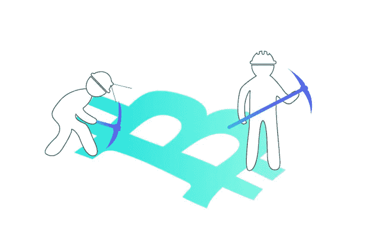

# 简单解释一下:为什么比特币需要工作证明？

> 原文：<https://medium.com/coinmonks/simply-explained-why-is-proof-of-work-required-in-bitcoin-611b143fc3e0?source=collection_archive---------0----------------------->

Credit: [https://www.radixdlt.com/post/what-is-proof-of-work/](https://www.radixdlt.com/post/what-is-proof-of-work/)

**目标受众:**
这篇博文是针对不熟悉[区块链](https://medium.com/coinmonks/blockchain/home)的开发者受众。

**TD；LR:** 工作证明[共识机制](https://en.bitcoin.it/wiki/Consensus)的本质是提供多数节点同意且不说谎的证据。

**什么是** [**比特币**](https://medium.com/coinmonks/bitcoin/home) **？** [比特币](https://medium.com/coinmonks/bitcoin/home)是一种去中心化的、无需许可的数字货币协议，允许点对点的价值转移，无需中央中介。

**为什么工作证明在** [**比特币**](https://medium.com/coinmonks/bitcoin/home) **很有必要？** 一个 [**的工作证明**](https://en.bitcoin.it/wiki/Proof_of_work) 的验证是困难的，成本高，而且创建起来费时，但验证起来容易。[比特币](https://medium.com/coinmonks/bitcoin/home)是安全的，因为攻击网络在计算上是不可行的。要求工作证明的参与是这个属性的核心。因此[比特币](https://medium.com/coinmonks/bitcoin/home)依赖于**密码挑战**的**计算工作**作为信任的**基础。**

> 交易新手？尝试[加密交易机器人](/coinmonks/crypto-trading-bot-c2ffce8acb2a)或[复制交易](/coinmonks/top-10-crypto-copy-trading-platforms-for-beginners-d0c37c7d698c)

工作证明(PoW)是安全所必需的，它可以防止欺诈，从而获得信任。这种安全性确保了独立的数据处理者(**矿工**)无法对交易撒谎。工作证明被用来安全地对[比特币的](https://medium.com/coinmonks/bitcoin/home)交易历史进行排序，同时增加了随时间改变数据的难度。如果有多个副本，它用于选择网络中最有效的[区块链](https://medium.com/coinmonks/blockchain/home)副本。最后，工作证明是创建**分布式时钟**的关键，它允许矿工自由进出网络，同时保持恒定的运行速率。

然而，要真正理解工作证明，我们必须了解区块链的基础知识。

[**区块链**](https://medium.com/coinmonks/blockchain/home) **基础知识:** [比特币的](https://medium.com/coinmonks/bitcoin/home)交易历史存储在一种叫做区块链的数据结构中。从逻辑上讲，[区块链](https://medium.com/coinmonks/blockchain/home)是由一连串的积木组成的。 [**块**](https://en.bitcoin.it/wiki/Block) 大约每十分钟产生一次，由事务组成。 [**交易**](https://en.bitcoin.it/wiki/Transaction) 是在网络上广播的比特币从一个账户到另一个[的转账。区块内的交易由](https://en.bitcoin.it/wiki/Network) [**矿工**](https://en.bitcoin.it/wiki/Mining) (区块创建者)根据[用户包含的](https://en.bitcoin.it/wiki/Miner_fees)可选费用进行排序。费用越高，交易被收录的可能性越大。任何人都可以运行挖掘节点。每个矿工都有同一个区块链的副本。创造一个区块的行为称为采矿。

通过将每个块与前一个块的 [**散列**](https://en.bitcoin.it/wiki/Hash) 链接来按时间顺序组织块。

**不可变区块链:** 将一个块与它的前一个块的“工作证明” **hash** 链接起来会产生防篡改效果。由于每个数据块的哈希都是下一个数据块哈希的组成部分，因此数据链中的任何改变都会改变最终的“工作证明”哈希以及中间的所有数据块哈希。更改的块越深，篡改所需的计算工作量就越大。链的最后一个 hash 代表整个链的累积工作，类似于一个 [**校验和**](https://en.wikipedia.org/wiki/Checksum) 。

**工作证明说明:** [比特币](https://medium.com/coinmonks/bitcoin/home)使用 [hashcash](https://en.bitcoin.it/wiki/Hashcash) 系统生成区块。矿工通过计算工作证明挑战的解决方案来创建区块。他们需要在一个 [**目标下面找到一个特定的哈希 256 位数字**](https://en.bitcoin.it/wiki/Target) **。** Hashcash 使用一个[**sha 256**](https://en.bitcoin.it/wiki/SHA-256)**产生一个随着数据的任何变化而剧烈变化的 hash。从输出中得到输入是不可能的。解决这一挑战的唯一方法是通过昂贵的猜测，即工作证明。**

**为了猜测“工作证明”的答案，矿工接受交易列表并添加一个猜测数( [**nonce**](https://en.bitcoin.it/wiki/Nonce) )作为散列函数的输入。由于矿工自由进出网络， [**难度**](https://en.bitcoin.it/wiki/Difficulty) 每隔 2016 块调整一次，使每个矿工的解块概率保持在十分钟区间内。这分散了整个网络的验证过程。这种调整是通过协议根据矿工人数自动增加或减少目标来实现的。**

****共识:** 第一个找到“工作证明”答案的矿工向网络广播了他们的解决方案。通知所有节点发现了新的块。他们反复检查解决方案，然后开始下一个区块的工作。这项工作是非常多余的；所有矿工都在同一组事务上竞争，以找到解决方案。**

**如果正确，区块矿工赚取交易费和区块奖励。一个 [**块奖励**](https://en.bitcoin.it/wiki/Controlled_supply) (目前为 12.5 [比特币](https://medium.com/coinmonks/bitcoin/home))是一个新的[比特币](https://medium.com/coinmonks/bitcoin/home)被创建并认可到他们的账户。这种竞争形成协议( [**共识机制**](https://en.bitcoin.it/wiki/Consensus) )，该协议将所有节点与相同的[区块链](https://medium.com/coinmonks/blockchain/home)副本同步。**

****安全性:** 该协议只将最长的链(具有最多“工作证明”的链)视为有效和可信的。从长期来看，欺诈链是不切实际的，因为矿工持续赢得大宗奖励以维持链的概率很低。随着时间的推移，其他挖掘者将比篡改链更快地扩展有效链。**

****工作证明的问题:** 比特币的工作证明共识机制有几个问题:
1。这是环境税。
2。容易受到 [51%攻击](https://en.bitcoin.it/wiki/Majority_attack)。如果矿工掌握了 51%的散列(猜测)能力，他们就能决定什么是真相。
3。除了高昂的尝试成本之外，没有任何机制来惩罚任何恶意的矿工。
4。[由于每个节点都必须处理每个事务，因此扩展性不好](https://hackernoon.com/blockchains-dont-scale-not-today-at-least-but-there-s-hope-2cb43946551a)。网络可能会提高效率，但会降低安全性。**

> **加入 Coinmonks [电报频道](https://t.me/coincodecap)和 [Youtube 频道](https://www.youtube.com/c/coinmonks/videos)获取每日[加密新闻](http://coincodecap.com/)**

## **另外，阅读**

*   **[复制交易](/coinmonks/top-10-crypto-copy-trading-platforms-for-beginners-d0c37c7d698c) | [加密税务软件](/coinmonks/crypto-tax-software-ed4b4810e338)**
*   **[网格交易](https://coincodecap.com/grid-trading) | [加密硬件钱包](/coinmonks/the-best-cryptocurrency-hardware-wallets-of-2020-e28b1c124069)**
*   **[密码电报信号](/coinmonks/top-3-telegram-channels-for-crypto-traders-in-2021-8385f4411ff4) | [密码交易机器人](/coinmonks/crypto-trading-bot-c2ffce8acb2a)**
*   **[购买比特币印度](/coinmonks/buy-bitcoin-in-india-feb50ddfef94) | [Pionex 评论](/coinmonks/pionex-review-exchange-with-crypto-trading-bot-1e459d0191ea) | [加密交易机器人](/coinmonks/crypto-trading-bot-c2ffce8acb2a)**
*   **[印度的加密交易所](/coinmonks/bitcoin-exchange-in-india-7f1fe79715c9) | [比特币储蓄账户](/coinmonks/bitcoin-savings-account-e65b13f92451)**
*   **[Cloudbet 赌场评论](https://coincodecap.com/cloudbet-casino-review) | [点火赌场评论](https://coincodecap.com/ignition-casino-review)**
*   **[币安收费](/coinmonks/binance-fees-8588ec17965) | [僵尸加密审查](/coinmonks/botcrypto-review-2021-build-your-own-trading-bot-coincodecap-6b8332d736c7) | [热点审查](/coinmonks/hotbit-review-cd5bec41dafb)**
*   **[my constant Review](https://coincodecap.com/myconstant-review)|[8 款最佳摇摆交易机器人](https://coincodecap.com/best-swing-trading-bots)**
*   **[最佳加密交易所](/coinmonks/crypto-exchange-dd2f9d6f3769) | [最佳加密交易所](/coinmonks/bitcoin-exchange-in-india-7f1fe79715c9)**
*   **[开发人员的最佳加密 API](/coinmonks/best-crypto-apis-for-developers-5efe3a597a9f)**
*   **最佳[密码借贷平台](/coinmonks/top-5-crypto-lending-platforms-in-2020-that-you-need-to-know-a1b675cec3fa)**
*   **[杠杆代币终极指南](/coinmonks/leveraged-token-3f5257808b22)**