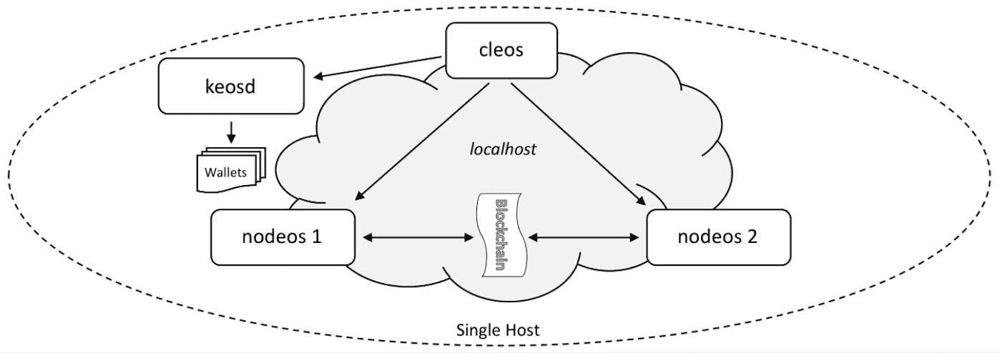

# EOS 上的单主机多节点测试网

> 原文：<https://medium.com/coinmonks/single-host-multi-node-testnet-on-eos-6d940811a03?source=collection_archive---------1----------------------->

本教程描述了如何在 EOS 上建立一个*单主机多节点测试网。我们将在您的本地计算机上设置两个节点，并让它们相互通信。本节中的例子依赖于三个命令行应用程序，`nodeos`、`keosd`和`cleos`。下图描述了所需的 testnet 配置。*



假设`keosd`、`cleos`和`nodeos`已经安装在您的路径中，或者您知道如何从文件系统中的位置启动这些应用程序。

打开 **4** “终端”窗口，执行本教程中的步骤。

## 1.启动钱包管理器

在第**个**终端窗口，启动`keosd`，钱包管理应用程序:

```
$ keosd --http-server-address 127.0.0.1:8899
```

如果成功，`keosd`将显示一些信息，从:

```
2493323ms thread-0   wallet_plugin.cpp:39          plugin_initialize    ] initializing wallet plugin
2493323ms thread-0   http_plugin.cpp:141           plugin_initialize    ] host: 127.0.0.1 port: 8899
2493323ms thread-0   http_plugin.cpp:144           plugin_initialize    ] configured http to listen on 127.0.0.1:8899
2493323ms thread-0   http_plugin.cpp:213           plugin_startup       ] start listening for http requests
2493324ms thread-0   wallet_api_plugin.cpp:70      plugin_startup       ] starting wallet_api_plugin
```

寻找一条说钱包正在监听 127.0.0.1:8899 的线路。这将表明`keosd`已正确启动，并且正在正确的端口上监听。如果在“启动 wallet_api_plugin”之前看到任何其他内容，或者看到一些错误报告，则需要诊断问题并重新启动。

当`keosd`正常运行时，让该窗口保持打开，同时运行钱包应用程序，并移至**第二个**终端窗口。

## 2.创建默认钱包

在**第二个**终端窗口中，使用命令行实用程序`cleos`创建默认钱包。

```
$ cleos --wallet-url http://localhost:8899 wallet create
Creating wallet: default
Save password to use in the future to unlock this wallet.
Without password imported keys will not be retrievable.
"PW5Jn3GFZzerJTVz4XDN4W8QfGpvwiyLEucEvVxseKdbEZdSKV8bK"
```

对于后续的`cleos`命令，我们将继续使用这个**第二**窗口。

## 3.启动第一个生产者节点

我们现在可以启动第一个生产者节点。在**第三个**终端窗口运行:

```
$ nodeos --enable-stale-production --producer-name eosio --plugin eosio::chain_api_plugin --plugin eosio::net_api_plugin
```

这就产生了一个特殊的生产者，称为“bios”生产者。

## 4.启动第二个生产者节点

以下命令假设您正在从您运行`./eosio_build.sh`的`${EOSIO_SOURCE}`目录运行本教程

要启动其他节点，您必须首先加载`eosio.bios`契约。该契约使您能够直接控制其他帐户的资源分配，并访问其他特权 API 调用。返回第二个终端窗口，运行以下命令来加载合同:

```
$ cleos --wallet-url http://localhost:8899 set contract eosio build/contracts/eosio.bios
Reading WAST/WASM from build/contracts/eosio.bios/eosio.bios.wast...
Assembling WASM...
Publishing contract...
executed transaction: 808599e85909b5793819a6f303c499d776fede9c9cc2cc1dc9776d3877c60e87  3280 bytes  2200576 cycles
#         eosio <= eosio::setcode               {"account":"eosio","vmtype":0,"vmversion":0,"code":"0061736d0100000001581060037f7e7f0060057f7e7e7e7e...
#         eosio <= eosio::setabi                {"account":"eosio","abi":{"types":[],"structs":[{"name":"set_account_limits","base":"","fields":[{"n...
```

我们将使用帐户名`inita`创建一个成为生产者的帐户。要创建帐户，我们需要生成与帐户相关联的密钥，并将其导入到我们的钱包中。

```
$ cleos create key
Private key: 5HvbXnMVLLQEQRR3He7fu4rj7JziCiCcmWgAVkyhWbatBNFw8sw
Public key: EOS7J9pSmsJLQuHwQ5NZAH1V3MKKGgZtwZ92GqmAfbJqdUXDehiCE
```

现在将私钥部分导入到您的钱包中。

```
$ cleos --wallet-url http://localhost:8899 wallet import 5HvbXnMVLLQEQRR3He7fu4rj7JziCiCcmWgAVkyhWbatBNFw8sw
imported private key for: EOS7J9pSmsJLQuHwQ5NZAH1V3MKKGgZtwZ92GqmAfbJqdUXDehiCE
```

创建我们将用来成为生产者的`inita`账户。

```
$ cleos --wallet-url http://localhost:8899 create account eosio inita EOS7J9pSmsJLQuHwQ5NZAH1V3MKKGgZtwZ92GqmAfbJqdUXDehiCE EOS7J9pSmsJLQuHwQ5NZAH1V3MKKGgZtwZ92GqmAfbJqdUXDehiCE
executed transaction: 03d801831dc30fe43a355b2a5e1ff553c5081f6fc8a89a93c86fdffcbb4c891c  352 bytes  102400 cycles
#         eosio <= eosio::newaccount            {"creator":"eosio","name":"inita","owner":{"threshold":1,"keys":[{"key":"EOS7J9pSmsJLQuHwQ5NZAH1V3MK...
```

在第四个终端窗口中，启动第二个 nodeos 实例。

```
$ nodeos --producer-name inita --plugin eosio::chain_api_plugin --plugin eosio::net_api_plugin --http-server-address 127.0.0.1:8889 --p2p-listen-endpoint 127.0.0.1:9877 --p2p-peer-address 127.0.0.1:9876 --config-dir node2 --data-dir node2 --private-key [\"EOS7J9pSmsJLQuHwQ5NZAH1V3MKKGgZtwZ92GqmAfbJqdUXDehiCE\",\"5HvbXnMVLLQEQRR3He7fu4rj7JziCiCcmWgAVkyhWbatBNFw8sw\"]
```

此时，第二个 nodeos 是一个空闲的生产者。要将其转变为活动生产者， **inita** 需要向 bios 节点注册为生产者，bios 节点需要执行一个操作来更新生产者时间表。

```
$ cleos --wallet-url http://localhost:8899 push action eosio setprods "{ \"version\": 1, \"producers\": [{\"producer_name\": \"inita\",\"block_signing_key\": \"EOS7J9pSmsJLQuHwQ5NZAH1V3MKKGgZtwZ92GqmAfbJqdUXDehiCE\"}]}" -p eosio@active
executed transaction: 95baf281e32f1e54686518c85a1317f4e387977b6f16d2b74061cec605f22238  272 bytes  105472 cycles
#         eosio <= eosio::setprods              {"version":1,"producers":[{"producer_name":"inita","block_signing_key":"EOS7J9pSmsJLQuHwQ5NZAH1V3MKK...
```

恭喜，您现在已经配置了一个双节点 testnet！您可以看到原始节点不再产生数据块，但它正在接收数据块。您可以通过对每个节点运行`get info`命令来验证这一点。

## 5.验证区块链

获取第一个节点的信息:

```
$ cleos get info
{
  "server_version": "f537bc50",
  "head_block_num": 28063,
  "last_irreversible_block_num": 28062,
  "head_block_id": "00006d9f87bcdee47f67eee56b861f118734794fed4a5ebeebb5c341ee1c3cd5",
  "head_block_time": "2018-05-04T03:33:09",
  "head_block_producer": "inita"
}
```

现在是第二个节点:

```
$ cleos --url [http://localhost:8889](http://localhost:8889) get info
{
  "server_version": "f537bc50",
  "head_block_num": 28505,
  "last_irreversible_block_num": 28504,
  "head_block_id": "00006f596fdb9660854b61a99cbbcaf8bb21c112e983a36e041f6b50fe170b1a",
  "head_block_time": "2018-05-04T03:36:50",
  "head_block_producer": "inita"
}
```

