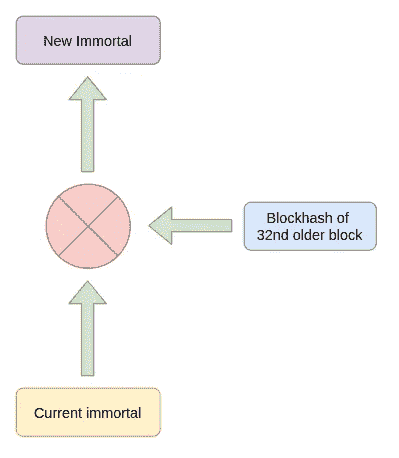

# 在 26 字节智能合约中实现伪随机数生成器

> 原文：<https://medium.com/coinmonks/sinh-s%E1%BB%91-pseudo-random-v%E1%BB%9Bi-26-bytes-smart-contract-4fee0d8da249?source=collection_archive---------2----------------------->


Photo by [Florian Olivo](https://unsplash.com/@florianolv?utm_source=medium&utm_medium=referral) on [Unsplash](https://unsplash.com?utm_source=medium&utm_medium=referral)

自 2015 年以来，我一直关注分散式随机数生成器(DRNG)主题。这是一个漫长而愉快的旅程，因为我有时间在 R&D 部门进行研究并参与开发。现在，阅读新的报纸，看看人们如何证明他们的方法，已经成为一种习惯力量。

我最近用以太坊虚拟机操作码做了一些实验，并产生了一个想法，如何编写一个执行伪随机数生成器(PRNG)的最小智能契约。这个想法很简单，如果你在一个静态值上使用散列函数`n`次，你会收到不同的结果，因为它的抗碰撞特性。这里你可能会有更多的细节，【http://www.ijcee.org/papers/439-JE503.pdf】T4。他们证明并通过了 NIST 给定的静态测试。

我提出了一个非常简单的想法，我们通过对先前的`immortal`和第 32 个旧块散列的组合执行散列来维护一个`immortal`值。

```
Immortal := keccak256(Immortal XOR blockhash(block.number - 32))
```



# 这里的重点是什么？

显然，在上面的想法中，结果是可预测的，因为算法和输入是在区块链上发布的。任何人都可以进行链外计算。问题是他们无法预测另一个智能合约会触发这个合约多少次。预估压倒性交易的价值是有成本的。

为了实际操作结果，miner 将能够按照给定的顺序执行 mine 选择的交易，但是在交换中，他们需要冒他们的 coinbase 奖励的风险。

如果对手不是矿商，他们将能够通过创建一系列具有最高`gasPrice`的序列事务来确保他们能够占据一系列值，从而获得优势。

# 这个提议有什么帮助？

该算法对于大范围的 PRNG 应用和操纵成本超过交易价值的情况是安全和可接受的。

我们可以使用 PRNG 作为额外的盐来改善由 oracle 或 commit 方案提供的结果。Oracle 和 commit 方案在区块链上作为一个黑盒来维护随机性的不可预测性，而 PRNG 则提高了可信度。

```
Randomness := RPNGResult XOR OracleResult
```

# 履行

EVM 是一个非常简单的虚拟机，它有一个深度为 1024 的堆栈。当然，它有记忆和存储。操作码的数量不算太多。

在尝试编写纯操作码智能契约时，我编写了自己的汇编程序来从汇编编译成 EVM 操作码。

下面是一个包含操作码列表的文件:

[](https://github.com/chiro-hiro/thedivine/blob/master/assembler/opcode.js) [## 千寻/thedivine

### 此时您不能执行该操作。您已使用另一个标签页或窗口登录。您已在另一个选项卡中注销，或者…

github.com](https://github.com/chiro-hiro/thedivine/blob/master/assembler/opcode.js) 

我们遵循以下准则定义:

[](https://ethervm.io/) [## 以太坊虚拟机操作码

### 更新于 2019 年 9 月 28 日(添加了 SHL、SHR 和 SAR 操作码)。这是以太坊的一个低级参考…

ethervm.io](https://ethervm.io/) 

我的汇编程序:

实施:

```
; EVM Assembly The Divine by Chiro Hiro <[chiro8x@gmail.com](mailto:chiro8x@gmail.com)>PUSH1 0x20
RETURNDATASIZE
CALLER
ORIGIN
XOR
PUSH1 0x0a
JUMPI
REVERT
JUMPDEST
DUP2
DUP2
DUP1
SLOAD
DUP3
NUMBER
SUB
BLOCKHASH
XOR
DUP2
MSTORE
SHA3
DUP2
SSTORE
RETURN
```

*   `PUSH1 0x20`将`0x20`推到堆栈顶部
*   `RETURNDATASIZE`将`0x00`推入堆栈，因为我们没有执行任何调用，所以它的结果是`0x00`。比`PUSH1 0x00`便宜
*   `CALLER`将`msg.sender`推到袋子上
*   `ORIGIN`将`tx.origin`推到堆栈
*   `XOR`消耗堆栈顶部的两个项目，并将结果`msg.sender xor tx.origin`压入堆栈
*   `PUSH1 0x0a`将`JUMPDEST`推至堆栈
*   `JUMPI`消耗栈顶的两个物品，如果`msg.sender == tx.origin`做`REVERT`否则跳转到`JUMPDEST`
*   `DUP2`复制堆栈中的第二个项目
*   `DUP2`复制堆栈中的第二个项目
*   `DUP1`复制栈顶的项目，我们的栈看起来会像这样`[0x00,0x00,0x20,0x00,0x20]`，我们假设栈顶在左边。
*   `SLOAD`在栈顶索引`0x00`返回`immortal`处装载存储
*   `DUP3`我们用`DUP3`复制`0x20`，因为`BLOCKHASH`不能在当前程序块上执行，我们的想法是在第 32 个旧程序块上执行。
*   `NUMBER`将当前块高度`block.number`返回堆栈
*   `SUB`消耗堆栈顶部的两个值，然后将`block.number - 32`压入堆栈
*   `BLOCKHASH`获取`block.number - 32`的块哈希，推入堆栈，`blockhash`和`immortal`位于堆栈顶部
*   `XOR` EVM 的字长是 256 位，所以我们最好使用 XOR 来合并两个 256 位的值，而不是在内存中执行 con cat。这一步之后`blockhash xor imomrtal`将会在堆栈的顶部。
*   `DUP2`将复制`0x00`，现在`0x00`在栈顶
*   `MSTORE`分配内存`memory[0, 32] = blockhash xor imomrtal`，现在堆栈`[0x00,0x20,0x00,0x20]`
*   `SHA3`在`[0x00:0x20]`计算内存中值的摘要，然后将结果压入堆栈
*   `DUP2`堆栈中有重复的`0x00`值，堆栈为`[0x00,keccak256(blockhash xor immortal),0x00,0x20]`
*   `SSTORE`消耗堆栈顶部的两个项目，并在`0x00`处覆盖`immortal`
*   `RETURN`消耗堆叠中的最后两件物品，然后离开。

当我们运行汇编程序时，编译汇编程序的结果如下所示:

```
Output:
60203d333218600a57fd5b8181805482430340188152208155f3Tx deploy data:
601a803d90600a8239f360203d333218600a57fd5b8181805482430340188152208155f3
```

# 结论

*   我们阻止正常地址触发 PRNG
*   代码被优化以最小化气体消耗
*   每次通话费用大约在`5190`气左右，大部分来自`SLOAD`和`SSTORE`
*   这段代码适用于任何 EVM
*   其他合同越多地使用这种 PRNG，对手预测或操纵结果的机会就越少

此处提供源代码:

[](https://github.com/chiro-hiro/thedivine) [## 千寻/thedivine

### 这是一份智能合同，允许我们以最低的成本生成并保护伪随机数。所有流程和…

github.com](https://github.com/chiro-hiro/thedivine)