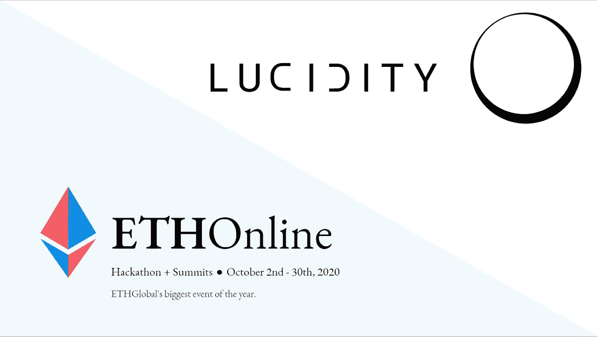

# 作为 ETHOnline 2020 黑客马拉松的获奖者，我学到了六点经验

> 原文：<https://medium.com/coinmonks/six-lessons-learned-as-a-prize-winner-from-the-ethonline-2020-hackathon-4c291ed49738?source=collection_archive---------1----------------------->

[Lucidity: A public project/procurement bidding and funds management platform](https://hack.ethglobal.co/showcase/lucidity-recGnEuX8m3Q0UIjL)

## 以太坊黑客马拉松

## 为期一个月的以太坊黑客马拉松非常累人，但也很有收获。请跟随我讲述技术和团队挑战，以及我会对我们的方法做出哪些改变。