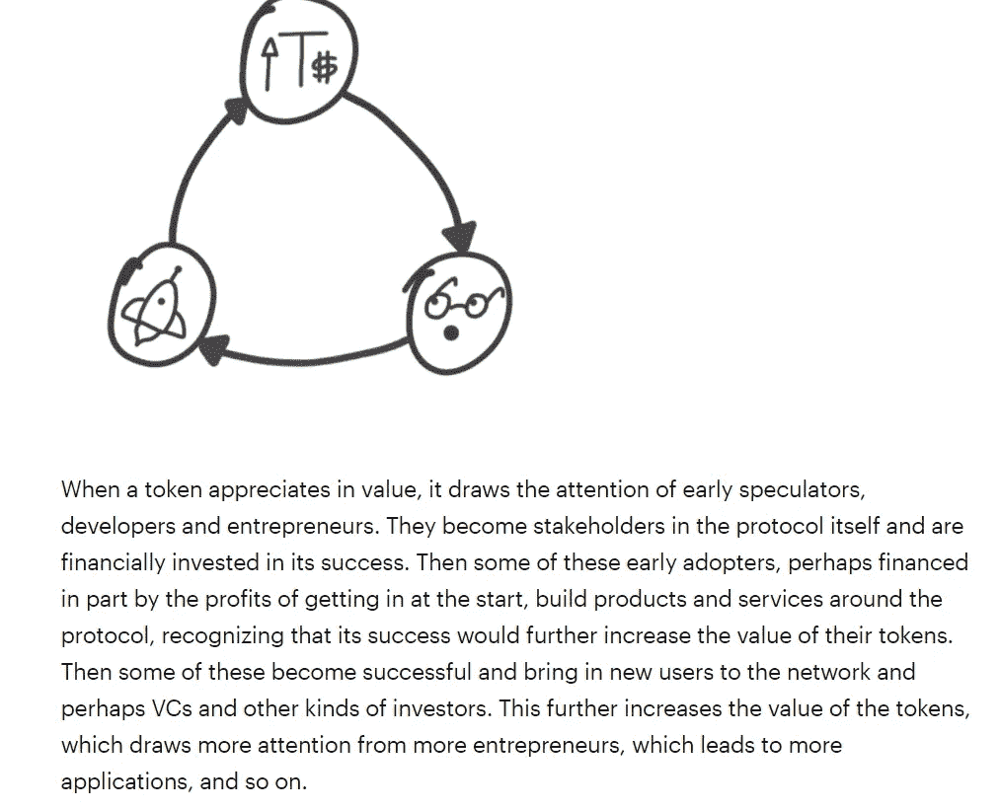
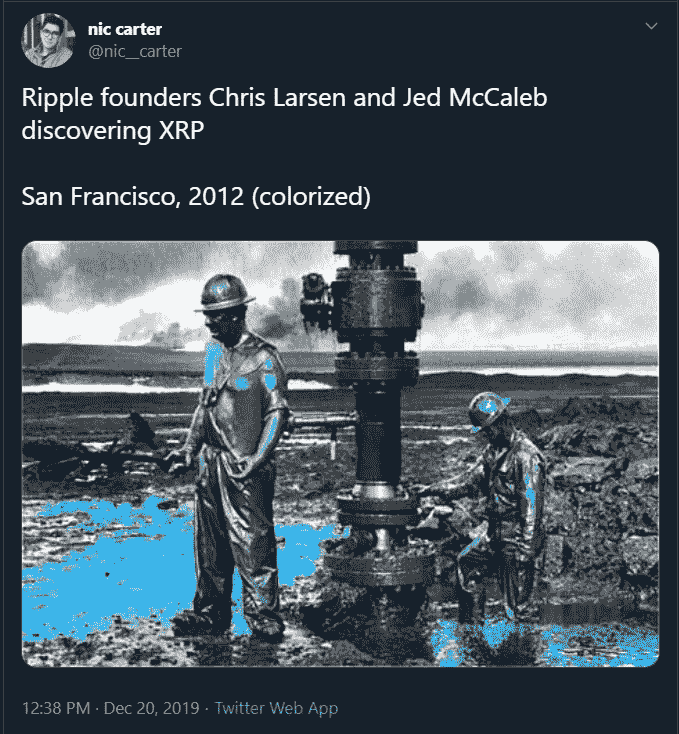

# 尺寸很重要——第一部分

> 原文：<https://medium.com/coinmonks/size-does-matter-part-1-9f83b130a451?source=collection_archive---------1----------------------->

## 令牌化网络的证券法哲学

**简介**

我是一名美国公司/证券律师，我花了(浪费？)过去三年的大部分时间都在思考证券法如何适用于令牌化的[区块链](https://medium.com/coinmonks/blockchain/home)网络。我的问题是:

*哪里都是阴沉沉的！！？？？*

这就是我想知道的。

加密文化被打破了，我把这归咎于证券法:

*   创始人不希望他们的代币成为证券，所以他们不能或不愿谈论、担心或研究代币价格
*   这项技术没有像预期的那样发展得又快又好，因为每个人都在参与“去中心化剧场”以避免监管者的干扰；我们拥有的不是投资、项目管理和经过仔细谈判的合资企业，而是“赠款”和“粗略的社会共识”
*   token HODLers 受到了人类历史上最严重的泡沫破裂之一的惩罚，他们觉得自己的投资让创始人变成了名人百万富翁，而投资者却被抛在了后面
*   新的资金正坐在场外，被前三分和彼得-希夫和努里埃尔-鲁比尼式的阴影投向区块链，被大众媒体的正常人适时放大
*   监管者落后于技术曲线 2-3 年，容易上当受骗，感到困惑，害怕输掉官司，所以他们只追求不需要重新思考法律的简单目标
*   立法者主要受华盛顿内部游说者的影响，这些游说者反过来由公司式的区块链项目资助，并提出起草得非常糟糕和考虑不周的法律
*   数百万美元正被投入证券法的辩护诉讼和“辩护基金”，而不是投资于技术开发，这可能有一天会使法律变得无关紧要
*   我们的技术是“不要相信，核实”，但我们的治理是“相信我们就好”，暗箱操作的“基金会”为令牌化的[区块链](https://medium.com/coinmonks/blockchain/home)网络做出几乎所有重大决策；他们根据像“社会契约”这样毫无意义的模糊概念来证明他们所做的一切
*   科技每天都在创造新的怪物；[加密货币](https://medium.com/coinmonks/crypto/home)交易所正在变成投资银行，它们只是持有你的[密码](https://medium.com/coinmonks/crypto/home)并支付你利息；与此同时，许多 DeFi 项目只是在同一趋势上的一个稍微去风险的变化
*   2015-2017 年的[加密](https://medium.com/coinmonks/crypto/home)鲸鱼是我们新的科技风投之神，他们需要在让你进入更广阔的资本市场之前获得回报
*   每一个职业需要提升的律师现在都是“[秘密](https://medium.com/coinmonks/crypto/home)律师”,即使在技术和文化变得完全空虚的时候，他们也在赚钱
*   2019 年最热门的项目发布会是他妈的*天秤座*脸书*的*！！！！

是的，我把这一切都归咎于证券法。不仅仅是法律，还有那些试图执行法律、试图提出建议、试图遵守法律和/或试图规避法律或不介意违反法律的人。因为我认为所有这些球员都严重缺乏理解和想象力——我也有错，并在其中扮演了我的角色。但现在我正试图开辟一条新的道路。

证券律师、证券监管者和区块链的狂热爱好者都不同意证券法。我今天无法解决所有这些辩论，我甚至不会去尝试。

我能做的(至少我是这么认为的)是提供一个框架——如果你允许的话，一个*哲学* —关于我认为证券法应该(并且可能已经)如何适用于令牌化的开放网络，以及这可能如何有助于解决我上面提到的问题，并让[密码](https://medium.com/coinmonks/crypto/home)回归黑暗。

我不指望每个人都同意我。你可能不会同意我的观点。如果你是一名律师，你肯定会不同意我的观点，因为正如一位非常精通法律的以太坊开发者曾经恰当地对我说的那样，“你们这些律师都在暗地里互相憎恨。”(而且是真的！)

但我认为，即使那些不同意的人也能欣赏有一套连贯的、相互关联的概念和论点来进行反驳。也许他们甚至会意识到证券法最终会成为一股积极的力量，增强这个行业最根深蒂固的赛博朋克价值观。

在解释这一哲学时，我不打算引用太多的证券案例法或学术。填写这些细节肯定是有用的——也许我或其他人会在未来的工作中这样做——但也会很无聊。一天只有这么几个小时。我的论点也将包括从三段论到苏格拉底对话到直觉泵和*反证法。他们不会太专业。*

但如果这是奖学金，我会把它发表在杂志上，让同行评审，可能会被邀请在更多的小组上发言。这不是奖学金；更像是我个人的密码法宣言。我是一名律师，但我也是一名局外人——这篇文章可能更容易被其他局外人欣赏，而不太容易被那些已经在这个行业中获得大量财富和权力的人欣赏。就这样吧。

**开放网络代币是网络股权的份额**

吉勒·德勒兹和费利克斯·瓜塔里曾将哲学定义为“形成、发明和制造概念的艺术”。所以，我对令牌化网络的证券法的哲学也是从一个特殊的概念开始的:网络权益的概念。

网络权益应该是熟悉的——它已经是你如何看待你的大多数代币的价值。这本质上是网络价值的概念，Joel Monegro 用他的“胖协议”飞轮来描述:

Joel Monegro’s Fat Protocol Flywheel

我将“网络权益令牌”定义为(在理论上或实践中)倾向于获取开放网络的全部或部分价值的令牌。这不应该有太大的争议，但可悲的是，它是。

你看，我相信当我们使用诸如“ICO”、“稀释”、“利益相关者”、“市值”和“分叉”等术语时(这些术语让人想起 IPO、股权稀释、股东、市值和公司股本的股票分割)，这不是偶然的。与一些专家(包括我过去的生活)的评论相反，这些术语的使用不仅仅是对网络代币、传统证券或两者的一些非常不幸的误解的结果。相反，我们是故意使用这些词，而且是以一种有意义的方式，因为它们是最接近捕捉我们关于什么是网络价值(一种准股权)以及开放网络令牌如何捕捉它(如股票)的直觉的词。

2016-2017 年的 ICO 狂热是由那些认为通过购买协议令牌，他们购买了开放网络的“股份”，随着网络变得越来越受欢迎，这些股份的价值会增加。获取的价值的性质与公司股东权益的性质并不完全相同(它不是对属于一个实体的资产和负债之间的正差额的主张)，令牌获取该价值的方式与股票份额获取股东权益的方式也不相同(前者是功能性的，后者是基于权利的)。然而，网络代币是最接近于在一个不属于任何人的网络中获得股权的代币，并且在该网络中成为代币持有者就像在一个管理该网络的无所有者企业中成为股东一样。“股权”也有比“股东股权”更广泛的含义，反映在“家庭股权”和“品牌股权”等概念中。因此，我认为“网络权益”在名称和概念上都是恰当的，以涵盖开放网络令牌所代表的价值。

本文的动机基本如下:我认为，当这种令牌被公开视为网络股权的股份，并且当它们作为证券的性质被接受时(直到“充分去中心化”的点)，围绕开放网络令牌的监管问题变得更加清晰。这比仅仅将这种代币视为“数字货币”或“实用代币”要好；这些概念非常不适合代币的实际使用、估值和思考方式，而且主要是在规避证券法的不成熟尝试中被采用的。

事实上,“网络公平”框架与网络参与者的实际直觉、动机和信念更加一致，因为他们是在野外发现的。可以看到令牌网络开发商将网络令牌分配给早期员工，就像他们是热门初创公司的“创始人股份”一样，甚至经常让他们接受归属。大型早期代币买家进行尽职调查，并寻求建立声誉，就像硅谷风险投资基金一样。较晚买入且信息较少的散户代币购买者往往会借助创始团队和早期投资者的资质、声望和先前的估值。所有这一切都很像发生在普通企业股票市场上的事情。当然，有一些差异——最终这些差异中的一些应该反映在适用法律的修正案中——但是相似之处远远多于差异。

在这一点上，我做了一些大胆的断言。我怀疑，在文章的这个阶段，许多读者仍然会对这些断言的价值持怀疑态度。您可能仍然会质疑“网络股权份额”是否是查看开放网络令牌的好方法。你可能会想“代币不是更像产品而不是股票吗？或者说，它们不就像商品之类的东西吗？”

因此，下一节我将致力于解决潜在的怀疑——揭穿传统商业/公司世界中所有其他常见的代币类比。

**为什么开放网络令牌的其他概念都是弱酱**

1.  ***开放网络代币不太像债务***

债务是借款人支付本金*加上*利息的一种义务，而贷款人接收本金*加上*利息，可能会受到一些外部因素的影响，如本金和利息计价货币的波动。债务可以是有担保的(债权人有权取消特定抵押品的赎回权以确保偿还)或无担保的(无抵押品)。

不用说，开放网络令牌与债务完全不同:

首先，它们不代表收回资金的权利。然而，我认为这种差异相对不重要。网络代币也不代表主张资产和负债之间差额的权利。因此，如果我限于这种推理，网络代币将一点也不像债务*和*不像股权；我的整个哲学将在水中死去。

开放网络代币不同于债务的更重要的原因是，其次，人们期望从这种代币获得的回报和风险完全不同于债权人期望从贷款获得的回报和风险。没人会指望债务会带来*井喷*回报或*灾难性*损失:它们本质上是保守的投资，旨在产生适度回报，并有重大的下行保护(特别是在抵押担保品种中)。然而，股权投资的主要目标是巨大的回报，为获得回报的可能性而付出的代价是承担风险，很少有这样的投资能产生任何实质性的回报；事实上，许多可以并将导致全部或接近全部损失。因此，开放网络代币的利润和风险状况更像股票，无论如何，与债务非常非常不像。

**2。*开放网络代币不太像消耗品***

开放网络令牌的一个经常重复的概念将它们描绘成“产品”，或者有时更具体地说是“软件产品”。这个类比比债务稍微好一点，但在绝大多数情况下仍然非常不准确且容易误导。

首先，证券法判例所涵盖的“产品”几乎不像想象中的开放网络代币。我曾多次听到证券律师将 ETH 比作 Howey 案中的橙子、T2 Glen Arden 案中的威士忌或 T4 Brigadoon Scotch Distributors 案中的稀有硬币，我尊重他们的意见。对于这些律师来说，有两件事是永远正确的:

(1)他们充当有说服力的倡导者，因此并不完全坦诚；或者

(2)他们并不真的使用 [crypto](https://medium.com/coinmonks/crypto/home) ，也不在 [crypto](https://medium.com/coinmonks/crypto/home) 社区中，因此还没有在购买不合理的大量适当泵送的开放网络令牌时，带着恐惧和禁忌快感的混合感觉与敌人为敌，在凌晨 3 点充满了生病的 gainz 的狂热梦想。

开放网络令牌本身是没有用的。你不能像喝威士忌一样喝它。你不能像吃橘子一样吃它。你不能把它举到灯光下，欣赏浮雕设计的灵巧、古董工艺，或轻微磨损和刻痕的铜绿赋予的微妙历史感。

网络令牌不是这些东西中的任何一个:相反，它是属于你的记账单位，因为它被识别为由数据库上的特定公钥/私钥对管理，该数据库由许多人操作的节点网络维护，符合由许多其他人设计的软件中建立的规则，以在这样的条件下并根据这样的[密码](https://medium.com/coinmonks/cryptography/home)规则来识别和管理这样的记账单位的变化。

如果每个人都停止运行这些节点，令牌将毫无用处和价值，甚至可以说是不存在的。如果软件客户端不能正常工作，或者停止更新，或者至少停止维护，令牌就会大幅或完全贬值。在缺乏这些基于网络的依赖性的情况下，令牌永远不会真正被使用或者甚至被享用。

让我们将其与证券律师让你相信的类似于代币的其他一些东西进行比较，它们应该受到同样的监管:

*   一瓶威士忌就能让你醉，即使威士忌酒厂已经关门大吉了
*   一个橙子可以被吃掉，而不用在乎它来自哪片树林，也不用在乎那片树林是否还在
*   一枚具有收藏价值的金属硬币可以被审美欣赏，或者被熔化以回收合金中金属的价值，即使铸造它的政府早已成为历史

威士忌、桔子和可收藏的金属硬币是产品，因为它们有独立于生产环境的生命。开放网络令牌没有……它们只在特定网络的上下文中有用，并且人们持续愿意操作该网络。

**3。*开放网络令牌不太像“软件产品”***

如果你聪明的话，你现在可能会认为我是个白痴。你应该想对我说这样的话:

“你说代币不像威士忌、橘子和金属硬币……这一点我同意。但是代币从来就不是这种老式的商品。代币意味着现代，甚至后现代。代币不仅仅是产品，它们是一种特殊的产品——*软件*产品——它们遵循不同的规则，但与股票证券完全不同。你不会说微软 Word 许可证的购买者是在购买微软公司的股票，对吧？!"

不，我不会说微软 Word 的买家是在购买微软公司的股票。那将是荒谬的。然而，在某种情况下，我会说微软 Word 的买家是在购买股权。在微软 Word 中！

考虑以下历史的替代时间线/曼德拉效应版本:

*   1982 年，微软公司推出了它即将推出的文字处理器 Microsoft Word
*   微软公司表示，它将只向微软 Word 出售 1 亿份许可证
*   微软公司以 kickstarter 的方式提供 5000 万份预售许可证
*   微软公司保留另外 5000 万份许可证，用于以后的销售，以资助继续发展/为股东获得收入
*   这些许可是永久的、不可撤销的、完全付清的、不可再许可的
*   这些许可证可以自由转让，价格没有上限
*   这些许可证适用于 Microsoft Word 的所有未来升级，即使这些升级不是由 Microsoft Corporation 生产的(例如，即使是由通过收购 Microsoft Corporation 的股权而获得 Microsoft Word 的知识产权的收购者生产的)。

在这种情况下，我相信微软 Word 中有一种股权正在被出售。一开始，我有两种方式购买微软 Word 的股份:直接购买微软 Word 的许可证，或者间接购买微软公司的股份。然而，最终，随着微软公司出售越来越多的最初分配的 50%的许可证，越来越少的微软 Word 的权益将通过微软公司的权益获得；最终，获得微软 Word 股权的唯一方法可能是购买 1 亿份自由流通的微软 Word 许可证中的一份。

现在，这种微软 Word 准股权可能有作为证券监管的情况，也可能有不监管的情况。一些人可能正在获得使用它的许可；其他人可能会购买 1000 个许可证，希望在几年内多次升级 Microsoft Word 后获得 100 倍的回报。Microsoft Word 的合理预期客户群可能也很重要。目前大约有 10 亿用户。如果我们假设这是正确的受众规模，并且有 10 亿个 Microsoft Word 许可证，那么我们对每个人来说都足够了，不应该期望这些许可证作为投资工具有多大价值。我们稍后会谈到所有这些。

现在，我只想指出，在一个非常类似于效用令牌的场景中，一个人如何能够将类似于股权的价值驱动到一个实际的软件产品中。在我的假设中，只有有限数量的微软 Word 许可证应该被生产的事实非常类似于只有有限数量的 BTC 应该被生产的事实，或者在给定时间只有有限数量的 ETH 可用于(缓慢的额外发行)支付网络上的汽油。

但是，我对网络令牌与软件的类比的破坏还没有完成。人们可以更进一步，认为简单地说网络令牌根本不像软件许可证会更准确。一个以太网不是使用以太网协议的许可证。以太坊协议及其所有以软件客户端(如 Geth)形式出现的实例实际上是完全开源的。所以你不能告诉我买 ETH 就像买软件许可证一样。软件是免费的；你不需要 ETH 来使用它。你可以创建你自己的版本，并在你自己的私人 ETH 网络上注册你想注册的 ETH。

相反，购买 ETH 是购买在特定*网络上交易的权利或能力。这与其说是购买某个特定软件的许可证，不如说是用一种货币兑换另一种货币。在日本他们不接受美元；他们只收日元。以太坊也不收美元，只收以太币。ETH 是一种货币，你用它来支付(或社区支付)以太坊主网上的节点操作者为你(或他们)做的事情，比如运行计算(或提议块)。它也可以是你支付 DAPPs/smart contracts 的货币，DAPPs/smart contracts 基本上就像网络上的虚拟代理，用来执行某些功能，或者给你某些其他令牌等。*

因此，开放网络令牌基本上不像桔子、威士忌、可收藏的硬币或软件产品。这些对网络令牌的类比/隐喻并不十分有用或准确，需要被淘汰。即使这些类比在某种程度上比我给予它们的更多，人们也需要考虑我假设的有限微软 Word 许可证，它仍然可以体现网络公平，本质上是一种有趣的安全类型，尽管也是软件许可证。

**4。*开放网络代币不太像(自然)“商品”***

这一点令人惊讶地明显，但我猜也不那么明显，因为许多人将比特币等加密货币与石油等大宗商品进行比较。我不得不说，我完全不同意这一点，这几乎毫无意义。

在开始的时候，我会变得非常廉价和懒惰。以下是 Investopedia.com 如何抓住商品的本质。你可能会认为这非常天真，没有学术气息，但实际上我认为 [Investopedia 的定义](https://www.investopedia.com/terms/c/commodity.asp)比许多人愿意承认的更加真实和深刻:

> 商品是商业中使用的基本商品，可以与同类商品互换。商品最常被用作生产其他商品或服务的投入。特定商品的质量可能略有不同，但在不同的生产商之间基本上是一致的。基本思想是，来自一个生产者的商品和来自另一个生产者的相同商品之间几乎没有区别。一桶油基本都是同一种产品，不考虑生产商。相比之下，对于电子产品，给定产品的质量和功能可能完全不同，这取决于生产商。一些传统的商品包括谷物、黄金、牛肉、石油和天然气。

Nic Carter 关于代币 XRP 和 Ripple 公司之间关系的一条有史以来最野蛮的推文中也捕捉到了这一基本思想:

这很有趣，因为我们直觉上知道这很可笑。

XRP 代币不是通过数百万年来化石和其他有机物的胶粘化在地下形成的，然后被像石油一样的涟漪创始人发现的。XRP 代币不是从某座山中开采出来的，它们像金块一样在那里已经存在了几百万年，任何人都可能发现它们。XRP 代币不受欢迎或没有价值，因为它们有一些内在的有用和稀有的东西，就像石油、黄金或钻石有一些内在的有用和稀有的东西一样。

不，XRP 代币是人造的合成资产。它们之所以受欢迎或有价值，并不是因为它们是一种特定类型的代币或由特定类型的软件支持，而是因为一些特定的人/特定的公司赢得了投资者对他们创业努力的信心，并默认或明确地承担了推广的责任，不是推广整个 XRP 软件，而是推广该软件的一个特定的*实例*——使用该软件的特定网络。

那些 XRP 令牌——在那个*特定的*网络上的令牌——而不是同一软件的某个技术上完全相同的私有版本(“pXRP”)，才是真正有价值的东西。原因是他们背后有特定的人，这些人赢得了投资者的信任。这些*不像*传统商品——支持或推广它们的特定生产商*确实*重要。

**5。*开放网络代币不太像货币——直到突然变成***

好吧，这是我论点中最薄弱的部分，因为，是的，事实上，开放网络代币就像钱一样。我在这里提醒你，以防你浏览这篇文章:几节之前，我甚至把 ETH 比作 *yen* 。那么，怎么回事？我在这里说什么？

这实际上是问题的整个核心，并进入了有时被称为威廉·辛曼的“可变性原则”，如“[数字资产交易:当豪伊遇到加里(塑料)](https://www.sec.gov/news/speech/speech-hinman-061418)”中所阐述的。我们会对此进行大量讨论。但是现在让我稍微懒一点，回到直觉泵。

你听说过公司代币或公司镇币吗？还是那句话，我要超级懒，只引用维基百科，因为它挺好的，而且就像我之前说的，我已经花了(浪费？)我在这上面花了三年时间，为什么不偶尔走捷径呢？=)

> **公司代币**是[公司](https://en.wikipedia.org/wiki/Company)发行的[代币](https://en.wikipedia.org/wiki/Scrip)(代替政府发行的[法币](https://en.wikipedia.org/wiki/Legal_tender)或[货币](https://en.wikipedia.org/wiki/Currency))用以[支付](https://en.wikipedia.org/wiki/Payroll)其员工。它只能在雇主拥有的[公司商店](https://en.wikipedia.org/wiki/Company_store)中兑换…
> 
> 在美国，采矿营地和伐木营地通常由一家公司创建、拥有和运营。这些地方，有些相当偏远，往往现金匮乏；即使在没有现金的地方，以现金支付的工人也别无选择，只能在公司商店购买商品，因为兑换成货币，即使可以兑换，也会通过兑换费耗尽部分价值。有了这种经济上的垄断，雇主可以在商品上大幅加价，让工人依赖于公司，从而迫使员工对公司忠诚。

现在对比一下维基百科对“货币”的广义定义:

> 一种**货币**(来源于[中古英语](https://en.wikipedia.org/wiki/Middle_English_language):*curr aura*，【流通中】，来源于[拉丁语](https://en.wikipedia.org/wiki/Latin_language):[:*currens*](https://en.wiktionary.org/wiki/currens)*，-entis* )，在最具体的意义上是作为交换媒介使用或流通的[货币](https://en.wikipedia.org/wiki/Money)，特别是流通中的[纸币](https://en.wikipedia.org/wiki/Banknote)和[硬币](https://en.wikipedia.org/wiki/Coin)。[【1】](https://en.wikipedia.org/wiki/Currency#cite_note-1)[【2】](https://en.wikipedia.org/wiki/Currency#cite_note-Bernstein-2)更一般的定义是，货币是一种通用的*货币体系*(货币单位)，特别是对一个民族的人来说。根据这个定义，[美元](https://en.wikipedia.org/wiki/United_States_dollar) (US$)、[欧元](https://en.wikipedia.org/wiki/Euro) (€)、[日元](https://en.wikipedia.org/wiki/Japanese_yen)()、以及[英镑](https://en.wikipedia.org/wiki/Pound_sterling)()都是货币的例子。这些不同的货币被认为是价值储存手段，在决定不同货币相对价值的外汇市场上进行交易。[【4】](https://en.wikipedia.org/wiki/Currency#cite_note-4)这种意义上的货币是由各国政府定义的，每一类都有有限的接受边界。

请注意，除了规模之外，这两样东西实际上没有区别——一方面是公司代币，另一方面是货币。公司代币只在公司(可能是高度)集中管理下的孤立小城镇被接受。另一方面，货币在政府的(可能不太)集中管理下被整个国家的人民所接受。

我认为类似的事情也会发生在 ETH 这样的开放网络令牌上。在最坏的情况下，当以太坊网络由集中管理和有紧密联系的个人或企业赞助和运营时，ETH 作为以太坊网络上选择的交换媒介，就像是公司的临时凭证。在最好的情况下，当以太坊网络由许多不相关的人在高度分散的基础上管理和运营时，以太坊就像货币——以太坊的国家货币。在第二种情况下，ETH 比在第一种情况下更赚钱。规模，以及伴随规模而来的集权和分权的相对水平，都很重要。

尽管在网络代币和金钱之间有这种相对强烈的相似性，但仍然有一个令人困惑的因素:大多数购买 ETH 或任何其他网络代币的人事实上并不是购买它来作为以太坊网络或其他适用网络上的交换媒介，即使它可以这样使用。他们买它是希望“数字上升”这种期望是否合理，以及这种期望采取的具体形式——例如，它是侧重于一个发挥企业家努力的实体或团体，还是侧重于本质上反映自然的达尔文过程的网络进化过程——对于它们在法律下如何被对待关系重大(或应该关系重大)。

同样，我们稍后会谈到这一点，但我在这里的观点非常简单:购买 ETH 或另一种开放网络令牌的人只*有时*会希望将其用作网络内货币，但几乎总是——特别是如果他们在相当长的一段时间内按照 HODLing 计划一次性购买大量的话——希望用它来获取不断增长的网络权益的收益。即使是 BTC 也是如此，它无疑是把“货币”放进“加密货币”的密码，是最像钱的区块链网络代币之一。

开放网络代币主要不是商品、产品、软件或货币——它们主要是网络资产的*股份。*

— — —

在本文的第 2 部分中，我们将更多地讨论证券法以及在这些法律下如何处理“网络权益”——特别是 1934 年的证券交易法案，在关于证券法如何影响区块链代币的评论中，该法案没有得到足够的关注。

> [在您的收件箱中直接获得最佳软件交易](https://coincodecap.com/?utm_source=coinmonks)

