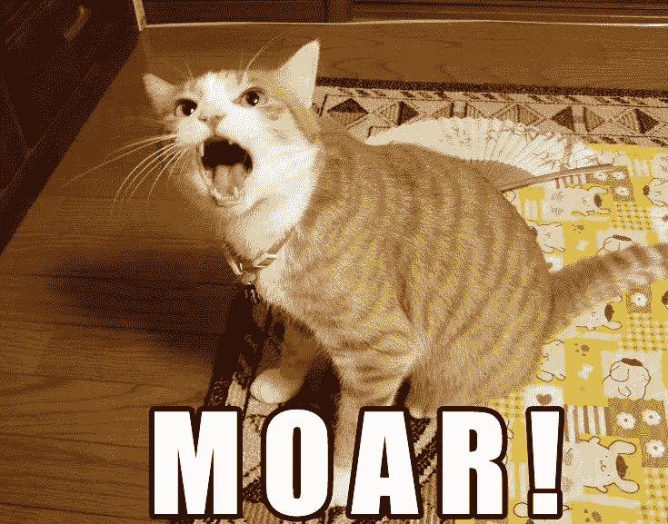

# 尺寸很重要—第二部分

> 原文：<https://medium.com/coinmonks/size-does-matter-part-2-fbcb20671b53?source=collection_archive---------2----------------------->

## 令牌化网络的证券法哲学

**令牌化网络股权牵连证券法**

我将直言不讳:在早期阶段，几乎每个令牌化网络上的令牌都满足一个或多个证券测试，更确切地说，涉及证券法背后的几乎每个政策问题。

唷。很高兴我们解决了这个问题。= )

我觉得我可能没有必要过多地抨击或证明这一点，因为已经有这么多 SEC 报告，SEC 和解，法院意见和堆积如山的法律学术和 cryptolegal 学术和 cryptotwitter 评论——你可以去读那些狗屎。

我*在这里想要做的是比平常更深入一到三层。*

几乎所有关于代币的证券法评论都主要或专门涉及 1933 年证券法下的发行。这是体现证券监管基本原则的美国法律:所有证券发行/销售必须在 SEC 注册或正式豁免 SEC 注册。这项法律主要定义了一群创始人或一家公司何时可以向你出售一些新的代币/证券。但是…

…你知道吗…

….实际上有…

… ***更有*** 证券法？是的，:

以下是我最想谈的几个:

*   1934 年《证券交易法》，对二级证券市场进行总体监管(“交易法”)
*   《交易法》第 12 节，确定发行人何时必须成为公开报告人以及他们必须报告的内容(“交易法报告公司”)
*   《威廉姆斯法案》对《交易法》进行了修订，增加了第 13 节，要求报告发行人股票证券的大股东(或股东群体)公开表明自己的身份并承认其收购计划，并规定了他们从公开市场获得发行人控股地位的方式
*   《交易法》第 14 节，对证券发行人治理相关事宜的投票征集(有时称为“代理”)进行监管
*   《交易法》第 16 节，监管发行人的大股东(10%以上)和董事/执行官购买和出售权益证券

一旦你将开放网络代币视为网络股权的一部分，我认为这就变得非常明显，它们暗示了许多(如果不是全部的话)与《交易法》下的传统“股权证券”相同的政策问题。这是我想在这里向你提出的第一点，我将在本文的其余部分详细阐述这一点。

第二，我想说的可能更有争议的一点是，在某个特定的时刻(充分分散化的时刻)之前，应用那些规则(尽管可能以稍微修改的形式，以便它们与[密码](https://medium.com/coinmonks/crypto/home)一起工作)是一件*好事情*，每个人都应该想要支持它。

事实上，我相信，通过修改《交易法》中的一些测试和标准，人们可以突破我在本文第一部分的要点中列出的跛脚的泥沼*和*帮助 SEC 和立法者更准确地定义备受非议/追求的“充分分散化”点，即网络股权份额不再(或应该不再)作为*证券*进行监管。我也会详细说明这一点。

但是我想得太多了。让我慢下来，再解释一下。

**关于《交易法》你一直想知道但又不敢问的一切**

本节标题的灵感来自一个长期运行的小组，该小组每年在加利福尼亚州科罗纳多的证券监管研究所活动结束时举行，题为:“你一直想知道但不敢问的关于证券法的一切。”是的，这个标题更宽泛，但它是由一群优秀的律师完成的，他们可能比我聪明得多，甚至在他们获得 20 多年的证券法经验之前，其中许多人来自 SEC。

我吗？我只打算介绍一下《外汇交易法》，我甚至不打算介绍所有的内容，甚至我介绍的部分也可能会被懒洋洋地介绍。

好了，注意事项说完了，我们开始吧:

1.  ***《交易法》体现了“大小事”的原则***

关于《交易法》,需要知道的最与密码相关的事情是，它的大多数条款都适用于一个基本的“规模问题”原则。第 12 节要求发行人成为“报告公司”，如果他们的证券在“国家证券交易所”(如纳斯达克或纽约证券交易所)交易，或者他们拥有超过 1000 万美元的资产，以及超过 1999 名记录权益持有人或超过 499 名记录权益持有人不是合格投资者。

“报告公司”就是你可能认为的“上市公司”:它受到广泛的监管，向 SEC 发布全面的季度、年度和定期公开报告。要求“报告公司”遵守公开报告和相关审计、会计和治理要求的费用通常每年达数百万美元。因此，只有对具有足够业务和/或市场规模的发行者实施此类监管才有意义。

因为“规模很重要”，偶然成为“报道公司”是完全可能的。这就是为什么大多数估值数十亿美元的“科技独角兽”通常会严格控制其股票的二级交易；否则，股票可能被太多的人收购，发行者可能被迫过早地承担“报告公司”的负担，而仍然处于私人规模模式。

值得注意的是，大多数与美国证券交易委员会达成和解的 ICO 发行人被要求根据《交易法》第 12(g)条注册为“报告公司”——这是因为他们的股票被认为由超过 499 名未经认可的投资者持有，他们被认为拥有 1000 万美元以上的资产，因此触发了报告公司的要求。含蓄地说，这也意味着美国证券交易委员会不仅将这些代币视为证券，还将其视为 T2 股票。你会从这篇文章中得到要点，我认为他们在这方面的观点不是没有价值的。

**2。*《交易法》主要是对可能存在结构性利益冲突的关键市场参与者实施良好的信息披露规范***

我知道，我知道 crypto 的每个人都讨厌禁止性规则。我们是反叛者。“合格投资者规则”，当孤立地考虑时，理所应当地受到诽谤——感觉就像是谁可以低价购买证券，谁必须以更高的价格购买证券。这感觉像是保姆国家的产物。

那是 33 年的法案。你可能不喜欢。那很好。我可以证明(并且已经证明)它可能更多地是为了保护市场而不是个人，尽管它经常被框定为“保护投资者”。但是我们都知道它过于复杂，关注了错误的东西，可能会被极大地简化和自由化。让我们把辩论留到下一天。因为现在我们不是在讨论 33 年法案。我们在讨论交易法案，宝贝。那是一个完全不同的世界。

《交易法》是关于证券和市场的。它主要适用于*上市*公司和*自由交易*证券，并把所有的许可废话留给了‘33 法案。密码经济学的人应该会喜欢《交易法》——他们可能会认为这是过时的、不够自愿的，但他们至少应该会觉得这是一种有趣的“游戏识别游戏”。

从证券发行人和证券持有人的角度来看，这项法律实际上是让人们做他们想做的任何事情，只要他们做出正确的公开披露，这些披露旨在梳理出那些有结构性利益冲突的人的潜在不良行为，这些人可能会为了个人利益而滥用这些利益。

规模变得如此之大，以至于成为资本市场不可或缺的一部分的发行者，必须定期发布关于其财务状况、计划、关键人员和潜在负债的报告——他们不仅“自愿”这样做，而且依法行事，接受美国证券交易委员会的密切监督，因为所有人都知道，你不能相信人们会承认他们最感到羞耻的罪恶或结构性弱点或潜在利益冲突，但这些可能对市场最相关、最有影响。你不仅需要自愿披露，还需要法律要求的、受监督的披露，以确保消除信息不对称，让市场真正“自由”。

这听起来熟悉吗？没错，基本就是法律/社会层面的“不要相信，核实”。换句话说，交易法是密码朋克 af。

值得一提的是《交易法》的另一面——我们在这里不会详细讨论——是关于监管证券中介的。在规范的金融世界中，这些是你的证券交易所、证券经纪人、证券交易商、代理律师等。在密码世界里，这些将是你的硬币库和币币，你的做市商和场外交易商，你的密码银行和所有的人类密码交易巨鲸。虽然加密货币非常需要这些参与者，但他们也是该行业最大的信任漏洞和滥用来源。我想当然地认为真正的赛博朋克真的不介意被监管。我认为他们应该受到严格的监管，而监管者大部分时间都在玩忽职守。大多数人担心的是，这些规定会对技术本身产生负面影响——这是我们将继续关注的问题。

**3。*《交易法》使发行人透明化***

符合“规模问题”测试的证券发行人必须根据《交易法》向美国证券交易委员会提交以下报告:

*   年度/季度报告(表格 10-Ks 和 10-Qs)
*   年度股东报告(附表 14As)
*   当前报告(表格 8-Ks)

总的来说，这些报告使股东完全了解发行人，由发行人在旨在确保披露准确无误的条件下披露。

信息就是力量，因此，拥有这些信息，再加上他们自由出售股票的能力(通常还有选举董事的权利——稍后会详细介绍),股东就能让发行人及其当前的管理团队对他们的决策结果负责。这种情况发生在整个市场，内部人士被禁止利用信息不对称。基本格言是:应该为每个人提供一个公平的竞争环境，阳光是最好的消毒剂。

这些报告中包含的披露内容包括:

*   发行人业务和财务状况的全面概述，包括对过去和预期未来业绩、未来计划、负债和风险的披露
*   符合 GAAP 的独立审计财务报表
*   发行人最重要的决策者的姓名和角色，每个此类人员持有发行人的多少股票，以及每个此类人员持有股票的条件(例如，基于时间的归属、基于业绩的归属等。)
*   发行人的薪酬惯例，特别是适用于董事和高级职员的
*   发行人与其董事、高管或大股东之间的关联方交易，例如，发行人雇佣首席执行官的另一家公司来完成一项重要工作
*   有关发行人当前重大事件的报告，必须在事件发生后的 4 个工作日内公布，包括:重大资产/实体/业务的合并、收购和处置、高级管理层的离职或解雇、重大诉讼、与第三方的重大商业协议、发行人破产、发行人证券预期从主要交易所退市、发行人证券的未注册销售(私募)、发行人当前证券持有人权利的重大修改、董事或高管的新奖金或其他补偿、发行人治理结构的重大变化等。

这些规则是非常可取的。一个公司或项目的投资者需要了解他们的收入、费用、资产、负债和计划，以便评估投资的前景。当管理人员对拥有大量资产的大型项目具有巨大影响力时，也会出现重大利益冲突——内部人员可以利用他们的影响力获得过多的报酬，或者以导致他们的激励与证券持有人的激励不同的方式获得报酬——因此投资者有权了解薪酬安排以及与高管和/或他们的关联公司的“关联方交易”。如果一家公司的证券即将从主要交易所退市，或者该公司即将破产或被收购，证券持有人有权尽快了解这些情况，而且他们应该在任何内部人士或其他主要市场参与者能够利用他们之前的信息进行交易之前，立即了解所有情况。

**4。*《交易法》要求内幕人士披露他们的交易，并将非法所得返还给股东***

或许这里最好的事情就是引用[证券交易委员会网站](https://www.sec.gov/smallbusiness/goingpublic/officersanddirectors)上的话:

> 《交易法》第 16 节适用于 SEC 报告公司的董事和高级职员，以及持有根据《交易法》登记的某类公司股本证券 10%以上的股东。第 16 节的规定要求这些“内幕人士”在两个工作日内通过表格 [3](https://www.sec.gov/about/forms/form3.pdf) 、 [4](https://www.sec.gov/about/forms/form4.pdf) 或 [5](https://www.sec.gov/about/forms/form5.pdf) 向 SEC 报告其涉及公司股权证券的大部分交易。
> 
> 第 16 节还规定了公司收回“短期”利润的机制，即内部人员在六个月内通过买卖公司证券获得的利润。
> 
> 此外，第 16 节禁止内部人士卖空公司任何类别的证券，无论该类别是否根据《交易法》注册。

我不确定我是否需要过多地解释为什么这些规则是可取的；它们似乎不言自明。如果你是一个项目或一家公司的投资者，你不希望运营那个项目/公司的人，或其最大的鲸鱼投资者(他们可能有额外的信息)，能够根据他们的内幕信息进行各种有利可图的交易，而你，一个持股较少、没有控制权、信息较少的不幸的平民，只是 HODL。此外，即使内部人士在正常情况下出售(而不是为了短期利润)，你也想知道这一点，因为这可能意味着最有资格判断项目投资前景的人对项目投资前景的信心增强或丧失。

**5。*交换法案(通过威廉法案)阻止 51%的小兵攻击***

威廉姆斯法案做了很多事情，但主要是为了对抗像卡尔·伊坎这样的“企业掠夺者”的“绿色邮件”做法，当时 M&A 还有点朋克摇滚的味道。它修正了《交易法》,增加了第 13 条，并规定主要投资者有义务报告，这些投资者可能能够操纵发行人证券市场，以人为低价“悄悄收购”发行人的大部分证券。

换句话说,《证券交易法》(通过《威廉姆斯法案》)规定了披露义务，限制了那些天赋异禀的小人通过二级市场交易操纵发行人和/或其证券的能力。这是对第 16 节的补充。第 16 条的主要目的是监管潜在冲突和有权势的“内部人”的活动，而第 13 条/威廉姆斯法案的主要目的是监管以坏的方式“不冲突”的外部人——因为他们都是关于他们自己的。

第 13 节规定的核心披露义务再次由 SEC 进行了最好的总结:

> 如果贵公司已根据《交易法》登记了一类权益证券，持有该类已发行股份 5%以上的股东必须在[附表 13D](https://www.ecfr.gov/cgi-bin/text-idx?SID=1399255c17b2c3ce630cfe96c13bfc80&mc=true&node=se17.4.240_113d_6101&rgn=div8) 或 [13G](https://www.ecfr.gov/cgi-bin/text-idx?SID=1399255c17b2c3ce630cfe96c13bfc80&mc=true&node=se17.4.240_113d_6102&rgn=div8) 上提交实益拥有人报告，直到其持股降至 5%以下。这些文件包含提交文件的股东的背景信息以及他们的投资意图，为投资者和公司提供有关证券累积的信息，这些信息可能会改变或影响公司的管理和政策。

虽然这些规则为什么好的原因可能不太明显，但它们*是*好的，其原因值得思考。出于我们的目的，您可以将第 13 节视为传统公司金融领域的第一条反 51%攻击者规则。考虑:

*   大多数上市公司在最关键问题上的治理(如授权更多股票、作为成员公司参与合并、解散等。)归结为该公司已发行和发行在外的普通股的多数票——即上市公司由多数人控制
*   因为这些公司是由多数人控制的，拥有 51%的股份不仅仅比拥有 50%的股份多 1%的价值，而是多得多的倍数，这个倍数在传统的公司财务中被称为“控制溢价”，实际上你可以说这也是一个浮动的比例，因为大量但次级控制的股份带来了类似控制的优势，也应该获得溢价
*   因此，如果有人试图以透明、公平的方式购买一家公司 51%的股份，他们应该会支付控制权溢价
*   因此，如果他们能在任何人知道之前，秘密地以基本市场价格(即没有控制溢价)购买一家公司 51%的股份，对他们来说会好得多
*   因此，应该有法规来防止，或者至少非常强烈地阻止这些不公平事件的发生

所以，这些规则是好的，也是有意义的。在这些法案获得通过之前，像 t·布恩·皮肯斯这样的“企业掠夺者”通过秘密收购大量股票，然后试图利用他们的控股(或非常大的，实际上是控制)股份，从股东和发行人那里榨取价值，来中饱私囊，从而榨取公众股东的利益。在它们被通过后，所有这些人都不得不换工作，成为“股东积极分子”，这是一种稍微不那么明目张胆的敲诈股东的形式，而且(尽管我这个前大律师不愿意承认)在大多数时候，对大多数公司的大多数股东来说，这甚至可能是一件对社会有益的事情。

actual corporate raider, caught in the wild

我想你能明白我的意思。事实证明，公开交易股票证券的公司毕竟与公开的令牌化网络没有太大区别。两者都可以被攻击 51%。当人们想到 PoS 网络时，这种潜在的类比尤其强烈；当人们想到像 Tezos 这样带有投票组件的 DPoS 网络时，这种感觉就更强烈了。就像[区块链](https://medium.com/coinmonks/blockchain/home)一样，企业通常不应该也不会仅仅依靠法律来保护自己——他们也可以依靠像“毒丸”计划这样的加密经济算法——这是未来文章的一个有趣主题！

与此同时，所有这一切肯定会让我们感到疑惑；证券法规，而不仅仅是密码经济学，是否有可能在防范 51%攻击和针对区块链网络的类似攻击中发挥合理的作用？我们将会看到…

**6。*《交易法》规定了发行人的治理和作为治理流程一部分的征集投票流程***

《交易法》第 14 节要求发行人或其他向股东征集投票的人提供一份“代理声明”，向股东提供所有相关信息，以便通知投票。很多信息都与谁管理公司、他们持有公司的哪些有投票权的证券、他们的利益冲突以及类似的事情有关。

这很有用。例如，在股东投票赞成选举一家公司的新董事之前，股东可能想知道该董事是否持有该公司的大量股票，或者是竞争公司的股票，或者是希望与这家公司达成有利可图的商业交易的另一家公司的股票。股东希望了解董事在管理公司方面的专业知识、能力和历史。股东希望并有权知道董事的激励措施是否与股东的一致。

在区块链的世界里，有各种各样的情况下，像这样的要求可能是正当的。例如，如果 MakerDAO 基金会的领导层正在争取 MKR 持有者批准一种新的代币作为 CDP 抵押品，那么 MKR 持有者难道不应该获得受监管的披露，以了解哪些 MakerDAO 领导人可能持有大量代币，如果获得批准，他们将获得经济收益吗？

在这种情况下，代理规则的一个有趣方面是“[解绑规则](https://www.sec.gov/divisions/corpfin/guidance/14a-interps.htm)”。该规则背后的政策目标是确保最大限度的股东自由，使他们能够对提案进行投票，而不是为了批准他们喜欢的其他提案而可能不得不批准他们不喜欢的提案。一个例子是一家日本公司和一家美国公司之间拟议的对等合并，该合并在荷兰创建了一家新的母公司，因此改变了股东的投票权，因为荷兰公司法现在适用:SEC 可能要求投票权的改变与合并本身分开投票。

人们可以看到，在像 Tezos 这样的系统中，某种分类规则可以应用于象征性投票人的请求，要求对每个实质性的提案进行单独投票，而不是要求对“一揽子交易”进行投票。例如，如果协议升级既引入了匿名功能，又改变了膨胀时间表，如果令牌持有者只是想要匿名功能，他们为什么需要批准膨胀时间表？

如果规则背后的政策目标进一步扩大(这可能需要修改法律)，人们可以想象这将应用于 hardforks 中的节点更新流程，即使对于非硬币投票网络也是如此——开发人员不是向主要客户发布“一揽子交易”hardfork 更新，而是可以要求或激励他们将它们分成单个提案，以便给定的节点运营商可以选择支持哪些更改。

当然，从负面来看，这种方法在后勤和协调以及升级路径的可预测性方面也可能有重大缺陷。

无论如何，关键是:这种基于披露的保护在加密中有用是有原因的，而且它们在今天的区块链世界中几乎完全不存在。然而，在传统的企业界，取消这种保护几乎是不可想象的。这并不是说开发天才们已经想出了一些聪明的基于道的方法来编码世界之外的利益冲突；只是没有人像传统公司在正常的公司金融世界中那样对他们负责。但是有人*应该*让他们负责，这样做的自然群体是令牌持有者、矿工和其他主要网络参与者，他们需要获得良好的彻底披露才能这样做。

所以，现在你知道了所有关于交易法案的事情，以及为什么它很酷。在文章的第 3 部分，我们将讨论如何将交易法案应用到网络股票上。

> [直接在您的收件箱中获得最佳软件交易](https://coincodecap.com/?utm_source=coinmonks)

