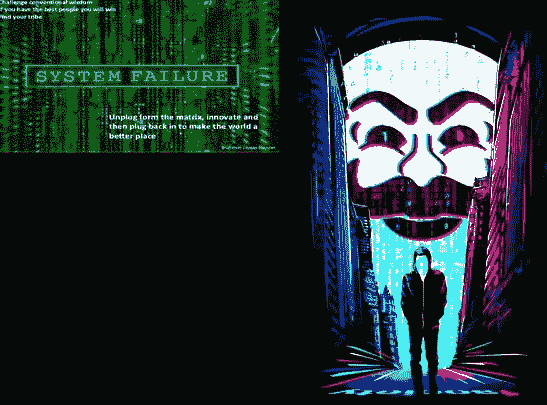

# 尺寸很重要——第三部分

> 原文：<https://medium.com/coinmonks/size-does-matter-part-3-b378244df7d5?source=collection_archive---------0----------------------->

## 令牌化网络的证券法哲学

感谢(排名不分先后)Ameen Soleimani、Peter Pan、Marc Goldich、Drew Hinkes、Olta Andoni、Marc Boiron、Lewis Cohen、Grant Gulovsen、Adrian Cortez、Jake Brukhman 和 CryptoLaw 的其他核心成员对第 3 部分的想法提出反馈。

**什么是“区块链基金会”？**

正如我们在[第二部分](/@lex_node/size-does-matter-part-2-fbcb20671b53)中所讨论的，交换法案是巨大的和多方面的，可能以多种多样的方式应用于各种各样的令牌化开放网络。我无法在一篇文章(甚至不是一篇由多个部分组成的文章)中全面地推测它们。

我想做的是特别密切地关注区块链世界非常怪异和独特的东西——“基金会”的不可或缺的角色——然后讨论如果《交易法》适用于他们，他们将会受到怎样的影响。

区块链技术“基金会”通常(不总是)是这样的组织:

*   据称是非营利性的
*   充当[区块链](https://medium.com/coinmonks/blockchain/home)协议的管理者(通常专注于一个特定的网络实例化该协议——例如以太坊基金会的以太坊主网)
*   直接或间接地通过向公众或更小范围的老练投资者销售预先挖掘的网络令牌来获得资金
*   是由首先推出该协议/网络的开发人员组成的，或者至少在执行层面上是由他们领导的
*   持有、配备人员和/或领导大量预先挖掘的网络令牌的个人——在基金会的情况下，作为其“金库”和持续资金来源，在管理基金会的个人的情况下，作为其个人财富的一部分
*   使用资金直接或间接支付人员继续研究和开发或鼓励采用协议/网络——这可以通过拨款、投资、商业伙伴关系或直接雇用来实现

在我看来，许多[区块链](https://medium.com/coinmonks/blockchain/home)基金会，如以太坊基金会、泰佐斯基金会和马克道基金会，符合这一基本模式的所有或大部分方面。让我们称这种模式为“原型区块链基金会”。

有趣的是，一些营利性公司，比如 Block。第一，也符合典型的区块链基金会模式，但事实是他们选择在明确的盈利基础上运作，而不是将自己标榜为非营利基金会。也有一些[区块链](https://medium.com/coinmonks/blockchain/home)基金会明显偏离了原型模式——例如，ZCash 基金会不是由 ICO 收益资助的，而是由协议逐步产生的网络启动后创始人奖励的接受者捐赠的。现在创始人奖励结束了，协议正在更新，直接给 ZCash 基金会新的区块奖励。电子硬币公司也有类似的资金，但以盈利为基础，可能会在多个区块链项目上工作，而不是单独为 ZCash 工作。还有其他类型的盈利性公司，它们对某些协议/网络具有很大的影响力，但在网络启动后显著崛起，并且/或者具有更加多样化的 L2 或企业应用重点 Blockstream 和 ConsenSys 等公司可以从这个角度来看待。分析所有这些略有不同类型的公司和基金会的监管考虑也很有趣，但出于时间/空间/注意力的考虑，我不打算在这里讨论它们。相反，我将把重点放在原型区块链基金会。

典型的区块链基金会何时会成为证券发行人？什么时候证券发行人需要根据《交易法》履行报告义务？这种潜在的报告状态意味着什么，对技术是好是坏？报告义务是否应该在某一点——在“充分分权”的点上停止？

这些我们都来说说吧。

**一个原型基金会**

为了避免给具体项目蒙上阴影，让我们假设一个有以下事实的基础。下面列出的一些细节与第 3 部分并不直接相关，但在第 4 部分讨论“充分的权力下放”过程时会变得更加相关。现在请随意浏览。

*   Power Foundation 通过向公众出售 PowerChain 的网络代币(PowerCoins)筹集了 5000 万美元
*   代币销售是根据一份白皮书完成的，该白皮书提出了以下技术发展路线图:(a)作为中本聪共识 PoW [区块链](https://medium.com/coinmonks/blockchain/home)推出(b)推出后添加私人交易(c)切换到新的共识算法和领导者选择机制，使 DAPPs 的开发者和用户能够获得批量奖励→“(b)”将使 PowerCoin 更有价值，但不会更多，因为有许多竞争对手提供隐私解决方案；相比之下，“(c)”预计最终将使 PowerCoin 变得更有价值，因为所有 DAPPs 都希望在 PowerCoin 上获得来自块奖励的额外收入，从而促进网络效应
*   没有 KYC 做代币购买者；Power Foundation 不知道他们是谁，住在哪里，也不知道他们是否是“合格投资者”，但怀疑可能有超过 1，999 名买家，其中许多人在美国
*   该基金会用 100 万美元的代币销售收入开发了一个包含该协议的软件客户端 MegaZord

MegaZord

*   该基金会资助了一个由四名全职开发人员组成的团队来维护和改进 MegaZord
*   电力网上的所有节点都由 MegaZord 供电
*   该基金会还有一个全职的营销和财务部门
*   表征组学如下:100M 总最大供应量(开采前和未来开采的总和)；代币销售时的 2000 万供应量(全部预开采)；7M 的预矿在代币销售中售出；pre-mine 的 300 万英镑奖励给了为 Power Foundation 工作的创始人/开发者；基金会将保留 1000 万英镑的预开采矿，以资助未来的营销和开发
*   因此，就在代币出售后，基金会持有代币当前供应量的 50%，基金会内部人士持有代币当前供应量的 15%，公众持有代币当前供应量的 50%；我们还假设批量生产奖励的通货膨胀率相当低，比如 2% /年，所以这些百分比在一段时间内可能相当稳定
*   该基金会有一个赠款小组，旨在为在 PowerChain 上构建东西、将 PowerCoin 功能集成到现有应用程序中的开发人员提供预期资助或追溯奖励。；这些赠款中有许多是从基金会的库存中以金币支付的，但也有一些是以瑞士法郎、BTC 或美元支付的，还有一些是以金币和其他货币混合支付的

对我来说，这很简单:在目前阶段，电力基金会是一个开发和营销开放的[区块链](https://medium.com/coinmonks/blockchain/home)网络的企业。即使权力基金会没有试图在实体层面产生利润，它也是由那些从代币中获利并可能有强烈盈利动机的人管理的。

Power Foundation 的资金来自向希望从中获利的人出售网络代币的收入，并持有一批代币，希望在未来代币增值后出售。这些销售的收益在证券法中被称为“风险资本”。令牌持有者期望主要从电力基金会和电力基金会支付的人员的努力中获得利润，因为他们继续开发和营销网络。

在我看来，这些事实使得代币既是用于金融目的的“网络股票”,也是用于法律目的的证券，并且它们使得 Power Foundation 成为证券发行者。

由于电力基金会拥有超过 1000 万美元的资产，那么如果电力代币由超过 499 名未经认证的投资者持有(他们几乎肯定是)，那么电力基金会将满足“规模问题”测试，并受《交易法》报告的约束。

这会是什么样子？会是好还是坏？

想象一个基金会都是交易所记者的世界

让我们想象一个世界，在这个世界里，电力基金会是《交易法》下的“报告公司”。

1.  ***正面后果***

首先，积极的结果:当我解释交易法的目的和效果时，代币持有者和公众将得到我在本文第 2 部分列出的所有类型的披露。在这种情况下，权力基金会是作为“证券发行者”的组织。它需要让公众了解其最新的财务状况、增发股票的销售情况、治理和薪酬安排，以及高管或董事的任何重大利益冲突。

我很难理解为什么这个披露本身会是一件积极的事情。一个组织也不太可能自愿提供这种程度的披露，即使它这样做了，披露也不太可信，因为在披露之前，SEC 不会审查披露内容并与基金会讨论，以确保它符合质量和可信度标准。

不仅代币持有者和公众将获得更多关于基金会的信息，而且基金会也将通过交易法第 13 节等法规获得更多关于市场的信息。这可能非常有帮助，尤其是在开发的早期阶段。在早期阶段，网络非常脆弱(由于诸如低令牌价格(和/或散列率，如果适用)、潜在的相对较高的基尼系数、仍然是实验性的等因素)。).在早期，任何事情都可能破坏网络的蓬勃发展的网络效应；如果电力网希望达到逃逸速度，就必须小心管理，如果电力基金会对市场了解得更多，就能够更好地管理它。

例如，如果 Power Blockchain 是一个 PoS 网络，并且有人计划通过积累巨额股份来攻击它的 51%，那么一旦达到 5%的所有权水平，攻击者将被法律要求披露积累和计划，这将有很大的好处。这些披露也将作为一种自然的基于监管的诱因来维持和增加去中心化，因为积累了太多代币的人必须要么向 SEC 和公众 KYC 自己，要么违反法律，这两者都不是很有吸引力。

《交易法》的第 13 条实质上是一个协议外的"[愚蠢的鲸鱼惩罚](https://www.youtube.com/watch?v=n6dt83DzggI&feature=emb_title)":根据你对去中心化如何影响价格的偏见，你甚至可以认为它是增强网络公平性的额外补充。当然，人们总是可以违反法律，积累，不披露，51%的人无论如何都会攻击——但如果他们知道 SEC 可能会找到他们并进行报复，他们肯定至少会有所畏惧。

代币持有者还会相信，权力基金会的高管和董事的利益与他们一致。这些官员和董事将被要求披露他们的代币持有情况及其代币购买和销售情况；如果他们在给定的六个月内买卖代币，赚取“短期利润”，他们将受到惩罚，并被要求为了其他代币持有者的利益将这些利润返还给基金会。

2. ***负面后果***

**A .合规成本**

代币可以自由交易股票证券的最大负面后果是，电力基金会将面临大量合规成本。"[上市公司每年的合规成本从 100 万美元到 300 多万美元不等，即使对于这样一家相对较小的公司也是如此。人们认为钱可以“更好地花在”开发、营销等方面。我认为这是一个价值判断，但我相信我概述的披露不仅从投资角度来看非常有价值，而且有助于网络安全。](https://www.dorsey.com/newsresources/publications/2009/03/going-dark--voluntary-delisting-and-deregistrati__)

我还认为，并非所有与报告公司面临的相同的披露义务——如萨班斯-奥克斯利法案的广泛金融控制义务——对大多数代币投资者来说都特别重要，并且 SEC 和立法者将愿意与代币发行者合作，以减少在代币化网络背景下强加不合理成本/收益比的披露义务，即使这些相同的义务对传统企业实体更有意义。

**B .有限的加密证券交易所**

与代币成为证券相关联的当前但暂时的负面后果是代币交易所的有限选择，代币交易所也有资格成为证券交易所或证券 ATS。当然，代币是否是一种证券并不完全是一个*的选择*——要么是，要么不是。但从某种程度上来说，既然我主张代币作为一种证券可能是一件好事，我也有责任指出潜在的负面影响。

然而，也有一些不错的选择——比如 [OpenFinance](https://www.openfinance.io/) ，它允许通过 MetaMask 交易基于以太坊的代币，并且有 24/7 的交易时间。出现更多交易证券代币的场所应该只是时间问题，如果比特币基地和北海巨妖最终没有注册成为证券交易所，我会感到惊讶。甚至一些纯粹的[加密货币](https://medium.com/coinmonks/crypto/home)交易所也在交易安全代币:例如，非美国版的币安交易 STX 代币，这是合格监管 A+产品中由 Blockstack 发行的证券。

让我们也不要忘记不断爆炸的 DeFi 和分散交易的世界。 [Uniswap](https://uniswap.io/) 是一个完全自主、分散的智能合约交易所，它通过自动做市功能来设定价格，现在不仅公开促进[加密货币](https://medium.com/coinmonks/crypto/home)的交易，还公开促进[安全令牌](https://beincrypto.com/first-security-token-launches-on-ethereums-uniswap-creating-true-real-estate-liquidity/)的交易。 [0x 协议](https://0x.org/)也很有趣，因为它将通常由一个集中交易运营商执行的功能分布在多个智能合约机制和更有限类型的市场参与者(称为中继者)之间，从而促进了信任减少的点对点交易。

在这一点上，我不准备评论这些分散的解决方案是否可以逃脱 SEC 作为证券交易所的监管，但至少有这样的可能性——毕竟，没有传统意义上的“中介”,因此交易所运营商监管背后的许多政策问题可能并不适用。也许更重要的是，像 Uniswap 这样的 DEx 实际上是不可监管的，除非 SEC 能够以某种方式说服广泛的 ETH 客户端开发人员、节点运营商和矿工在不规则的状态变化中将其硬分叉出去——这是一种极不可能的情况。在我个人看来，这是逃避监管的正确途径——消除对中介的需求，分散潜在审查者的权力。我看到了这种创新的光明前景。

**慈善鲸鱼失去匿名权**

上面提到的识别不怀好意的鲸鱼的能力也可能是负面的——仁慈的鲸鱼将受到同样的披露要求。注重隐私的鲸鱼将被阻止购买尽可能多的代币——他们可能会试图将他们的股份保持在供应量的 5%以下，这样他们就永远不必在公开文件中表明自己的身份。或者，他们可能收购大量股份而不披露，从而违反法律，并使自己面临证券交易委员会的行动或发行人的诉讼风险。阻止邪恶的鲸鱼是好事，阻止仁慈的鲸鱼是坏事——你不能只做一件事而不做另一件事。这是一个潜在的实质性负面消息，特别是对于一个利益攸关的网络来说，在这个网络中，仁慈的鲸鱼可能被视为对确保共识特别重要。

**D .杂底片**

还有一些其他潜在的问题，人们偶尔会提出，作为构成自由交易证券的证券的潜在负面因素，但我认为它们是相当投机的，而且有相当好的证据表明，至少在目前，SEC 也没有认真对待它们。其中包括以下论点，我认为这些论点基本上已经被揭穿:

*   如果协议令牌是有价证券，那么每个矿工都必须成为注册的经纪自营商(在第 1 节[中被揭穿)](https://www.sec.gov/Archives/edgar/data/1719379/000110465919020748/a18-15736_1ex1a15addexhbd6.htm)
*   如果协议令牌是证券，那么采矿者和/或发行者和/或“区块链”将需要成为注册的转让代理或清算代理(在第 2 节和第 5 节[中被揭穿，此处为](https://www.sec.gov/Archives/edgar/data/1719379/000110465919020748/a18-15736_1ex1a15addexhbd6.htm))
*   如果协议令牌是证券，那么网站、钱包或区块链的其他接口需要注册证券交易所或 ATS(在第 3 节[此处](https://www.sec.gov/Archives/edgar/data/1719379/000110465919020748/a18-15736_1ex1a15addexhbd6.htm)揭穿)
*   如果一个基金会出售更多的协议代币，如果这些代币是有价证券，那么它将违反规则 M(在第 6 节[这里](https://www.sec.gov/Archives/edgar/data/1719379/000110465919020748/a18-15736_1ex1a15addexhbd6.htm)揭露了一个潜在的事实模式)
*   由于持有代币证券，每个基金会都需要成为注册投资公司(在第 7 节[中揭露)](https://www.sec.gov/Archives/edgar/data/1719379/000110465919020748/a18-15736_1ex1a15addexhbd6.htm)
*   代币将作为证券征税——好吧，它们已经被征收了同样的惩罚性税收，如果不是更多的话；虽然一些律师主张更有利的税收方式，但几乎没有证据表明，即使代币不被视为证券，这种方式也会被采用

我经常听到其他律师和各种区块链爱好者声称，如果区块链代币被视为证券，它们将变得“无法使用”。Kik 和 Telegram 都曾在针对美国证券交易委员会的未决诉讼为自己辩护时提出过此类主张。然而，我还没有听到一个例子或强有力的论据表明，为什么一个 SEC 注册的、自由交易的网络令牌仅仅因为是一种证券就不能用于其预期目的。如果你有任何我忽略的例子，请联系我——我很想听听。

**比较好的一种粉底？**

我们已经讨论了很多关于证券法的细节，相当细致和半技术性的。我意识到这对非律师来说可能太多了，即使我忽略了许多技术上的细微差别。我欣赏到目前为止阅读了所有内容的人的耐心和思想开放。

为了让我们保持清醒，在我们进入本文的第 4 部分之前，我想暂停一下，回到我在本文第 1 部分开始时指出的问题上来。让我们做一点记录，并思考证券法如何帮助他们。

> **创始人不希望他们的代币成为一种证券，所以他们不能或不愿谈论、担心代币价格，或为代币价格努力**

在代币被简单地视为证券的世界里，这将不再是一个问题。然后，令人惊奇的事情可能会发生——协议开发者可以积极地、公开地推动令牌的价值，而不隐藏他们的意图。我们都知道像 Vitalik 这样有影响力的开发者希望为他们选择的网络令牌创造价值，所有令牌的持有者都希望并期待他们这样做。

此外，随着计划向 PoS 的过渡，我们不能再假装令牌值的问题是偶然的或微不足道的，因为网络的安全性直接取决于令牌值。那么，为什么我们在玩这些没有人关心的荒谬的游戏，为什么领先的开发者没有能力积极影响估值呢？这根本不是真的。

我们从这类游戏中可以得到的好处是，代币不被归类为证券，并且每年可以节省 1 2M 的合规成本。

我们从这种游戏中失去的是信息披露、市场动力，以及像 Vitalik Buterin 这样的技术领导者回答有关代币价值和市场动态的基本问题的能力和意愿。想象一下，如果像桑德尔·皮帅或埃隆·马斯克这样的首席执行官接到投资者电话，却拒绝回答关于价格、财务、预测和市场势头的基本问题，会是怎样的情形？当令牌持有者询问时，Vitalik Buterin 和其他区块链技术领导者拒绝此类问题也同样荒谬。

以下是埃隆·马斯克在投资者电话会议上说的话:“马斯克在电话会议上自信地告诉投资者，自动驾驶将把特斯拉变成一家市值 5000 亿美元的公司，现有的特斯拉将随着自动驾驶功能通过软件的加入而增值，三年内价值高达 25 万美元。”

难道我们不应该希望区块链的创始人能够以同样的方式与我们交流吗？他们可以，只要他们不试图荒谬地假装他们的代币不是证券。

> **这项技术没有像预期的那样发展得又快又好，因为每个人都在参与“去中心化的戏剧”来摆脱监管者；我们拥有的不是投资、项目管理和经过仔细谈判的合资企业，而是“赠款”和“粗略的社会共识”**

为了让软件开发看起来分散，从而(试图)避免受制于证券法，基金会不雇佣人员并指导和管理他们的工作——相反，他们给“独立团队”提供“资助”，然后声称不知道这些团队到底在做什么。

当网络相对成熟，只需要维护和逐步改进时，这可能是好的，事实上也是可取的。然而。当网络等待大规模升级时，如从 ETH 1.0 升级到 ETH 2.0，这种方法会适得其反，并可能带来灾难性后果。这不是启动一个基于新协议的全新网络的方式。

相反，新技术应该以初创企业的方式推出——在一个创始天才(或至多几个创始天才)的仁慈独裁下。为什么我们要构建 10 个客户，让 10 个独立的团队从事重叠的工作，做同样的事情？虽然拥有多个客户可能会导致一个更加分散的网络，这是好的，但他们中的任何一个都没有独立的长期资助计划——因此没有特别的理由预期当他们的发展伙伴用完赠款或失去兴趣时，几乎所有人都不会走平价客户的路。这不是资本或时间的有效利用。

相比之下，如果我们在证券法下接受相对集中和覆盖的初始阶段，这些技术项目可以得到有效和积极的管理，从而为令牌持有者、DAPP 开发者和用户带来更好的结果。

***注(出版后更新):*** 关于这一观点的对比，请在此阅读本·艾丁顿的文章。

虽然他承认以太坊 2.0 项目开发比典型的“集市”模型走得更远，即使按照开源标准("*)我们也走得更远。我们将这种方法应用于 Eth2 协议本身的开发，它的设计和它背后的研发…*")并坦率地承认"*如果在诸如[以太坊 2.0 上线的确切日期，一个 2 年的承诺路线图，以及跨碎片事务将如何保持不可组合性]等问题上没有答案，我就会被我以前的公司解雇，*"然而他认为这种混乱的开发过程是"T10 以太坊的魔力"“我不同意。混乱和开放是有区别的。但是我觉得他的观点值得在这里讨论。

> **token HODLers 受到了人类历史上最严重的泡沫破裂的惩罚，他们觉得自己的投资让创始人变成了名人百万富翁，而投资者被抛在了后面**

泡沫发生在受监管和不受监管的市场中，因此很难称之为泡沫。我确实怀疑，代币市场目前的低迷很大程度上是由于监管的不确定性。在一定程度上，监管实际上是被接受的——也许是认识到，虽然它带来一些成本，但也带来一些好处——不确定性将会减少，也许这为市场反弹奠定了基础。当然，市场是复杂的，监管的部分目的是通过消除信息不对称来防止投机泡沫。理想情况下，一个受监管的市场可能增长得更慢，但也更稳定、更理智；然而，当然，即使有规定，也没有保证。

> 新的资金正坐在场边，被前三分和对区块链的彼得-希夫和努里埃尔-鲁比尼式的阴影吓住了，这些被大众媒体中的正常人适时放大了

机构投资者和其他新资本来源肯定有可能被一个更受监管的市场吸引，为象征性的网络发展提供资金。与过去的 ico 不同，如果基金会赋予象征性持有人实施良好基金会治理的权利，比如选举董事的投票权，这一点尤其正确。过去，授予此类权利可能会被避免，部分原因是开发者担心，如果他们授予令牌持有者权利，令牌将被视为证券。一旦监管被认为是正常的，这种担忧就不再适用。

> **监管者落后于技术曲线 2-3 年，容易上当受骗，感到困惑，害怕败诉，所以他们只关注不需要重新思考法律的简单目标**

在我看来，尽管今年从美国证券交易委员会获得了一些不采取行动的信件，声明某些令牌不是证券，但它们并没有真正推动对话——从法律角度来看，它们是不需要动脑筋的，并且令牌不存在为令牌持有者带来好处或激发对新开放网络的热情的现实可能性。这不是进步之路。

对我来说，像 Blockstack 的 Regulation A+产品那样做更有意义——接受监管，但与 SEC 密切合作，以获得必要的灵活性。例如，SEC 似乎愿意接受 Blockstack 的观点，即 STX 可能是债务证券而不是股权证券(尽管我个人认为这些观点是错误的)，Blockstack 和 Blockstack 网络上的矿商不需要注册为经纪自营商。通过接受监管作为一个门槛问题，一个人打开了修改监管的大门，因为它们适用于开放的网络技术，所以法律补充而不是抑制技术。

> **立法者主要受华盛顿内部游说者的影响，这些游说者反过来又得到了区块链公司式项目的资助，他们提出了起草得非常糟糕且考虑不周的法律**

我将在第 4 部分讨论“充分的去中心化”时解决这个问题简而言之，我不认为仅仅因为数据库是“区块链”,就应该减少对它的监管。区块链只是一种数据结构。相比之下，我确实认为本质上作为无主的、分散的公共基础设施的开放网络应该得到法律规定的特权和豁免。致力于这些问题的游说者和立法者很容易被企业风格的区块链项目或更关心逃避他们过去错误的后果而不是成为法律的好管家的项目所左右；他们往往不知道是什么使分散的网络变得特殊，因此不知道如何恰当地起草这些类型的法律。

> **数百万美元被投入到证券法的辩护诉讼和“辩护基金”中，而不是投资于技术开发，这可能有一天会使法律变得无关紧要**

很明显。更少的违反证券法的行为，更少的诉讼，更少的浪费。

> **我们的技术是“不要相信，核实”，但我们的治理是“相信我们就好”，暗箱操作的“基金会”为令牌化的区块链网络做出几乎所有重大决策；他们根据像“社会契约”这样毫无意义的模糊概念来证明他们所做的一切**

这涉及到更深层次的治理问题，而不仅仅取决于证券法。也许我会把这个留到第 5 部分——或者完全是另一篇文章。就目前而言，只要考虑到如果代币持有者有良好的披露，他们将有更大的机会监督并向基金会提供反馈，他们将能够让基金会对渎职负责。

> 科技每天都在创造新的怪物； [**加密货币**](https://medium.com/coinmonks/crypto/home) **交易所正在变成投资银行，只是持有你的**[**crypto**](https://medium.com/coinmonks/crypto/home)**并支付你利息；与此同时，许多 DeFi 项目只是同一趋势下的一个轻微风险变化**

坦率地说，我不认为证券法能扭转这种局面；他们甚至会让事情变得更糟。然而，至少这些行为者将承担更大的责任——他们中的许多人将不得不成为注册的证券中介。

> **2015-2017 年的** [**加密**](https://medium.com/coinmonks/crypto/home) **巨鲸是我们新的科技风投之神，他们需要在让你进入更广阔的资本市场之前获得回报**

再说一次，在这里不可能完成所有的事情——财富往往会集中。然而，一个更加规范的开放网络代币市场可以带来更多的零售资金(合法)以及其他类型的大型投资者，如投资银行和养老基金。在某种程度上，你可能认为利益相关者的多样性是积极的，这可能有利于网络的健康和治理。

> **每一个职业需要提升的律师现在都是“加密律师”,即使在技术和文化变得完全空虚的时候，他们也在赚钱**

嗯，这种情况会继续下去。除了可能会减少诉讼，更先进的交易结构。随着时间的推移，高级交易结构会扩大规模，变得更便宜——SEC 文件是公开的，任何人都可以利用它们。相比之下，诉讼事实是模糊的，特定的事实，并且不会有助于使新项目的生活更容易。当你早期走捷径的时候，最终你会付出更多。

> ***2019 年最热门的项目发布会是脸书的《天平座》！！！！***

也许有了一个更加规范的市场，更多的项目可以获得资金——它们会更好，更有创造性，对人类更有价值？

在第四部分中，我们将进入正题——证券法何时停止适用？什么时候达到“充分放权”的地步？

在这方面还没有有约束力的法律先例。然而，我完全期望——如果我们能够避免通过使事情更加混乱的混乱的立法——能够确定明确的指导方针。

在第 4 部分的[中，我将提出我自己的测试版本，测试何时“充分去中心化”已经实现，开放网络令牌应该不再是证券。我不能保证这个测试会被当权者采纳甚至考虑，但也许它会给讨论增加一些动力，并有助于提供一些清晰度。](/coinmonks/size-does-matter-part-4-e66e2a242140)

> [直接在您的收件箱中获得最佳软件交易](https://coincodecap.com/?utm_source=coinmonks)

