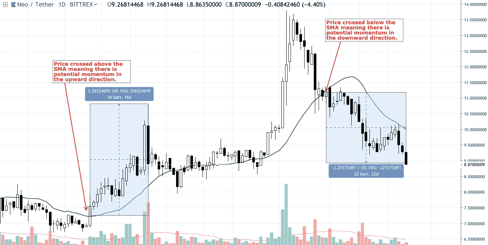
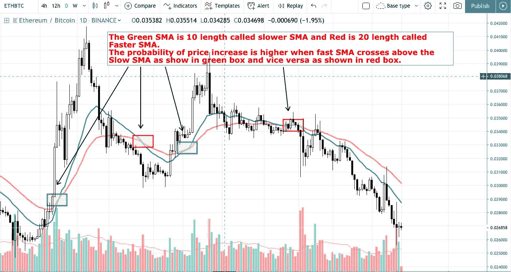
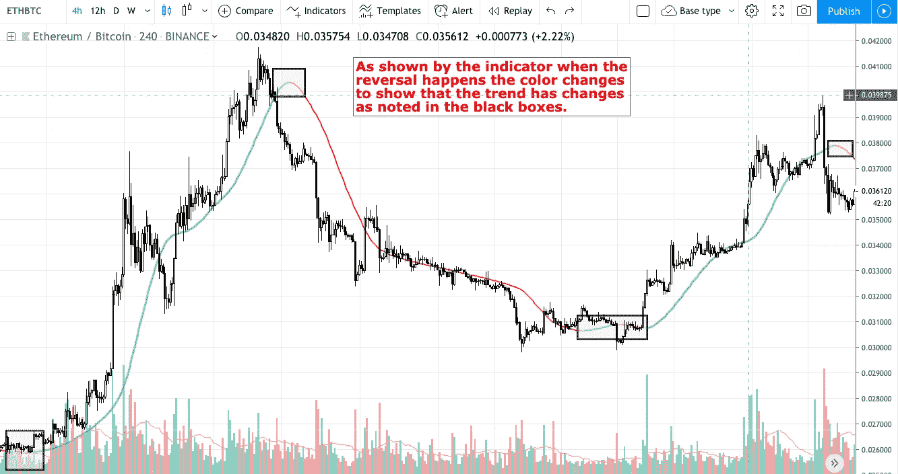
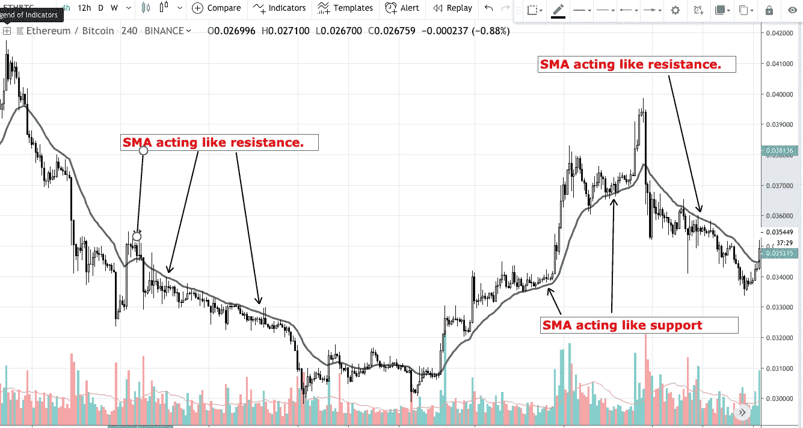
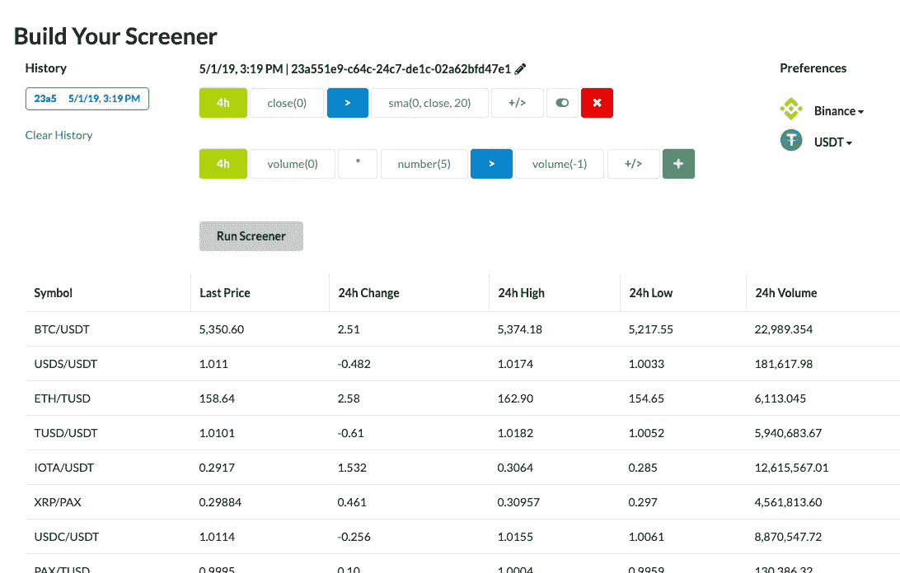

# SMA(简单移动平均线)—交易指标 101

> 原文：<https://medium.com/coinmonks/sma-simple-moving-average-trading-indicator-101-99a84849899f?source=collection_archive---------1----------------------->

简单移动平均线是一种技术指标，被全世界的交易者用于各种可能的资产，如股票、外汇、商品和水。

基本上它是一系列源数据的简单平均。在大多数情况下，用于计算简单移动平均线的默认源数据是收盘价数据集。

它们也被称为滞后指标，因为所使用的数据和显示的结果是基于过去的价格行为，并不表明近期的未来价格行为。也就是说，它们对于确认价格趋势的变化至关重要。

使用 SMA 交易有很多方法，下面是一些方法。

- **与 SMA 的价格交叉**

- **多个 SMA 交叉**

——**SMA 反转。**

- **用于支撑和阻力的 SMA**。

# 价格交叉 SMA:

第一种方法是用 SMA 上面或下面的交叉作为买入或卖出的指标。当 SMA 在价格上方交叉时，这意味着价格的涨幅低于平均水平，或者价格上涨的势头已经放缓，这意味着价格可能会进一步下跌。

类似地，当资产价格穿过 SMA 时，这意味着价格上涨快于平均价格运动，因此意味着该资产价格的动量正在上升。

关键是在价格交叉时找到合适的资产，并寻找这样的机会。

那么 SMA 交叉是否总是意味着收益呢？简单的答案是否定的，但这意味着获得收益的可能性很高。

很多时候，最好结合其他指标，如成交量的增加和 RSI，来帮助你做出更好的决定。

# 多 SMA 交叉:

在前面的例子中，我们使用价格变化和 SMA 来确定趋势是上升还是下降。在这个例子中，我们做同样的事情，但是我们使用 2 个 SMA 代替价格，一个长度较短，称为快速 SMA，另一个长度较长，称为慢速 SMA。

理论是相同的，但是较小的 SMA 平滑了价格曲线，消除了由于随机价格行为引起的微小不规则性。

当快速 SMA 在慢速 SMA 上方交叉时，这意味着价格可能会随着动量的增加而上涨，如果它在下方交叉，则相反，价格动量在下降。

“黄金跨界车”就是一个例子，这是一款使用 SMA 20 和 SMA 50 的著名跨界车。

200 长度的更长的 SMA 用于长期趋势确认。

# SMA 反转:

大多数情况下，当出现上涨或下跌时，使用 SMA 来进出交易资产，但关键是要关注这些 SMA 反转方向的时间。许多有经验的交易都认为这是反转后发生的正常交叉，这是许多人进入市场的已知点，但与反转时的成功进入相比，利润更少。像所有的交易一样，这个交易应该有一个止损和风险管理。

Noted the Black Box as the reversal is happening.

反转时形成的“U”形曲线是趋势变化的早期迹象。

# SMA 支撑和阻力:

许多有经验的价格交易者不把 SMA 用于简单的买卖，而是用它作为支撑和阻力。通常支撑和阻力是图表的水平线，但不是动态的，需要不断更新。SMA 作为一条动态线，随着价格的更新而变化和发展。

S&R 是一种生理障碍，有助于跟踪趋势，直到趋势最终打破。

除了上面的使用 SMA 的方法，还有更多的方法可以使用它，例如通过绘制两条使用高价位和低价位交易的 SMA 线，可以得到一个可以用来交易的 SMA 带。

另一个例子是使用开盘价和收盘价作为来源，绘制两条 SMA 线，并执行两条线的交叉，以进行买入或卖出。

这只是几个例子，人们可以通过多种方式个性化地使用 SMA。

SMA 的许多缺点主要是铺设方面和在较低的时间框架内无效。

为了克服均线的延迟部分，建议使用均线，因为均线公式更重视最新价格，因此反应更灵敏。

此外，建议主要在较高的时间范围内使用 SMA，如每日或以上，以避免各种虚假信号和噪声。

希望你喜欢这篇文章，我们是 tradeplanIO 正在开发一个密码筛选程序，帮助像你这样的交易者找到你正在寻找的硬币，无论它是 SMA 交叉还是反转，我们的筛选程序都会帮助你在其他人之前找到那个硬币。

要进一步了解这个指标如何帮助你赚钱和节省时间，请阅读下面的帖子

 [## 你是如何发现 WPR/联邦理工学院 30%的收益的？

### 在每次价格变动之前，通常会有微妙的变化，这些变化可以通过各种技术指标来检测。的…

medium.com](/tradeplan-io/how-you-could-have-found-the-wpr-eths-30-gain-1d58594383b2)  [## 85 分钟内逆向工程 LINK/ETH 的 50%。

### 密码波动性是吸引大量交易者进入密码市场的一个主要因素。

medium.com](/@shakks/reverse-engineering-link-eths-50-in-85-minutes-a28ad089aa0b) 

[TradeplanIO](http://tradeplan.io)

请访问 [TradePlanIO](http://Tradeplan.co) ,在 twitter 上告诉我们您的想法和疑问:@tradeplanIO

请随意提出任何问题或留下任何评论来改进或纠正帖子的任何部分，如果帖子有帮助，也欢迎鼓掌。

> [在您的收件箱中直接获得最佳软件交易](https://coincodecap.com/?utm_source=coinmonks)

