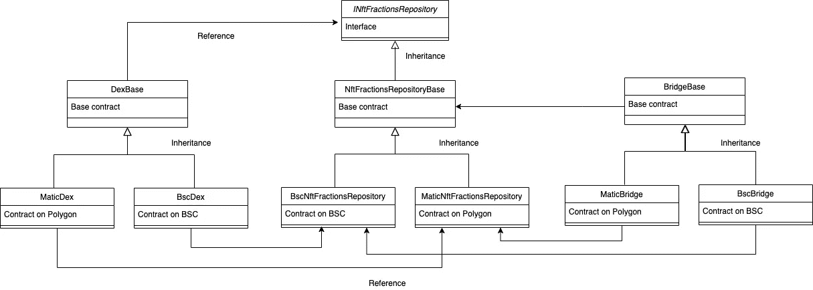

# 智能合同架构

> 原文：<https://medium.com/coinmonks/smart-contract-architecture-77a17ae9255d?source=collection_archive---------1----------------------->

让我们对应用程序中的智能合约有一个大致的了解。这些合同可以分为三种类型:

*   NFT 分数存储库合同，存储每个独立 NFT 的铸造 NFT 股份。这些存储库合同实现了 ERC1155 标准，因此代表原始 NFT 的每个令牌都可以分成任意数量。
*   持有交换功能的分散交换契约。
*   跨链实现必要转移功能的桥接协定。

我们正在谈论合同组，因为每种类型在每条链上都有一个版本。例如，Polygon 和 BSC 上都存在 NFT 分数库契约，因为每个链都必须单独处理在特定链上保存了多少分数。

两个链上的这些单个契约从一个公共基础契约继承了它们的核心功能，该公共基础契约也属于该智能契约组。

让我们在下图中将其形象化:

在图的中间，是 NFT 分数存储库合同组。它由特定于每个链的版本(MaticNftFractionsRepository、BscNftFractionsRepository)、它们的基本联系(NftFractionsRepositoryBase)以及可以从另一组合同引用的接口(例如:DexBase 合同)组成。

在左侧，有一个结构更简单的 Dex 合同组:一个基础合同和每个链上的一个版本。特定于链的契约引用了相应链上的 NFT 分数库契约，例如:MaticDex 契约引用了 MaticNftRepositoryContract。如果交易成功，Dex 必须在交易者之间转让股票，则需要此参考。

在右侧，有一个与 Dex 合同结构相似的桥梁合同组。

我们将在单独的文章中深入探讨每一组的功能，但一般来说，我们可以有两个观察结果:

1.  持有状态的合同可以通过 Openzeppelin 升级插件升级。这对于 NFT 分数储存库组和 Dex 合同组中的合同是真实的，因为两者都持有状态变量。另一方面，桥契约只实现逻辑，它们没有任何状态(它们只跟踪已处理的随机数，稍后会对它们进行更多的跟踪)，因此它们不必是可升级的。在出现错误的情况下，这些合同可以很容易地用新版本替换，而不需要任何复杂的升级过程来保存状态。可升级合同组从 Openzeppelin 的可升级合同版本继承其功能(例如:ERC1155Upgradeable、PausableUpgradeable、OwnableUpgradeable 等。).你可以在这里阅读更多关于 Openzeppelin 升级插件和如何写可升级合同的内容。
2.  这个项目的目的之一是玩技术。这也涵盖了[图](https://thegraph.com/)。应用程序的多边形端通过图形读取数据，而 BSC 端直接从智能合同读取数据，以便能够比较两种解决方案的优缺点。这种差异对我们必须如何编写智能合同产生了影响。与图形集成的组件必须发出事件，其他没有图形的组件必须支持丰富的数据读取功能:契约和数据读取函数中更多的内部数据结构。基于这些功能，我们可以支持数据读取用例。为了能够处理这些差异，基础契约定义了挂钩函数，这些函数可以在子契约中实现，以挂钩特定的功能。在多边形契约的情况下，这些钩子包含事件发射，在 BSC 契约的情况下，这些钩子函数更新内部数据结构。我们将在深入具体的合同组时详细说明这些差异。

关于智能合同安全性的一些思考:

*   合同一般是可以中止的。所以关键功能可以暂停。
*   合同也是可以拥有的。所以有些函数只能被契约的所有者调用。
*   处理货币或股票转移的函数是防止重入的。

上述所有功能都是通过适当的 Openzeppelin 合同实现的。

在下一节中，我们将详细介绍 [NFT 分数库合同](/@szmizorsz/nft-fractions-repository-contracts-3ecab96f3d1)。

如果你想阅读该系列的其他文章，你可以在[的主要文章](/@szmizorsz/nft-fractions-decentralised-exchange-introduction-3e696f27c065)中找到链接。

或者如果你想看我的其他项目和贡献:
[https://www.szabolcsszentes.com/](https://www.szabolcsszentes.com/)

> 加入 Coinmonks [电报频道](https://t.me/coincodecap)和 [Youtube 频道](https://www.youtube.com/c/coinmonks/videos)了解加密交易和投资

## 也阅读

 [## 杠杆代币[多头代币]终极指南

### 杠杆化令牌是具有杠杆化风险敞口的 ERC20 令牌，不考虑保证金、要求、管理…

medium.com](/coinmonks/leveraged-token-3f5257808b22)  [## 获取信号、交易机器人和套利

### 在本文中，我们将回顾 Bitsgap，这是一个满足您所有交易需求的一站式加密交易平台。它…

blog.coincodecap.com](https://blog.coincodecap.com/bitsgap-review)  [## 5 个最佳社交交易平台[2021] | CoinCodeCap

### 困惑于社交交易和副本交易哪个平台最好？本文将带您了解各种…

blog.coincodecap.com](https://blog.coincodecap.com/best-social-trading-platforms)  [## BlockFi 评论 2021:利弊和利率| CoinCodeCap

### 今天，我们提出了一个全面的 BlockFi 评论，这是一个成立于 2017 年的加密贷款平台，拥有其…

blog.coincodecap.com](https://blog.coincodecap.com/blockfi-review)  [## 如何在印度购买比特币？2021 年购买比特币的 7 款最佳应用[手机版]

### 如何使用移动应用程序购买比特币印度

medium.com](/coinmonks/buy-bitcoin-in-india-feb50ddfef94)  [## 加密税务软件——五大最佳比特币税务计算器[2021]

### 不管你是刚接触加密还是已经在这个领域呆了一段时间，你都需要交税。

medium.com](/coinmonks/best-crypto-tax-tool-for-my-money-72d4b430816b)  [## 存储比特币的最佳加密硬件钱包[2021] | CoinCodeCap

### 保管您的数字资产很容易，但找到正确的存储方式却是一项繁琐的任务。在线钱包有一个风险…

blog.coincodecap.com](https://blog.coincodecap.com/best-hardware-wallet-bitcoin)  [## Pionex 评论 2021 |免费加密交易机器人和交换

### Pionex 是为交易自动化提供工具的后起之秀。Pionex 上提供了 9 个加密交易机器人…

medium.com](/coinmonks/pionex-review-exchange-with-crypto-trading-bot-1e459d0191ea)