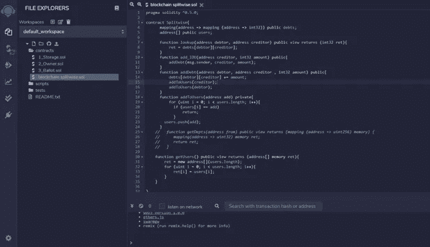

# 智能合同开发和部署

> 原文：<https://medium.com/coinmonks/smart-contract-blockchain-splitwise-dapp-544d344c838e?source=collection_archive---------5----------------------->

## 区块链 Splitwise 去中心化 App

你可能听说过智能合约，并对它们的工作原理感到好奇。如果你对这项新技术感兴趣，你就在一个好地方，因为在这篇文章中，我们将发现这些合同是多么有趣，它们是如何有用的。

为了达到我们的目的，我们将用一个项目来解释这个主题。因此，通过一步一步地理解和做这个项目，你可以找到这些问题的答案:

***什么是智能合约？***

***我们如何将这项技术用于不同的用例？***

什么是可靠性语言，我们怎样才能写出一份聪明的合同？

***什么是去中心化应用，它们是如何开发的？***

所以有很多话要说，让我们去挖掘它。我们想创建一个去中心化的系统来跟踪借贷 Splitwise 的区块链版本。如果你没有听说过这款应用，这是一种简单的方法来记录一群人中谁欠谁钱(可能在分摊午餐、杂货或账单后)。为了说明该应用程序，请考虑以下场景:

艾丽斯、鲍勃和卡罗尔都是喜欢一起出去吃饭的朋友。鲍勃上次和爱丽丝出去吃饭时付了午饭钱，所以爱丽丝欠鲍勃 10 美元。同样，卡罗尔和鲍勃出去吃饭时付了钱，所以鲍勃欠卡罗尔 10 美元。

现在，想象一下卡罗尔现金短缺，向爱丽丝借了 10 美元。请注意，在这一点上，不是每个人都在某个时候偿还他们的“贷款”，而是他们都同意谁也不欠谁。换句话说，无论何时出现债务循环，我们都可以将其从我们的簿记中删除，从而使一切变得更简单，并减少现金转手的次数。

我们将建立一种去中心化的方法来跟踪谁欠谁什么，这样就不需要依赖任何可信的第三方。有了这个介绍，你可能会猜测，这个过程将由一个智能合同来处理。

智能契约是一段代码，由**管理**流程的**状态。如果所需的条件得到满足，这个自动执行的协议可以使用**区块链**达成不同类型的**协议**。这些合同的关键是被称为区块链的分散网络。**

`Smart contracts`使用`blockchain technology`到 ***验证*** ， ***验证*** ， ***捕获*** ， ***强制执行*** 多方约定的条款。我会在另一篇文章中解释更多关于区块链的事情。

所以回到我们的项目，我们的`DApp`将在智能合约和区块链技术的帮助下编写。因为是在区块链，所以当 Carol 为她和 Bob 的餐费买单时，她可以要求 Bob 提交一张借据(他可以使用我们的 DApp 来完成)，她可以验证他确实提交了借据。公开的链上存储将作为谁欠谁的唯一事实来源。稍后，当上述循环得到解决时，Carol 将看到 Bob 不再欠她的钱。

因此，让我们来实现我们的智能合同，您可以添加一个欠条(我欠你)，所以我们需要`IOU`功能，我们需要一个获取所有债务的功能，我们需要为用户添加和获取功能。

从上面的代码中可以看出，`splitwise contract`包含了我们所需要的函数。这是一个用 solidity 语言写的代码。`Solidity`是我们用于实施智能合同的语言。它是在以太坊平台上开发的，允许程序员编写区块链 DApps。

*下面我们来看看这些函数是做什么的:*

**lookup(地址债务人，地址债权人)**public view Returns(uint 32 ret):返回债务人欠债权人的金额。

**add _ IOU(address credential，uint32 amount，...):**通知合同，msg.sender 现在欠债权人更多美元。这是附加的:如果你已经欠了钱，这将增加。

**addDebt(address 债务人，address 债权人，int32 amount):** 实际上，add IOU 函数使用了这个函数，它给出了 msg.sender 地址而不是债务人，然后，它将债务人和债权人之间的债务增加了给它的金额。它还向用户添加债权人和债务人地址。

现在是时候部署和运行我们的智能合同了，看看它实际上是如何工作的。为此，我们可以使用[混音网站](https://remix.ethereum.org)。

在创建了扩展名为`.sol`的合同文件后，我们可以通过选择正确的编译器版本从`SOLIDITY COMPILER`部分编译它。

在这种状态下，我们需要安装并运行`ganache-cli`，这是一个**区块链仿真器**。它用于在我们的本地机器上模拟一个真实的以太坊节点。它允许您调用区块链，而无需运行实际以太坊节点的开销。要安装这个模拟器，首先需要在系统上安装 Node.js 和 npm。然后，您可以通过以下命令轻松安装 ganache:

`npm install -g ganache-cli`

通过运行 ganache-cli，它将设置 **10 个默认以太网地址**，包括私钥和所有内容，并为每个地址预装 100 个模拟以太网。

现在，我们可以从 remix 网站的`DEPLOY & RUN TRABSACTIONS`部分轻松地将我们的合同部署到区块链。我们将环境设置为`Web3 Provider`，然后将端点设置为[http://localhost:8545](http://localhost:8545)——这应该是默认设置。现在，我们也有了部署合同的地址。

一旦部署了合同，您就可以使用智能合同的功能并进行交易。

首先，我们来做一笔欠条交易。默认情况下，我们当前的地址是 ganache 为我们创建的第一个地址。例如，我们选择 ganache 地址的第二个地址来表示我们欠它 5 英镑(ether 或$)。完成交易后，我们还可以看到交易详情:

使用查找函数会告诉我们债务人欠债权人多少钱:

您可以自己测试其他功能，享受部署智能合约的体验。

此外，我们有一个用户界面，为用户计算有用的信息，并允许非程序员使用 DApp。在`index.html`和`script.js`文件中实现。所有的源代码都可以在我的 [GitHub 库](https://github.com/mohsenamjadi/Ethereum-Smart-Contract-Blockchain-Splitwise-Solidity)中找到。

要使用客户端用户界面，只需在 script.js 文件中用`var contractAddress`替换您部署的智能合约的地址，就大功告成了。

此外，更多的细节在客户端源代码中处理，包括**解决债务循环**如下，我稍后将解释它们，或者你可以通过你的好奇心找到它是如何工作的。我希望你喜欢它。

> 加入 [Coinmonks 电报频道](https://t.me/coincodecap)，了解加密交易和投资