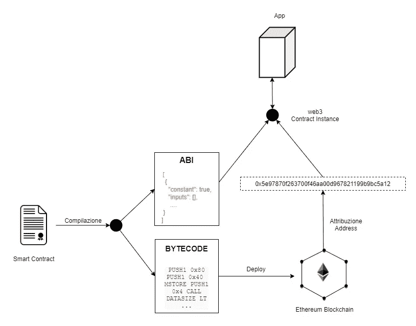

# 智能合同部署

> 原文：<https://medium.com/coinmonks/smart-contract-deploy-b98469e3e158?source=collection_archive---------6----------------------->

## 智能合约是一种软件，允许您与以太坊区块链进行交互，并创建去中心化的应用程序。但是他们的部署是如何工作的呢？代码发布后会发生什么？

智能合约的部署对于公开已开发的功能至关重要…