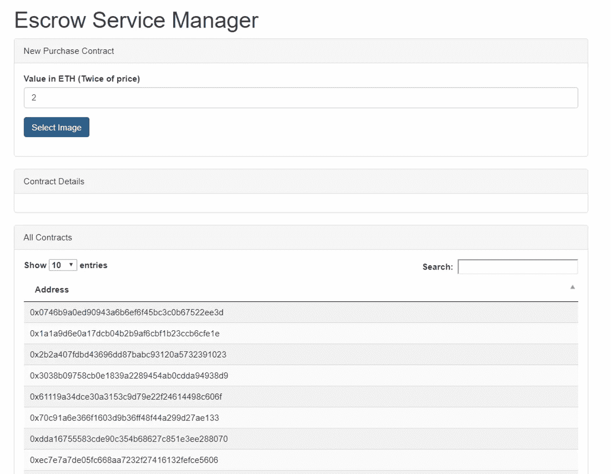
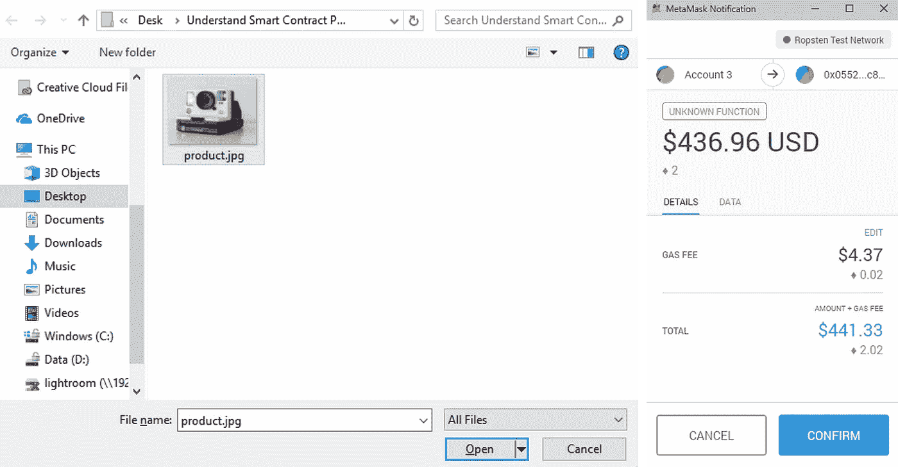
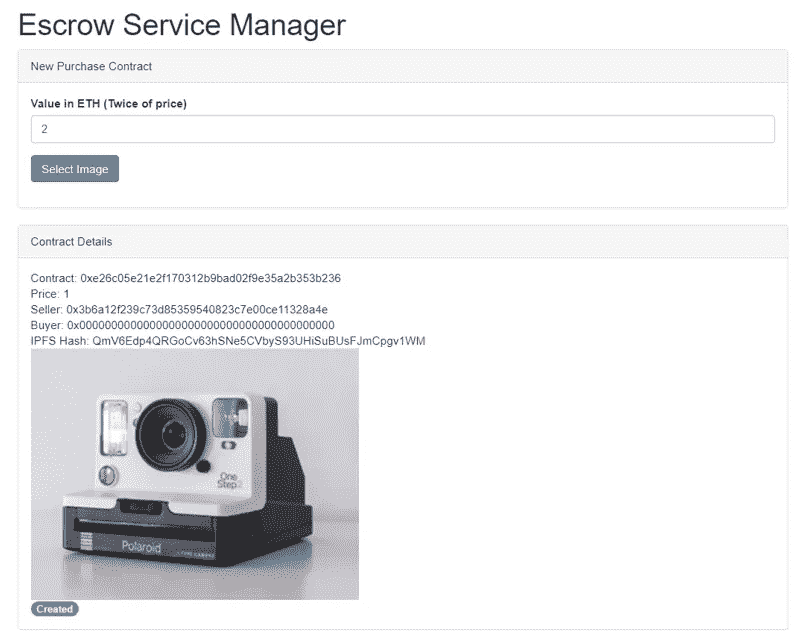
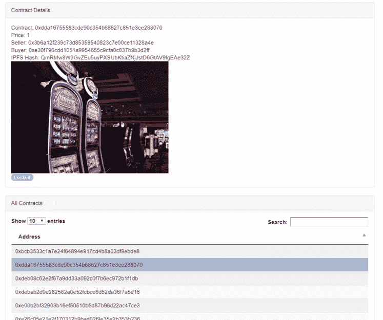

# 智能合同托管 DApp-卖方视图

> 原文：<https://medium.com/coinmonks/smart-contract-escrow-dapp-seller-view-f244b4a557fd?source=collection_archive---------6----------------------->


Photo by [Alex Person](https://unsplash.com/photos/kzhHEkQa4BQ?utm_source=unsplash&utm_medium=referral&utm_content=creditCopyText) on [Unsplash](https://unsplash.com/search/photos/seller?utm_source=unsplash&utm_medium=referral&utm_content=creditCopyText)

这是 2 部分文章中的第一部分，解释了由演示解释的[智能合约背后的代码，对于想要学习如何编写基于 Web3 的](/coinmonks/smart-contract-explained-by-demonstration-93b06e938474)[Dapp](https://ethereum.stackexchange.com/questions/383/what-is-a-dapp)作为 Solidity 智能合约的前端用户界面的开发人员来说，这将会很有意义。特别是，本文解释了以下方法:

1.  在 JavaScript 中执行智能合同功能
2.  写作和阅读来自 [IPFS](https://ipfs.io/)

在开发这个 DApp 时，我使用了几个第三方库，即:

1.  [jQuery 数据表](https://datatables.net/)
2.  [jQuery](https://jquery.com/)
3.  [Web3](https://github.com/ethereum/web3.js/)
4.  [IPFS](https://github.com/ipfs/js-ipfs-api)

在这一部分中，我将关注销售者的 UI。

Dapp 使用的 StartEscrow 智能合同可以在这里找到[这里](https://github.com/jacksonng77/StartEscrow/blob/master/Solidity/StartEscrowV2.sol)我以前写过一篇关于它如何工作的文章[这里](/coinmonks/creating-smart-contracts-with-smart-contract-d54e21d26e00)。

你可以在我的 Github 库[这里](https://github.com/jacksonng77/StartEscrow/blob/master/Web3/index.html)找到完整的卖方源代码。在接下来的部分中，我将引用我在 Github 中的代码的行号。

**初始化**

```
**if** (**typeof** web3 !== 'undefined') { 
     web3 = **new** Web3(web3.currentProvider); 
} 
**else** 
{ 
     // set the provider you want from Web3.providers 
     web3 = **new** Web3(**new** Web3.providers.HttpProvider("http://localhost:8545")); 
}
```

第 91 到 96 行初始化 web3。这里，web3 库检查 UI 是否是从具有 web3 提供者的 web 浏览器执行的。如果你在 Chrome 浏览器上安装了 [MetaMask](https://metamask.io/) 或者在[状态](https://status.im/)下运行这个页面，Dapps 的移动应用程序就会运行。否则，web3 将试图在您的机器中寻找一个正在运行的 Web3 提供程序来使用。

```
ipfs = **new** window.IpfsApi('ipfs.infura.io', '5001', { protocol: 'https' }); 
ipfs.id(function(err, res) { 
     **if** (err) **throw** err 
              console.log("Connected to IPFS node!", res.id, res.agentVersion, res.protocolVersion); 
}); 
web3.eth.defaultAccount = web3.eth.accounts[0]; 
var Buffer = window.IpfsApi().Buffer;
```

第 98 到 104 行初始化 IPFS，销售者的产品图像将被存储在这里。这里，我们在 [Infura](https://infura.io/) 上使用一个公共 IPFS 实例。要了解更多关于 IPFS 的信息，你可以参考我之前写的文章，这篇文章展示了 IPFS 如何与 Solidity 和 JavaScript 一起工作。

```
web3.eth.defaultAccount = web3.eth.accounts[0];
```

第 106 行说这个 Dapp 将使用你的 Web3 提供者中的默认帐户。例如，如果你使用 MetaMask 和 Chrome 来运行这个 Dapp，并且有几个钱包，它将使用你的第一个钱包中的 ETH。

```
var PurchaseContract = web3.eth.contract( 
     [ 
        { "constant": true, 
          "inputs": [], 
          "name": "seller", 
          "outputs": [
            ..... 
      ]
 );
```

在 [StartEscrow.sol](https://github.com/jacksonng77/StartEscrow/blob/master/Solidity/StartEscrowV2.sol) 中有 2 个智能合约。第 108 到 204 行陈述了第一个智能合同——purchase Contract 的[应用程序二进制接口(ABI)](https://ethereum.stackexchange.com/questions/234/what-is-an-abi-and-why-is-it-needed-to-interact-with-contracts) 。智能合约的 ABI 可以通过将智能合约代码复制并粘贴到 [Remix](https://remix.ethereum.org/) 并编译您的合约来获得。

```
var StartEscrowContract = web3.eth.contract( 
      [ 
          { "constant": false, 
            "inputs": 
            [
               ...... 
      ] 
);
```

第 242 到 348 行说明了第二个智能合同的 ABI—`StartEscrowContract`。

```
var StartEscrow = StartEscrowContract.at('0x05525d0692794ee5a19fa8b259f1100358ffc882');
```

第 349 行说明了我正在运行的 StartEscrowContract 的地址。您可以将该地址复制并粘贴到 [Etherscan Ropsten](https://ropsten.etherscan.io/) 中进行查看。这个 DApp 允许我们启动尽可能多的`PurchaseContract`实例。

**检索采购合同**

```
//retrieve all the contracts from the blockchain first 
StartEscrow.getContractCount(function(error, result){ 
      **if**(!error){ 
               console.log(JSON.stringify(result)); 
               var contractCount = Number(result); 
               var t = $("#contractTable").DataTable(); t.clear(); 
               **for** (var i = 0; i<contractCount; i++){ 
                           StartEscrow.contracts(i,function(error, result){ 
                                         **if**(!error){ 
                                               t.row.add([result]).draw(false); 
                                               console.log(JSON.stringify(result)); 
                                         } **else**{ 
                                               console.error(error); 
                                         } 
                           }); 
              } 
     } 
    **else**{ 
              console.error(error); 
     } 
});
```

第 353 到 374 行检索所有由 StartEscrow 启动的购买合同。它初始化数据表，读取采购合同的每个实例，并将它们的地址添加到表中。你可以在下面的“所有合同”部分看到一个例子。



**发布待售商品**

```
$("#file-upload").change(function() { 
     $("#loader").show(); 
     var reader = **new** FileReader(); 
     reader.onload = function() { 
          mybuffer = Buffer.from(**this**.result); 
          ipfs.files.add(mybuffer, function(err, result){ 
               **if** (err) { 
                    console.log("Error"); 
               } 
               **else** { 
                    ipfsHash = result[0].hash; 
                    StartEscrow.newPurchase(ipfsHash, {value: $("#price").val()*1000000000000000000, gas: 1000000, gasPrice: web3.toWei(2, 'gwei')}, 
                    function(error, result){ 
                           **if**(!error){ 
                                   console.log(JSON.stringify(result)); 
                           } 
                           **else**{ 
                                   console.error(error); 
                           } 
                      }); 
                } 
             }); 
    } 
    reader.readAsArrayBuffer(**this**.files[0]); 
})
```

`("#file-upload").change();` 是在用户从他的机器上选择一张图片并输入物品的售价后执行的。

上面的第 400 到 425 行读取图像，将它转换成一个缓冲区，并将其添加到 IPFS 文件系统。IPFS 文件系统根据文件上传的内容生成哈希代码。`StartEscrow.newPurchase`通过提供 IPFS 散列、该项目的销售价格和天然气价格来执行，以作为运行合同的参数。



**关注采购合同的成功执行**

```
var newPurchaseContractEvent = StartEscrow.newPurchaseContract();
    	newPurchaseContractEvent.watch(function(error, result){
            **if** (!error)
                {
                    $("#loader").hide();
                    $("#contractaddress").html("Contract: " + result.args.contractAddress);
                	loadContractDetail(result.args.contractAddress);
                	var t = $("#contractTable").DataTable();
                    t.row.add([result.args.contractAddress]).draw(false);

                    ipfs.pin.add(ipfsHash, function (err) {
                    	**if** (err){
							console.log("cannot pin");
                        }
                    	**else**{
                        	console.log("pin ok");
                        }
                    });

                } **else** {
                    $("#loader").hide();
                    console.log(error);
                }
        });
```

第 375 到 398 行等待和观察购买合同的执行。一旦采购合同生效，它将:

1.  用此合同的详细资料更新合同详细资料部分
2.  将合同的地址添加到数据表中。
3.  将映像固定到 IPFS，以便将其永久写入文件系统。



**点击采购合同地址**

卖方 DApp 允许卖方监控他已经执行的购买合同。为此，请点击表格中的地址并阅读合同详情。



```
$(document).ready( function () {
    		var table = $('#contractTable').DataTable();
           	$('#contractTable tbody').on( 'click', 'tr', function () {
        		**if** ( $(**this**).hasClass('selected') ) {
            		$(**this**).removeClass('selected');
        		}
        		**else** {
            		table.$('tr.selected').removeClass('selected');
            		$(**this**).addClass('selected');
        		}
    		} );

			$('#contractTable tbody').on('click', 'tr', function () {
				var data = table.row( **this** ).data();
            	$("#contractaddress").html("Contract: " + data[0]);
				loadContractDetail(data[0]);
			} );
		} );
```

第 72 到 89 行初始化数据表。它还说明了当用户单击数据表中的一个合同地址时会发生什么情况— `loadContracDetails()` 将执行以在合同细节部分加载该采购合同的细节。

```
function loadContractDetail(address){
    	var Purchase = PurchaseContract.at(address);

    	Purchase.value(function(error, result){
   			**if**(!error){
            	console.log(JSON.stringify(result));
       			$("#itemvalue").html("Price: " + Number(result)/1000000000000000000);
            }
   			**else**{
       			console.error(error);
            }
		})/18;

    	Purchase.seller(function(error, result){
   			**if**(!error){
            	console.log(JSON.stringify(result));
       			$("#seller").html("Seller: " + result);
            }
   			**else**{
       			console.error(error);
            }
		});

        Purchase.buyer(function(error, result){
   			**if**(!error){
            	console.log(JSON.stringify(result));
       			$("#buyer").html("Buyer: " + result);
            }
   			**else**{
       			console.error(error);
            }
		});
        Purchase.ipfsHash(function(error, result){
   			**if**(!error){
            	console.log(JSON.stringify(result));
       			$("#ipfshash").html("IPFS Hash: " + result);
       			$("#ipfsimage").html("");
            }
   			**else**{
       			console.error(error);
            }
		});

        Purchase.state(function(error, result){
   			**if**(!error){
            	console.log(JSON.stringify(result));
            	**if** (Number(result) === 0){
                	$("#state").html('<span class="badge progress-bar-success">Created</span>');
                }
            	**else** **if** (Number(result) === 1){
                	$("#state").html('<span class="badge progress-bar-info">Locked</span>');
                }
            	**else** {
                	$("#state").html('<span class="badge progress-bar-danger">Inactive</span>');                
                }
            }
   			**else**{
       			console.error(error);
            }
		});
    }
```

第 427 到 488 行定义了`loadContractDetail()` does。`loadContractDetails()` 接受采购合同的地址作为参数。然后，它调用相应的智能合同函数来检索合同详细信息部分，并用相关值填充该部分:

1.  `Purchase.value()` -这个物品的价值。
2.  `Purchase.seller()`——卖家的地址。
3.  `Purchase.buyer()` -买方的地址。
4.  `Purchase.ipfsHash()` -项目图像的哈希值。
5.  `Purchase.state()` -该采购智能合同的当前状态

**接下来是什么？**

在下一部分中，我将研究买方 Dapp 背后的代码。

[Alex Person](https://unsplash.com/photos/kzhHEkQa4BQ?utm_source=unsplash&utm_medium=referral&utm_content=creditCopyText) 在 [Unsplash](https://unsplash.com/search/photos/seller?utm_source=unsplash&utm_medium=referral&utm_content=creditCopyText) 上的照片

> [直接在您的收件箱中获得最佳软件交易](https://coincodecap.com/?utm_source=coinmonks)

[](https://coincodecap.com/?utm_source=coinmonks)