# 智能合约利用第 1 部分—以捕获以太(彩票)为特色

> 原文：<https://medium.com/coinmonks/smart-contract-exploits-part-1-featuring-capture-the-ether-lotteries-8a061ad491b?source=collection_archive---------1----------------------->

几个月前，一系列与稳固性(以及区块链总体情况)相关的挑战以游戏形式发布，玩家需要破解智能合约，耗尽其中的能量才能获胜。总共有 17 个不同难度的挑战，有 3 个热身挑战是为那些不熟悉坚固性的人准备的。这一系列的文章将分享我解决这些挑战的方法，当然，如果你是一个 Solidity 开发人员并且还没有尝试过这些挑战，我强烈建议你在阅读其中包含的方法之前尝试一下。

这些挑战可以在网站上找到:[https://capturetheether.com/challenges/](https://capturetheether.com/challenges/)
这些挑战的作者是非常聪明的 smarx，抓住他的推特账号@smarx。

这篇文章将直接跳到彩票部分，说明在一个公共的、确定性的分布式系统上保守秘密或创建随机值可能是一个挑战。本文还假设了一些关于可靠性和相关开发工具的知识。

事不宜迟——前方有巨大的剧透！

# 1.猜猜这个数字

源代码如下:

为了获胜，我们将需要调用函数`*guess*()`，通过变量`*n*`传递答案，并随事务一起发送 1 ether。由于我们可以访问源代码，我们可以清楚地看到答案是 42！用参数`*n = 42*`调用函数`*guess*()`将解决这个问题。

虽然这很简单，但我确实相信作者试图暗示一些更深层次的东西。注意`*uint8 answer = 42*`没有访问修饰符，默认为 private。如果源代码没有公开发布，那就不那么明显了，因为我们将只能访问字节码:

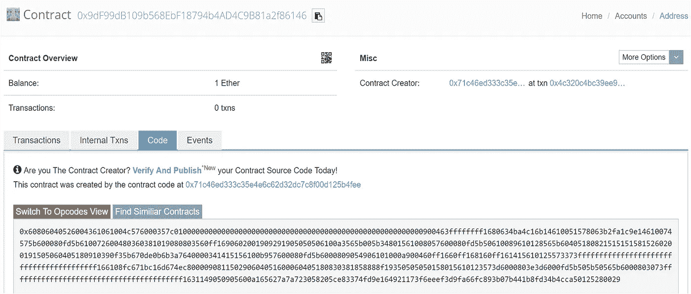

Code not published — We can only see bytecodes.

这可能会让一些人认为变量是完全不可访问的，不幸的是，这是错误的。即使声明为 private，我们仍然可以通过运行下面的命令并查找相关的存储索引来访问契约的状态存储:

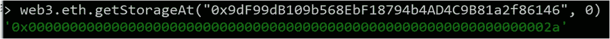

Accessing the storage index.

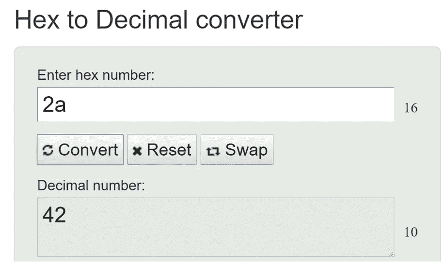

0x2a in hex, decimal equivalent of 42.

# 2.猜测秘密数字

源代码如下。

也许明文是个糟糕的主意。让我们散列答案。所以现在我们需要调用函数`*guess*()`，同样通过变量`*n*`传递一个数字，这将使 keccak256 散列并与状态变量 answerHash 比较，即`*0xdb81b4d58595fbbbb592d3661a34cdca14d7ab379441400cbfa1b78bc447c365*`。

除了变量`*n*`声明为 uint8。即 8 位，最小整数为 0，最大整数为 255，要测试的概率空间为 256。实际上没有那么多要讲的，所以让我们快速地做些混音…

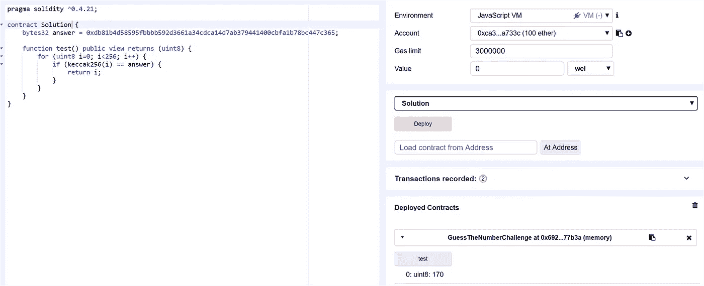

Creating a contract in Remix which brute forces the 256 probability space.

我们得到的答案是 170！同样地，用以太发送答案，我们将完成这个挑战。

请注意，只要您有一个可以访问的 keccak256 实现/库，任何其他编程语言都应该会给出相同的结果，尽管要记住数据类型，例如，大多数在线转换器将输入视为字符串，这将被不同地散列。例如，使用`*web3.sha3*`:

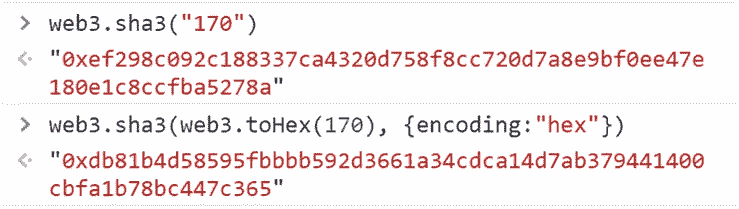

Note that datatype influences the hex output for hashing.

# 3.猜随机数

源代码如下。

因此，现在状态变量`*answer*`使用之前的块 hash 和当前块时间戳初始化，其中块 hash 和当前块时间戳用 keccak256 散列，并向下转换为 uint8。现在这有一些问题…

1.  获得这里使用的 blockhash 和块的时间戳很简单。再者，一般不建议使用 blockhash 作为随机种子(见[这个](http://hackingdistributed.com/2017/12/24/how-not-to-run-a-blockchain-lottery/)，和[这个](https://blog.positive.com/predicting-random-numbers-in-ethereum-smart-contracts-e5358c6b8620))。
2.  状态变量`*answer*`只有 0 到 255 的概率空间，最大需要 256ETH 以蛮力方式迭代(但我们不需要)。
3.  如**猜数字**所述，私有变量仍然可以访问。

我们可以很容易地获得 blockhash，方法是找出合同部署的 blocknumber 减 1，并从 Etherscan 检索该块的 blockhash。Timestamp 是部署合同的块号的 Unix 时间戳。Keccak256 这两个值，并将其转换为 uint8，我们就有了答案。

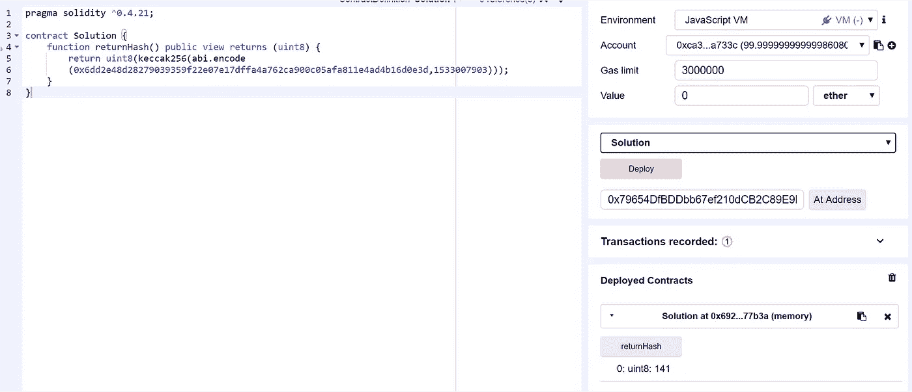

Manually applying keccak256 on blockhash and timestamp to produce the result we want.

或者，更简单的方法是访问状态变量索引。

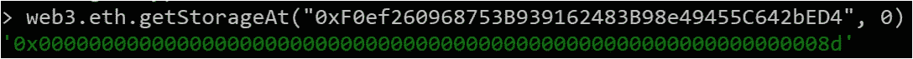

Accessing the storage index, hex 0x8d = decimal 141

# 4.猜猜新号码

源代码如下。

这与“猜测随机数”非常相似，不同之处在于变量`*answer*`在每次猜测时被初始化。从表面上看，似乎引入了某种程度的随机性，因为我们不太可能知道 blockhash 是什么；除了实际上我们甚至不需要知道 blockhash 是什么来利用这种情况。

更详细地说，回想一下，可以使用一个智能协定调用另一个智能协定，发送的每个事务都在同一个块中完成执行，即使该事务涉及跨多个智能协定的执行。为了利用这个契约，我们应该构建一个单独的智能契约，使用相同的机制调用函数`*guess()*`来初始化变量`*answer*`，我们将使用完全相同的值，因为执行是在相同的块中完成的，使用相同的块哈希和时间戳。

现在我们知道了这一点，让我们开始混音吧。请记住，我们的解决方案需要将 1 个以太转移到我们希望利用的契约，因此我们的函数需要是可支付的，允许我们在执行期间发送 1 个以太。

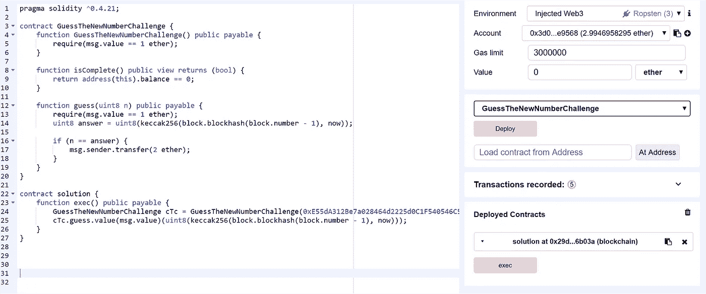

Our exploit contract code.

嗯。我们部署了合同，但为什么当我们试图执行漏洞时，Remix 会抱怨交易可能会失败？

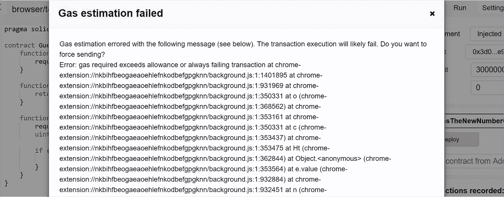

The transaction will always fail? Hmm.

让我们后退一步，再次回顾这一点。当我们使用智能契约调用函数`*guess()*`时，假设输入是正确的，**guess new number**契约将返回 ethers，在本例中是返回给`*msg.sender*`。回想一下，`*msg.sender*`指的是交易的发送者，在这种情况下，我们将使用合同地址来利用漏洞(相比之下，`*tx.origin*`指的是原始发送者)。现在，我们看到了当前解决方案的两个问题:

1.  不允许应付回退功能。
2.  即使指定了一个回退应付函数，我们也想收回乙醚，所以我们需要以某种方式告诉合同将它退回给我们。

回退函数只是一个函数，如果没有其他函数与被调用的函数签名相匹配，则默认执行该函数。例如，当将乙醚作为正常交易发送给合同，从而触发可支付回退函数执行时，或者当调用函数但该函数在合同中不存在时。为了将醚返回给我们，我们可以指定一个函数将醚传递回来，或者使用`*selfdestruct(msg.sender)*`。请注意，这并没有编码到回退功能中，因为没有足够的气体从传输操作中转送过来。

因此，漏洞代码看起来应该是这样的:

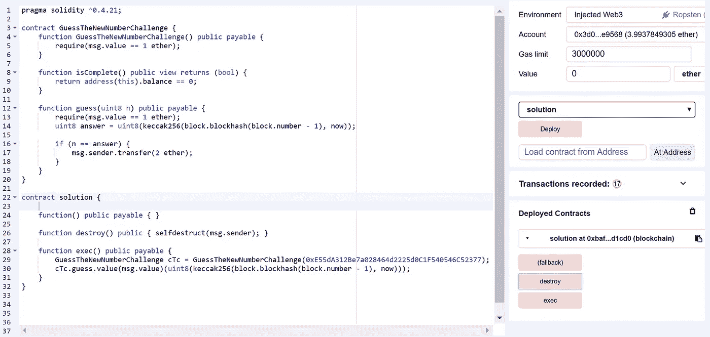

Our updated exploit contract code.

运行`*exec()*`和随后的`*destroy()*`将让我们取回我们的醚。

# 5.预测未来

源代码如下。

对于这个挑战，我们需要事先提交我们的猜测。提交猜测将记录下`*guess*`的值和`*guesser*`的地址。有一个变量`*settlementBlockNumber*`作为条件变量，所以`*settle()*`只能在后续程序块中调用。当我们调用函数`*settle()*`时，会运行一个评估来查看提交的猜测是否与使用之前的 blockhash 和当前块时间戳 mod 10 创建的 keccak256 哈希的 uint8 转换匹配。这意味着概率空间是 0 到 9，在这个范围内的任何猜测都有 10%的机会是正确的。

利用我们从 pass challenges 中学到的知识，我们的利用序列应该看起来有点像这样:

1.  创建另一个契约，它主要应该有两个功能:提交对 **PredictTheFuture** 契约的猜测；评估我们的猜测是否正确
2.  提交我们的猜测。
3.  提交后，开始评估我们的猜测是否正确。
4.  如果我们的猜测是正确的，合约将继续调用**预测未来**合约上的`*settle()*`。

我们将部署一个漏洞利用契约，在这里我们可以锁定我们的猜测，并且使用像 Web3JS 这样的库(我将使用 Nethereum ),我们可以每一个/几个块调用一次漏洞利用契约来执行漏洞利用。或者，我们也可以通过每隔几个块重新混合来手动调用漏洞利用合同函数。

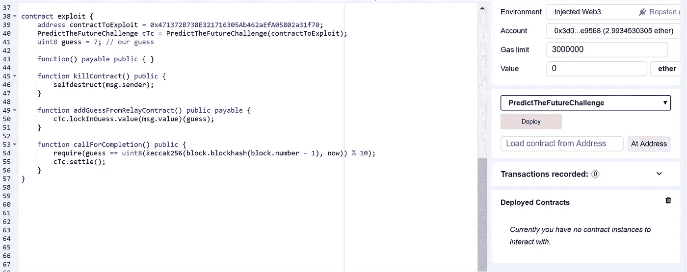

Create our exploit contract. Don’t forget to place payable on relevant functions.

让我们锁定 7 作为我们的猜测。

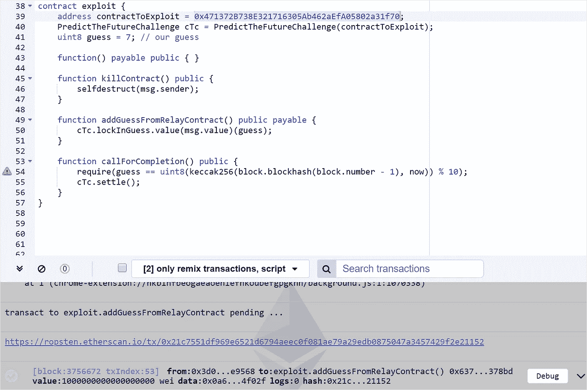

Committing 7 to be our guess.

加载 VS2017 并创建一个函数来调用我们的漏洞利用合同。当我们浏览可爱的猫图片时，让它做它的事情。

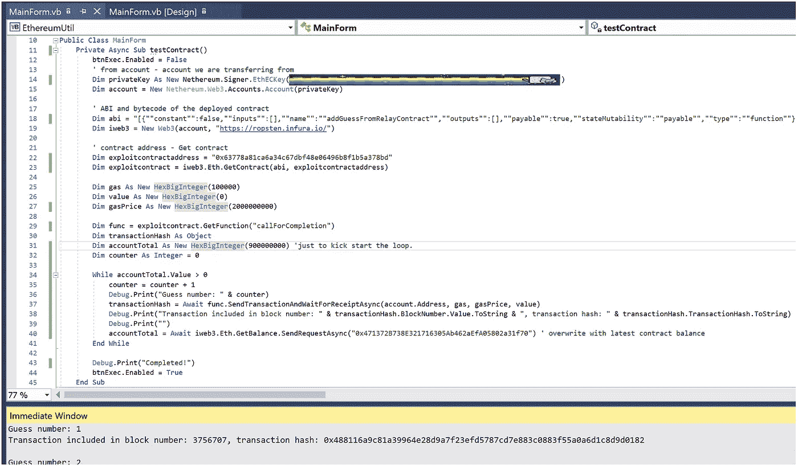

Letting our program do all the hard work for us.

一旦我们的漏洞利用合同获得正确的猜测，该功能应该完成并停止。

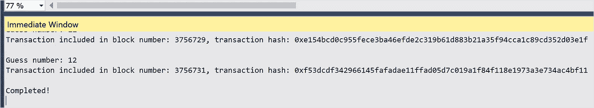

And we are done!

现在，我们只需要调用我们的开发合同上的`*killcontract()*`来自毁和取回乙醚，完成这个挑战，并继续进行彩票部分的最后一个挑战。

# 6.预测块哈希

源代码如下。

这个很有意思。像前面的挑战一样，我们需要提交我们的猜测，并在随后的块上调用函数`*settle()*`来查看我们的猜测是否正确。主要的区别在于，当我们提交我们的猜测时，我们也指定了解决方案散列是下一个块的散列(`*block.number + 1*`)，并且是 256 位空间，不可能进行暴力破解。

然而，这个契约的撤销是因为它依赖于块哈希，并且块哈希的检索只适用于 256 个过去的块(出于客户端实现效率的目的)，超过 256 个块的检索只返回`*0x0000000000000000000000000000000000000000000000000000000000000000*`

以太坊黄皮书和 Solidity 文档中都提到了这一点:

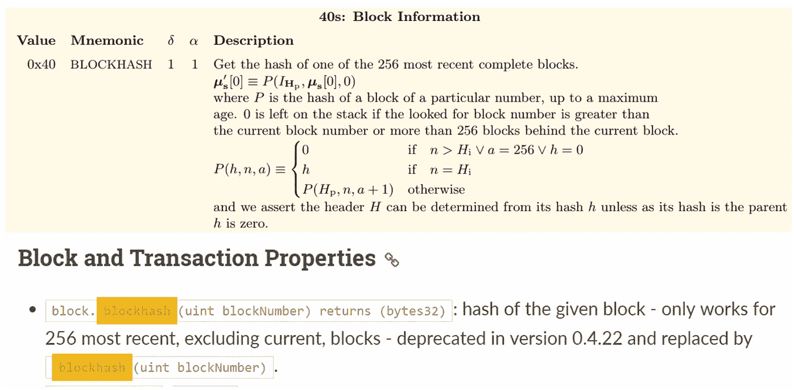

Reading the docs — Ethereum Yellow Paper and Solidity docs.

把这些放在一起，利用这个契约就足够简单了。提交一个`*0x0000000000000000000000000000000000000000000000000000000000000000*`的猜测，等待 256 个方块通过(大约一个小时，或者一个半小时)，然后执行函数`*settle()*`完成挑战。

# 结论

这是这个多部分系列的第一部分。显然，在确定性分布式系统上保持数据的私密性和随机性是很困难的。一些关键要点:

1.  请始终注意，公共区块链上的所有数据和交易都是公开的，所有人都可以看到。
2.  请始终注意，另一个智能合约可以调用您的智能合约以实现某种程度的自动化和状态共享，因此您的智能合约应该设计得足够安全，可以被外部拥有的帐户和合约帐户调用。
3.  避免使用 blockhash 作为随机计算的种子——它可能是你的随机熵方案的一部分，这取决于你的智能契约处理多少价值，但不要依赖它。在处理巨大值时，考虑结合额外的熵源，如参与者的地址、提交-揭示方案、防止共谋的博弈论方案、使用预言等。
4.  时刻注意 EVM 的行为和怪癖。

该系列的其余部分将在未来几周内发布，可能会先发布会计和杂项部分，因为我怀疑我会让数学变得相当冗长。让我们看看。与此同时，我鼓励你尝试其余的挑战——祝你一切顺利！

> [直接在您的收件箱中获得最佳软件交易](https://coincodecap.com/?utm_source=coinmonks)

