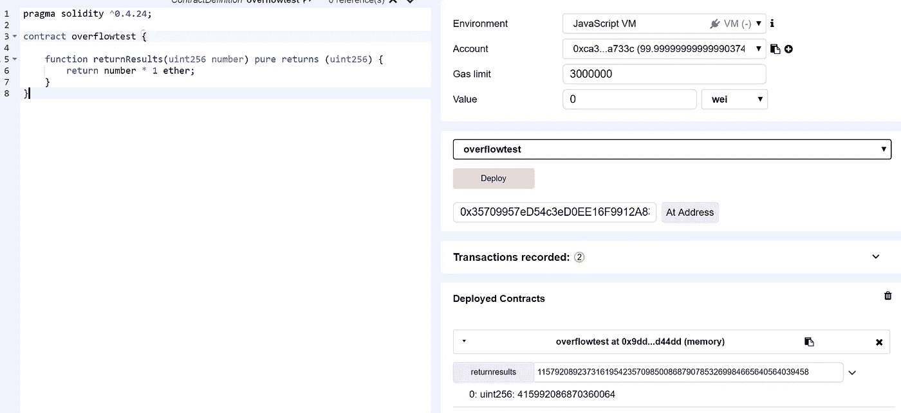

# 智能合约利用第 2 部分—以捕获以太(数学)为特色

> 原文：<https://medium.com/coinmonks/smart-contract-exploits-part-2-featuring-capture-the-ether-math-31a289da0427?source=collection_archive---------2----------------------->

这是《捕捉以太》的第二部分。在起草我的笔记后，我决定先研究数学部分，最后以账户+杂项结束。数学部分，顾名思义，主要关注基于数学的挑战，围绕溢出，操纵可靠性存储机制，以及简单草率的编码。如果你还没有这样做，请尝试一下挑战，因为我个人认为这是捕捉以太开始变得真正有趣的地方。

对于错过第一部分的人:[https://medium . com/@ enigmatic 1256/smart-contract-exploits-part-1-featured-capture-the-ether-lotteries-8a 061 ad 491 b](/@Enigmatic1256/smart-contract-exploits-part-1-featuring-capture-the-ether-lotteries-8a061ad491b)

可以找到这些挑战的网站:[https://capturetheether.com/challenges/](https://capturetheether.com/challenges/)
这些挑战的作者是非常聪明的 smarx，抓住他的推特账号@smarx。

和以前一样，这篇文章需要一些关于 Solidity 及其相关开发工具的知识。

事不宜迟——前方有巨大的剧透！

# 7.象征性销售

源代码如下。

要赢，我们将需要耗尽合同创建时放入合同的初始 1 乙醚押金。只有两个函数`*buy()*`和`*sell()*`我们可以访问，因此必须有一种方法让我们达到这样一种状态:我们可以卖出比我们可以买断该合同更多的东西，以使它有资格获得`*address(this).balance < 1 ether*`。

它可能不会立即显现出来；有可能会溢出合同。钥匙在线上`*require(msg.value == numTokens * PRICE_PER_TOKEN)*`。`*PRICE_PER_TOKEN*`是一个以太常数，所有的计算都将使用数字 10 亿。然后，我们可以通过将`*PRICE_PER_TOKEN*`乘以一个巨大的数来溢出支票，将其与 msg.value 的等价模数相匹配，给我们自己一个巨大的数`*numTokens*`,随后我们可以提取存放在合同中的乙醚，以使值为< 1 乙醚。

所以首先我们需要弄清楚我们可以使用什么数字来合理地溢出，允许我们发送一个合理数量的以太网来完成所需的检查。uint256 最大值为 2 * * 256–1，即:

115792089237316195423570985008687907853269984665640564039457584007913129639935

我们将它乘以 10 * 18，所以我们去掉最后 18 位，得到:

115792089237316195423570985008687907853269984665640564039457

加上 1，再乘以 10 * 18，我们将得到:

115792089237316195423570985008687907853269984665640564039458000000000000000000

这将溢出到 415992086870360064，略低于半个以太。

Writing a small test to see if we get 415992086870360064.

现在我们知道了号码，只需要以 115792089237316195423570985008687907853269984665640564039458 为参数调用`*buy()*`，同时发送 415992086870360064 魏随我们交易，就会溢出并给我们一笔巨量代币:

Executing the exploit.

随后，我们可以调用 sell with 1 来退还我们发送到合同的 1 ether，在合同中留下 0.41…64 ether，这将为我们赢得挑战。

# 8.象征鲸

源代码如下。

快速浏览一下，我们可以看到该契约最有可能出现溢出漏洞，这一点可以通过在没有边界检查的情况下随意使用算术运算(例如 SafeMath 库)来证明。尽管我认为这个契约的主要失败是草率的编码，抛开绑定检查不谈——`*transferFrom*`调用`*_transfer*`，它从 msg.sender 发送令牌，而不是在 from 和 to 地址之间发送。

攻击序列将如下所示:

1.  允许一个代理帐号从玩家那里获得任意多的津贴。
2.  从代理帐户，执行球员和另一个帐户之间的转移。这将溢出代理帐户上的余额，给它大量的令牌。
3.  从代理帐户向玩家转移代币，使其余额超过 1，000，000。

启动 Visual Studio，用 Nethereum 创建解决方案(同样，任何其他库都可以):

The sequence of exploit.

运行它，我们应该得到:

And… Success.

# 9.退休基金

源代码如下。

这个合同发生的事情实际上只集中在`*collectPenalty()*`上，因为 due require(msg . sender = = owner)，其中 owner 是 Ether factory 合同的捕获者，我们永远不能调用 retract()。然后重点是 collectPenalty()来执行我们的利用。

我们如何利用这份合同取决于 EVM 的怪癖。本质上，如果我们能强迫一些醚进入契约，使`*address(this).balance > startBalance*`促使溢出到变量提取，我们将能耗尽这个契约中的每一个醚。这两种方法在 Solidity 文档中有很好的记录:

Forcing ether to a contract with a coinbase transaction or selfdestruct.

还有第三种方式——因为合同地址是确定性生成的——基本上是黄皮书中记载的 RLP 格式的发送方地址和随机数的 keccak256 结果的最右侧 160 位，如下所示:

Deriving a contract address.

因此，可以计算出退休基金合同将具有哪个地址，因为我们可以计算出 nonce 和部署合同的地址；但是让我们来看看最简单的选择。

简而言之，我们需要做的是写一个契约，用一些 ethers 加载它，用我们打算利用的契约的地址执行 selfdestruct，然后调用`*collectPenalty()*`。

Firing up Remix, deploy and calling selfdestruct.

随后，在令牌鲸挑战契约上调用`*collectPenalty()*`，我们就大功告成了！

# 10.绘图

源代码如下。

这是一个非常有趣的开发，它将让我们更好地理解可靠性存储模式是如何工作的。与其他的略有不同，这个契约不需要任何以太存款，但要求我们以某种方式将`*isComplete*`变为真实。唯一允许我们写入契约的函数是`*set()*`，所以让我们从那里着手解决问题。

`*set()*`函数允许我们写入一个数组`*map[]*`，我们可以指定要写入的值以及确切的数组位置。现在回想一下，EVM 将协定存储作为 256 位指针乘以 32 字节值槽来处理(因此 32 字节键对应 32 字节值)。此外，我们这里的数组是一个动态数组，EVM 无法假设要保留多少状态存储，因此有一个保留的槽来确定数组的大小，随后该槽的 keccak256 哈希作为存储值的地址。这很有趣，因为这意味着如果我们能够以某种方式扩展数组的范围，甚至覆盖`*isComplete*`变量存储，我们就可以访问并覆盖变量的值，前提是我们能够找到要写入的地址！

这实际上是一个相当好的记录利用，它在 2017 年赢得了秘密的可靠性编码竞赛:[https://github . com/Arachnid/uscc/tree/master/submissions-2017/doughoyte](https://github.com/Arachnid/uscc/tree/master/submissions-2017/doughoyte)

现在对于漏洞本身——从漏洞契约中，我们被允许写入契约的任意位置，因为我们可以指定参数`*key*`。虽然 USCC2017 漏洞利用依赖于下溢来导致数组的索引绕过数组的边界，但在这里我们可以改为指定 uint256 减 2 的最大值(因为 if 语句将数组长度扩展 1)作为参数`*key*`的输入来绕过数组边界，然后通过从数组的哈希偏移中环绕 uint256 来计算出哪个地址`*isComplete*`，这将我们带到存储槽 0x0 的地址。

(请注意，下面的示例是在编译器设置为 Solidity v0.4.17 的情况下完成的。这很重要，将在下面进一步解释)。

首先，我们通过输入 2 * * 256–2 和一个随机值(比如 2 ),使用函数`*set()*`强制数组越界:

Forcing array to be out-of-bounds — Note the value being the maximum of uint256.

然后，我们计算需要使用哪个地址来访问`*isComplete*`。在这种情况下，0x b 10 e 2d 527612073 b 26 EEC DFD 717 E6 a 320 cf 44 B4 afac 2 b 0732 9 fcb 2 b 7 fa 0 cf 6 是数组变量开始的地址槽，因此我们可以运行以下 Python 脚本对其进行包装:

`*print '0x{0:02x}'.format(2**256 - 0xb10e2d527612073b26eecdfd717e6a320cf44b4afac2b0732d9fcbe2b7fa0cf6)*`

它返回 us 0 x4 ef 1d 2 ad 89 EDF 8 C4 d 91132028 e 8195 CDF 30 bb 4b 5053d 4 F8 CD 260341d 4805 f 30a

如果我们直接用值为 1 的函数`*set()*`访问这个地址:

Setting the value of this storage slot to 1.

`*isComplete*`最终将返回 true:

What sorcery is this??

有趣的是，Solidity v0.4.22 有一个错误修复，它实际上使这种性质的契约更容易被破解——如果我们指向一个大于现有数组长度的索引，它会跳过不必要的数组存储(我相信这是为了节省汽油成本),当我们能够找出哪个地址槽 0x0 时，这无意中允许我们将一个值直接推入槽 0x0。对于 v0.4.22 之前的版本，当试图跳过大量阵列插槽时，会出现“没有气体”错误。CaptureTheEther 上的合同已经被重新编译，以允许在 v0.4.22 上利用漏洞。

让我们在 v0.4.22 上重新编译并尝试一下，使用相同的参数 0x 4 ef 1 D2 ad 89 EDF 8 C4 d 91132028 e 8195 CDF 30 bb 4b 5053d 4 f 8 CD 260341d 4805 f 30 a 和值 1:

Entering value directly to the address of the storage slot.

请注意，长度被自动推送到所需的位置，如果我们访问 isComplete:

Entering value directly to the address of the storage slot.

这种利用的真正目的是问自己，“当一个函数的状态改变到一个数组时，是否应该允许它用一个作为数组索引的输入参数来这样做”？

# 11.捐款

源代码如下。

啊。这个…太可怕了。这份合同本身写得很糟糕，不应该通过基本审查。`*donate()*`功能并不完全工作，即使通过目视检查没有注意到，一旦运行该功能也应该是显而易见的。

基本上，有两个问题:

1.  捐赠结构没有正确声明—试图指向该结构的指针导致了一些相当奇怪的行为，即直接访问契约存储槽，允许我们覆盖其他契约状态变量。
2.  比例计算错误——它似乎想要将输入的值缩放到 1 以太，但是将它乘以 10**36，因此我们可以发送一个 msg.value，它实际上是`*etherAmount / 10**36*`，这是我假设合同真正希望收到的值的一小部分。

让我们测试一下可以调用什么行为。我们试试派 1 个卫进来，用`*etherAmount*` = 10**36。

恐怖。整个 Owner 变量被覆盖了！

Hmmmmm. c097ce7bc90715b34b9f1000000000 is not the original owner.

如果我们仔细看看 Remix 上的代码，Remix 已经抛出了一个警告(如下)。基本上，以这种方式声明捐赠会创建一个指向协定存储的指针，而不是一个临时内存存储，代码稍后会将该临时内存存储推送到捐赠数组。

So never ignore warnings.

换句话说，写现实中的`*donation.timestamp*`和`*donation.etherAmount*`就是写存储指针 0 和指针 1，其中存储指针 1 反映了变量`*Owner*`，赋予我们操纵这个变量的能力。

Note the updates are done to storage slot 1 and 0 respectively.

我们如何利用这一点？十六进制 c097ce7bc90715b34b9f1000000000 是指我们输入的以太量，为 10**36。在这种情况下，我们可以通过使用十六进制到十进制转换器计算出我们地址的 uint256 等价物来编辑 Owner 变量，将其作为参数传递给`*etherAmount*`，同时发送与`*etherAmount / 10**36*`等价的 msg.value，有效地给予我们的地址从合同中提取所有资金的访问权。

Convert your address from hex to decimal, using it as a parameter.

所有这些都可以通过声明捐赠内存`*donation*`来规避(如果我们想要正确地反映捐赠的数量，还需要让`*scale*`正确地反映 10**18)。

# 12.五十年

源代码如下。

整个 CaptureTheEther 挑战赛的最高分是 2000 分。下面关于如何利用这个合同的描述将是相当长的，所以请原谅我。

本质上，漏洞本身与我们迄今为止所经历的并没有什么不同，然而，在我们耗尽之前，这个契约需要执行一些漏洞的正确顺序。

从一些观察开始:

1.  `*upsert()*`函数上的“else”语句没有正确声明贡献变量，而是依赖于“if”语句中的早期声明，这创建了一个指向该结构的指针。这意味着…同样，我们有机会直接利用合同存储片段 0 和 1。
2.  这几天可能会对我们有利。
3.  “else”语句上的代码`*queue.push*`应该将贡献结构的副本(内存)推送到现有数组。由于`*contribution.amount*`和`*contribution.unlockTimeStamp*`导致我们直接访问存储槽…我们最终会将什么推送到这里的数组`*queue*`？

让我们确认我们的观察。

1.  输入一个值对，其中索引不为 0，而`*timestamp = queue[0].timestamp + 86400*`的 msg.value 为 0，用 0 覆盖槽 0x0，用时间戳+ 86400 覆盖 0x1。这些分别映射到`*queue*`的长度和变量`*head*`。
2.  这意味着如果我们想保留`*queue*`的数组长度，我们需要在调用`*upsert()*`时增加 msg.value。
3.  这个很简单。输入时间戳为 2 * * 256–86400 的内容，下一轮我们可以输入 0 作为时间戳。请记住，我们需要在每次使用`*upsert()*`时发送一个递增的 wei (msg.value ),以允许我们在每次推送新元素时适当地保留数组的长度。

Point 1 — Notice storage slots (key) 0x0 and 0x1 — Being 0 and timestamp + 86400

在没有指定 msg.value 的情况下，如果我们执行一个索引为 1、时间戳为+ 86400 的`*upsert()*`，我们可以看到金额和时间戳+ 86400 的值 1 被推送到数组中。继续使用索引 2 和时间戳+ 172800，我们可以看到 1 和时间戳+ 172800 被推送到阵列。另一方面，如果我们在推送新元素时指定一个递增的 msg.value 来增加数组长度，同时重复同样的事情，我们会看到每个元素的数量随着数组长度的增加而增加(或者更准确地说，基于 msg.value + 1，因为它将数组长度递增 msg.value **，然后**用最新的元素推送数组)。

了解了所有这些，让我们来看看如何为这个合同拼凑一个漏洞。检查`*withdraw()*`函数的代码，我们可以看到，如果索引的时间戳已经过期(超过当前时间),我们可以传入我们想要撤回的索引。这里使用变量`*head*`是为了防止我们遍历已经退出的索引。因此，为了利用这个契约，我们至少需要满足以下条件:a)拥有我们想要撤销的索引的时间戳，b)将 head 设置为 0，这样我们就可以撤销最初的贡献。为了达到这种状态，我们可以执行如下序列:

1.  用 index = 1(金额变成 2)调用`*upsert()*`，时间戳= 2 * * 256–86400，msg.value = 1 魏。
    结果是元素被追加到队列数组(queue.length = 2)，而 contract 总共保存 1 个 ether 和 1 个 wei。变量`*header*`将是 2 * * 256–86400。
2.  调用`*upsert()*`，index = 2(金额变为 3)，timestamp = 0，msg.value = 2 魏。
    结果是元素被追加到队列数组(queue.length = 3)中，契约总共保存 1 个 ether 和 3 个 wei。变量`*header*`将为 0。
    请注意，此时，我们还不能退出合同，因为总金额(10**18 + 2 + 3)大于合同持有的实际价值(1 乙醚 3 魏)。因此，我们需要在合同中加入更多的醚，并从早期的指数中撤出，并试图将剩余的作为一个单独的过程排出。
3.  调用`*upsert()*`索引= 3(金额变成 4)，时间戳= 86400，msg.value = 3 魏。
    结果是元素被追加到队列数组(queue.length = 4)中，契约总共保存 1 个 ether 和 6 个 wei。变量`*header*`将是 86400。
4.  调用`*upsert()*`，索引= 4(金额变成 5)，时间戳= 2 * * 256–86400，msg.value = 4 魏。
    结果是元素被追加到队列数组(queue.length = 5)中，契约总共保存 1 个 ether 和 10 个 wei。变量`*header*`将是 2 * * 256–86400。
5.  调用`*upsert()*`索引= 5(金额变成 6)，时间戳= 0，msg.value = 5 魏。
    结果是元素被追加到队列(array.length = 6)中，并且契约总共保存 1 个 ether 和 15 个 wei。变量`*header*`将为 0。
6.  现在，我们可以在索引 3 上调用`*withdraw()*`。这就让我们可以退掉 1 以太+ 2 卫+ 3 卫+ 4 卫，剩下 6 卫的合同就要被榨干了。

Contract drained successfully — Leaving with 6 wei.

现在我们已经成功榨干了合同。请注意，默认情况下`*returnTotal*`不存在——添加它是为了让我在测试时快速检查合同余额。

我们怎么榨干剩下的 6 个魏呢？回想一下，我们可以在不发送 msg.value 的情况下执行一个`*upsert()*`，这将导致`*contribution.amount*`为 1。我们需要弄清楚的是，当`*contribution.amount is 1*`时，我们如何达到`*contribution.timestamp*`为 0 的状态。这可以简单地通过在时间戳 2 * * 256–86400 和 0 之间交替来完成，这允许我们到达`*contribution.amount = 1*`和`*contribution.timestamp = 0*`。随后，从索引 0 开始撤回。重复这些动作 6 次，我们将能够完全耗尽此合同！

这整个序列可能看起来有点抽象和难以理解，所以我有下面的要点链接，它显示了我是如何在 VB 中使用 Nethereum 执行这个漏洞利用的。网络:

[https://gist . github . com/enigmatic 331/1 af 7 f 92d 221 BD 831 fc 81 f 50 AC 8 CD 72 ea](https://gist.github.com/Enigmatic331/1af7f92d221bd831fc81f50ac8cd72ea)

# 结论

这就结束了这个多部分系列的第二部分。在一份聪明的合同上保持价值是有风险的，它保持的价值越多，审查合同的人越多越好。一些关键要点:

1.  总是有一双额外的眼睛来检查你的代码；如果没有其他人可以帮助你，那么就尽可能地彻底——回顾、单元测试、回顾、尝试破解你自己的代码、清洗并重复。
2.  如果您正在开发存储大量价值的生产代码，最好的选择是聘请像 ChainSecurity 这样的智能合同审计员，对您的合同进行专业审计。
3.  使用 SafeMath 进行算术运算。句号。
4.  不要依赖用户输入来分配数组索引。代码，因此这可以由智能合约在内部处理。

这些系列的最后一部分将在几周内完成，其中一两个挑战稍微超出了简单地破解智能合同的范围。会很有趣。而且…如果你还没有，我仍然鼓励你在此期间尝试其余的挑战——祝你一切顺利！

> [直接在您的收件箱中获得最佳软件交易](https://coincodecap.com/?utm_source=coinmonks)

